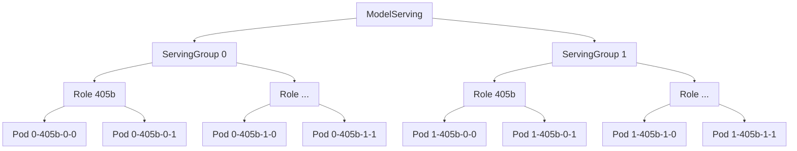

# Multi-Node Inference

This page describes the multi-node inference capabilities in Kthena, based on real-world examples and configurations.

## Overview

With the development of LLM, the scale of model parameters has grown exponentially, and the resource limits of a single conventional virtual machine or physical server can no longer meet the computational demands of these LLM.

The industry has proposed various innovative optimization strategies, such as PD‑disaggregation and hybrid deployment of large and small models. These strategies have significantly changed the execution pattern of inference tasks: inference instances are no longer limited to a single pod, but instead involve multiple pods collaborating to complete a single inference prediction.

To address this issue, Kthena provides a new `ModelServing` CR to describe specific inference deployment, enabling flexible and diverse deployment methods for inference task pods.

For a detailed definition of the `ModelServing`, please refer to the [ModelServing Reference](../reference/crd/workload.serving.volcano.sh.md) pages.

## Concepts

Kthena's multi‑node inference is built around three core abstractions:

- **ServingGroup** – A group of replicas that together serve a model. Each ServingGroup is a logical unit of scaling and rolling updates. A ModelServing can have multiple ServingGroups (controlled by `spec.replicas`).

- **Role** – Within a ServingGroup, pods are organized into Roles. Each Role represents a distinct functional component (e.g., entry‑point, worker, decoder). Roles can have different container images, resource requirements, and replica counts. The `spec.template.roles` field defines the Roles.

- **Pod** – The actual Kubernetes pod that runs the inference workload. Pods belong to a specific Role within a specific ServingGroup.

### Pod‑Naming Pattern

Pods are named using the following pattern:

```
{modelServing-name}-{servingGroup-index}-{role-hash}-{role-index}-{pod-index}
```

| Component | Description | Example |
|-----------|-------------|---------|
| `modelServing‑name` | Name of the ModelServing CR | `llama‑multinode` |
| `servingGroup‑index` | Zero‑based index of the ServingGroup | `0`, `1` |
| `role‑hash` | Short hash derived from the Role configuration | `405b` |
| `role‑index` | Zero‑based index of the Role within the ServingGroup | `0`, `1` |
| `pod‑index` | Zero‑based index of the Pod within the Role | `0`, `1` |

For instance, the pod `llama‑multinode‑0‑405b‑1‑0` belongs to:
- ModelServing `llama‑multinode`
- ServingGroup `0`
- Role with hash `405b`
- Role index `1` (the second Role)
- Pod index `0` (the first pod of that Role)

This naming convention makes it easy to identify a pod's position in the multi‑node hierarchy.

### Hierarchy Visualization

The following diagram illustrates the relationship between ModelServing, ServingGroups, Roles, and Pods:



- **ModelServing** is the top‑level custom resource.
- Each **ServingGroup** is a replica of the entire serving topology.
- Within a ServingGroup, multiple **Roles** represent different functional components.
- Each **Role** contains one or more **Pods** (the actual Kubernetes workloads).

## Preparation

### Prerequisites

- Kubernetes cluster with Kthena and [Volcano](https://volcano.sh/en/docs/installation/) installed
- Access to the Kthena examples repository
- Basic understanding of ModelServing CRD

### Getting Started

Deploy the Llama LLM inference engine as shown below. The tensor parallel size is 8 and the pipeline parallel size is 2.

```yaml showLineNumbers title="multi-node.yaml"
apiVersion: workload.serving.volcano.sh/v1alpha1
kind: ModelServing
metadata:
  name: llama-multinode
  namespace: default
spec:
  schedulerName: volcano
  replicas: 1  # inferGroup replicas
  template:
    restartGracePeriodSeconds: 60
    gangPolicy:
      minRoleReplicas:
        405b: 1
    roles:
      - name: 405b
        replicas: 2
        entryTemplate:
          spec:
            containers:
              - name: leader
                image: vllm/vllm-openai:latest
                env:
                  - name: HUGGING_FACE_HUB_TOKEN
                    value: $HUGGING_FACE_HUB_TOKEN
                command:
                  - sh
                  - -c
                  - "bash /vllm-workspace/examples/online_serving/multi-node-serving.sh leader --ray_cluster_size=2; 
                    python3 -m vllm.entrypoints.openai.api_server --port 8080 --model meta-llama/Llama-3.1-405B-Instruct --tensor-parallel-size 8 --pipeline_parallel_size 2"
                resources:
                  limits:
                    nvidia.com/gpu: "8"
                    memory: 1124Gi
                    ephemeral-storage: 800Gi
                  requests:
                    ephemeral-storage: 800Gi
                    cpu: 125
                ports:
                  - containerPort: 8080
                readinessProbe:
                  tcpSocket:
                    port: 8080
                  initialDelaySeconds: 15
                  periodSeconds: 10
                volumeMounts:
                  - mountPath: /dev/shm
                    name: dshm
            volumes:
            - name: dshm
              emptyDir:
                medium: Memory
                sizeLimit: 15Gi
        workerReplicas: 1
        workerTemplate:
          spec:
            containers:
              - name: worker
                image: vllm/vllm-openai:latest
                command:
                  - sh
                  - -c
                  - "bash /vllm-workspace/examples/online_serving/multi-node-serving.sh worker --ray_address=$(ENTRY_ADDRESS)"
                resources:
                  limits:
                    nvidia.com/gpu: "8"
                    memory: 1124Gi
                    ephemeral-storage: 800Gi
                  requests:
                    ephemeral-storage: 800Gi
                    cpu: 125
                env:
                  - name: HUGGING_FACE_HUB_TOKEN
                    value: $HUGGING_FACE_HUB_TOKEN
                volumeMounts:
                  - mountPath: /dev/shm
                    name: dshm   
            volumes:
            - name: dshm
              emptyDir:
                medium: Memory
                sizeLimit: 15Gi
```

### Tensor and Pipeline Parallelism Configuration

The multi‑node example configures tensor parallelism and pipeline parallelism through the command‑line arguments of the inference engine. In the `multi-node.yaml` manifest, the entry‑point container includes:

```yaml
command:
  - sh
  - -c
  - "bash /vllm-workspace/examples/online_serving/multi-node-serving.sh leader --ray_cluster_size=2;
    python3 -m vllm.entrypoints.openai.api_server --port 8080 --model meta-llama/Llama-3.1-405B-Instruct --tensor-parallel-size 8 --pipeline_parallel_size 2"
```

- `--tensor-parallel-size 8`: Splits the model across 8 GPUs within each pod.
- `--pipeline_parallel_size 2`: Splits the model across 2 pipeline stages (requires multiple pods).

The Role `405b` has `replicas: 2`, which creates two pods per ServingGroup. Together with the parallelism settings, this enables distributed inference across multiple nodes.

You can run the following command to check the ModelServing status and pod status in the cluster.

```sh
kubectl get modelServing -oyaml | grep status -A 10

status:
  availableReplicas: 1
  conditions:
  - lastTransitionTime: "2025-09-05T08:53:25Z"
    message: All Serving groups are ready
    reason: AllGroupsReady
    status: "True"
    type: Available
  - lastTransitionTime: "2025-09-05T08:53:23Z"
    message: 'Some groups are progressing: [0]'
    reason: GroupProgressing
    status: "False"
    type: Progressing
  currentReplicas: 1
  observedGeneration: 4
  replicas: 1
  updatedReplicas: 1

kubectl get pod -owide -l modelserving.volcano.sh/name=llama-multinode

NAMESPACE   NAME                          READY   STATUS    RESTARTS   AGE     IP            NODE           NOMINATED NODE   READINESS GATES
default     llama-multinode-0-405b-0-0    1/1     Running   0          15m     10.244.0.56   192.168.5.12   <none>           <none>
default     llama-multinode-0-405b-0-1    1/1     Running   0          15m     10.244.0.58   192.168.5.43   <none>           <none>
default     llama-multinode-0-405b-1-0    1/1     Running   0          15m     10.244.0.57   192.168.5.58   <none>           <none>
default     llama-multinode-0-405b-1-1    1/1     Running   0          15m     10.244.0.53   192.168.5.36   <none>           <none>
```
:::note
The first number in the pod name indicates which `ServingGroup` this pod belongs to. The second number indicates which `Role` it belongs to. The third number indicates the `pod`'s sequence number within Role.
:::

:::info
To keep the examples clear, the following sections (Scaling, Rolling Update, Gang Scheduling) use a configuration with a single role (role index 0) to demonstrate scaling, rolling update, and scheduling concepts.
:::

## Scaling

ModelServing supports scaling at two distinct levels: **ServingGroup** and **Role**. This allows fine‑grained control over the number of replicas for different parts of the inference workload.

| Level | Field | Effect |
|-------|-------|--------|
| ServingGroup | `spec.replicas` | Changes the number of ServingGroups (horizontal scaling). Each ServingGroup contains a full set of Roles. |
| Role | `spec.template.roles[*].replicas` | Changes the number of pods within a specific Role, inside every ServingGroup. |

### ServingGroup‑level scaling

ServingGroup‑level scaling adds or removes entire ServingGroups. This is useful when you need to increase the overall capacity of the model while preserving the same internal Role structure.

**Example: Scale up from 1 to 2 ServingGroups**

Increase `spec.replicas` from 1 to 2:

```sh
kubectl get pod -l modelserving.volcano.sh/name=llama-multinode

NAMESPACE            NAME                                          READY   STATUS    RESTARTS   AGE
default              llama-multinode-0-405b-0-0                    1/1     Running   0          35m
default              llama-multinode-0-405b-0-1                    1/1     Running   0          35m
default              llama-multinode-1-405b-0-0                    1/1     Running   0          2m
default              llama-multinode-1-405b-0-1                    1/1     Running   0          2m
```

After scaling, you can see that a new ServingGroup (index `1`) has been created, containing all Roles defined in the template.

### Role‑level scaling

Role‑level scaling changes the number of pods inside a particular Role, affecting every ServingGroup. This is useful when you need to adjust the parallelism of a specific component (e.g., add more workers).

**Example: Scale down a Role from 2 to 1 replica**

Reduce `spec.template.roles[0].replicas` from 2 to 1:

```sh
kubectl get pod -l modelserving.volcano.sh/name=llama-multinode

NAMESPACE            NAME                                          READY   STATUS    RESTARTS   AGE
default              llama-multinode-0-405b-0-0                    1/1     Running   0          28m
default              llama-multinode-0-405b-0-1                    1/1     Running   0          28m
```

After scaling, the second pod of each Role (index `1`) is removed, while the first pod remains.

### Combined scaling

You can adjust both levels simultaneously. For instance, you can increase the number of ServingGroups while also changing the replica count of a Role. The scaling operations are independent and can be applied in any order.

## Rolling Update

Currently, `ModelServing` supports rolling upgrades at the `ServingGroup` level, enabling users to configure `Partitions` to control the rolling process.

- Partition: Indicates the ordinal at which the `ModelServing` should be partitioned for updates. During a rolling update, replicas with an ordinal greater than or equal to `Partition` will be updated. Replicas with an ordinal less than `Partition` will not be updated.
  
### ServingGroup Rolling Update

We configure the corresponding rolling update strategy for llama-multinode.

```yaml
spec:
  rolloutStrategy:
    type: ServingGroupRollingUpdate
    rollingUpdateConfiguration:
      partition: 1
```

Modifying the parameters of entryTemplate or workerTemplate triggers a rolling update. For example, changing the image.

You can see the result:

```sh
kubectl get pods -l modelserving.volcano.sh/name=llama-multinode -o jsonpath='{range .items[*]}{.metadata.name}{"\t"}{.spec.containers[*].image}{"\n"}{end}'

llama-multinode-0-405b-0-0        vllm/vllm-openai:latest    
llama-multinode-0-405b-0-1        vllm/vllm-openai:latest        
llama-multinode-1-405b-0-0        vllm/vllm-openai:v0.10.1                  
llama-multinode-1-405b-0-1        vllm/vllm-openai:v0.10.1                 
```

From the pod runtime, we can see that only group 1 has been updated because we set `rolloutStrategy.partition = 1`.

## Gang Scheduling and Network Topology

Gang scheduling is a feature that allows pods to be scheduled together. This is useful when you have a set of pods that need to be scheduled together. For example, you may have a set of pods that need to be scheduled together because they are pods of the same model.

In Kthena, we use [Volcano gang scheduling](https://volcano.sh/en/docs/v1-10-0/plugins/#gang) to ensure that required pods are scheduled concurrently. If you haven't installed Volcano yet, follow the [installation guide](https://volcano.sh/en/docs/installation/).

Kthena creates PodGroups based on the ModelServing. Among these, the important field is `MinRoleReplicas`, which defines the minimum number of replicas required for each role in gang scheduling. This map allows users to specify different minimum replica requirements for different roles.

- **Key:** role name
- **Value:** minimum number of replicas required for that role

### MinRoleReplicas and PodGroup Mapping

The `MinRoleReplicas` map is used to generate the PodGroup's `spec.minTaskMember` field. Each entry becomes a key-value pair where the key is `{roleName}-{index}` and the value is the number of pods per role replica (`1 + workerReplicas`). Only role replicas with index less than `minRoleReplicas` are included, allowing the gang to start before all replicas are ready.

**Example:** In the `multi-node.yaml` example, the gang policy is defined as:

```yaml
gangPolicy:
  minRoleReplicas:
    405b: 1
```

This results in the following PodGroup spec (shown earlier):

```yaml
spec:
  minTaskMember:
    "405b-0": 2   # roleName-index: (1 entry + workerReplicas)
```

In this example, `minRoleReplicas.405b: 1` means only the first role replica (`405b-0`) is included in `minTaskMember`. The value `2` represents the total number of pods in this role replica: 1 entry pod + 1 worker pod (the role has `workerReplicas: 1`).

### Network‑Topology Scheduling

To reduce network latency between pods, you can enable network‑topology scheduling in Volcano. This requires creating a HyperNode resource that groups physical nodes into logical tiers.

**Steps to enable network‑topology scheduling:**

1. **Install Volcano with the network‑topology plugin** (if not already installed). The plugin is included by default in recent Volcano releases.

2. **Create a HyperNode** that describes your cluster's network topology. Refer to the [Volcano documentation](https://volcano.sh/en/docs/network_topology_aware_scheduling/) for details.

3. **Configure the ModelServing** to request topology‑aware scheduling by adding a `networkTopology` field to the `gangPolicy`:

   ```yaml
   gangPolicy:
     minRoleReplicas:
       405b: 1
     networkTopology:
       mode: soft   # or "hard"
       highestTierAllowed: 2   # only for hard mode
   ```

4. **Apply the updated ModelServing**. The Volcano scheduler will then attempt to place pods within the same HyperNode (or as close as possible) according to the chosen mode.

### Troubleshooting

If pods remain in `Pending` state, check the following:

- **PodGroup status:** Run `kubectl get podgroup -o wide` to see if the PodGroup is `Running` or `Pending`. A `Pending` PodGroup indicates that the gang scheduling requirements are not met (e.g., insufficient resources, missing nodes).

- **Volcano scheduler logs:** Inspect the Volcano scheduler logs for errors or warnings:
  ```sh
  kubectl logs -l app=volcano-scheduler -n volcano-system
  ```

- **Resource quotas:** Ensure your cluster has enough resources (GPU, memory, CPU) to satisfy the `minTaskMember` requirements.

- **Node affinity / taints:** Check if pods have node affinity or taints that prevent scheduling.

You can run the following command to see the `PodGroup` created by Kthena based on the `llama-multinode` ModelServing.

```sh
kubectl get podgroup-0 -oyaml

apiVersion: scheduling.volcano.sh/v1beta1
kind: PodGroup
metadata:
  annotations:
    scheduling.k8s.io/group-name: llama-multinode-0
  creationTimestamp: "2025-09-05T08:43:40Z"
  generation: 9
  labels:
    modelserving.volcano.sh/group-name: llama-multinode-0
    modelserving.volcano.sh/name: llama-multinode
  name: llama-multinode-0
  namespace: default
  ownerReferences:
  - apiVersion: workload.volcano.sh/v1alpha1
    controller: true
    kind: ModelServing
    name: llama-multinode
    uid: a08cd31a-9f39-450e-a3dc-bc868e08ce0a
  resourceVersion: "2621200"
  uid: 3abd9759-1fd7-48d7-be6b-ac55e17b36a0
spec:
  minMember: 2
  minResources: {}
  minTaskMember:
    405b: 2
  queue: default
status:
  conditions:
  - lastTransitionTime: "2025-09-05T09:10:47Z"
    reason: tasks in gang are ready to be scheduled
    status: "True"
    transitionID: fea87f6f-c172-4091-b55d-bd7160a7a801
    type: Scheduled
  phase: Running
  running: 2
```

## Clean up

```sh
kubectl delete modelserving llama-multinode

helm uninstall kthena -n kthena-system

helm uninstall volcano -n volcano-system
```

## Next Steps

Now that you have a working multi‑node inference deployment, you can explore other Kthena capabilities:

- **[Autoscaling](./autoscaler.md)** – Configure automatic scaling of your ModelServing based on metrics like request queue length or GPU utilization.
- **[Router & Routing](./router-routing.md)** – Set up intelligent request routing, canary deployments, and traffic splitting across multiple model versions.
- **[Prefill‑Decode Disaggregation](./prefill-decode-disaggregation/)** – Learn how to split the prefill and decode stages across different hardware for better resource utilization.

For detailed API references, see the [ModelServing CRD reference](../reference/crd/workload.serving.volcano.sh.md).
