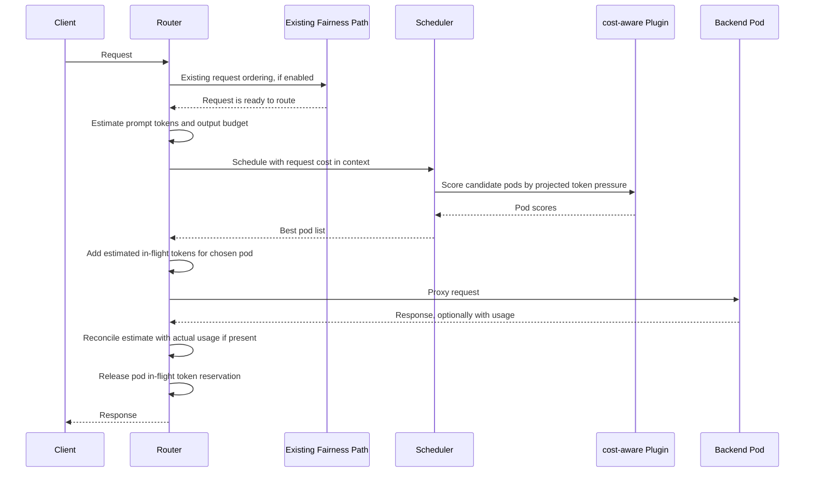

## Cost-Aware Scheduling Plugin for Kthena Router

### Summary

This proposal introduces and the initial implementation adds a `cost-aware`
scheduler plugin for `kthena-router`.
The plugin scores candidate backend pods using estimated token cost instead of
only request count. It is intended to improve performance for mixed workloads
where one request can be much more expensive than another because of long input,
large requested output, or both.

This revision intentionally does **not** add a second router queue. Existing
request ordering remains unchanged:

1. If fairness scheduling is enabled, the existing fairness path decides request
   order.
2. After a request is ready to be routed, the router estimates its token cost.
3. The scheduler runs normal filter and score plugins.
4. The new `cost-aware` score plugin prefers pods with more token headroom.
5. The router proxies to the selected pod and tracks estimated in-flight token
   pressure until the request finishes.

This keeps the feature scoped to performance scheduling. Fairness remains a
separate policy concern.

### Motivation

The current `least-request` plugin uses request-count signals such as:

```text
RequestRunningNum + 100 * RequestWaitingNum
```

That is simple and useful, but it treats a short chat request and a long-context
generation request as similar units of load. In practice they can have very
different effects on prefill time, decode time, KV-cache growth, and tail
latency.

This mismatch creates several problems:

1. **Pod score mismatch under mixed costs**  
   A pod with two long-context requests can be more loaded than a pod with many
   short requests. Request count alone cannot represent that.

2. **Performance regression for small requests**
   Short interactive requests can be routed to pods already occupied by large
   token budgets, increasing p95/p99 latency.

3. **KV-cache pressure**
   Large prompt plus large output budgets can consume much more KV-cache than
   request-count based scheduling expects.

4. **Limited operator control**
   Operators can tune QPS or concurrent request counts, but those knobs are only
   indirect proxies for token-level resource pressure.

### Goals

1. Add a `cost-aware` scheduler plugin that can be enabled and weighted like
   existing score plugins.
2. Estimate both input and output token cost before scheduling.
3. Track per-pod in-flight token pressure and reconcile it with actual usage
   when available.
4. Keep the feature independent from fairness priority calculation.
5. Avoid introducing another router queue in the initial design.
6. Provide clear observability for estimate quality and token pressure.
7. Support observe-only rollout before operators use the score in production.

### Non-Goals

1. Replace the existing fairness queue or define new fairness policy.
2. Add a new router-side queue for token-budget admission in v1.
3. Guarantee exact output length prediction.
4. Build a globally consistent multi-router coordinator in the first step.
5. Enforce tenant quotas or billing policy.

### Proposal

Add a new scheduler score plugin named `cost-aware`.

At a high level:

1. The router parses the request and estimates:
   - prompt tokens,
   - output token budget,
   - weighted total request cost.
2. The estimate is stored in scheduler context.
3. The scheduler runs existing filter plugins.
4. `cost-aware` scores every candidate pod by projected token pressure:

```text
projected_tokens = current_pod_inflight_tokens + estimated_request_tokens
projected_utilization = projected_tokens / effective_pod_budget_tokens
score = clamp(100 * (1 - projected_utilization), 0, 100)
```

5. The existing weighted score combiner chooses the best pod using all enabled
   plugins.
6. When the request is dispatched, the router records an estimated in-flight
   token reservation for that pod.
7. When the request completes, the router reconciles the reservation with
   OpenAI-compatible usage fields if available, then releases the reservation.

The plugin can initially run in observe-only mode, where it records metrics but
does not affect pod selection.

### Request Workflow

The key workflow is after any existing fairness decision has already happened:



There is no separate `cost-aware` queue in this proposal. If fairness scheduling
is enabled, it remains the only request-ordering queue. If fairness is disabled,
the plugin simply affects backend selection.

### Design Details

#### 1. Existing Router Integration Points

Relevant existing behavior:

1. The router already parses OpenAI-compatible request bodies.
2. The scheduler framework supports pluggable score plugins.
3. `least-request` already scores pods from runtime request metrics.
4. The router already captures usage from responses and updates token stats.
5. `FAIRNESS_WINDOW_SIZE` has an in-code fallback default of 5m when unset; the
   Helm chart default is 1h when fairness is enabled.

The new plugin uses these as integration points. It does not change the meaning
of fairness priority weights.

#### 2. Request Cost Estimate

The estimate includes both input and output tokens:

```text
estimated_prompt_tokens = tokenizer(prompt/messages)
estimated_output_tokens = output_budget(request, model, history)

estimated_request_tokens =
  input_weight * estimated_prompt_tokens +
  output_weight * estimated_output_tokens

reservation_tokens = clamp(
  ceil(estimated_request_tokens * safety_factor),
  min_reservation_tokens,
  max_reservation_tokens,
)
```

Input and output are both needed because:

1. short input can request long output,
2. long input can request short output,
3. prefill and decode have different performance profiles,
4. KV-cache grows with total sequence length.

##### 2.1 Prompt Token Estimate

The first implementation estimates prompt tokens from request bytes and a
per-model EMA of observed bytes per prompt token:

```text
estimated_prompt_tokens = ceil(prompt_bytes / bytes_per_token_ema)
bytes_per_token_ema = ema(observed_prompt_bytes / actual_prompt_tokens)
```

When no history exists for the model, `defaultBytesPerToken` is used. The EMA is
updated after responses that include OpenAI-compatible `prompt_tokens` usage.
This keeps the first version lightweight and matches the token-budget direction
from https://github.com/volcano-sh/kthena/issues/907#issuecomment-4585562101.

Future implementations can replace the byte/EMA estimator with a model tokenizer
when tokenization is available in the scheduling path.

##### 2.2 Output Token Estimate

Output length is the hardest part. Other serving systems generally avoid trying
to predict the semantic stopping point exactly:

1. vLLM exposes `SamplingParams.max_tokens` as the maximum number of output
   tokens and its scheduler works incrementally against token budgets and
   `request.max_tokens`, rather than predicting the final completion length up
   front.
2. TensorRT-LLM's scheduler uses runtime limits such as `max_batch_size`,
   `max_num_tokens`, and sequence-length configuration to decide what can be
   scheduled efficiently. Its documentation also notes that KV-cache grows as
   tokens are generated.
3. OpenAI-compatible APIs expose output caps such as `max_completion_tokens` or
   `max_tokens`; SGLang exposes `max_new_tokens` in sampling parameters.
4. Recent token-budget routing research uses request budget classification and
   online calibration from observed usage instead of claiming exact output
   prediction.

Based on this, Kthena should treat output estimation as a conservative budget,
not a precise prediction.

Recommended order:

1. If the request sets an explicit output cap, use it:
   - `max_completion_tokens`
   - `max_tokens`
   - `max_new_tokens`
   - `max_output_tokens`
2. Clamp the cap by remaining model context when model context is known:

```text
context_remaining = max_model_context_tokens - estimated_prompt_tokens
estimated_output_tokens = min(requested_output_cap, context_remaining)
```

3. If the request omits an output cap, use model or route configuration:
   - per-model `defaultOutputTokens`,
   - per-route `defaultOutputTokens`,
   - global `defaultOutputTokens`.
4. After enough traffic is observed, allow an optional rolling quantile fallback:

```text
estimated_output_tokens =
  max(configured_default_output_tokens,
      rolling_p95_completion_tokens_by_model_route)
```

5. If no history exists, use the configured default and label the estimate
   confidence as `default`.

This answers the precision concern directly: explicit client limits are the
strongest signal; otherwise the plugin uses conservative configured defaults and
learns from actual completion lengths over time.

##### 2.3 Multiple Choices and Streaming

If `n > 1`, output estimate should multiply by `n` because the backend may
generate multiple completions:

```text
estimated_output_tokens *= max(1, n)
```

For streaming responses:

1. Keep the estimated reservation until the stream ends.
2. If final usage arrives, reconcile with `completion_tokens` or `total_tokens`.
3. If final usage never arrives, release the estimate and emit
   `usage_missing{streaming="true"}`.
4. If the client disconnects mid-stream, release the estimate and emit
   `stream_cancelled_before_usage`.

#### 3. Cost-Aware Score Plugin

The plugin state tracks in-flight token pressure by pod:

```go
type PodTokenPressure struct {
    PodKey           string
    Model            string
    BudgetTokens     int64
    ReservedInflight int64
    Reservations     map[string]int64
    LastUpdatedUnix  int64
}
```

The plugin must make reservation operations concurrency-safe:

1. Use sharded locks keyed by `podKey`, or a single per-pod lock.
2. `Reserve`, `Release`, `Reconcile`, and `Utilization` run while holding the
   relevant lock.
3. Each in-flight request has a `reservationID`.
4. `Release` is idempotent by `reservationID`.
5. If an atomic implementation is chosen later, reserve must use a CAS loop so
   two goroutines cannot corrupt the in-flight token count.

Score formula:

```text
effective_budget = floor(podBudgetTokens / routerBudgetDivisor)
current_pressure = ReservedInflight / effective_budget
projected_pressure =
  (ReservedInflight + request.reservation_tokens) / effective_budget

score = 100 * (1 - projected_pressure)
score = clamp(score, 0, 100)
```

The plugin should expose two modes:

1. `observe`: compute scores and metrics but return neutral scores.
2. `score`: return cost-aware scores and participate in normal weighted
   scheduling.

An optional later `filter` mode can reject pods whose projected pressure is over
`maxProjectedUtilization`, but that should be a follow-up because it changes
failure behavior. The initial proposal is score-only.

#### 4. Interaction With Existing Plugins

The plugin composes with existing scheduler profiles:

```yaml
scheduler:
  pluginConfig:
  - name: least-request
    args:
      maxWaitingRequests: 10
  - name: cost-aware
    args:
      mode: score
      podBudgetTokens: 262144
      routerBudgetDivisor: 1
      inputWeight: 1.0
      outputWeight: 1.0
      safetyFactor: 1.2
      defaultOutputTokens: 1024
      minReservationTokens: 64
      maxReservationTokens: 32768
      emaAlpha: 0.2
      defaultBytesPerToken: 4.0
      outputQuantile: 0.95
  plugins:
    Score:
      enabled:
      - name: least-request
        weight: 1
      - name: cost-aware
        weight: 1
```

Recommended behavior:

1. Keep `least-request` enabled by default.
2. Add `cost-aware` with low or equal weight after observe-only validation.
3. Tune `podBudgetTokens`, `inputWeight`, and `outputWeight` per model family.
4. Do not mix this with `random`, matching the existing scheduler rule that
   removes random when meaningful score plugins are enabled.

#### 5. Configuration

Configure the feature as a scheduler plugin, not under fairness-specific
settings.

| Plugin arg | Default | Description |
|---|---|---|
| `mode` | `observe` | `observe` or `score` |
| `podBudgetTokens` | `262144` | Per-pod token pressure budget |
| `routerBudgetDivisor` | `1` | Divide local budget by expected router replicas |
| `inputWeight` | `1.0` | Weight for prompt/prefill tokens |
| `outputWeight` | `1.0` | Weight for output/decode tokens |
| `safetyFactor` | `1.2` | Conservative multiplier |
| `defaultOutputTokens` | `1024` | Output budget when request omits an output cap |
| `minReservationTokens` | `64` | Minimum request reservation |
| `maxReservationTokens` | `32768` | Maximum request reservation |
| `emaAlpha` | `0.2` | EMA smoothing factor for observed bytes per prompt token |
| `defaultBytesPerToken` | `4.0` | Prompt estimate fallback before EMA history exists |
| `outputQuantile` | `0.95` | Future rolling completion-token quantile used when available |
| `maxHistoryEntries` | `10000` | Bound memory used by rolling output history |

Validation:

1. `podBudgetTokens > 0`
2. `routerBudgetDivisor >= 1`
3. `inputWeight >= 0`
4. `outputWeight >= 0`
5. `inputWeight + outputWeight > 0`
6. `safetyFactor >= 1.0`
7. `maxReservationTokens >= minReservationTokens`
8. `0 < emaAlpha <= 1`
9. `defaultBytesPerToken > 0`
10. `0 < outputQuantile < 1`

#### 6. Pod Budget Sizing

`podBudgetTokens` is workload and hardware dependent. The default `262144` is
only a starting point for observe mode, not a universal safe value.

Operators should prefer backend-reported KV-cache capacity or load-test data.
When that is unavailable, a rough sizing model is:

```text
usable_kv_bytes = gpu_kv_cache_bytes * target_utilization
bytes_per_token ~= 2 * layers * hidden_size * bytes_per_element / tensor_parallel_size
podBudgetTokens ~= floor(usable_kv_bytes / bytes_per_token)
```

The exact value depends on engine implementation, quantization, parallelism,
LoRA overhead, speculative decoding, and non-request memory. The recommended
rollout is:

1. start in `observe` mode,
2. compare estimated pressure with latency and OOM signals,
3. set model-specific budgets from measurements,
4. then enable `score` mode.

#### 7. Multi-Router Behavior

In v1, in-flight token pressure is local to each router process. With `N`
router replicas, local-only tracking can understate total pod pressure.

Mitigation in v1:

```text
effective_pod_budget = floor(podBudgetTokens / routerBudgetDivisor)
```

Operators should set `routerBudgetDivisor` to the expected number of active
router replicas when using score mode. This is conservative when traffic is
uneven, but safer than assuming one router owns the full pod budget.

Future work should evaluate a shared tracker using Redis or backend-reported
live KV-cache usage. That is a correctness improvement for multi-router strict
budgeting, but it is not required for the score-only first step.

#### 8. Response Usage and Reconciliation

When usage is available, prefer OpenAI-compatible fields:

1. `prompt_tokens`
2. `completion_tokens`
3. `total_tokens`

Reconciliation:

```text
actual_cost =
  inputWeight * actual_prompt_tokens +
  outputWeight * actual_completion_tokens

delta = actual_cost - reserved_tokens
```

The tracker records estimate error metrics and releases the reservation. If only
`total_tokens` is present, use it as a lower-fidelity actual value and label the
source as `total_only`.

If usage is unavailable, release by estimate and label reconciliation status as
`usage_missing`. Do not treat the estimate as an actual value for calibration.

#### 9. Failure Handling

1. **Proxy error with no usage**: release estimate and mark reconciliation
   status `unknown`.
2. **Client disconnect after dispatch**: release estimate.
3. **Streaming final usage missing**: release estimate and emit
   `usage_missing{streaming="true"}`.
4. **Client disconnects mid-stream**: release estimate and emit
   `stream_cancelled_before_usage`.
5. **Pod disappears after scoring but before dispatch**: release any reservation
   and retry the normal scheduler path.
6. **Router restarts**: local in-flight token state is lost. This is acceptable
   for score-only mode and should be documented for future strict modes.

#### 10. Observability

Metrics:

1. `kthena_router_cost_aware_estimated_tokens{model,route,type,source}`
   - `type`: `prompt`, `output`, `total`
   - `source`: `bytes_ema`, `explicit_cap`, `default`, `history`
2. `kthena_router_cost_aware_actual_tokens{model,route,type,source}`
3. `kthena_router_cost_aware_estimation_error_ratio{model,route}`
4. `kthena_router_cost_aware_pod_reserved_tokens{model,pod}`
5. `kthena_router_cost_aware_pod_projected_utilization{model,pod}`
6. `kthena_router_cost_aware_score{model,pod}`
7. `kthena_router_cost_aware_reconcile_total{model,result}`
   - `result`: `actual`, `total_only`, `usage_missing`, `cancelled`

Dashboard views:

1. per-pod projected utilization heatmap,
2. estimate vs actual completion tokens by model/route,
3. score distribution by plugin,
4. p95/p99 latency before and after enabling score mode.

#### 11. Rollout Plan

1. **Phase 0: Metrics only**
   - add estimator,
   - record estimate and actual usage,
   - do not add scheduler plugin weight.
2. **Phase 1: Observe plugin**
   - enable `cost-aware` in `observe` mode,
   - emit what score would have been,
   - compare with selected pod and latency.
3. **Phase 2: Score mode**
   - enable `mode: score`,
   - start with low plugin weight,
   - tune per model.
4. **Phase 3: Shared pressure state**
   - evaluate Redis or backend-reported KV-cache usage for multi-router
     correctness.
5. **Phase 4: Optional filter mode**
   - consider hard projected-utilization filtering only if maintainers agree
     that routing failures or existing queue retries should be part of the
     behavior.

Rollback:

1. Remove `cost-aware` from scheduler score plugins or set `mode: observe`.
2. Existing `least-request`, `kvcache-aware`, fairness, and routing behavior
   continue unchanged.

### Test Plan

#### Unit Tests

1. Prompt estimate uses default bytes per token when no EMA history exists.
2. Prompt estimate updates bytes per token from response usage with EMA.
3. Output estimate uses explicit caps in priority order.
4. Output estimate clamps by remaining model context.
5. Missing output cap uses configured default and then rolling p95 when enough
   history exists.
6. `n > 1` multiplies estimated output budget.
7. Concurrent reservation/release cannot corrupt per-pod token pressure.
8. Double release by reservation ID is idempotent.
9. Score stays in `[0, 100]`.
10. Observe mode returns neutral scores while emitting metrics.

#### Integration Tests

1. Mixed short and long requests route long requests away from token-heavy pods.
2. `cost-aware` composes with `least-request`.
3. Streaming with final usage reconciles actual completion tokens.
4. Streaming without final usage releases estimates and labels usage missing.
5. Multi-router divisor changes effective local pod budget.

#### Performance Tests

1. Compare p95/p99 latency under mixed workloads before and after enabling
   `cost-aware`.
2. Measure scheduler overhead with many candidate pods.
3. Measure lock contention under high concurrency.

### Alternatives

1. **Extend `least-request` directly**
   - Pros: fewer plugins.
   - Cons: mixes request-count and token-cost semantics; harder to disable.

2. **Add a new router queue**
   - Pros: could defer requests until token budget is available.
   - Cons: maintainers prefer keeping this as scheduling, not a second queue.
     This proposal does not choose this path.

3. **Prompt-only scoring**
   - Pros: simple.
   - Cons: misses short-input long-output requests.

4. **Backend-only scheduling**
   - Pros: backend has accurate runtime state.
   - Cons: router still sends traffic without considering token pressure across
     candidates.

5. **Immediate shared-state strict budget**
   - Pros: stronger multi-router correctness.
   - Cons: more complexity and more failure modes than needed for an initial
     score plugin.

Recommended path: implement `cost-aware` as a separate score plugin with hybrid
input/output estimation, observe it first, then enable scoring with conservative
weights.

### Research Notes

This proposal uses the following external behavior as design input:

1. vLLM documents `max_tokens` as the maximum number of tokens to generate per
   output sequence and its scheduler checks `request.max_tokens` while
   scheduling incrementally:
   https://docs.vllm.ai/en/latest/api/vllm/sampling_params.html
   https://docs.vllm.ai/en/latest/api/vllm/v1/core/sched/scheduler/
2. TensorRT-LLM documents that `max_batch_size` and `max_num_tokens` drive
   scheduler decisions and that generated tokens grow KV-cache over time:
   https://nvidia.github.io/TensorRT-LLM/performance/performance-tuning-guide/tuning-max-batch-size-and-max-num-tokens.html
   https://nvidia.github.io/TensorRT-LLM/features/paged-attention-ifb-scheduler.html
3. OpenAI-compatible APIs expose output token caps such as
   `max_completion_tokens` and `max_tokens`:
   https://platform.openai.com/docs/api-reference/chat/create
4. SGLang exposes `max_new_tokens` as the generation cap in sampling parameters:
   https://sgl-project.github.io/basic_usage/sampling_params.html
5. Recent token-budget routing research proposes routing by estimated total
   token budget and online calibration from observed usage:
   https://arxiv.org/abs/2604.08075

The common lesson is that output length is uncertain. The practical signal is
the requested output cap when present, followed by conservative defaults and
online calibration from actual usage.

### Appendix A: Example Scheduler Configuration

```yaml
scheduler:
  pluginConfig:
  - name: least-request
    args:
      maxWaitingRequests: 10
  - name: cost-aware
    args:
      mode: observe
      podBudgetTokens: 262144
      routerBudgetDivisor: 1
      inputWeight: 1.0
      outputWeight: 1.0
      safetyFactor: 1.2
      defaultOutputTokens: 1024
      minReservationTokens: 64
      maxReservationTokens: 32768
      emaAlpha: 0.2
      defaultBytesPerToken: 4.0
      outputQuantile: 0.95
  plugins:
    Score:
      enabled:
      - name: least-request
        weight: 1
      - name: cost-aware
        weight: 1
```

### Appendix B: Review Feedback Mapping

This revision addresses the maintainer review in
https://github.com/volcano-sh/kthena/pull/928#issuecomment-4340678029 as
follows:

1. **Author-as-reviewer**: reviewers are now `@hzxuzhonghu` and
   `@YaoZengzeng`; the author is not listed as reviewer.
2. **Concurrency story**: per-pod token pressure uses sharded or per-pod locking,
   idempotent reservation IDs, and locked reserve/release/reconcile operations.
3. **Timer retry thundering herd**: removed from v1. There is no new
   token-budget queue and therefore no 10ms polling loop.
4. **`FAIRNESS_QUEUE_TIMEOUT` conflict**: removed from v1. The plugin is
   configured as a scheduler plugin, not as a fairness queue extension.
5. **Streaming and missing usage**: streaming final-usage, missing-usage, and
   client-disconnect paths are explicitly handled.
6. **`podBudgetTokens: 262144` justification**: documented as observe-mode
   starting point only, with a KV-cache sizing formula and load-test guidance.
7. **Multi-router state**: v1 documents local-only pressure and adds
   `routerBudgetDivisor`; shared state is a follow-up.
8. **Large-request starvation**: removed the queue priority formula entirely.
   The initial design is score-only, so it does not introduce a new queue where
   large requests can be starved by an age/cost priority formula.

Other inline review comments are handled as follows:

1. **No extra router queue**: the revised design is a scheduler plugin and keeps
   existing request ordering.
2. **Fairness separation**: fairness decides request ordering; `cost-aware`
   decides backend preference for performance.
3. **Output estimate detail**: explicit caps first, configured defaults second,
   rolling actual-completion quantile third.
4. **Prompt estimator**: the implementation uses a per-model EMA of observed
   bytes per token, with `defaultBytesPerToken` as the cold-start fallback.
5. **New score plugin preference**: the recommended path is a separate
   `cost-aware` score plugin, not a `least-request` rewrite.
