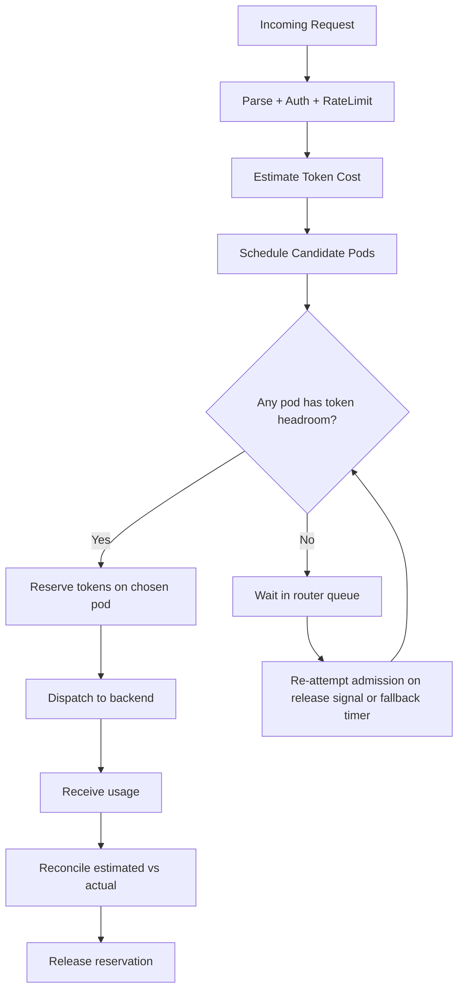
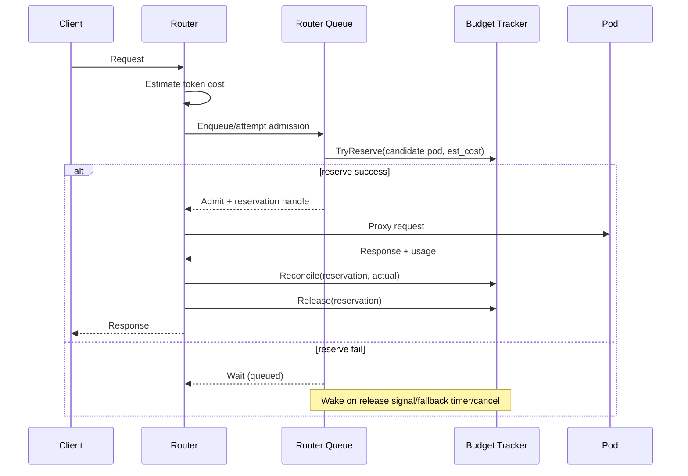

## Cost-Aware Request Queuing and Token-Budget Admission Control in Kthena Router

### Summary

This proposal introduces a token-cost-aware admission control layer in `kthena-router` so routing decisions and queuing behavior reflect actual request cost, not only request count. Today, pod selection is dominated by request-count signals (for example, `running + 100 * waiting` in `least-request`), which is not robust for mixed workloads where one request may be 64x or more expensive than another. This mismatch can admit expensive requests into already constrained pods, trigger KV-cache pressure/OOM, and inflate tail latency.

The proposal adds token-budget-based admission at router level:
1. Estimate request token cost before dispatch (with safe fallbacks).
2. Track pod in-flight token reservations.
3. Admit only when at least one candidate pod has enough token headroom.
4. Reconcile estimates with actual usage on response.
5. Keep compatibility with existing request queuing and configuration style.

This design is intentionally incremental: operators can deploy it in observe-only mode first, then soft enforcement, then strict admission once confidence is high.

### Motivation

Current scheduler and queue behavior can misrepresent real load:

1. **Pod score mismatch under mixed costs**  
   A pod handling 2 long-context requests may be effectively saturated while a pod handling 8 short requests is not. Request count alone cannot express this.

2. **Head-of-line blocking under mixed costs**
   FIFO/count-driven queue release can admit large requests that block capacity for multiple smaller requests, harming interactive latency.

3. **KV cache and memory pressure**  
   Requests with large prompt and generation budgets can rapidly consume decode/prefill memory. Without admission guardrails, pressure is discovered too late.

4. **Limited operational predictability**  
   Operators currently tune QPS or concurrent-count limits, but these knobs are only indirect proxies for real resource usage.

#### Goals

1. Introduce **token-budget admission control** per model queue and pod.
2. Support **router-side queuing** when all candidate pods exceed budget.
3. Use **request token-cost estimates pre-dispatch**, then reconcile with actual usage.
4. Keep token-budget admission separate from fairness policy:
   - fairness decides request ordering when enabled.
   - token-budget admission decides when and which backend can accept the dequeued request.
   - timeout/cancel semantics remain request-scoped.
5. Provide strong observability for:
   - estimated vs actual token deltas
   - budget utilization
   - queue delay and rejection reasons
6. Preserve backward compatibility and safe rollout controls.

#### Non-Goals

1. Build a globally consistent cross-router coordinator in this phase.
2. Guarantee perfect request cost prediction for all models/vendors.
3. Replace all scheduler plugins or remove `least-request`.
4. Couple admission logic to vendor-specific engine internals.
5. Enforce hard tenant quotas or billing in this proposal.

### Proposal

Introduce a **Token-Budget Admission Controller** in router request flow:

1. Request enters router and passes authentication/rate-limit checks.
2. Router estimates request cost in token units.
3. Scheduler determines candidate pods (existing path).
4. Admission controller checks each candidate pod's available token headroom.
5. If fit exists, reserve tokens on selected pod and dispatch request.
6. If no fit exists, keep the request waiting in the router queue and wake it when budget may be available.
7. On response usage event, reconcile reservation with actual usage and release budget.
8. On timeout/cancel/error, release reservation deterministically.

#### User Stories (Optional)

##### Story 1

As a platform operator running mixed workloads (chat + long-context generation), I want admission to consider token cost so long requests do not overwhelm pods and degrade p99 latency.

##### Story 2

As a tenant with bursty short prompts, I want smaller requests to continue flowing when a few heavy requests arrive, instead of being blocked behind them due to count-only scheduling.

##### Story 3

As an SRE, I want metrics that explain queuing decisions (`admitted`, `queued_budget_exceeded`, `rejected_timeout`) and estimate error (`estimated_vs_actual`) so I can tune limits safely.

##### Story 4

As a maintainer, I want this feature to be opt-in with compatibility fallback so existing clusters can upgrade without behavior breakage.

#### Notes/Constraints/Caveats (Optional)

1. **Estimator uncertainty is expected.**  
   The design explicitly supports conservative estimates and post-response reconciliation.

2. **Streaming usage events may arrive late.**  
   Release logic must be robust even when usage is only available at stream tail.

3. **In-memory accounting is per router instance.**  
   In multi-replica router deployments, state is local unless future shared-state mode is enabled. v1 mitigates this with `routerBudgetDivisor` so each router uses a conservative slice of the pod budget.

4. **Routing scope remains model-local in v1.**  
   This proposal does not attempt cross-model pooled budgets.

#### Risks and Mitigations

| Risk | Impact | Mitigation |
|---|---|---|
| Cost estimator underestimates large requests | Over-admission, memory pressure | Safety factor, minimum reservation floor, strict-mode guardrails |
| Estimator overestimates | Unnecessary queue delay | Reconciliation + dynamic calibration metrics |
| Budget leak on error path | Permanent reduced capacity | Single-owner reservation lifecycle with defer-based release |
| Queue starvation of large requests | Performance regression | Signal-based wakeups + max-wait promotion |
| Increased routing overhead | Router latency | O(1) accounting structures, bounded queue ops, targeted metrics |
| Multi-router inconsistency | Over-admission, memory pressure | Per-router budget divisor in v1 + future Redis-backed shared budget mode |

### Design Details

#### 1. Current State Summary

Relevant existing behavior in codebase:

1. Scheduler `least-request` scoring uses:
   - `base = RequestRunningNum + 100 * RequestWaitingNum`
2. Fairness queue already supports:
   - queue timeout (`FAIRNESS_QUEUE_TIMEOUT`)
   - request cancel propagation
   - optional semaphore mode (`FAIRNESS_MAX_CONCURRENT`)
   - weighted priority (`FAIRNESS_PRIORITY_TOKEN_WEIGHT`, `FAIRNESS_PRIORITY_REQUEST_NUM_WEIGHT`)
3. Token tracker exists:
   - sliding window (`FAIRNESS_WINDOW_SIZE`; in-code fallback default 5m when unset; Helm chart default 1h when fairness is enabled; valid 1m to 1h)
   - input/output weights (`FAIRNESS_INPUT_TOKEN_WEIGHT`, `FAIRNESS_OUTPUT_TOKEN_WEIGHT`)
4. Router already parses usage and updates user-model token stats from response usage fields.

This proposal uses these primitives as integration points, but the new
admission decision is a performance and resource-safety check, not a fairness
priority redesign.

#### 2. High-Level Architecture



#### 3. Core Components

##### 3.1 TokenCostEstimator

Computes a conservative token-cost estimate for incoming request:

```text
estimated_prompt_tokens = tokenizer(prompt/messages)
estimated_output_tokens = requested output token budget
estimated_total = input_weight * estimated_prompt_tokens +
                  output_weight * estimated_output_tokens
reservation_tokens = clamp(
  ceil(estimated_total * safety_factor),
  min_reservation_tokens,
  max_reservation_tokens,
)
```

Where:
1. `estimated_prompt_tokens`:
   - Primary: tokenizer estimate from prompt/messages using the existing router
     tokenizer path.
   - Fallback: `utf8.RuneCountInString(prompt) / 4.0`, matching the existing
     tokenizer estimator behavior and avoiding byte-length overestimation for
     non-ASCII prompts.
2. `estimated_output_tokens`:
   - Prefer explicit request fields in OpenAI-compatible order:
     `max_completion_tokens`, then `max_tokens`.
   - If neither field is present, use a configurable per-model default output
     budget. If no model-specific default exists, fall back to
     `defaultOutputTokens`.
   - Invalid, negative, NaN, or infinite values are treated as missing.
3. Apply safety controls:
   - input and output are both included because short prompts can generate long
     outputs and long prompts can request short outputs.
   - `input_weight` and `output_weight` make the estimate tunable for different
     resource profiles. Input tokens mostly affect prefill and initial KV-cache
     allocation; requested output budget mainly affects decode duration and KV
     growth.
   - `reservation_tokens = ceil(estimated_total * safety_factor)`
   - lower bound (`min_reservation_tokens`)
   - upper bound clamp (`max_reservation_tokens`)

Estimator modes:
1. **Conservative** (default): higher safety factor.
2. **Balanced**: moderate factor.
3. **Observe-only**: no admission enforcement, metrics only.

##### 3.2 PodTokenBudgetTracker

Maintains per-pod budget state:

```go
type PodBudgetState struct {
    PodKey           string
    Model            string
    BudgetTokens     int64
    ReservedInflight int64
    Reservations     map[string]int64
    LastUpdatedUnix  int64
}
```

The implementation must make reservation operations atomic. The proposed v1
approach is a sharded tracker:

1. A top-level shard map routes each `podKey` to one lock shard.
2. Every `TryReserve`, `Release`, `Reconcile`, and `Utilization` operation for
   a pod runs while holding that shard lock.
3. Each active reservation is tracked by `reservationID` so releases are
   idempotent and reconcile can compare estimated and actual cost.
4. `ReservedInflight` is never read or written outside the lock. If the
   implementation later uses atomics, the compare-and-reserve operation still
   must be a single atomic CAS loop so two goroutines cannot over-admit.

Accounting operations:
1. `TryReserve(pod, cost) -> bool`
2. `Release(pod, reservationID)`
3. `Reconcile(pod, reservationID, actualCost)` (adjust delta)
4. `Utilization(pod) = ReservedInflight / BudgetTokens`

##### 3.3 Admission Queue Manager

Adds budget checks after normal queue ordering:

1. Queue remains per model.
2. If fairness scheduling is enabled, the fairness queue decides which request
   is ready to attempt admission. If fairness is disabled, the existing router
   queue order is preserved.
3. After a request is dequeued, the scheduler produces candidate pods and the
   admission controller picks the first candidate with enough token headroom.
4. If no candidate fits, the request waits for an admission wake event without
   changing fairness priority.
5. Timeout/cancel follows existing request-scoped context semantics.

Wait and retry behavior:

1. The primary retry path is signal-based: `Release` and capacity-affecting pod
   updates notify waiters for the relevant model/pod candidates.
2. Wakeups should be bounded. A release should notify the relevant model queue
   and let the queue manager attempt admission for the oldest eligible entries,
   rather than waking every queued request for every pod.
3. A fallback timer exists only to recover from missed signals or pod state
   drift. It should be coarse, for example 500ms to 1s, not a 10ms polling
   loop.
4. To avoid starvation, a request that has waited longer than
   `starvationPromotionAfter` is promoted to the next admission attempt before
   newer requests. `maxBudgetQueueWait` remains the hard timeout. This is a
   bounded wait rule, not an unbounded age score competing with token-sized
   priority values.

##### 3.4 Reservation Lifecycle and Safety

Each admitted request receives `reservationID` and release handler:

1. Reserve before proxy dispatch.
2. On every terminal path (success/error/cancel/timeout): release.
3. If usage is available: reconcile before release.
4. Double-release is guarded by `sync.Once` on the request-side handle and by
   reservationID idempotency in the tracker.

#### 4. Request Lifecycle (Detailed)



#### 5. Token Estimation Strategy

This proposal defines three strategies and selects hybrid by default:

1. **Actual-only strategy**
   - Reserve fixed default, rely on actual usage later.
   - Pros: simple.
   - Cons: weak pre-dispatch protection.

2. **Pre-request estimate strategy**
   - Estimate from prompt + request limits.
   - Pros: proactive admission quality.
   - Cons: estimation error risk.

3. **Hybrid strategy (recommended)**
   - Pre-request estimate for admission.
   - Post-response reconciliation for correction.
   - Tracks estimator error metrics to support tuning.

#### 6. Scheduler Integration

Two compatible integration options:

1. **New score plugin (recommended)**
   - `token-budget-aware` plugin with clear separation.
   - Can be composed in scheduler profile.
   - Scores candidate pods by token-budget headroom and recent reservation
     pressure without changing `least-request` semantics.

2. **Extend `least-request` plugin**
   - Add optional token-aware score term:
     - lower utilization -> higher score
   - Preserve existing behavior when disabled.

Initial recommendation: add a new `token-budget-aware` score plugin. This keeps
the performance-scheduling behavior independent from existing request-count
heuristics and makes it easier to disable or tune without changing
`least-request`.

#### 7. Configuration

Keep configuration style consistent with existing fairness settings under:
`networking.kthenaRouter.fairness.*`

Proposed additions:

| Helm value | Env var | Default | Description |
|---|---|---|---|
| `fairness.tokenBudget.enabled` | `FAIRNESS_TOKEN_BUDGET_ENABLED` | `false` | Enable token-budget admission |
| `fairness.tokenBudget.podBudgetTokens` | `FAIRNESS_POD_TOKEN_BUDGET` | `262144` | Per-pod token budget |
| `fairness.tokenBudget.routerBudgetDivisor` | `FAIRNESS_TOKEN_BUDGET_ROUTER_DIVISOR` | `1` | Divide local per-pod budget by expected router replicas |
| `fairness.tokenBudget.estimationMode` | `FAIRNESS_COST_ESTIMATION_MODE` | `hybrid` | `observe`,`conservative`,`balanced`,`hybrid` |
| `fairness.tokenBudget.safetyFactor` | `FAIRNESS_COST_SAFETY_FACTOR` | `1.2` | Multiplicative safety factor |
| `fairness.tokenBudget.defaultOutputTokens` | `FAIRNESS_DEFAULT_OUTPUT_TOKENS` | `1024` | Output budget when request and model config omit a limit |
| `fairness.tokenBudget.minReservationTokens` | `FAIRNESS_MIN_RESERVATION_TOKENS` | `64` | Minimum reservation |
| `fairness.tokenBudget.maxReservationTokens` | `FAIRNESS_MAX_RESERVATION_TOKENS` | `32768` | Max reservation clamp |
| `fairness.tokenBudget.queueRetryInterval` | `FAIRNESS_ADMISSION_RETRY_INTERVAL` | `1s` | Fallback retry interval when no wake signal arrives |
| `fairness.tokenBudget.maxBudgetQueueWait` | `FAIRNESS_BUDGET_QUEUE_TIMEOUT` | `60s` | Max wait for token-budget admission before timeout |
| `fairness.tokenBudget.starvationPromotionAfter` | `FAIRNESS_BUDGET_STARVATION_PROMOTION_AFTER` | `30s` | Promote long-waiting budget-blocked requests |

Validation rules:
1. Budget > 0
2. Safety factor >= 1.0
3. `routerBudgetDivisor >= 1`
4. `maxReservation >= minReservation`
5. Retry interval in sensible bounds (e.g., 500ms-10s)

`FAIRNESS_BUDGET_QUEUE_TIMEOUT` is intentionally separate from the existing
`FAIRNESS_QUEUE_TIMEOUT`. The existing variable controls fairness queue wait
behavior; budget admission can need a different timeout because it is waiting
for pod memory/token headroom, not fairness order.

##### 7.1 Pod Budget Sizing

`podBudgetTokens` should be tuned per model, hardware shape, and engine. The
default `262144` is only a conservative starting point for observe/soft mode,
not a universal safe value.

Operators should size the budget from available KV-cache capacity:

```text
usableKVBytes = gpuKVCacheBytes * targetUtilization
bytesPerToken ~= 2 * layers * hiddenSize * bytesPerElement / tensorParallelSize
podBudgetTokens ~= floor(usableKVBytes / bytesPerToken)
```

The exact formula varies by engine, attention implementation, quantization, and
parallelism. For production, operators should prefer engine-reported KV-cache
capacity or benchmarked safe concurrency over the static default. The proposal
therefore recommends:

1. start in observe mode and compare estimated reservations with OOM/latency
   behavior,
2. set model-specific `podBudgetTokens` from engine capacity or load tests,
3. keep a safety margin for router replicas, speculative decoding, LoRA/cache
   overhead, and non-request memory.

##### 7.2 Multi-Router Behavior

In v1 the tracker is local to each router process. With `N` router replicas,
unadjusted local accounting could admit up to `N * podBudgetTokens` against the
same backend pod. To avoid presenting local accounting as globally strict, v1
must support `routerBudgetDivisor`:

```text
effectiveLocalPodBudget = floor(podBudgetTokens / routerBudgetDivisor)
```

Operators should set `routerBudgetDivisor` to the expected number of active
router replicas when using local enforcement. This is conservative when traffic
is uneven, but it is safer than over-admitting. A shared-state tracker
(Redis/etcd or backend-reported live KV usage) remains the preferred follow-up
for strict multi-router correctness.

#### 8. API and Data-Contract Considerations

No external API breaking changes are required.

Internal additions:
1. Extend request metadata in queue entries:
   - estimated cost
   - reservation id
   - admission attempts
2. Extend metrics labels/reasons for admission outcomes.
3. Optional scheduler plugin args for token-aware scoring.

Backend usage fields:
1. Prefer existing OpenAI-compatible usage (`prompt_tokens`, `completion_tokens`, `total_tokens`).
2. If usage unavailable:
   - release by estimate
   - emit `usage_missing` metric
   - keep estimator-error metrics labeled as `unknown` rather than treating the
     estimate as accurate usage

#### 9. Failure Handling and Edge Cases

1. **Client disconnect while queued**: remove/skip queued entry via request context cancellation.
2. **Client disconnect after reserve**: release reservation immediately.
3. **Proxy error with no usage**: release estimate, mark reconcile status `unknown`.
4. **Streaming usage only at end**: retain the reservation estimate until the
   final SSE chunk. If final usage arrives, reconcile before release.
5. **Streaming engine never returns usage**: release by estimate, emit
   `usage_missing{streaming="true"}`, and exclude the request from
   estimated-vs-actual error calculations.
6. **Client disconnects mid-stream**: release by the current reservation
   estimate because no final usage can be trusted. Emit
   `stream_cancelled_before_usage` so operators can see how often this path is
   used.
7. **Queue timeout**: release if reserved, return 504.
8. **Pod disappears after reserve**: force release and retry scheduling.
9. **Negative reconcile delta** (actual < estimate): immediate credit-back.
10. **Positive delta exceeding remaining headroom**: allow bounded temporary over-commit and emit alert metric.
11. **Estimator unavailable**: fallback to conservative default reservation.
12. **Admission flapping**: debounce wake signals and cap reinsert loops.

#### 10. Observability

Add metrics:

1. `kthena_router_token_budget_reserved{model,pod}`
2. `kthena_router_token_budget_utilization{model,pod}`
3. `kthena_router_admission_total{model,result}` where result in:
   - `admitted`
   - `queued_budget_exceeded`
   - `rejected_timeout`
   - `rejected_cancelled`
4. `kthena_router_cost_estimate_tokens{model,type}` with type in:
   - `estimated`
   - `actual`
5. `kthena_router_cost_estimation_error_ratio{model}`
6. `kthena_router_admission_queue_wait_seconds{model,user_id}`

Operational dashboards:
1. estimate error trend
2. budget utilization heatmap by pod
3. queue wait p50/p95/p99
4. admission outcome rates

#### 11. Rollout Plan

1. **Phase 0: Observe-only**
   - compute estimates and hypothetical decisions
   - do not block admissions
2. **Phase 1: Soft enforcement**
   - enforce budgets with conservative values
   - alert-only on estimator drift
3. **Phase 2: Full enforcement**
   - strict admission + tuned safety factor
4. **Phase 3: Optimization**
   - refine model-specific defaults
   - evaluate optional shared-state mode

Rollback:
1. Toggle `FAIRNESS_TOKEN_BUDGET_ENABLED=false`
2. Existing fairness and request-count behavior continues unchanged.

#### Test Plan

1. **Unit tests**
   - estimator correctness across prompt shapes
   - rune-count fallback for non-ASCII prompts
   - input/output budget combination and missing-output fallback
   - budget reserve/release/reconcile invariants
   - concurrent `TryReserve` calls cannot exceed effective pod budget
   - signal-based wake behavior with coarse fallback timer
   - cancellation/timeout release correctness

2. **Integration tests**
   - mixed workload (short + long requests) across multiple pods
   - verify no budget leaks across failures/retries
   - verify compatibility with fairness disabled and enabled modes
   - multi-router local divisor behavior under two or more router replicas

3. **Performance tests**
   - compare p95/p99 latency under mixed-cost load
   - throughput under observe-only vs enforcement modes
   - admission overhead on router CPU and lock contention

4. **Resilience/chaos tests**
   - router restart during in-flight requests
   - pod churn while queue backlog exists
   - streaming cancellation storms

Success criteria:
1. reduced OOM incidents under mixed traffic
2. improved p99 latency stability
3. bounded estimator error after tuning
4. zero reservation leaks in stress tests

### Alternatives

1. **Keep request-count model with different constants**
   - Pros: simplest.
   - Cons: still blind to cost variance; only shifts failure points.

2. **Backend-only queuing/admission**
   - Pros: backend has deeper runtime context.
   - Cons: router still sends bursts blindly; less central policy control.

3. **Prompt-only token estimation without reconciliation**
   - Pros: low complexity.
   - Cons: poor for generation-heavy requests; drift accumulates.

4. **Global Redis-backed token budget coordinator (immediate)**
   - Pros: consistent across router replicas.
   - Cons: higher complexity and failure modes; local enforcement with
     `routerBudgetDivisor` is a simpler first step.

5. **Strict per-user quotas instead of budget admission**
   - Pros: policy simplicity.
   - Cons: does not solve pod saturation from heterogeneous request cost.

Recommended path: hybrid estimation + local pod budget admission with
`routerBudgetDivisor` first, then optional shared-state enhancement.

---

### Appendix A: Example Helm Values

```yaml
networking:
  kthenaRouter:
    fairness:
      enabled: true
      windowSize: "5m"
      inputTokenWeight: 1.0
      outputTokenWeight: 2.0
      tokenBudget:
        enabled: true
        podBudgetTokens: 262144
        routerBudgetDivisor: 1
        estimationMode: hybrid
        safetyFactor: 1.2
        defaultOutputTokens: 1024
        minReservationTokens: 64
        maxReservationTokens: 32768
        queueRetryInterval: "1s"
        maxBudgetQueueWait: "60s"
        starvationPromotionAfter: "30s"
```

### Appendix B: Open Questions for Review

1. Should initial budget defaults be static or model-size-aware?
2. Should `starvationPromotionAfter` be fixed per queue or derived from queue wait SLO?
3. Should we support per-model override values in first implementation?
4. Which shared-state backend should be preferred after local enforcement:
   Redis, etcd, or backend-reported live KV usage?
