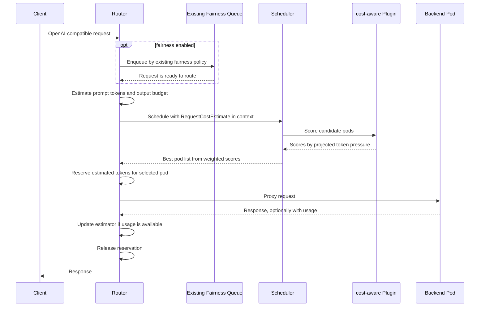

## Cost-Aware Scheduling Plugin for Kthena Router

### Summary

This proposal adds a `cost-aware` score plugin to the existing
`kthena-router` scheduler. The plugin estimates the token pressure of each
request before backend selection, tracks estimated in-flight token pressure per
pod, and gives higher scores to pods with more projected token headroom.

This is a scheduling feature, not a new router queue and not a hard admission
controller in v1. Existing request ordering remains unchanged:

1. If fairness scheduling is enabled, the existing fairness queue decides when a
   request is ready to route.
2. The router estimates the ready request's prompt and output token budget.
3. The scheduler runs the configured filter and score plugins.
4. `cost-aware` contributes a score based on projected pod token pressure.
5. The normal weighted score combiner selects the backend pod.
6. The router records an estimated reservation after selecting the pod and
   releases it when the request finishes.

The first version is intentionally conservative: it can run in observe mode,
then score mode, and it does not change fairness semantics or introduce a second
place where requests wait.

### Motivation

The current `least-request` plugin scores backend pods from request-count
signals such as:

```text
RequestRunningNum + 100 * RequestWaitingNum
```

That signal is useful, but one request is not always one unit of load. A short
interactive prompt and a long-context generation request can have very different
effects on prefill latency, decode latency, KV-cache growth, and backend memory
pressure.

Cost-aware scheduling addresses three concrete gaps:

1. **Mixed request costs**: a pod with a few long-context requests can be more
   loaded than a pod with many short requests.
2. **Tail latency**: small requests should avoid pods already carrying large
   token budgets when another pod has more token headroom.
3. **Operator visibility**: token-pressure metrics explain routing decisions
   better than request counts alone for mixed workloads.

### Goals

1. Add a separate `cost-aware` scheduler score plugin.
2. Estimate request cost from prompt tokens and output token budget before
   scoring.
3. Track per-pod estimated in-flight token pressure.
4. Reconcile estimates with OpenAI-compatible usage when usage is available.
5. Keep fairness scheduling independent from cost-aware backend scoring.
6. Avoid a new router queue in v1.
7. Support observe-only rollout before score mode is enabled.

### Non-Goals

1. Replace `least-request` or rewrite existing scheduler plugins.
2. Add a router-side token-budget queue in v1.
3. Hard reject or block requests when every pod is projected over budget.
4. Guarantee exact output length prediction.
5. Build a globally consistent multi-router coordinator in v1.
6. Add tenant quota, billing, or fairness policy.

### Proposal

Add a score plugin named `cost-aware`.

For each request, the router stores a `RequestCostEstimate` in scheduler
context. The estimate contains:

```text
estimated_prompt_tokens
estimated_output_tokens
estimated_request_tokens =
  inputWeight * estimated_prompt_tokens +
  outputWeight * estimated_output_tokens

reservation_tokens = clamp(
  ceil(estimated_request_tokens * safetyFactor),
  minReservationTokens,
  maxReservationTokens,
)
```

The plugin scores each candidate pod by projected token pressure:

```text
effective_budget = floor(podBudgetTokens / routerBudgetDivisor)
projected_tokens = reserved_inflight_tokens + reservation_tokens
projected_utilization = projected_tokens / effective_budget
score = clamp(100 * (1 - projected_utilization), 0, 100)
```

The scheduler then combines this score with other enabled score plugins using
the existing weighted scoring path.

### Request Workflow

The workflow starts after normal request validation and after any existing
fairness wait has completed.



There is no `cost-aware` waiting queue in this design. If no pod has attractive
token headroom, the pod still receives a lower score, but the scheduler returns
the best available pod according to the full configured score set.

### Design Details

#### 1. Existing Integration Points

The proposal uses existing router and scheduler boundaries:

1. The router already parses OpenAI-compatible request bodies.
2. The scheduler already supports filter plugins, score plugins, score weights,
   and plugin-specific config.
3. `least-request` already contributes request-count based scores.
4. The router already parses response usage and updates token statistics.
5. The router already has a request lifecycle point after pod selection where
   per-pod in-flight accounting can be recorded and released.

`cost-aware` does not change the meaning of existing fairness weights,
`FAIRNESS_QUEUE_TIMEOUT`, or fairness queue ordering.

#### 2. Prompt Token Estimate

The v1 estimator uses a lightweight bytes-per-token model:

```text
estimated_prompt_tokens = ceil(prompt_bytes / bytes_per_token_ema)
bytes_per_token_ema = ema(observed_prompt_bytes / actual_prompt_tokens)
```

Cold start uses `defaultBytesPerToken`, defaulting to `4.0`. When a response
includes `usage.prompt_tokens`, the plugin updates the per-model EMA:

```text
new_ema = emaAlpha * observed_bytes_per_token +
          (1 - emaAlpha) * previous_ema
```

This intentionally avoids putting a full model tokenizer in the scheduler hot
path. It also follows the direction discussed in issue #907: start with token
budgeting, estimate bytes per token with EMA, and leave more complex
classification or tokenizer-backed estimation for later.

#### 3. Output Token Estimate

Output length cannot be predicted exactly before generation. The proposal
therefore estimates an output budget, not the semantic final answer length.

The v1 order is:

1. Prefer explicit output caps in the request:
   - `max_completion_tokens`
   - `max_tokens`
   - `max_new_tokens`
   - `max_output_tokens`
2. If no cap is set, use `defaultOutputTokens`.
3. Multiply by `n` when the request asks for multiple choices.

This makes the estimate predictable and explainable:

```text
estimated_output_tokens = output_cap_or_default * max(1, n)
```

Future versions can add model or route overrides and clamp by known model
context length:

```text
context_remaining = max_model_context_tokens - estimated_prompt_tokens
estimated_output_tokens = min(estimated_output_tokens, context_remaining)
```

They can also add a rolling completion-token quantile once enough usage history
exists. Those are not v1 config knobs.

#### 4. Why This Output Strategy

Existing LLM serving systems use limits and online runtime information rather
than exact pre-generation output prediction:

1. vLLM exposes `SamplingParams.max_tokens` as the maximum number of output
   tokens per sequence, and `n` as the number of outputs for a prompt.
2. TensorRT-LLM scheduling is governed by runtime limits such as max batch size
   and max number of tokens, and its scheduler documentation shows generated
   tokens growing KV-cache over time.
3. SGLang exposes `max_new_tokens` as the maximum output length in tokens and
   allows request-level overrides.
4. OpenAI-compatible chat APIs expose `max_completion_tokens` and the deprecated
   `max_tokens` as upper bounds for generated tokens.

The common lesson is that the explicit output cap is the strongest safe signal.
When it is absent, Kthena should use an operator-configured default and surface
estimate quality through metrics.

#### 5. Score Plugin State

The plugin tracks local token pressure by pod:

```go
type PodTokenPressure struct {
    PodKey           string
    ReservedInflight int64
    Reservations     map[string]int64
}
```

Concurrency requirements:

1. `Reserve`, `Finish`, and score-time pressure reads must be synchronized.
2. Each request/pod reservation uses a stable `reservationID`.
3. `Finish` is idempotent by `reservationID`.
4. If a repeated `Reserve` sees an existing `reservationID`, it returns the
   stored reservation amount, not a newly computed estimate.

A single mutex is sufficient for v1. A sharded or per-pod lock can replace it if
contention appears in benchmarks.

#### 6. Plugin Modes

The plugin supports two v1 modes:

1. `observe`: compute estimates and emit metrics, but return neutral pod scores.
2. `score`: return cost-aware scores and participate in normal weighted
   scheduling.

An optional future `filter` mode could exclude pods over a projected utilization
threshold. That is deliberately deferred because it would change failure
behavior and move the design closer to admission control.

#### 7. Configuration

Configure the feature as a scheduler plugin.

```yaml
scheduler:
  pluginConfig:
  - name: least-request
    args:
      maxWaitingRequests: 10
  - name: cost-aware
    args:
      mode: observe
      podBudgetTokens: 262144
      routerBudgetDivisor: 1
      inputWeight: 1.0
      outputWeight: 1.0
      safetyFactor: 1.2
      defaultOutputTokens: 1024
      minReservationTokens: 64
      maxReservationTokens: 32768
      emaAlpha: 0.2
      defaultBytesPerToken: 4.0
  plugins:
    Score:
      enabled:
      - name: least-request
        weight: 1
      - name: cost-aware
        weight: 1
```

V1 plugin args:

| Plugin arg | Default | Description |
|---|---|---|
| `mode` | `observe` | `observe` or `score` |
| `podBudgetTokens` | `262144` | Per-pod local token pressure budget |
| `routerBudgetDivisor` | `1` | Divides local budget by expected active router replicas |
| `inputWeight` | `1.0` | Prompt/prefill token weight |
| `outputWeight` | `1.0` | Output/decode token weight |
| `safetyFactor` | `1.2` | Multiplier applied before reservation clamp |
| `defaultOutputTokens` | `1024` | Output budget when request omits a cap |
| `minReservationTokens` | `64` | Minimum reservation per request |
| `maxReservationTokens` | `32768` | Maximum reservation per request |
| `emaAlpha` | `0.2` | EMA smoothing factor for bytes per prompt token |
| `defaultBytesPerToken` | `4.0` | Cold-start prompt estimate fallback |

Validation:

1. `mode` is `observe` or `score`.
2. `podBudgetTokens > 0`.
3. `routerBudgetDivisor >= 1`.
4. `inputWeight >= 0`.
5. `outputWeight >= 0`.
6. `inputWeight + outputWeight > 0`.
7. `safetyFactor >= 1.0`.
8. `defaultOutputTokens >= 0`.
9. `minReservationTokens > 0`.
10. `maxReservationTokens >= minReservationTokens`.
11. `0 < emaAlpha <= 1`.
12. `defaultBytesPerToken > 0`.

Future-only knobs such as `outputQuantile`, `maxHistoryEntries`,
`maxModelContextTokens`, and `maxProjectedUtilization` are intentionally not in
the v1 table.

#### 8. Interaction With Existing Plugins

Recommended deployment:

1. Keep `least-request` enabled.
2. Enable `cost-aware` in `observe` mode first.
3. Compare estimated token pressure with latency, OOM, and backend metrics.
4. Switch to `score` mode with a conservative score weight.
5. Tune `podBudgetTokens`, `inputWeight`, and `outputWeight` per model family.

Do not mix `cost-aware` with `random` in the same score profile. This follows
the existing scheduler behavior that removes `random` when meaningful score
plugins are enabled.

#### 9. Pod Budget Sizing

`podBudgetTokens` is not a universal capacity value. The default `262144` is a
starting point for observe mode only.

Operators should prefer backend-reported KV-cache capacity, engine metrics, or
load-test data. When those are unavailable, a rough sizing model is:

```text
usable_kv_bytes = gpu_kv_cache_bytes * target_utilization
bytes_per_token ~= 2 * layers * hidden_size * bytes_per_element / tensor_parallel_size
podBudgetTokens ~= floor(usable_kv_bytes / bytes_per_token)
```

The actual value depends on model architecture, engine implementation,
quantization, tensor parallelism, LoRA overhead, speculative decoding, and
non-request memory.

#### 10. Multi-Router Behavior

In v1, in-flight token pressure is local to each router process. With multiple
router replicas, each router only knows about reservations it created locally.

The v1 mitigation is:

```text
effective_budget = floor(podBudgetTokens / routerBudgetDivisor)
```

Operators should set `routerBudgetDivisor` to the expected number of active
router replicas when enabling score mode. This is conservative and can
under-utilize pods if traffic is uneven, but it avoids every router assuming it
owns the full pod budget.

Future work should evaluate shared state through Redis or backend-reported live
KV-cache usage. That is required for strict global admission, but not for this
score-only first step.

#### 11. Usage Reconciliation

When usage is available, prefer:

1. `prompt_tokens`
2. `completion_tokens`
3. `total_tokens`

The router releases the reservation exactly once even if usage is missing. Usage
updates the prompt bytes-per-token EMA only when `prompt_tokens` is present. If
only `total_tokens` is present, the router can emit metrics but should not
update the prompt EMA because prompt and completion tokens cannot be separated.

Streaming behavior:

1. Keep the reservation until the stream ends.
2. If final usage arrives, release with usage.
3. If usage never arrives, release by estimate and mark `usage_missing`.
4. If the client disconnects mid-stream, release by estimate and mark
   `stream_cancelled_before_usage`.

#### 12. Failure Handling

1. **Proxy error before usage**: release the reservation by estimate.
2. **Client disconnect**: release the reservation by estimate.
3. **Backend usage missing**: release the reservation and do not calibrate EMA.
4. **Pod disappears after scoring**: release any reservation and retry the
   normal scheduler path.
5. **Router restart**: local reservations are lost. This is acceptable in
   score-only mode and must be revisited before strict admission.

#### 13. Observability

Recommended metrics:

1. `kthena_router_cost_aware_estimated_tokens{model,route,type,source}`
   - `type`: `prompt`, `output`, `total`
   - `source`: `bytes_ema`, `explicit_cap`, `default`
2. `kthena_router_cost_aware_actual_tokens{model,route,type,source}`
3. `kthena_router_cost_aware_estimation_error_ratio{model,route}`
4. `kthena_router_cost_aware_pod_reserved_tokens{model,pod}`
5. `kthena_router_cost_aware_pod_projected_utilization{model,pod}`
6. `kthena_router_cost_aware_score{model,pod}`
7. `kthena_router_cost_aware_reconcile_total{model,result}`
   - `result`: `actual`, `total_only`, `usage_missing`, `cancelled`

Useful dashboards:

1. per-pod projected utilization,
2. estimate vs actual completion tokens by model and route,
3. score distribution by plugin,
4. p95 and p99 latency before and after score mode.

### Rollout Plan

1. **Phase 0: Estimation and metrics**
   - Add request estimates and actual usage metrics.
   - Do not change scheduling decisions.
2. **Phase 1: Observe plugin**
   - Enable `cost-aware` in `observe` mode.
   - Emit scores that would have been used.
3. **Phase 2: Score mode**
   - Enable `mode: score`.
   - Start with low or equal weight relative to `least-request`.
   - Tune per model family.
4. **Phase 3: Shared pressure state**
   - Evaluate Redis or backend-reported KV-cache usage.
5. **Phase 4: Optional filter/admission mode**
   - Consider hard projected-utilization filtering only after score mode is
     validated.

Rollback:

1. Set `mode: observe`, or
2. remove `cost-aware` from scheduler score plugins.

Existing `least-request`, `kvcache-aware`, fairness, and routing behavior remain
available.

### Test Plan

#### Unit Tests

1. Prompt estimate uses `defaultBytesPerToken` when no EMA exists.
2. Prompt estimate updates bytes per token from `usage.prompt_tokens`.
3. Output estimate uses explicit caps in priority order.
4. Missing output cap uses `defaultOutputTokens`.
5. `n > 1` multiplies estimated output budget.
6. Concurrent reservation and release do not corrupt pod pressure.
7. Double release by reservation ID is idempotent.
8. Repeated reserve by reservation ID returns the stored reservation amount.
9. Score stays in `[0, 100]`.
10. Observe mode returns neutral scores.
11. Scheduler finish releases all reservations for a plugin but applies usage
    calibration once per request.
12. Response parsing triggers usage reconciliation when any usage field is
    present, including prompt-only or total-only usage.

#### Integration Tests

1. Mixed short and long requests prefer pods with lower token pressure.
2. `cost-aware` composes with `least-request`.
3. Streaming with final usage reconciles actual usage.
4. Streaming without final usage releases by estimate.
5. Multi-router divisor changes effective local pod budget.

#### Performance Tests

1. Compare p95 and p99 latency under mixed workloads before and after score
   mode.
2. Measure scheduler overhead with many candidate pods.
3. Measure lock contention under high concurrency.

### Alternatives

1. **Extend `least-request` directly**
   - Pros: fewer plugins.
   - Cons: mixes request-count and token-cost semantics and is harder to
     disable independently.

2. **Add a new router queue**
   - Pros: could defer requests until enough token budget is available.
   - Cons: maintainers asked to keep v1 as scheduling, not a second queue.

3. **Prompt-only scoring**
   - Pros: simpler.
   - Cons: misses short-input requests that ask for long outputs.

4. **Immediate strict shared admission**
   - Pros: stronger protection against multi-router over-admission.
   - Cons: adds distributed state and failure modes before the scoring signal is
     validated.

Recommended path: implement `cost-aware` as a separate scheduler score plugin,
observe it first, then enable score mode with conservative weights.

### Research Notes

This proposal uses the following external behavior as design input:

1. vLLM documents `max_tokens` as the maximum generated tokens per output
   sequence and `n` as the number of outputs:
   https://docs.vllm.ai/en/stable/api/vllm/
2. TensorRT-LLM documents scheduling around max batch size and max number of
   tokens, and shows generated tokens increasing KV-cache usage:
   https://nvidia.github.io/TensorRT-LLM/features/paged-attention-ifb-scheduler.html
3. SGLang documents `max_new_tokens` as the maximum output length in tokens:
   https://sgl-project.github.io/basic_usage/sampling_params.html
4. OpenAI-compatible chat APIs expose `max_completion_tokens` and deprecated
   `max_tokens` as upper bounds for generated tokens:
   https://platform.openai.com/docs/api-reference/chat/create-chat-completion
5. A related token-budget routing draft exists at
   https://arxiv.org/abs/2604.09613. It is useful background for bytes-per-token
   EMA and token-budget routing, but the arXiv page currently marks the draft as
   withdrawn, so this proposal does not depend on it as normative support.

The earlier `2604.08075` reference was incorrect and is intentionally not used.

### Appendix A: Review Feedback Mapping

This revision addresses the latest maintainer direction in
https://github.com/volcano-sh/kthena/pull/928#pullrequestreview-4398971946 and
the earlier discussion in
https://github.com/volcano-sh/kthena/pull/928#pullrequestreview-4360411293:

1. **Name**: the proposal file is now `cost-aware-scheduling.md`, and the title
   is `Cost-Aware Scheduling Plugin for Kthena Router`.
2. **No extra queue**: the proposal is score-plugin based and does not add a
   router-side cost-aware queue.
3. **Workflow clarity**: the workflow separates existing fairness ordering,
   scheduler scoring, reservation, usage reconciliation, and release.
4. **Output estimation research**: the proposal explains how vLLM,
   TensorRT-LLM, SGLang, and OpenAI-compatible APIs rely on output caps or
   runtime token budgets rather than exact output prediction.
5. **V1 config clarity**: the main configuration table contains only v1 args.
   Rolling quantile history and hard filter thresholds are listed as future
   work, not implemented config.
6. **Terminology**: formulas consistently use `reservation_tokens` and
   `effective_budget`.
7. **Multi-router behavior**: v1 documents local pressure tracking and the
   `routerBudgetDivisor` mitigation.
8. **Concurrency**: reservations are synchronized and idempotent by
   `reservationID`.
