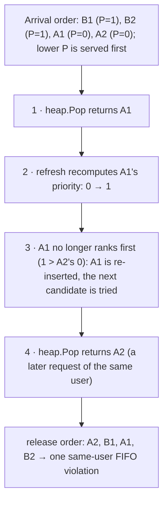
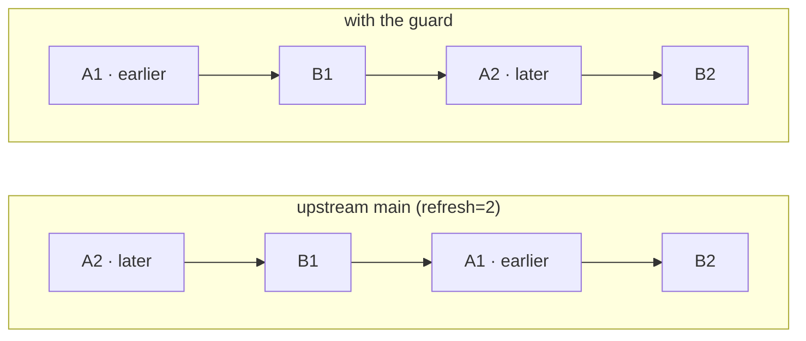
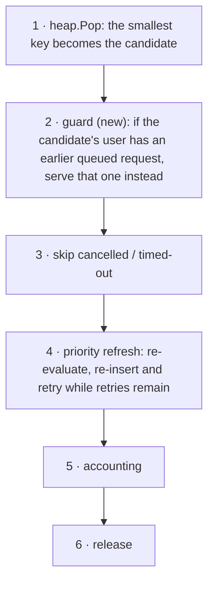
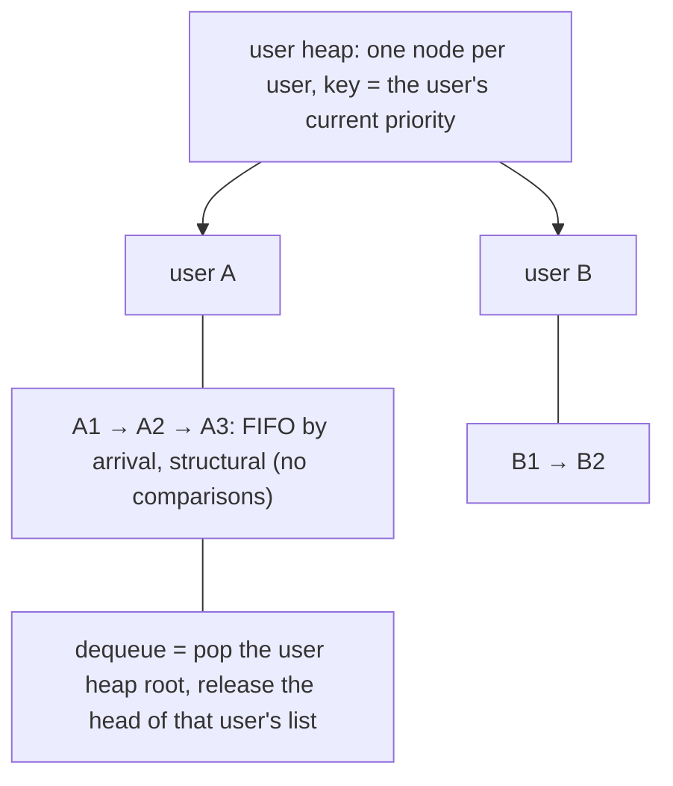

## Same-User FIFO in the Fairness Queue: Violation, Root Cause, and Fix Options

### Summary

The fairness scheduling user guide documents same-user ordering as part of the
queue's contract:

- **Same user**: requests remain FIFO by arrival time.
- If the same user sends several requests in sequence, Kthena preserves FIFO
  order for that user. Fairness applies across users, not by reordering a
  single user's own requests.

The same guide recommends enabling dequeue-time priority refresh for rapidly
changing usage patterns (`FAIRNESS_PRIORITY_REFRESH_RETRIES=1` or `2`).

With dequeue-time refresh enabled, the queue can release a later request of a
user before an earlier one. Same-user ordering is currently expressed only
through the comparator (`Less()`) and through each request's own copy of the
fairness score, while the refresh path re-inserts candidate requests during the
drain. A user's later request can therefore overtake an earlier request that is
still queued.

This proposal:

1. documents the violation and its root cause;
2. proposes the fix: enforce same-user FIFO at dequeue time ("the guard");
3. explores two prototype implementations of the lookup the guard needs, with
   measured cost; their final shape is still open.

A structural alternative (scheduling users instead of requests) is described
in [Future Work](#future-work) for discussion only; it is not part of this
change.

A draft implementation of this proposal is open as `#1772`; the bug is tracked
as `#1771`.

### Motivation

#### How the queue orders requests today

The fairness queue is a single min-heap of requests. Ordering is decided in one
comparator with three rules (`fairness_queue.go`):

1. same user -> compare arrival time (FIFO);
2. different users -> compare priority (lower value is served earlier);
3. equal priorities -> compare arrival time.

Priorities are per-request copies of a score derived from the user's recent
usage (a sliding-window tracker). With dequeue-time refresh enabled
(`FAIRNESS_PRIORITY_REFRESH_RETRIES > 0`), the priority of the candidate is
recomputed at dequeue time against current usage; if the fresher score would
place the candidate behind another waiting request, the candidate is
re-inserted and the next candidate is tried instead (bounded by the retry
count, with an optional full heap rebuild when the queue is small enough,
`FAIRNESS_REBUILD_THRESHOLD`, default 64).

Same-user order is therefore not enforced anywhere; it holds only as long as
each user's requests keep their relative comparison outcomes while the queue
is drained. The refresh path is exactly the mechanism
that can change those outcomes mid-drain: it re-inserts a request whose stored
score has moved, and the request that ends up at the root next is chosen by
scores, not by "who is the earliest queued request of this user".

#### Reproducible case

With dequeue-time refresh enabled (`FAIRNESS_PRIORITY_REFRESH_RETRIES=2`; the
guide recommends `1` or `2`), four requests are enough (arrival order and
enqueue priorities below):

- B1 (P=1), B2 (P=1), then A1 (P=0), A2 (P=0).



*Figure 1: the reproducer. A1 arrives first, A2 arrives later; A2 is released
first. Cross-user positions are unaffected.*

The case is deterministic. `#1772` adds
`TestPriorityRefresh_PreservesSameUserFIFO`, which reproduces the violation
during a burst (the user's burst is drained while its tracked usage grows).
The test fails without the guard and passes with it.

#### Why this matters

The user guide states the same-user order as an unconditional property of
fairness scheduling. This is a contract violation, not a tuning preference:
under the configuration the guide recommends, a client that issues requests in
sequence (a credential can be an application or an agent, not just one person)
can have them returned out of order. The failure is silent: nothing in the
system reports it. That is why it is worth fixing at dequeue time, instead of
documenting it as a caveat.

#### Goals

1. Guarantee the documented same-user FIFO at dequeue time, including while
   dequeue-time refresh is enabled.
2. Keep cross-user scheduling, refresh semantics, configuration, metrics, and
   APIs unchanged.
3. Keep the new invariants small and local to the queue.
4. Provide measured costs for the fix and for the alternative approaches
   (prototype-level).
5. Keep this change separable from any structural redesign of the queue.

#### Non-Goals

1. Redesigning the queue (per-user sub-queues); see [Future Work](#future-work).
2. Changing the priority formula, the sliding window, or cross-user semantics.
3. Changing refresh or rebuild behavior, defaults, or configuration surfaces.
4. Fixing every possible ordering anomaly under staleness; this change targets
   same-user ordering at dequeue time.
5. New CRDs, Helm values, metrics, or log surfaces.
6. Changing session-boost mode, which does not use the fairness comparator.

### Proposal

**Enforce same-user FIFO at dequeue time.** Before a candidate
request is released, check whether the same user has an earlier request still
in the queue. If it does, serve that request instead, and keep the candidate
queued. Nothing else changes: the comparator, the priority formula, the
refresh path, and all configuration stay as they are.



*Figure 2: the same reproducer, before and after. Only the same-user pair moves;
B1 stays 2nd and B2 stays 4th, so cross-user positions are unchanged.*

#### Position in the dequeue path

The guard runs immediately after the candidate is popped, before the
cancelled/timed-out skip and before the refresh block, inside
`popWhenAvailable()`:



*Figure 3: the dequeue pipeline. The guard precedes steps 3–4 so that the
request actually released is the one that goes through the cancellation check
and the refresh evaluation.*

#### What the guard needs

The guard needs to answer one question: *which request is this user's earliest
still-queued one, and where is it in the heap?* There are three ways to answer
it; we prototyped and measured all three, and recommend Option A as the
  default.

| Lookup approach | How the earlier request is located | Dequeue cost, 20k-deep queue (single-user / multi-user) |
|---|---|---|
| current `#1772` | full scan of the heap array on every dequeue | ≈33 µs / ≈63 µs |
| **Option A: per-user FIFO list** (recommended) | one check of the user's list head in the common case; a scan only when the guard actually triggers | 0.31 µs / 5.4–5.6 µs |
| Option B: heap index | a direct lookup of the earlier request's stored position | 0.32–0.36 µs / 4.4–4.5 µs (≈20% faster than Option A on the deep multi-user shape) |

*Prototype costs were measured with synthetic micro-benchmarks on one machine (queue depth 20k; single- and multi-user shapes); all variants were built from the same base code.*

**Option A** would keep one FIFO list per user with queued requests, mirroring
the heap's membership; the common case is one check of the user's list head,
and a scan happens only when the guard actually triggers.

**Option B** would keep each request's position in the heap array, so the earlier
request is reached directly instead of by scanning; the cost is a new
invariant to maintain and test across every heap mutation.

**Recommendation: Option A.** It has the smallest footprint, adds no invariant
on the heap itself, and moves the linear scan from "every dequeue" to "only
when the guard triggers". Option B is the right choice if a strict bound on the
replacement path is preferred; either can serve as the branch for this
proposal depending on the room's preference.

#### Notes / Constraints / Caveats

- **Ties**: the guard only serves a *strictly* earlier request
  (`RequestTime.Before`). Requests stamped in the same millisecond keep
  today's behavior.
- **Scope of reordering**: the guard only swaps within one user. Cross-user
  positions are untouched (Figure 2).
- **session-boost**: unaffected. Boost has its own ordering rule and does not
  use the fairness comparator; the guard is skipped there.
- **Bookkeeping on the boost drain path**: the boost-mode backpressure drain
  bypasses the standard dequeue (it filters the array and rebuilds), so the
  new bookkeeping is not used on that path; the only leftover is list nodes
  released when the queue closes. See [Related observation](#related-observation-out-of-scope).
- **Memory**: one list node per queued request, plus one extra field per request
  in Option B. Bounded by queue depth.

#### Risks and Mitigations

| Risk | Mitigation |
|---|---|
| Behavior change in a hot path | The guard is one comparison in the common case; the existing queue suites cover the queue's behavior |
| Option A's scan on hit, and Option B's new invariant | The scan runs only when the guard triggers, and the index is maintained only in `Swap/Push/Pop` |
| Session-boost regressions | The guard is skipped in boost mode; boost tests unchanged |
| Scope creep into a redesign | The structural direction is Future Work, explicitly not part of this change |

### Design Details

#### The guard in code (shared by all three variants)

```go
// after: req := heap.Pop(pq).(*Request)
if !pq.sessionBoost {
    if idx := pq.earliestQueuedBeforeLocked(req.UserID, req.RequestTime); idx >= 0 {
        earlier := pq.heap[idx]
        heap.Remove(pq, idx)
        heap.Push(pq, req)
        req = earlier
    }
}
```

Option A would replace `earliestQueuedBeforeLocked` with a lookup of the user's
list head plus a scan for the head's heap index; Option B would replace the index
lookup with `earliest.heapIndex`.

#### Related observation (out of scope)

One small item we noticed while working on this change; we flag it for the
maintainers to decide rather than proposing it:

1. the boost-mode backpressure drain bypasses the standard dequeue; should it
   be routed through the standard path?

### Alternatives

1. **Documentation-only mitigation** (stop recommending refresh, or warn about
   ordering): rejected. Freshness and ordering are independent concerns; the
   documented guarantee should not depend on a tuning knob being off.
2. **Current `#1772` (guard + full scan)**: correct and simple, but pays
   O(depth) on every dequeue (≈33 µs at depth 20k). Superseded by Option A/B
   on cost; can stay as a minimal first step if the community prefers shipping
   correctness first.
3. **Making the comparator order-consistent** (e.g., comparing a
   (user, arrival) tuple): rejected. The comparator sees two requests at a
   time; "the earliest queued request of this user" is a property of the whole
   queue, and the refresh path re-inserts candidates without consulting user
   order. Enforcement has to happen at dequeue time.
4. **Structural change**: scheduling users instead of requests; not part of
   this change, described in [Future Work](#future-work).

### Future Work

#### Structural direction (design only, for discussion)

The root cause is that same-user order has no structural home: it is carried
by the comparator, which mixes cross-user and same-user rules and is evaluated
between arbitrary pairs. An alternative shape is to schedule **users**:



*Figure 4: a two-level shape; a heap of users, one FIFO list per user.*

In this shape, same-user FIFO is structural, the comparator no longer mixes
rules, and the re-insert refresh path (and its rebuild fallback) is
not needed for ordering (the user key can be resampled when the user is
popped). This direction is **not implemented and has no measurements** in
this proposal; it is shared because it is where the root cause leads.
Open questions we would want to settle before proposing it:

- how refresh/freshness semantics migrate to a per-user key resampling model;
- the absolute memory cost of per-user bookkeeping at scale;
- how the shared queue shell used by session-boost would interact with it.

### Open Questions

1. Which lookup approach should ship: Option A (recommended), Option B, or the
   current scan?
2. Is the structural direction worth pursuing, and with what phasing?
3. Should this item be folded into this change or tracked
   separately?
