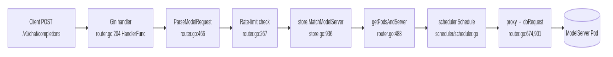
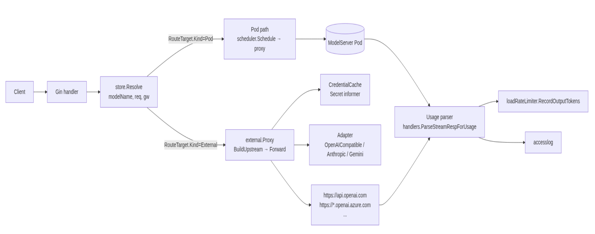
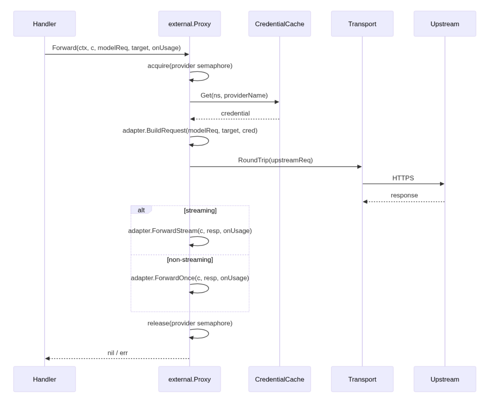
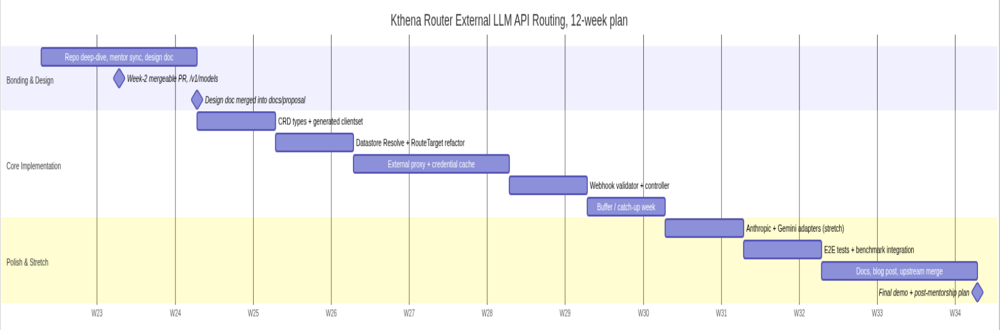

# Kthena Router: First-Class Routing to Third-Party LLM APIs

**LFX Mentorship 2026 Term 2 · CNCF / Volcano / Kthena**
**Slot:** [volcano-sh/kthena#939](https://github.com/volcano-sh/kthena/issues/939)

---

## 1. Title & Metadata

| Field | Value |
|---|---|
| **Applicant** | Divyam jha |
| **GitHub** | https://github.com/divyam-jha123 |
| **Email** | divyamjha.70055594@gmail.com |
| **Timezone** | UTC +5:30 IST |
| **Mentor** | Zengzeng Yao ([@YaoZengzeng](https://github.com/YaoZengzeng), yaozengzeng@huawei.com) |
| **Repository** | [github.com/volcano-sh/kthena](https://github.com/volcano-sh/kthena) |
| **Proposal version** | v1.0 |
| **Date** | 2026-05-16 |

---

## 2. Abstract

Kthena Router today only forwards inference traffic to in-cluster `ModelServer` pods. Teams that want to fall back to OpenAI, an Azure OpenAI deployment, or a self-hosted vLLM endpoint outside the cluster have to deploy a sidecar proxy and lose `ModelRoute`'s weight-splitting, rate-limit, and access-log integration. This work introduces an `ExternalModelProvider` CRD and a typed `RouteTarget` dispatch fork so a single `ModelRoute` rule can mix in-cluster pods and external HTTPS endpoints under unified weighted routing. The router gains a dedicated [pkg/kthena-router/external/](pkg/kthena-router/external/) proxy that injects credentials from a Secret, rewrites the model name for the upstream, streams responses with full Server-Sent Events pass-through, parses OpenAI `usage` blocks back into the existing rate-limiter, and exposes per-provider Prometheus metrics. Scope stops at OpenAI-compatible APIs in v1alpha1, with adapter hooks reserved for Anthropic and Gemini; cost-aware routing is left for a follow-up proposal. Twelve-week plan ships a mergeable PR in week 2, the API in week 4, the proxy in weeks 6–7, and e2e coverage and docs by week 11.

---

## 3. Background & Why This Work Matters

### 3.1 What the router does today

Kthena's data plane is built around one backend shape: a `ModelServer` selects pods via a label selector, the scheduler scores those pods (cache, KV-aware, tokenization), and the proxy forwards to a chosen pod IP. The dispatch path in [`router.go:317 doLoadbalance`](pkg/kthena-router/router/router.go#L317-L464) always calls [`getPodsAndServer`](pkg/kthena-router/router/router.go#L488-L498), runs the [`scheduler`](pkg/kthena-router/scheduler/scheduler.go) over the pod list, and proxies to a pod IP via [`doRequest`](pkg/kthena-router/router/router.go#L901-L920) (`req.URL.Host = fmt.Sprintf("%s:%d", podIP, port)`). The CRD field that drives this, [`TargetModel.ModelServerName`](pkg/apis/networking/v1alpha1/modelroute_types.go#L107-L120), is singular and required, so `ModelRoute` has no syntactic room for an external endpoint.

### 3.2 The user demand

The mentor's slot description states it directly: *"during discussions with customers, some users have expressed a need for the ability to integrate with external large language model APIs."* This shows up in three concrete operational patterns operators ask for:

1. **Burst overflow.** Local GPU capacity is sized for steady-state; bursts spill to a SaaS endpoint instead of being queued or dropped.
2. **Cold-start fallback.** A scale-to-zero `ModelServer` ([#1019](https://github.com/volcano-sh/kthena/issues/1019)) needs an external endpoint to serve traffic during the few seconds while pods boot.
3. **Multi-region failover.** Some inference traffic is regulated and must stay in-cluster; the rest can fall back to a managed API during a regional outage.

All three reduce to the same primitive: a `ModelRoute` rule whose weighted targets can be a mix of in-cluster pods and external HTTPS endpoints, with the same token accounting, the same rate limits, and the same access log.

### 3.3 What this unblocks downstream

| Capability | Status today | After this work |
|---|---|---|
| Hybrid cloud/on-prem fallback when GPU pods are unavailable | impossible without a sidecar proxy | one `ModelRoute` rule, two `targetModels` |
| Scale-to-zero with cold-fallback to a SaaS endpoint | blocks scale-to-zero work in [#1019](https://github.com/volcano-sh/kthena/issues/1019) | unblocks |
| `/v1/models` synthesis (issue [#958](https://github.com/volcano-sh/kthena/issues/958)) | router returns 400 | listing covers in-cluster + external |
| Router benchmark scenarios with mixed targets ([#942](https://github.com/volcano-sh/kthena/issues/942)) | not testable | first-class scenario |
| Token-budget enforcement against SaaS spend | only in-cluster traffic counted | unified per-model rate limit |

### 3.4 System invariants the design must preserve

These invariants are non-negotiable for the existing router and apply equally to the external path:

- **One model name, one route.** A client sending `"model": "gpt-4-mini"` does not need to know whether the backend is local or remote.
- **Weighted routing semantics.** `Weight` in `TargetModel` keeps its meaning across mixed backends; canary and A/B tests continue to work.
- **Token accounting is centralized.** `loadRateLimiter` and the access log see every request, regardless of backend.
- **Backward compatibility.** Existing `ModelRoute` manifests using only `modelServerName` validate and route unchanged.
- **No credential leaks.** API keys never reach access logs, debug endpoints, or downstream clients.
- **No regression in the in-cluster path.** Scheduler plugins, KV connectors, and PD-disaggregated routing all keep the exact code paths they have today.

---

## 4. Current Architecture Analysis

### 4.1 Request lifecycle as it exists



Every arrow assumes a pod exists at the end of the chain. There is no branch for "the destination is an HTTPS URL."

### 4.2 Concrete extension points (each anchored to code)

| # | Observation | File reference |
|---|---|---|
| 1 | `MatchModelServer` returns a bare `types.NamespacedName`. There is no shape to express "this destination is not a ModelServer." | [store.go:179](pkg/kthena-router/datastore/store.go#L179), [store.go:936-998](pkg/kthena-router/datastore/store.go#L936-L998) |
| 2 | `doLoadbalance` unconditionally calls `getPodsAndServer` then `scheduler.Schedule(ctx, pods)`. Passing `nil` pods would NPE in plugins (cache, KV-aware). | [router.go:351-357](pkg/kthena-router/router/router.go#L351-L357), [router.go:434](pkg/kthena-router/router/router.go#L434) |
| 3 | `TargetModel.ModelServerName` is required by CRD validation and load-bearing in the controller's deepcopy. No extension point exists. | [modelroute_types.go:107-120](pkg/apis/networking/v1alpha1/modelroute_types.go#L107-L120) |
| 4 | The proxy retry loop reads `req.Body` once before the loop. PR [#1031](https://github.com/volcano-sh/kthena/pull/1031) fixed an empty-body-on-retry bug here; any external proxy must follow the same pattern. | [router.go:692-727](pkg/kthena-router/router/router.go#L692-L727) |
| 5 | Streaming response forwarding uses `bufio.NewReader` + `c.Stream`. Usage is parsed line-by-line via `handlers.ParseStreamRespForUsage`. Token accounting is keyed on `modelName`, not the upstream, so external traffic can reuse this if the proxy plumbs the `onUsage` callback. | [router.go:843-876](pkg/kthena-router/router/router.go#L843-L876), [handlers/response.go](pkg/kthena-router/handlers/response.go) |
| 6 | The webhook validator only registers two kinds: `/validate/modelroute`, `/validate/modelserver`. A third endpoint is needed. | [webhook/validator.go:62-65](pkg/kthena-router/webhook/validator.go#L62-L65) |
| 7 | Rate limiter is keyed on the client-facing `modelName` from the request body. External traffic reuses the key directly, as long as the proxy preserves the client model name in the limiter callback after rewriting it for the upstream. | [filters/ratelimit/](pkg/kthena-router/filters/ratelimit/), [router.go:757-779](pkg/kthena-router/router/router.go#L757-L779) |
| 8 | `cmd/kthena-router/app/server.go` is the single wiring file. Adding an informer + a controller is ≤30 lines of glue. | [cmd/kthena-router/app/server.go](cmd/kthena-router/app/server.go) |

These eight observations are the entire surface area this proposal touches.

---

## 5. Proposed Solution

### 5.1 Plain-language summary

Add one CRD, `ExternalModelProvider`, that names an HTTPS API root, references a `Secret` for the API key, and lists which model names the upstream serves. Extend `ModelRoute.spec.rules[].targetModels[]` so each entry is either `modelServerName: foo` (existing) or `targetRef: {group, kind, name, modelName}` (new). At dispatch time, the router resolves the `ModelRoute` to a typed `RouteTarget` and forks: in-cluster goes through the existing scheduler/pod path; external goes through a new proxy that injects auth, rewrites the model name, streams the response, and feeds usage into the existing rate limiter and access log.

### 5.2 Proposed architecture

.

The two arms converge again at usage parsing. Accounting, metrics, and access logs do not branch.

### 5.3 Key design decisions

#### 5.3.1 New CRD rather than extending `ModelServer`

`ModelServer` is fundamentally about pods. Its spec ([modelserver_types.go](pkg/apis/networking/v1alpha1/modelserver_types.go)) carries `WorkloadSelector`, `WorkloadPort`, `KVConnector`, `InferenceEngine`, and `WorkloadSelector.PDGroup`. Bolting an "external endpoint" field onto the same CRD would make every one of those fields conditionally valid, requiring CEL union rules across many fields and turning the controller into a `if spec.externalProvider != nil` ladder. The router scheduler is built around pod scoring ([pkg/kthena-router/scheduler/](pkg/kthena-router/scheduler/) plugins cache, kvcache-aware, tokenization), and none of those concepts apply to a remote HTTPS endpoint.

A separate `ExternalModelProvider` CRD keeps each resource's invariants clean. The controller, scheduler, and validator code paths split cleanly on type, and a `ModelServer` always means "I have pods."

#### 5.3.2 `targetRef` discriminator on `TargetModel`

I extend `TargetModel` with a Gateway-API-style `targetRef`:

```go
type TargetModel struct {
    // ModelServerName references an in-cluster ModelServer.
    // Preserved for backward compatibility with existing v1alpha1 manifests.
    // Exactly one of ModelServerName or TargetRef must be set.
    // +optional
    // +kubebuilder:validation:MinLength=1
    ModelServerName string `json:"modelServerName,omitempty"`

    // TargetRef references a typed routing backend.
    // v1alpha1 supports kind="ExternalModelProvider".
    // +optional
    TargetRef *TargetReference `json:"targetRef,omitempty"`

    // +optional
    // +kubebuilder:default=100
    // +kubebuilder:validation:Minimum=0
    // +kubebuilder:validation:Maximum=100
    Weight *uint32 `json:"weight,omitempty"`
}

// +kubebuilder:validation:XValidation:rule="[has(self.modelServerName), has(self.targetRef)].filter(x, x).size() == 1",message="exactly one of modelServerName or targetRef must be set"

type TargetReference struct {
    // +kubebuilder:validation:Required
    Group string `json:"group"`
    // +kubebuilder:validation:Required
    Kind string `json:"kind"`
    // +kubebuilder:validation:Required
    // +kubebuilder:validation:MinLength=1
    Name string `json:"name"`
    // ModelName is the upstream model identifier this target serves.
    // Required when Kind="ExternalModelProvider".
    // +optional
    ModelName string `json:"modelName,omitempty"`
}
```

The `targetRef` shape generalizes. When v1beta1 wants to add a Bedrock backend, an MCP-server proxy, or a Gateway-API `InferencePool` target, the change is one switch arm in `store.Resolve`, not a schema modification.

#### 5.3.3 Internal `RouteTarget` typed dispatch

`store.MatchModelServer` is retained as a thin compatibility shim for tests and debug handlers, and is wrapped by a new `Resolve` that returns a typed value:

```go
type RouteTargetKind int

const (
    RouteTargetPod RouteTargetKind = iota
    RouteTargetExternal
)

type RouteTarget struct {
    Kind       RouteTargetKind
    ModelRoute *v1alpha1.ModelRoute
    IsLora     bool

    // Set when Kind == RouteTargetPod
    ModelServer types.NamespacedName

    // Set when Kind == RouteTargetExternal
    Provider      types.NamespacedName
    UpstreamModel string
}

// New, replaces the bare types.NamespacedName return in callers.
func (s *store) Resolve(modelName string, req *http.Request, gatewayKey string) (*RouteTarget, error)
```

The handler in `router.go` becomes the obvious fork:

```go
target, err := r.store.Resolve(modelName, c.Request, gatewayKey)
if err != nil {
    accesslog.SetError(c, "route_resolution", err.Error())
    c.AbortWithStatusJSON(http.StatusNotFound, "no route for model: "+modelName)
    return
}

switch target.Kind {
case datastore.RouteTargetPod:
    r.dispatchToPod(c, modelRequest, target)      // existing flow, extracted
case datastore.RouteTargetExternal:
    r.dispatchToExternal(c, modelRequest, target) // new
}
```

`dispatchToPod` is the body of the current `doLoadbalance` from [router.go:346](pkg/kthena-router/router/router.go#L346) onward, mechanically extracted with no behavior change.

#### 5.3.4 The external proxy

A new package [pkg/kthena-router/external/](pkg/kthena-router/external/) owns the external path. The hot path of `Forward` looks like this:

```go
func (p *Proxy) Forward(
    c *gin.Context,
    modelRequest router.ModelRequest,
    target *datastore.RouteTarget,
    onUsage func(handlers.OpenAIResponse),
) error {
    provider := p.store.GetExternalProvider(target.Provider)
    if provider == nil {
        return errProviderMissing
    }
    cred, err := p.creds.Get(target.Provider)
    if err != nil {
        return fmt.Errorf("credential: %w", err)
    }

    // Per-provider concurrency cap. Releases on early return.
    release, err := p.sem.acquire(c.Request.Context(), target.Provider, provider.Spec.MaxConcurrentRequests)
    if err != nil {
        return err
    }
    defer release()

    adapter := p.adapters.For(provider.Spec.Adapter)
    upstreamReq, err := adapter.BuildRequest(c.Request.Context(), modelRequest, target, provider, cred)
    if err != nil {
        return err
    }

    transport := p.transports.For(target.Provider)
    resp, err := transport.RoundTrip(upstreamReq)
    if err != nil {
        return err
    }
    defer resp.Body.Close()

    if isStreaming(modelRequest) {
        return adapter.ForwardStream(c, resp, onUsage)
    }
    return adapter.ForwardOnce(c, resp, onUsage)
}
```

The structure is intentional:

- **`BuildRequest`** owns body marshaling (`json.Encoder.SetEscapeHTML(false)`), model-name rewriting, hop-by-hop header stripping, and auth injection. One place to audit for credential or header leakage.
- **`RoundTrip`** is a per-provider `*http.Transport` with bounded `MaxIdleConns=64`, `IdleConnTimeout=90s`, `ResponseHeaderTimeout=provider.Spec.Timeout`, `ForceAttemptHTTP2=true`. Per-provider isolation prevents one misbehaving upstream from starving connections for the rest.
- **`ForwardStream`** uses `bufio.Scanner` over Server-Sent Events with a `sync.Pool` of 32 KiB buffers. The scanner consumes lines, the upstream `data: ` payloads are written through `http.Flusher` so the client sees tokens in real time, and `handlers.ParseStreamRespForUsage` extracts the final `usage` block.
- **`onUsage`** is the existing callback used by the in-cluster path, so rate limiting and access-log token counters work without parallel code.

Body-reuse follows the pattern PR [#1031](https://github.com/volcano-sh/kthena/pull/1031) established for the in-cluster proxy: read the body once before any retry loop, set `req.Body = io.NopCloser(bytes.NewReader(b))` on each attempt.

#### 5.3.5 Credential handling

`pkg/kthena-router/external/creds.go` owns a `CredentialCache`:

```go
type credential struct {
    Header string // e.g. "Authorization"
    Value  string // e.g. "Bearer sk-..."
}

type CredentialCache struct {
    cache atomic.Pointer[map[string]credential] // key: "ns/providerName"
}
```

A `corev1.Secret` informer (filtered by an `ownedBy=externalmodelprovider` label that the controller stamps) drives updates. On Secret change, the cache builds a new map and `Store`s the pointer. Reads are lock-free; in-flight requests retain their old credential through `RoundTrip` and pick up the rotation on the next call. A counter (`kthena_router_external_provider_credential_rotations_total{provider}`) records each swap.

The cache deliberately does not propagate credentials past `BuildRequest`. The credential never enters `gin.Context`, never enters access-log structured fields, and never appears in debug endpoints.

#### 5.3.6 Adapters

`adapter.Adapter` is a small interface:

```go
type Adapter interface {
    BuildRequest(ctx context.Context, mr router.ModelRequest, t *datastore.RouteTarget, p *v1alpha1.ExternalModelProvider, cred credential) (*http.Request, error)
    ForwardStream(c *gin.Context, resp *http.Response, onUsage func(handlers.OpenAIResponse)) error
    ForwardOnce(c *gin.Context, resp *http.Response, onUsage func(handlers.OpenAIResponse)) error
    Kind() v1alpha1.AdapterType
}
```

v1alpha1 ships `OpenAICompatible` (default), which is a pass-through plus model-name rewrite. Anthropic and Gemini adapters are week-9 stretch deliverables; they translate request and response shapes ↔ OpenAI's. Adapters are in-tree only in v1alpha1, with no plugin loading.

#### 5.3.7 Per-provider concurrency and QPS

`ExternalModelProviderSpec` exposes `MaxConcurrentRequests` (default 256) and `QPS` (default unbounded). The proxy enforces both via a semaphore and a `golang.org/x/time/rate` limiter scoped per provider. If a provider misbehaves, the worst case is bounded saturation of *that provider's* slots and the rest of the router continues normally. A Prometheus gauge `kthena_router_external_provider_circuit_open{provider}` and a status condition `Saturated` give operators a visible signal.

#### 5.3.8 Backward compatibility

- Existing `ModelRoute` manifests using only `modelServerName` validate and route unchanged. The new CEL rule treats absence of `targetRef` as "use `modelServerName`."
- CRD edge case: today `modelServerName` is `+kubebuilder:validation:required` (key must be present) but lacks `MinLength=1`. After the change it becomes `+optional` with `MinLength=1`. A pre-existing object with the literal string `modelServerName: ""` would be rejected on the next update; this is a strictly tighter constraint than what the controller already assumed, since an empty string was never a valid reference.
- `MatchModelServer` becomes a thin shim around `Resolve`. Debug handlers, mocks, and tests that import the existing signature keep building.
- CRD install order matters: install the new schemas before rolling out a router image that honors `targetRef`. The Helm chart (`charts/kthena/charts/networking/`) gates the schema upgrade on a chart version bump.

#### 5.3.9 Security

| Concern | Mitigation |
|---|---|
| Credentials over plain HTTP | CEL: `self.lowerAscii().startsWith('https://')`. Runtime check on `url.Parse(...).Scheme == "https"` before any auth header is injected. |
| SSRF via userinfo URLs (`https://attacker@victim/`) | CEL: `!self.contains('@')`. Runtime check on `parsed.User == nil`. |
| Path-version doubling (`/v1/v1/chat/completions`) | CEL: `!self.matches('^.*/v\\d+/?$')`. |
| Query/fragment injection in `baseURL` | CEL: `!self.contains('?') && !self.contains('#')`. |
| Cross-namespace Secret access | v1alpha1: `Secret` and `ExternalModelProvider` must be in the same namespace. Cross-namespace is deferred to a future `ReferenceGrant`-style proposal. |
| Client `Authorization` header forwarded to upstream | Sanitizer drops `Authorization`, `Proxy-Authorization`, and all hop-by-hop headers (`Connection`, `Keep-Alive`, `Transfer-Encoding`, `Upgrade`, `TE`, `Trailer`, `Proxy-Connection`). Retained: `Content-Type`, `Accept`, `User-Agent`, `x-request-id`. |
| `Content-Length` mismatch after model-name rewrite | `Content-Length` is dropped from the cloned header set; `http.NewRequestWithContext` recomputes from the new body. |
| Goroutine exhaustion | Per-provider semaphore (§5.3.7) caps in-flight requests. |
| Credentials in logs | Authenticator scrub list extended; access-log structured fields never include provider credentials. |
| Supply-chain risk in adapters | Adapters are in-tree only in v1alpha1. No plugin loading, no Lua/Wasm. |

#### 5.3.10 Observability hooks

New Prometheus metrics, registered in [pkg/kthena-router/metrics/metrics.go](pkg/kthena-router/metrics/metrics.go), following the existing label conventions:

| Metric | Type | Labels |
|---|---|---|
| `kthena_router_external_provider_requests_total` | Counter | `provider`, `model`, `status_code`, `error_type` |
| `kthena_router_external_provider_request_duration_seconds` | Histogram | `provider`, `model` |
| `kthena_router_external_provider_active_requests` | Gauge | `provider` |
| `kthena_router_external_provider_credential_rotations_total` | Counter | `provider` |
| `kthena_router_external_provider_circuit_open` | Gauge (0/1) | `provider` |

Access log gains a `target_kind` field (`pod` or `external`) and a `target_provider` field (empty for pod). Set in [accesslog/middleware.go](pkg/kthena-router/accesslog/middleware.go) where `accesslog.SetRequestRouting` is called from [router.go:441-456](pkg/kthena-router/router/router.go#L441-L456).

A debug handler `/debug/external-providers` lists provider name, status conditions, in-flight count, and last error. Added to [debug/handlers.go](pkg/kthena-router/debug/handlers.go).

#### 5.3.11 Performance budget

Concrete targets the implementation will meet:

| Path | Budget |
|---|---|
| `Resolve` for cached `ModelRoute` (in-cluster + external arms combined) | < 5 µs p99 |
| Added latency over raw `http.Transport` for external non-streaming | < 300 µs p99 |
| Time-to-first-byte for streaming external response | within 2 ms of raw `http.Transport` p99 |
| Memory per concurrent external request | ≤ 64 KiB steady-state (32 KiB stream buffer + overhead) |
| Credential rotation visible to new requests | < 1 second after Secret update |

Measured via benchmarks in `pkg/kthena-router/external/proxy_bench_test.go` against an in-process `httptest.Server`. Numbers are reported in the week-12 blog post.

#### 5.3.12 Edge cases and failure modes

| Case | Handling |
|---|---|
| Upstream returns 429 | Surface as 429 to client; bump `RateLimitExceeded{error_type="upstream_rate_limit"}`. No retry. |
| Upstream returns 5xx | One retry after 100 ms jitter. On second failure, fall through to the next weighted target if any; otherwise return 502 to client. |
| Upstream times out (`spec.timeout`, default 60 s) | Cancel via `context.WithTimeout` derived from `c.Request.Context()`. Client sees 504. |
| Client disconnects mid-stream | Detected via `c.Request.Context().Done()`. Upstream connection closed. Partial usage recorded. |
| Secret deleted while in-flight | In-flight requests use cached credential. New requests fail with 503 + `error_type="credential_missing"`. |
| Secret rotated | Atomic swap; in-flight requests keep their old token. |
| Provider returns empty `usage` block | No-op for accounting. Matches current in-cluster behavior. |
| Client requests a model not in `provider.spec.models[]` | 404 + `error_type="upstream_model_not_found"`. Controller emits a `Warning` Event on the referencing `ModelRoute`. |

### 5.4 Alternatives considered

| Alternative | Why rejected |
|---|---|
| Extend `ModelServerSpec` with an optional `ExternalProvider` field | Field-validity matrix explodes (every existing field becomes conditionally valid). Controller assumes pods exist. Scheduler scores pods. See §5.3.1. |
| Two named fields `modelServerName` and `externalProviderRef` with a CEL XOR rule | Doesn't generalize past two backends. Every new backend kind churns the CRD schema. `targetRef` (§5.3.2) absorbs new backends with a switch arm. |
| Wrap an off-the-shelf reverse proxy library (`httputil.ReverseProxy`) | The `Director` callback can't easily express body rewriting for model-name remapping. Retry-on-5xx-then-failover semantics don't fit. Streaming usage parsing still needs to be custom. 200 lines we own are better than a thin wrapper around a library that doesn't quite fit. |
| Encode credentials directly in the CRD | Secret semantics, RBAC story, and rotation story are all strictly worse. Secret reference is non-negotiable. |
| Add external as a backend on a new `HTTPRoute` rule (Gateway API) | `HTTPRoute` doesn't model "one of N weighted upstreams of a logical model." That's exactly what `ModelRoute` exists to express. Keeping external as a `targetRef` keeps `ModelRoute` the single point of LLM-aware policy. |
| Implement only OpenAI passthrough and skip the adapter interface | Locks the design into one upstream shape. Anthropic and Gemini will be requested within a release; building the seam now is cheap (≤ 60 lines for the interface plus the default impl). |

### 5.5 Non-goals (explicit)

These are out of scope for this proposal, to keep review focused:

1. Cost-aware or latency-aware `selectionPolicy` on `ModelRoute`. Deferred to a follow-up.
2. Cross-namespace `Secret` and `ExternalModelProvider` references. Deferred to a `ReferenceGrant`-style proposal.
3. Liveness probing of external providers (periodic `GET /v1/models`). Status conditions in v1alpha1 reflect Secret and validation state only.
4. Request/response transformation policy beyond model-name rewriting and the adapter shapes.
5. Plugin-loaded adapters (Lua/Wasm/CRD-defined). Adapters are in-tree.
6. Billing or cost dashboard data on the CRD status.

---

## 6. Technical Implementation Plan

### 6.1 New CRD types, `pkg/apis/networking/v1alpha1/`

| File | Change |
|---|---|
| `externalmodelprovider_types.go` (new, ~180 lines) | `ExternalModelProvider`, `ExternalModelProviderSpec`, `ExternalModelProviderStatus`, `ExternalModelProviderAuth`, `ExternalSecretKeyRef`, `ExternalModel`, `AdapterType` enum |
| `modelroute_types.go` | Add `TargetReference`; relax `TargetModel.ModelServerName` to `+optional` + `MinLength=1`; add `TargetModel.TargetRef`; add CEL union rule |
| `register.go` | Register `ExternalModelProvider`, `ExternalModelProviderList` |
| `zz_generated.deepcopy.go` | Regenerated via `make generate` |

CRD YAMLs land under `charts/kthena/charts/networking/templates/`. Generated clientset and informers in `client-go/` updated by `make generate`.

Full spec sketch:

```go
type ExternalModelProviderSpec struct {
    // +kubebuilder:validation:Required
    // +kubebuilder:validation:MinLength=9
    // +kubebuilder:validation:MaxLength=2048
    // +kubebuilder:validation:XValidation:rule="self.lowerAscii().startsWith('https://')",message="baseURL must use HTTPS"
    // +kubebuilder:validation:XValidation:rule="!self.contains('@')",message="baseURL must not contain userinfo"
    // +kubebuilder:validation:XValidation:rule="!self.contains('?') && !self.contains('#')",message="baseURL must not contain query or fragment"
    // +kubebuilder:validation:XValidation:rule="!self.matches('^.*/v\\d+/?$')",message="baseURL must not end with a version path segment"
    BaseURL string `json:"baseURL"`

    // +kubebuilder:validation:Required
    Auth ExternalModelProviderAuth `json:"auth"`

    // +listType=map
    // +listMapKey=name
    // +kubebuilder:validation:MinItems=1
    // +kubebuilder:validation:MaxItems=64
    Models []ExternalModel `json:"models"`

    // +optional
    // +kubebuilder:default="OpenAICompatible"
    // +kubebuilder:validation:Enum=OpenAICompatible;Anthropic;Gemini
    Adapter AdapterType `json:"adapter,omitempty"`

    // +optional
    Timeout *metav1.Duration `json:"timeout,omitempty"`

    // +optional
    // +kubebuilder:validation:Minimum=1
    // +kubebuilder:validation:Maximum=10000
    MaxConcurrentRequests *int32 `json:"maxConcurrentRequests,omitempty"`

    // +optional
    // +kubebuilder:validation:Minimum=1
    QPS *int32 `json:"qps,omitempty"`
}

// +kubebuilder:validation:XValidation:rule="(self.type == 'APIKeyHeader') == has(self.headerName)",message="headerName is required when type=APIKeyHeader and rejected otherwise"
type ExternalModelProviderAuth struct {
    // +optional
    // +kubebuilder:default=Bearer
    // +kubebuilder:validation:Enum=Bearer;APIKeyHeader;RawToken
    Type AuthType `json:"type,omitempty"`

    // +kubebuilder:validation:Required
    SecretRef ExternalSecretKeyRef `json:"secretRef"`

    // +optional
    // +kubebuilder:validation:MinLength=1
    HeaderName string `json:"headerName,omitempty"`
}

type ExternalSecretKeyRef struct {
    // +kubebuilder:validation:Required
    // +kubebuilder:validation:MinLength=1
    Name string `json:"name"`
    // +optional
    // +kubebuilder:default=apiKey
    // +kubebuilder:validation:MinLength=1
    Key string `json:"key,omitempty"`
}
```

### 6.2 Datastore, `pkg/kthena-router/datastore/`

| File | Change |
|---|---|
| `external_provider.go` (new, ~180 lines) | `externalProviders sync.Map`; `AddOrUpdateExternalProvider`, `DeleteExternalProvider`, `GetExternalProvider`, `RangeExternalProviders` (the `Range` callback avoids O(N) map copies that a naive `GetAll` would incur) |
| `store.go` | Add `Resolve(modelName, req, gw) (*RouteTarget, error)`. Refactor `selectDestination` (already returns `*TargetModel`) to drive `Resolve`'s switch on `TargetRef.Kind` |
| `store_test.go` | Add table-driven tests for mixed in-cluster + external weighted picks |

`Store` interface gains:

```go
AddOrUpdateExternalProvider(p *aiv1alpha1.ExternalModelProvider) error
DeleteExternalProvider(name types.NamespacedName) error
GetExternalProvider(name types.NamespacedName) *aiv1alpha1.ExternalModelProvider
RangeExternalProviders(func(name types.NamespacedName, p *aiv1alpha1.ExternalModelProvider) bool)

// New typed dispatch:
Resolve(modelName string, request *http.Request, gatewayKey string) (*RouteTarget, error)
// Existing method preserved as a thin shim for compatibility.
MatchModelServer(...)
```

### 6.3 Controller, `pkg/kthena-router/controller/`

| File | Change |
|---|---|
| `external_provider_controller.go` (new, ~220 lines) | Standard informer-driven controller. Enqueue on add/update/delete. Reconcile reads the referenced `Secret`, validates, and sets `Status.Conditions` (`SecretAvailable`, `BaseURLValid`). Emits a `Warning` Event on referencing `ModelRoute` objects if a `targetRef.modelName` isn't in `Spec.Models`. |
| `external_provider_controller_test.go` (new) | Fake clientset + informer factory. Covers Secret missing, Secret rotated, baseURL invalid, model-not-found |
| `modelroute_controller.go` | Cross-resource referential check on `ModelRoute` admission and reconcile |

### 6.4 Router data plane, `pkg/kthena-router/router/router.go`

The change is small and surgical:

- Replace the `MatchModelServer` call at [router.go:341](pkg/kthena-router/router/router.go#L341) with `Resolve`.
- Extract the body of `doLoadbalance` from [router.go:346](pkg/kthena-router/router/router.go#L346) downward into a new `dispatchToPod` method. Same code, same behavior.
- Add `dispatchToExternal`, ~80 lines: resolve provider, fetch credential, call `external.Proxy.Forward`, plumb the `onUsage` callback through to `loadRateLimiter.RecordOutputTokens` and `accesslog.SetTokenCounts`.

### 6.5 External proxy, `pkg/kthena-router/external/` (new package)

| File | Estimated lines | Responsibility |
|---|---|---|
| `proxy.go` | 250 | `Forward`. Body-bytes-once. Per-provider semaphore. Header sanitize. Model-name rewrite. Streaming + non-streaming branches. |
| `transport.go` | 80 | `transportFor(provider) *http.Transport`. Per-provider pool. |
| `creds.go` | 120 | `CredentialCache`. Secret informer. Atomic load via `atomic.Pointer`. Lookup by `(ns, providerName)`. |
| `headers.go` | 50 | Hop-by-hop drop list. Client `Authorization` strip. Header canonicalization. |
| `streaming.go` | 120 | `forwardStream`. `bufio.Scanner` over SSE. `sync.Pool` for 32 KiB buffers. `http.Flusher` per chunk. |
| `adapter/openai.go` | 80 | Pass-through plus model-name rewrite. v1alpha1 default. |
| `adapter/anthropic.go` | 150 | Week-9 stretch. Translate ↔ `/v1/messages`. |
| `adapter/gemini.go` | 150 | Week-9 stretch. Translate ↔ `generateContent`. |
| `*_test.go` | 700 across files | See §8. |

Sequence of `Forward`:

.

### 6.6 Webhook validator, `pkg/kthena-router/webhook/`

| File | Change |
|---|---|
| `validator.go` | New handler `HandleExternalProvider`. Mux registration `mux.HandleFunc("/validate/externalmodelprovider", ...)` |
| `utils.go` | `ParseExternalProviderFromRequest` mirroring existing parsers |
| `validator_test.go` | HTTP rejected, userinfo rejected, trailing `/vN` rejected, missing Secret reference rejected, Bearer + headerName combination rejected, valid forms accepted |

A new entry is added to the `ValidatingWebhookConfiguration` under `charts/kthena/charts/networking/templates/`.

### 6.7 Wiring, `cmd/kthena-router/`

`cmd/kthena-router/app/server.go` gains four glue changes:

1. Construct `external.CredentialCache` with `kubeInformerFactory.Core().V1().Secrets()`.
2. Wire `external.NewProxy(transports, creds, metrics)` into the router constructor.
3. Build `ExternalProviderController` from `kthenaInformerFactory.Networking().V1alpha1().ExternalModelProviders()`.
4. Append to `cacheSyncs`, append to `controllers`, `go controller.Run(stop)`.

### 6.8 `/v1/models` synthesis (closes [#958](https://github.com/volcano-sh/kthena/issues/958))

Week-2 mergeable PR. New handler at `pkg/kthena-router/handlers/models.go` (~80 lines): lists the union of `store.GetAllModelRoutes()` model names plus all in-cluster `ModelServer.Spec.Model` names. Registered on `GET /v1/models` in `app/server.go` ahead of the gin catch-all. After §5 lands, the same handler picks up `ExternalModelProvider.spec.models[].name` for free.

### 6.9 Dependencies

No new direct dependencies are introduced:

- HTTP transport: stdlib `net/http`
- Secret informer: existing `k8s.io/client-go` v0.34.2
- CRD validation: existing controller-gen
- Streaming: stdlib `bufio` and `sync.Pool`
- Rate limiting: existing `golang.org/x/time/rate` from `go.sum`

---

## 7. 12-Week Timeline

### 7.1 Gantt overview



### 7.2 Week-by-week

| Week | Phase | Goals | Deliverables |
|---|---|---|---|
| 1 (Jun 2–8) | Bonding | Mentor sync. Open the design doc PR following the project template at [docs/proposal/proposal-template.md](docs/proposal/proposal-template.md). Map every file the work will touch. | Draft design doc PR opened. Weekly progress thread on #939. |
| 2 (Jun 9–15) | Bonding | Land `/v1/models` synthesis as the first mergeable PR. Closes [#958](https://github.com/volcano-sh/kthena/issues/958) and gives reviewers a real PR to calibrate on. | **PR #1**: `feat(router): synthesize /v1/models from ModelRoutes and ModelServers` (~150 lines + tests) |
| 3 (Jun 16–22) | Bonding → Impl | Design doc merged after review iteration. | Design doc merged at `docs/proposal/external-model-provider.md`. |
| 4 (Jun 23–29) | Impl slice 1 | CRD types + `make generate` + Helm chart updates. Webhook validator endpoint stub returning `Allowed: true` so admission tests can run before logic lands. | **PR #2**: `feat(api): add ExternalModelProvider CRD types and TargetRef union` |
| 5 (Jun 30–Jul 6) | Impl slice 2 | Datastore `RouteTarget` refactor. `Resolve` with table-driven tests including mixed in-cluster + external weighted picks. | **PR #3**: `refactor(datastore): introduce RouteTarget typed dispatch` |
| 6 (Jul 7–13) | Impl slice 3 | External proxy package. `Forward` with body-reuse, header sanitize, OpenAI adapter, credential cache with Secret informer. Unit-tested against `httptest.Server`. | **PR #4**: `feat(router): external HTTPS proxy for OpenAI-compatible providers` |
| 7 (Jul 14–20) | Impl slice 4 | Webhook validator real logic. `ExternalProviderController` reconcile + `Status` conditions. Cross-resource validation on `ModelRoute`. | **PR #5**: `feat(controller): ExternalProviderController with status conditions` |
| 8 (Jul 21–27) | Buffer / catch-up | Review-comment turnaround on PRs #2–#5. Performance pass (sync.Pool tuning, transport pool sizing). Wire access-log + metric integration. | Review-comment turnaround. Perf notes posted to #939. |
| 9 (Jul 28–Aug 3) | Stretch / Slice 5 | Anthropic + Gemini adapters. Per-provider QPS and concurrency caps land. Defer adapters if the mentor prefers OpenAI-only first. | **PR #6**: `feat(external): Anthropic and Gemini adapters` (or scope-narrow alternative) |
| 10 (Aug 4–10) | Polish | E2E tests under `test/e2e/router/` using an in-cluster mock LLM server. Benchmark scenario contributed to [#942](https://github.com/volcano-sh/kthena/issues/942). | **PR #7**: `test(e2e): external provider routing scenarios` |
| 11 (Aug 11–17) | Docs | User guide at `docs/kthena/docs/user-guide/external-providers.md`. Example manifests under `examples/kthena-router/`. Migration notes. Metrics docs update. | **PR #8**: `docs: external provider user guide and examples` |
| 12 (Aug 18–24) | Wrap-up | Blog post for kthena.volcano.sh/blog. Final review pass. Post-mentorship plan recorded in #939. | Blog post draft. Final demo to mentor. Closing summary on #939. |

Discipline this plan holds itself to:

- No week has more than two major deliverables.
- Buffer is week 8, not week 12.
- First mergeable PR lands in week 2.
- Documentation ships in every implementation PR (godoc, design doc sections), not only in weeks 11–12.

### 7.3 Acceptance criteria (definition of done at week 12)

This proposal succeeds when all of the following are true:

1. `ExternalModelProvider` CRD is merged in `pkg/apis/networking/v1alpha1/` and shipped in a Helm chart release.
2. A `ModelRoute` with mixed `modelServerName` and `targetRef` targets routes traffic weighted across both, end to end, in a real cluster.
3. Token accounting and rate limiting apply uniformly to in-cluster and external traffic. The Prometheus metrics in §5.3.10 exist and have non-zero values under load.
4. The e2e matrix entry `router` in CI covers external routing with the in-cluster mock provider, with no flakes across three consecutive runs.
5. The user guide at `docs/kthena/docs/user-guide/external-providers.md` walks an operator through three working configurations: OpenAI, Azure OpenAI deployment-style URL, and self-hosted vLLM.
6. The blog post is published on kthena.volcano.sh/blog with a metrics dashboard screenshot showing mixed in-cluster + external traffic.

---

## 8. Testing & Validation Strategy

### 8.1 Unit tests, `pkg/kthena-router/external/*_test.go`

| Test target | Coverage |
|---|---|
| `Forward` happy path | Body marshalled with `SetEscapeHTML(false)`. Model name rewritten correctly. Auth header set per `auth.type`. |
| `Forward` retry on 5xx | Single retry. Second 5xx returns 502. `bytes.Reader` reset between attempts (regression for the body-reuse class of bugs). |
| Header sanitize | All hop-by-hop headers stripped. Client `Authorization` stripped. `Content-Length` not propagated. |
| Streaming | SSE lines forwarded byte-for-byte. `data: [DONE]` sentinel respected. Usage parsed from final `data:` block. Client disconnect cancels upstream. |
| `CredentialCache` | Secret added populates the cache. Secret updated swaps atomically. Secret deleted returns a clear error. Concurrent reads under writes are race-detector clean. |
| Per-provider semaphore | 257th concurrent request blocks until one completes. Respects `ctx.Done()`. |
| QPS limiter | Tested with `golang.org/x/time/rate` mock clock. |
| `transport.go` | Per-provider transports are distinct. Pool sizing honored. |

Target line coverage for the new package: ≥85%. Existing CI workflow [.github/workflows/go-tests.yml](.github/workflows/go-tests.yml) tracks coverage trend.

### 8.2 Validator tests, `pkg/kthena-router/webhook/validator_test.go`

Mirroring the existing `TestKthenaRouterValidatingWebhook` style:

- HTTP `baseURL` rejected
- `https://token@host/` rejected
- `https://api.openai.com/v1` (trailing version) rejected
- `https://api.openai.com?key=x` (query) rejected
- Bearer + headerName combination rejected
- APIKeyHeader without headerName rejected
- Valid Bearer + valid Secret reference accepted
- Empty `models[]` rejected (enforced by `MinItems=1`, double-checked for clarity)

### 8.3 Controller integration tests

`external_provider_controller_test.go` follows the pattern at [`modelserver_controller_test.go`](pkg/kthena-router/controller/modelserver_controller_test.go):

- Secret missing → `SecretAvailable=False, reason=SecretNotFound`
- Secret rotated → controller observes via informer; `credential_rotations_total{provider}` increments
- `ModelRoute` references unknown upstream model → `Warning` Event on the ModelRoute
- `ExternalModelProvider` deleted while referenced → reconcile sets a clear error condition

### 8.4 End-to-end tests, `test/e2e/router/`

- `external_provider_test.go`: fully in-cluster. A tiny Go binary at `test/e2e/router/mock-external-llm/` serves OpenAI-shaped `/v1/chat/completions` and `/v1/models` on a `Service`. The `ExternalModelProvider` points at the in-cluster URL.
- Scenarios: streaming + non-streaming. Weighted 50/50 mix of in-cluster + mock external. Rate-limit exceeded. Provider returns 429. Credential rotation mid-test.
- Hooks into the existing matrix entry `router` in [.github/workflows/e2e-tests.yml](.github/workflows/e2e-tests.yml). No new matrix category needed.

The mentor's note that "external LLM APIs are unlikely to offer stable, long-term free access, so end-to-end testing is not a prerequisite" is respected. The mock-external server is the e2e contract, not a real provider. A `RUN_REAL_PROVIDER_E2E=1` env gate runs against OpenAI on demand only.

### 8.5 Performance benchmarks

- `pkg/kthena-router/external/proxy_bench_test.go` measures per-request overhead vs. raw `http.Client`. Targets in §5.3.11.
- Benchmark scenario YAML contributed to the parallel benchmark slot [#942](https://github.com/volcano-sh/kthena/issues/942) so external scenarios are included from day one.

### 8.6 Race detector and flake budget

All new tests run under `go test -race`. Open flake issues like [#1050](https://github.com/volcano-sh/kthena/issues/1050) (validator) and [#1070](https://github.com/volcano-sh/kthena/issues/1070) (rate-limit e2e) suggest the surrounding code needs careful synchronization. New tests use `eventually(t, fn, timeout)` patterns rather than fixed `time.Sleep`, and any flake observed during development is fixed in the same PR that introduced the test.

---

## 9. Documentation Plan

| Audience | Artifact | Where |
|---|---|---|
| Operators | "Routing to external LLM providers" guide. OpenAI, Azure OpenAI, vLLM-OSS, self-hosted-vLLM walkthroughs. | `docs/kthena/docs/user-guide/external-providers.md` |
| Operators | Migration note for existing `ModelRoute` users | Same file, "Backward compatibility" section |
| Developers | Architecture page section on the `RouteTarget` dispatch fork | `docs/kthena/docs/architecture/router.md` (existing file extended) |
| Developers | Adapter authoring guide. How to add a non-OpenAI shape. | `docs/kthena/docs/contributor/external-adapter.md` (new) |
| Designers | Design doc | `docs/proposal/external-model-provider.md` (new) |
| Examples | OpenAI passthrough, Azure deployment-style URL, mixed weighted route | `examples/kthena-router/ExternalProvider-OpenAI.yaml`, `ExternalProvider-Azure.yaml`, `ModelRoute-MixedExternalAndInCluster.yaml` |
| Community | Blog post: routing OpenAI traffic through Kthena Router. Config + metrics dashboard screenshot. | `docs/kthena/blog/` (publishes to kthena.volcano.sh/blog) |
| Tutorial | Quick Start update mentioning the external-provider option | `docs/kthena/docs/getting-started/quick-start.md` |

Docs ship in the same PR as the feature they document. The week-12 docs PR is the blog post and final polish, not the bulk of the writing.

---

## 10. Risk Analysis

| # | Category | Risk | Probability | Mitigation |
|---|---|---|---|---|
| 1 | Technical | Streaming SSE pass-through subtly breaks under a provider's chunk-encoding quirk (Azure occasionally interleaves `data: ` with pseudo-keepalive lines). | Medium | Capture pcap-equivalent fixtures of every provider's stream and replay them in unit tests. Real-provider smoke tests behind `RUN_REAL_PROVIDER_E2E=1`. |
| 2 | Technical | CRD schema migration trips on a stored object with `modelServerName: ""`. | Low | The same PR that relaxes `required` adds `MinLength=1`, a strictly tighter constraint. Migration note in the user guide. |
| 3 | Scope | Anthropic and Gemini adapters consume more time than the week-9 budget. | Medium | Adapters are explicitly stretch (§5.3.6). v1alpha1 ships OpenAI-compatible only. Week 9 falls back to perf hardening + extra test coverage if adapters slip. |
| 4 | Scope | Reviewers ask for cost-aware routing or `selectionPolicy` in the same proposal. | Low | Non-goals (§5.5) explicitly defer cost-aware routing. The follow-up proposal is the right place. |
| 5 | Ecosystem | `sigs.k8s.io/gateway-api-inference-extension v1.2.0` ships breaking changes during the cohort. | Low | Pinned via `go.mod`. No new direct dependency on its types in the external path. If upstream forces an update, it's isolated to existing GIE code. |
| 6 | Project | Provider rate limits or auth shapes change mid-cohort (e.g., Azure deployment URL format updates). | Low | Adapter interface isolates the provider-specific shape. A change rewrites one adapter file, not the proxy core. |

---

## 11. Community Collaboration Plan

- **Mentor sync:** weekly 30-minute video call with @YaoZengzeng, scheduled at a time that overlaps both timezones. Async daily updates as a comment on [#939](https://github.com/volcano-sh/kthena/issues/939) in the form *"Yesterday: X. Today: Y. Blocked on: Z (or none)."*
- **Channels:** GitHub Issues for tracking. GitHub Discussions for design questions before they become PR comments. Slack from the project README for synchronous quick clarifications during overlap hours.
- **Public weekly progress reports:** every Friday a `## Week N progress` comment lands on [#939](https://github.com/volcano-sh/kthena/issues/939) with what merged, what's open, what's blocked. Visible to the rest of the community, not only the mentor.
- **PR review etiquette:** small PRs (<500 lines diff each, except the necessarily larger CRD-types PR). Each opened as a draft first if I'm uncertain about an approach. Reviewers tagged from `OWNERS` (currently @hzxuzhonghu). Review comments addressed within 24 hours on weekdays in UTC +5:30 IST.
- **Disagreement handling:** if a reviewer and I disagree, I write the alternatives on the PR with trade-offs, then defer to maintainer judgment. I don't re-litigate decisions across multiple PRs.
- **Coordination with the benchmark slot ([#942](https://github.com/volcano-sh/kthena/issues/942)):** sync in week 6 once external routing PRs are mergeable. Contribute a benchmark scenario YAML so their work has external-routing data from day one.
- **Open community work:** during the buffer week and after week 12, pick up adjacent open issues, particularly the perf and observability cluster ([#1056](https://github.com/volcano-sh/kthena/issues/1056), [#960](https://github.com/volcano-sh/kthena/issues/960), [#347](https://github.com/volcano-sh/kthena/issues/347)).

---

## 14. Long-Term Vision Post-Mentorship

Concrete commitments past week 12, written into the closing comment on [#939](https://github.com/volcano-sh/kthena/issues/939):

- **v1beta1 graduation (Q4 2026).** Drive `ExternalModelProvider` from v1alpha1 to v1beta1 with the lessons from production deployments. Likely additions: cross-namespace reference via `ReferenceGrant`, request/response transformation policy, cost-aware routing as a `selectionPolicy` field on `ModelRoute`.
- **Adapter ecosystem.** Land Anthropic Messages and Gemini `generateContent` adapters if they don't make v1alpha1. Engage the community on Bedrock and Vertex AI shape support.
- **Health probes and circuit breakers** for external providers. Probe endpoint, ejection thresholds, half-open recovery.
- **Triage rotation** on open router issues, particularly the perf and observability cluster ([#1056](https://github.com/volcano-sh/kthena/issues/1056), [#960](https://github.com/volcano-sh/kthena/issues/960), [#347](https://github.com/volcano-sh/kthena/issues/347)).
- **Conference talk pitch** to KubeCon NA 2026 on hybrid cloud LLM serving with Kthena, co-authored with @YaoZengzeng if he is interested.

---

## 15. References

### Repository files

- [README.md](README.md)
- [CONTRIBUTING.md](CONTRIBUTING.md)
- [pkg/apis/networking/v1alpha1/modelroute_types.go](pkg/apis/networking/v1alpha1/modelroute_types.go), `TargetModel`, `Rule`, `ModelRouteSpec`
- [pkg/apis/networking/v1alpha1/modelserver_types.go](pkg/apis/networking/v1alpha1/modelserver_types.go), `ModelServerSpec`, `WorkloadSelector`, `KVConnector`
- [pkg/kthena-router/router/router.go](pkg/kthena-router/router/router.go), dispatch, proxy, body-reuse pattern
- [pkg/kthena-router/datastore/store.go](pkg/kthena-router/datastore/store.go), `Store` interface, `MatchModelServer`, `selectDestination`
- [pkg/kthena-router/handlers/request.go](pkg/kthena-router/handlers/request.go) and [response.go](pkg/kthena-router/handlers/response.go), body parsing, usage parsing
- [pkg/kthena-router/webhook/validator.go](pkg/kthena-router/webhook/validator.go)
- [pkg/kthena-router/filters/auth/](pkg/kthena-router/filters/auth/), JWT/API-key filter as a credential-handling pattern
- [pkg/kthena-router/filters/ratelimit/](pkg/kthena-router/filters/ratelimit/), token-based rate limiter
- [pkg/kthena-router/metrics/metrics.go](pkg/kthena-router/metrics/metrics.go), Prometheus metric conventions
- [cmd/kthena-router/app/server.go](cmd/kthena-router/app/server.go), informer wiring
- [examples/kthena-router/](examples/kthena-router/), `ModelRouteSimple.yaml`, `ModelRouteMultiModels.yaml`, `LLM-Mock.yaml`
- [test/e2e/router/](test/e2e/router/), existing e2e tests
- [.github/workflows/e2e-tests.yml](.github/workflows/e2e-tests.yml), [go-tests.yml](.github/workflows/go-tests.yml)

### Issues and PRs

- [#939, LFX 2026 T2 mentorship slot (this work)](https://github.com/volcano-sh/kthena/issues/939)
- [#942, Sibling LFX slot, Kthena Router Benchmark](https://github.com/volcano-sh/kthena/issues/942)
- [#1031, body-reuse fix for proxy retry path](https://github.com/volcano-sh/kthena/pull/1031)
- [#958, support `/v1/models`](https://github.com/volcano-sh/kthena/issues/958)
- [#1056, profiling support for router](https://github.com/volcano-sh/kthena/issues/1056)
- [#960, e2e perf of router](https://github.com/volcano-sh/kthena/issues/960)
- [#1019, scale-to-zero for Model Serving workloads](https://github.com/volcano-sh/kthena/issues/1019)
- [#1050, flaky test TestKthenaRouterValidatingWebhook](https://github.com/volcano-sh/kthena/issues/1050)
- [#1070, flaky e2e TestModelRouteWithRateLimit](https://github.com/volcano-sh/kthena/issues/1070)

### Existing Kthena design docs (style reference)

- [docs/proposal/Authorization_of_kthena_router.md](docs/proposal/Authorization_of_kthena_router.md)
- [docs/proposal/router-observability.md](docs/proposal/router-observability.md)
- [docs/proposal/fairness-scheduling-design.md](docs/proposal/fairness-scheduling-design.md)
- [docs/proposal/proposal-template.md](docs/proposal/proposal-template.md)

### External references

- OpenAI Chat Completions API. Request/response shape, SSE streaming format.
- Azure OpenAI Service REST reference. Deployment-style URLs and `api-version` query parameter. Relevant for v1beta1.
- Anthropic Messages API. Adapter target shape, week-9 stretch.
- Gemini `generateContent` API. Adapter target shape, week-9 stretch.
- Gateway API Inference Extension v1.2.0. `InferencePool` semantics, for alignment.
- Kubernetes API Conventions. Conditions and Status patterns.
- Common Expression Language spec. For the `XValidation` rules in the CRD.

---
