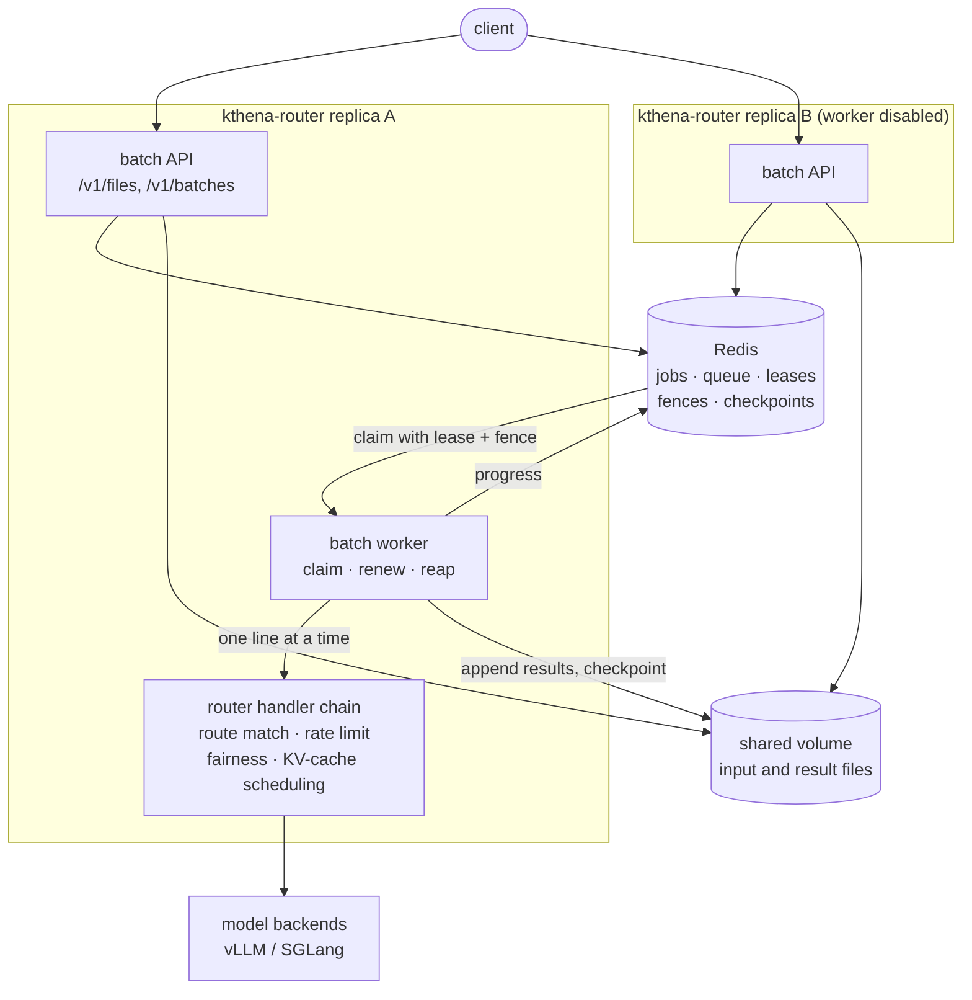
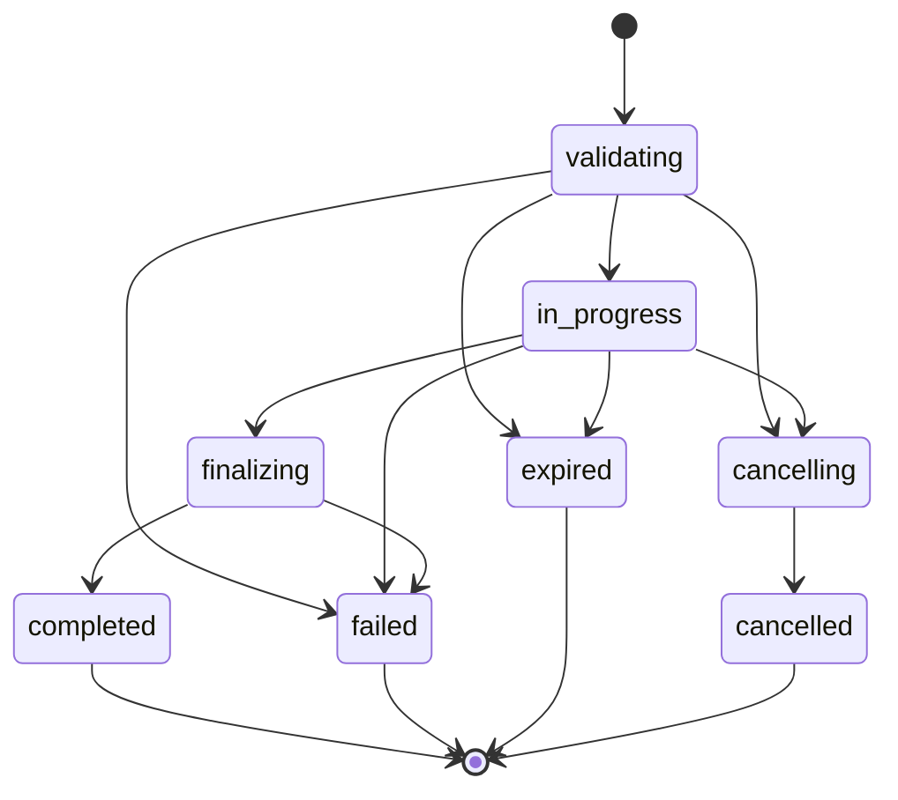

## OpenAI-Compatible Batch API in the Kthena Router

### Summary

Kthena serves interactive traffic well, but offline work — dataset inference, embedding
generation, evaluation runs — has no home. Today a user has to write their own loop over
`/v1/chat/completions`, and own the retries, the progress tracking and the restart
behavior themselves.

This proposal adds an OpenAI-compatible `/v1/files` and `/v1/batches` to the
kthena-router. A user uploads a JSONL file, creates a batch, polls it, and downloads a
result file, exactly as they would against OpenAI. Kthena owns the whole lifecycle:
neither vLLM nor SGLang exposes a batch API on its online server, so the router reads the
input file line by line and sends each line through its own request path, reusing the
routing, rate limiting, fairness and KV-cache aware scheduling that interactive requests
already get.

State lives in Redis and file bytes live behind a storage interface, so any replica can
serve the API, exactly one replica runs a given batch at a time, and a batch survives the
pod that created it. A proof of concept covering all of this is implemented and measured;
the numbers in [Evidence from the proof of concept](#evidence-from-the-proof-of-concept)
come from it.

### Motivation

Large offline inference is a first-class LLM workload and a poor fit for a synchronous
API. It is throughput-oriented rather than latency-sensitive, it runs for hours, and it
needs to survive process restarts. Running it through the interactive path means the
client owns durability, and a client that dies loses its progress.

OpenAI's Batch API is the de facto shape for this, so matching its schema lets existing
clients move to Kthena without code changes.

Putting it in the router rather than in a new component is what makes it cheap: the
router already knows backend load, already owns model-aware routing, and already talks to
Redis for the on-flight counter and the global rate limit. Batch dispatch reuses all of
it, and operators get the feature by flipping a Helm value rather than deploying and
scaling another service.

#### Goals

- OpenAI-compatible `/v1/files` and `/v1/batches` served by the kthena-router, with the
  same object shapes, status values and error envelope.
- Batches of tens of thousands of requests, with bounded router memory regardless of
  batch size.
- Each batch line takes the same path as an interactive request, so route matching,
  rate limiting, fairness and the KV-cache aware plugins all still apply.
- Exactly-once results: every `custom_id` in the input appears exactly once across the
  output and error files, including across a takeover.
- Any replica can serve the API; exactly one replica executes a given batch; a batch
  survives the loss of the pod running it.
- Cancellation, expiry, and garbage collection of finished batches and their files.
- Off by default, configured through Helm values.

#### Non-Goals

- Requiring engine-native batch support. vLLM's online server has no `/v1/files` or
  `/v1/batches` (its batch mode is the offline `vllm run-batch`, which starts its own
  engine), and SGLang's online server has neither. Kthena owns the lifecycle.
- A new deployable. The batch API and worker run inside kthena-router.
- Matching OpenAI's 24-hour discount pricing semantics. `completion_window` is accepted
  and enforced as a deadline; it is not a billing input.
- Cross-cluster or cross-region batch scheduling.
- Object storage in the first phase. The storage seam exists, but the first backend is a
  shared volume — see [File storage](#file-storage).

### Proposal

A user uploads a JSONL input file to `/v1/files` with `purpose: batch`, creates a batch
against it at `/v1/batches`, polls that batch, and when it reaches `completed` downloads
`output_file_id` and `error_file_id`. Every line of the input is one chat completion
request with a `custom_id`; every line of the output is that `custom_id` and the
response.

Inside the router, creating a batch writes a job record to Redis and pushes its ID onto a
queue. Every replica that has the worker enabled runs a claim loop. A claim takes a
renewable lease on the job and stamps it with a monotonically increasing fence token, so
exactly one replica executes it. The executor streams the input file, dispatches lines
through the router's own handler with bounded concurrency, appends results as they
arrive, and checkpoints progress. If the owning pod dies, the lease expires, another
replica requeues and claims the job, and resumes from the last checkpoint.

The shape of it:



Replica B serves the API but runs no batches, which is how an operator keeps batch load
off the replicas carrying interactive traffic. If replica A dies mid-batch, its lease
expires, and any replica with a worker requeues and resumes the job from its last
checkpoint.

#### User Stories

##### Story 1: offline dataset inference

A team has 50,000 prompts to score against a model Kthena already serves. They upload one
JSONL file, create a batch, and poll it every few minutes. The job runs for an hour, and
they download one output file. They never write a retry loop, and a router rollout in the
middle does not lose their progress.

##### Story 2: batch that yields to interactive traffic

A platform team wants to soak up spare GPU capacity overnight without risking daytime
latency. They enable the batch worker on two of six router replicas and cap per-job
concurrency. Batch load lands on those replicas, and the interactive p99 on the others is
unaffected.

##### Story 3: a batch that must stop

A user notices a bad prompt template 3,000 requests into a 20,000 request batch and
cancels it. Work stops within seconds, the answers already produced stay in the output
file, and every request that never ran is written to the error file with
`batch_cancelled`, so they know exactly what to resubmit.

#### Notes/Constraints/Caveats

- **Redis becomes required when batch is enabled.** The router already uses Redis for the
  shared on-flight counter and the global rate limit, but both are optional today. With
  batch enabled, Redis holds the job records, the queue and the leases, so it is a hard
  dependency. The router refuses to start with batch enabled and no Redis rather than
  starting in a state where batches silently never run.
- **The shared volume must be ReadWriteMany for more than one replica.** Every replica
  serving the API must be able to read any file, and a takeover must read a file another
  pod wrote. A single-node test cluster gets away with ReadWriteOnce; a real cluster does
  not. The router probes the volume at startup and fails fast if it is not writable.
- **Batch cost lands on the replica running the job.** This is why the worker has a
  separate switch from the API: operators can serve the API everywhere and run batches
  only where they want the load.
- **Streaming is off for batch lines.** A batch result is a complete response body.
- **First phase is `/v1/chat/completions` only.** `/v1/completions` and `/v1/embeddings`
  are the same mechanism and are the obvious next endpoints, but each needs its own
  validation and response shaping.

#### Risks and Mitigations

| Risk | Mitigation |
| --- | --- |
| Batch traffic degrades interactive latency | Worker is opt-in per replica; per-job and per-replica concurrency caps; adaptive back-off against backend load (phased, see [Flow control](#flow-control)) |
| A partitioned owner keeps writing after takeover | Fence token on every state write; segment files scoped per ownership attempt, so a stale writer cannot corrupt the new owner's output |
| A large file exhausts router memory | Input streamed line by line, results appended as they complete; measured 15–40 MiB at 50,000 requests against the chart's 512Mi limit |
| Redis loses batch state | Document AOF or RDB persistence and `maxmemory-policy noeviction` as a requirement when batch is enabled |
| Forged batch identity | Owner and gateway context travel in the request context, never in a header, so no client can spoof them |
| Abandoned files fill the volume | Files carry an expiry; a batch holds a reference on its input so a delete keeps the bytes until the batch is done; reap drops finished jobs |

### Design Details

#### API surface

Served from inside the router. `Handles` claims the paths and `Serve` answers them:

| Method | Path | Behaviour |
| --- | --- | --- |
| `POST` | `/v1/files` | multipart upload, `purpose` must be `batch`; streams to the file store |
| `GET` | `/v1/files` | list the caller's files, newest first, optional `purpose` filter |
| `GET` | `/v1/files/{id}` | file object |
| `GET` | `/v1/files/{id}/content` | raw bytes |
| `DELETE` | `/v1/files/{id}` | marks deleted; bytes stay while a batch still needs them |
| `POST` | `/v1/batches` | create from an `input_file_id` |
| `GET` | `/v1/batches` | list the caller's batches, newest first, paginated |
| `GET` | `/v1/batches/{id}` | batch object with live `request_counts` |
| `POST` | `/v1/batches/{id}/cancel` | cancel |

Errors use the OpenAI envelope (`message`, `type`, `param`, `code`), which differs from
the rest of the router and is deliberate — clients parse it.

Status values and transitions match OpenAI:



##### Why an extension hook rather than gin routes

The router's gin engine owns a `/v1/*path` catch-all for model requests. Registering
`/v1/files` as a sibling route panics on a wildcard conflict. So the router gains a small
seam:

```go
type APIExtension interface {
	Handles(method, path string) bool
	Serve(c *gin.Context)
}
```

`Router.HandlerFunc` consults the extension before parsing a model request, and only for
`/v1/` paths, which are the ones the auth middleware already covers. When batch is
disabled the field is nil and the check is one nil comparison. The seam is deliberately
generic: any future non-model OpenAI endpoint can use it.

#### State model

All keys are prefixed and live in Redis.

| Key | Type | Holds |
| --- | --- | --- |
| `job:<id>` | hash | the batch object, plus `holder`, `fence`, and per-status timestamps |
| `file:<id>` | hash | file record: tenant, filename, purpose, status, bytes, expiry |
| `queue` | zset | claimable job IDs, scored by enqueue time |
| `active` | zset | claimed job IDs, for the reaper |
| `lease:<id>` | string with TTL | `holder:fence` of the current owner |
| `fence` | counter | monotonic, incremented on every claim |
| `ckpt:<id>` | hash | resumable progress: segments, done bitmap, counts, usage |
| `fileref:<id>` | set | batches still needing this file, so a delete keeps the bytes |

Every multi-step state change is a Lua script, so it is atomic against other replicas.
There are seven, and each one is short enough to read in full: `claim`, `renew`,
`transition`, `checkpoint`, `cancel`, `reap`, `release`.

#### Ownership: leases and fencing

`claim` pops the oldest queued job, checks it is still claimable, increments the global
fence counter, writes `lease:<id>` with a TTL, and stamps `holder` and `fence` onto the
job. It expires a batch that blew its deadline while queued rather than starting it.

Every subsequent write — `transition`, `checkpoint` — verifies the fence still matches
before it does anything. A partitioned owner that comes back to life has a stale fence and
every write it attempts is rejected with `CONFLICT_FENCE`. This is what makes takeover
safe without needing to stop the old owner.

`renew` extends the lease and returns the current status in the same round trip, which is
how a running executor learns it has been cancelled.

`reap` runs on a timer, finds `active` entries whose lease key is gone, and requeues them.
`release` is the graceful path: on shutdown the worker hands unfinished batches straight
back to the queue instead of making the cluster wait out the lease.

#### Resumable execution

Naive resumption double-answers lines. The design avoids that with two pieces:

**Segments.** Each ownership attempt writes its own output and error segment, named with
the fence. The checkpoint records, for each segment, how many bytes are *valid*. On
resume, a new owner reads only the first `ValidBytes` of each earlier segment and starts
fresh segments of its own. Anything a dying owner half-wrote past its last checkpoint is
ignored, because the checkpoint never counted it.

**A done bitmap.** The checkpoint carries a bitmap of completed line numbers. A resuming
owner skips lines already answered. Combined with segments, a line is answered exactly
once even when a pod dies mid-write.

Finalizing concatenates the valid prefix of every segment into the final output and error
files, then transitions to `completed`.

#### Dispatch

Each line becomes an in-process HTTP request through the router's own `http.Handler`:

```go
identity := Identity{Tenant: request.Tenant, Dispatch: request.Dispatch}
httpRequest, err := http.NewRequestWithContext(
	WithIdentity(lineCtx, identity), http.MethodPost, request.Endpoint,
	bytes.NewReader(request.Body))
```

This is the core design decision and the reason batch lines get everything interactive
requests get: the same route matching, the same rate limits, the same fairness queue, the
same KV-cache aware scheduling, the same access log.

Two details matter:

- **Identity travels in the context, not a header.** The owning tenant and, under Gateway
  API, the listener the batch arrived on, are captured at create time and replayed on
  every line through `context.WithValue`. Nothing a client can set reaches the identity,
  so a batch cannot impersonate another tenant.
- **The response writer has to look like a real connection.** `batchWriter` collects the
  body up to a cap and implements `Flush` and `CloseNotify`, because gin's streaming path
  casts the writer to `http.CloseNotifier` and a writer without it panics. Its notify
  channel follows the line's context, so the goroutine ends with the line.

A panic in a line is recovered and recorded as that line's error rather than taking down
the worker.

#### File storage

File bytes sit behind a `FileStore` interface with `Create`, `Open`, `Size`, `Append`,
`Remove` and `Probe`. The first implementation is a shared volume, which is what the
issue discussion settled on as the simpler starting point.

**Known limitation, stated plainly:** the current interface returns `*os.File` from
`Open` and `Append`. That is honest about the shared-volume implementation but is not
implementable for S3. Before an object-storage backend lands, those two methods need to
return `io.ReadSeekCloser` and `io.WriteCloser`. This is a small, mechanical change and is
called out here so reviewers can decide whether to make the interface abstract now or
when the second backend arrives. The recommendation is to do it now, while there is one
implementation to update.

#### Flow control

Implemented today: a per-replica cap on concurrently running batches
(`maxConcurrentJobs`) and a per-batch cap on in-flight lines (`concurrency`), plus the
per-replica worker switch.

Proposed next, and **not yet built**: additive-increase/multiplicative-decrease on the
per-batch concurrency, driven by the backend in-flight counts the datastore already
tracks. When interactive pressure rises, batch concurrency backs off; when it falls,
batch creeps back up. This is the piece that turns "batch runs somewhere else" into
"batch yields", and it is deliberately scoped as a follow-up so the first PRs stay
reviewable.

#### Multi-tenancy

The owning tenant is the authenticated subject, read from the same gin key the rest of
the router uses (`common.UserIdKey`). Files and batches are scoped to it: a lookup that
does not match the caller's tenant is a 404, not a 403, so IDs cannot be probed.

When auth is disabled every caller shares one tenant, which is the same posture the rest
of the router takes.

#### Configuration

Off by default, under `kthenaRouter.batch` in the networking chart:

```yaml
batch:
  enabled: false
  storage:
    claimName: ""            # ReadWriteMany when replicas > 1
    mountPath: /var/lib/kthena/batch
    fsGroup: 65532
  worker:
    enabled: true            # false: serve the API here, run batches elsewhere
    maxConcurrentJobs: 2
    concurrency: 8
    leaseTTL: 30s
    lineTimeout: 10m
  limits:
    maxFileBytes: 209715200      # 200 MB, OpenAI's limit
    maxRequestsPerBatch: 50000   # OpenAI's limit
    maxLineBytes: 1048576
    maxResponseBytes: 2097152
  accessLog: true            # one access log line per batch request
  forwardHeaders: []         # client headers replayed, for header-matching ModelRoutes
```

Two startup guards, both fail-fast: batch enabled without Redis, and a configured volume
that is not actually writable by this pod.

#### Observability

**Not yet implemented, and required before this is production-ready.** The proposed
metrics:

| Metric | Type | Labels |
| --- | --- | --- |
| `kthena_batch_jobs` | gauge | `status` |
| `kthena_batch_lines_total` | counter | `outcome` |
| `kthena_batch_job_duration_seconds` | histogram | — |
| `kthena_batch_claims_total` | counter | `result` |
| `kthena_batch_takeovers_total` | counter | — |
| `kthena_batch_queue_depth` | gauge | — |

Batch lines already appear in the existing access log, with a per-replica switch to turn
that off for large batches.

#### Backward compatibility

Additive. With `batch.enabled: false` — the default — no Redis keys are written, no
volume is mounted, the API extension is nil, and `Router.HandlerFunc` performs one extra
nil check per request. Existing deployments are unaffected.

#### Test Plan

Unit tests per component: the Redis store against a Redis fake including every Lua script
and the fence-conflict paths; the file store including the probe and the size limits; the
API including tenant isolation, validation and the error envelope; the executor including
resume-from-checkpoint and the segment prefix rules; the worker including claim, renew,
lease loss and graceful release.

E2E on kind, with two router replicas sharing one volume and one Redis, against the
`llm-d-inference-sim` mock the existing e2e tests already use:

1. Happy path: every `custom_id` appears exactly once.
2. Takeover: kill the pod running a batch mid-flight, assert the batch still completes
   with no missing and no duplicated `custom_id`.
3. Cancel mid-flight: completed answers kept, the rest recorded as `batch_cancelled`.
4. Expiry: same shape, recorded as `batch_expired`.
5. Gateway API mode: a batch against a model only reachable through a Gateway-bound
   ModelRoute.

### Evidence from the proof of concept

Measured on kind: two router replicas, one shared volume, one Redis, `llm-d-inference-sim`
as the backend. Single node, so ReadWriteOnce sufficed there; a real multi-node cluster
needs ReadWriteMany.

**Correctness**

| Scenario | Result |
| --- | --- |
| 200 / 10k / 20k / 50k request batches | every `custom_id` exactly once |
| Pod killed (`--force --grace-period=0`) at 6,400 of 20,000 | other replica took over 36s later (30s lease + reap tick); final 20,000 completed, 0 missing, 0 duplicated |
| Cancel at 3,600 done | cancelled ~8s later; 3,800 answers kept, 16,200 `batch_cancelled` |
| Expiry | 2,400 kept, 17,600 `batch_expired` |
| Gateway API mode | 300/300 completed |

**Cost to interactive traffic**, 200 samples each, same cluster:

```
idle                            p50  8.3ms   p99 14.9ms
during a 50k batch              p50 16.8ms   p99 84.6ms
same, batch concurrency 1       p50  9.2ms   p99 73.5ms
```

Measured per pod while a batch ran, the replica doing the work was at p99 102ms and the
idle replica at p99 28ms, with the node using 1.2 of 8 cores. The cost lands on the
replica running the batch — which is the argument for the per-replica worker switch, and
for the adaptive back-off in [Flow control](#flow-control).

**Memory**: 15–40 MiB against the chart's 512Mi limit, even at 50,000 requests. The input
is streamed line by line and answers are appended as they arrive, so only the lines in
flight are held.

### Implementation Plan

Serial PRs, each independently reviewable:

1. Redis store, types and the Lua scripts
2. File store and `/v1/files`
3. `/v1/batches` and listing
4. Input validation
5. Executor, checkpointing and segments
6. Worker: claim, renew, reap, release
7. Router API extension seam and dispatch
8. Helm chart, startup guards and docs
9. Metrics
10. Adaptive flow control
11. E2E suite

### Alternatives

**A separate batch deployment.** Cleanest isolation, and batch load could never touch an
interactive replica. Rejected because it means a second deployable to scale and operate,
it duplicates the router's routing and scheduling or needs an RPC into it, and the issue
explicitly asks for a router-integrated design. The per-replica worker switch recovers
most of the isolation benefit.

**Engine-native batch.** Would be less code. Not available: vLLM's online server has no
batch endpoints and SGLang's has none either. Waiting on upstream engines would block the
feature indefinitely.

**A Kubernetes Job per batch.** Kubernetes-native, and gets restart semantics for free.
Rejected because a batch would no longer flow through the router's scheduling path, so it
would lose KV-cache aware routing and the shared view of backend load, and because job
startup latency is poor for small batches.

**In-memory queue.** Simplest. Rejected outright: a batch would not survive a restart,
which defeats the purpose. In-memory implementations exist only in tests.

**HTTP loopback instead of an in-process handler.** Dispatching each line over localhost
to the router's own listener would reuse the path without the `APIExtension` seam.
Rejected for the extra serialization and connection overhead per line, and because the
identity would then have to travel in a header, where a client could forge it.
