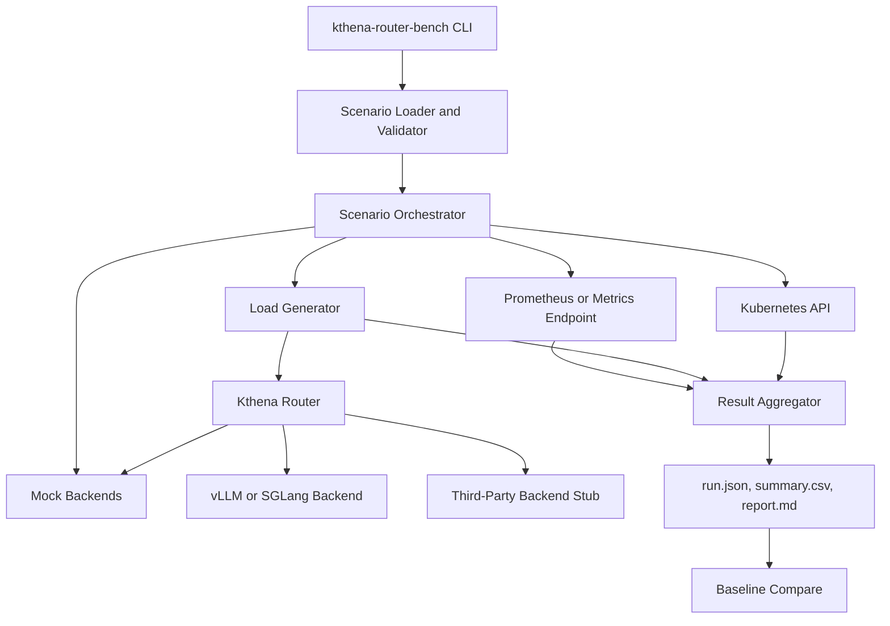
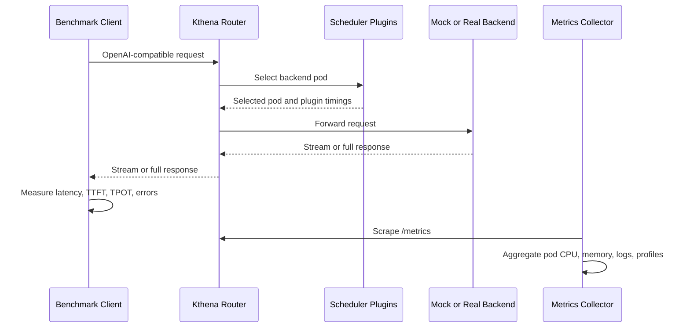

## Kthena Router Benchmark Framework

### Summary

Kthena Router is the data-plane component that receives OpenAI-compatible LLM
inference requests, resolves the target model, applies route policy, selects a
backend pod, and proxies the request to in-cluster or external model backends. As
Kthena Router adds more routing strategies, rate limits, fairness scheduling,
prefill-decode disaggregation, KV-cache-aware placement, and third-party backend
support, maintainers need a repeatable way to answer a release-critical question:
did router performance improve, stay stable, or regress?

This RFC proposes a reusable benchmark framework under `benchmark/kthena-router`.
The framework will provide a deterministic load generator, declarative scenario
configs, GPU-free mock backends, optional real vLLM/SGLang backend runs, metrics
collection, result aggregation, comparison reports, and a runbook. The first
deliverable is deliberately scoped to an approvable MVP that can run locally and in
CI without GPUs. Real-model benchmarks, profiling automation, and optimization PRs
are included as release and stretch work once the core framework is trusted.

This proposal tracks the LFX mentorship project request in issue `#942`.

### Motivation

Router performance directly affects user-visible latency and cluster capacity.
Today, performance claims are hard to compare because different contributors may
use different prompt sizes, output sizes, datasets, backend behavior, routing
plugins, concurrency levels, hardware, and metric windows. That makes it difficult
to review optimization PRs, detect regressions before release, or decide whether a
new routing strategy is worth its added overhead.

LLM router benchmarking is not the same as generic HTTP benchmarking. Useful
scenarios must model streaming responses, TTFT, TPOT, long-running requests,
backend saturation, repeated prefixes, routing strategy overhead, rate limiting,
and partial backend failures. The benchmark therefore needs to be Kthena-specific
while still using standard Kubernetes and Prometheus primitives where possible.

### Design Principles

- Make the first version useful without GPU access.
- Separate router overhead from backend inference cost.
- Prefer reproducibility over impressive absolute numbers.
- Keep scenario and result schemas stable enough for CI and release comparison.
- Record enough environment metadata to explain variance.
- Treat performance regression gates cautiously in normal PR CI.
- Build on current Kthena primitives instead of inventing a parallel control plane.
- Keep real-model and profiling benchmarks optional until the mock path is reliable.

### Current State

The repository already contains a minimal router benchmark scaffold at
`benchmark/kthena-router`. It packages an SGLang `bench_serving.py`-based load
generator as a Docker image and runs it as a Kubernetes Job. This is useful as a
seed, but it is not yet a reproducible Kthena Router benchmark framework because it
does not define Kthena scenario schemas, mock backends, stable result artifacts,
router-specific metric aggregation, CI thresholds, or baseline comparison.

The router already exposes important observability hooks:

- `/metrics` on the router listener for Prometheus metrics.
- `/debug/config_dump/*` on a localhost-only debug server for internal state.
- `/debug/pprof/*` on the same localhost-only debug server for CPU, heap,
  goroutine, block, mutex, and allocation profiles.

The benchmark should therefore collect existing metrics and profiles rather than
requiring a new observability subsystem. For Kubernetes benchmark jobs, profile
collection must account for the debug server being bound to localhost; the runbook
should use a safe mechanism such as `kubectl port-forward`, running the collector
inside the router pod namespace, or a controlled debug sidecar if maintainers
approve one.

### Goals

- Provide a reusable benchmark framework under `benchmark/kthena-router`.
- Support local process mode, Kind-based Kubernetes mode, and CI smoke mode.
- Generate OpenAI-compatible `/v1/completions` and `/v1/chat/completions` traffic.
- Support non-streaming and streaming responses with TTFT and TPOT measurement.
- Provide deterministic mock backends that isolate router overhead from inference
  engine cost.
- Provide declarative scenario configs for common LLM routing workloads.
- Collect client metrics, router Prometheus metrics, Kubernetes pod resources, and
  optional backend metrics.
- Write self-contained run artifacts with scenario config, environment metadata,
  summary tables, and machine-readable JSON.
- Provide comparison reports for baseline versus candidate runs.
- Document an end-to-end runbook for local, CI, and release benchmark execution.

### Non-Goals

- Define an official Kthena Router SLO.
- Require GPUs for PR CI.
- Replace unit tests, integration tests, or e2e tests.
- Build a generic benchmark platform for all Kthena components.
- Benchmark every model, tokenizer, inference engine, or third-party provider.
- Guarantee identical absolute results across different hardware.
- Make normal PR CI depend on real model downloads, Hugging Face availability, or
  dedicated benchmark infrastructure.
- Implement a full optimization campaign before the benchmark framework is usable.

### Architecture

The framework has four layers:

1. Workload generation: sends OpenAI-compatible requests to Kthena Router.
2. Scenario orchestration: prepares router config, Kthena resources, backends, and
   benchmark phases.
3. Metrics and artifact collection: gathers client results, router metrics, pod
   resources, logs, and optional profiles.
4. Result aggregation and reporting: writes normalized JSON/CSV/Markdown artifacts
   and compares candidate runs with baselines.



#### Request and Measurement Flow



#### Kthena Integration Boundary

Benchmark scenarios must map to existing Kthena concepts:

- `ModelRoute` selects the logical model and target `ModelServer`.
- `ModelServer` selects backend pods and defines timeout/retry behavior.
- Router scheduler configuration selects score and filter plugins such as
  `random`, `least-request`, `least-latency`, `prefix-cache`, and
  `kvcache-aware`.
- Backend deployments expose OpenAI-compatible endpoints and optional metrics.
- The benchmark framework owns only test resources in its namespace and should not
  mutate unrelated cluster state.

This is important because routing strategy is currently configured through router
scheduler configuration, not through `ModelServer.trafficPolicy`. Scenario configs
therefore must describe both Kthena resources and router scheduler config instead
of using an abstract `routing.strategy` field that has no direct API mapping.

### MVP and Stretch Scope

#### MVP Deliverables

The mentorship should first land a reliable, reviewable MVP:

- `kthena-router-bench` CLI with `validate`, `run`, `report`, and `compare`.
- Scenario schema and result schema.
- Deterministic mock backend with streaming and non-streaming OpenAI-compatible
  endpoints.
- Three required scenarios:
  - `smoke`
  - `streaming-chat`
  - `multi-backend-least-request`
- Router Prometheus metric scraping from `/metrics`.
- Kubernetes pod CPU and memory collection when running in cluster mode.
- Self-contained artifacts: `run.json`, `summary.csv`, `report.md`,
  `scenario.yaml`, and `environment.json`.
- Kind-based smoke runbook.
- CI smoke workflow that validates framework behavior and artifact generation.

#### Stretch and Release Deliverables

These should be added after the MVP is stable:

- Throughput and latency sweeps.
- KV-cache-aware shared-prefix scenario.
- Rate-limit and backend-failure scenarios.
- Optional pprof capture from the router debug server.
- Real-backend runbook for vLLM and SGLang.
- Nightly or release benchmarks on dedicated infrastructure.
- Optimization PRs for bottlenecks found by the benchmark, with before/after
  numbers.

### Repository Layout

```text
benchmark/kthena-router/
  README.md
  Makefile
  Dockerfile
  cmd/
    kthena-router-bench/
      main.go
  pkg/
    loadgen/
    scenario/
    backend/mock/
    metrics/
    report/
    artifacts/
  scenarios/
    smoke.yaml
    streaming-chat.yaml
    multi-backend-least-request.yaml
    throughput-sweep.yaml
    latency-sweep.yaml
    kvcache-aware-shared-prefix.yaml
    rate-limit.yaml
    backend-failure.yaml
  manifests/
    job.yaml
    rbac.yaml
    mock-backend.yaml
    servicemonitor.yaml
  reports/
    template.md
  results/
    .gitignore
```

Go is preferred for the benchmark CLI because the Kthena codebase is Go, the
router APIs and Kubernetes clients are Go-native, and CI packaging is simpler. The
current SGLang `bench_serving.py` wrapper may be reused for comparison or real
backend experiments, but it should not be the only supported benchmark path.

### Public Interface

#### CLI

```bash
kthena-router-bench validate \
  --scenario benchmark/kthena-router/scenarios/smoke.yaml

kthena-router-bench run \
  --scenario benchmark/kthena-router/scenarios/smoke.yaml \
  --target http://kthena-router.kthena-system.svc.cluster.local \
  --namespace kthena-benchmark \
  --output benchmark/kthena-router/results/smoke \
  --prometheus-url http://prometheus.monitoring.svc:9090

kthena-router-bench report \
  --input benchmark/kthena-router/results/smoke/run.json \
  --output benchmark/kthena-router/results/smoke/report.md

kthena-router-bench compare \
  --baseline benchmark/kthena-router/results/main/run.json \
  --candidate benchmark/kthena-router/results/pr/run.json

kthena-router-bench mock-backend \
  --listen :8000 \
  --config benchmark/kthena-router/scenarios/mock-backend.yaml
```

#### Scenario Structs

The scenario API is a benchmark-local config format, not a Kubernetes CRD in the
first implementation. It uses Kubernetes-style metadata only because that shape is
familiar to Kthena contributors.

```go
type RouterBenchmarkScenario struct {
    APIVersion string         `json:"apiVersion" yaml:"apiVersion"`
    Kind       string         `json:"kind" yaml:"kind"`
    Metadata   ScenarioMeta   `json:"metadata" yaml:"metadata"`
    Target     TargetSpec     `json:"target" yaml:"target"`
    Traffic    TrafficSpec    `json:"traffic" yaml:"traffic"`
    Requests   RequestSpec    `json:"requests" yaml:"requests"`
    Kthena     KthenaSpec     `json:"kthena" yaml:"kthena"`
    Backends   BackendSpec    `json:"backends" yaml:"backends"`
    Metrics    MetricsSpec    `json:"metrics" yaml:"metrics"`
    Thresholds ThresholdSpec  `json:"thresholds" yaml:"thresholds"`
}

type ScenarioMeta struct {
    Name        string            `json:"name" yaml:"name"`
    Description string            `json:"description,omitempty" yaml:"description,omitempty"`
    Labels      map[string]string `json:"labels,omitempty" yaml:"labels,omitempty"`
}

type TargetSpec struct {
    URL  string `json:"url" yaml:"url"`
    Path string `json:"path" yaml:"path"`
}

type TrafficSpec struct {
    Mode              string `json:"mode" yaml:"mode"` // fixed_qps, poisson, closed_loop
    RequestRate       int    `json:"requestRate,omitempty" yaml:"requestRate,omitempty"`
    MaxConcurrency    int    `json:"maxConcurrency" yaml:"maxConcurrency"`
    WarmupSeconds     int    `json:"warmupSeconds" yaml:"warmupSeconds"`
    DurationSeconds   int    `json:"durationSeconds" yaml:"durationSeconds"`
    CooldownSeconds   int    `json:"cooldownSeconds,omitempty" yaml:"cooldownSeconds,omitempty"`
    RequestTimeoutSec int    `json:"requestTimeoutSeconds" yaml:"requestTimeoutSeconds"`
}

type RequestSpec struct {
    API          string            `json:"api" yaml:"api"` // completions, chat_completions
    Model        string            `json:"model" yaml:"model"`
    Stream       bool              `json:"stream" yaml:"stream"`
    Prompt       TokenDistribution `json:"prompt" yaml:"prompt"`
    OutputTokens TokenDistribution `json:"outputTokens" yaml:"outputTokens"`
}

type KthenaSpec struct {
    ModelRouteManifest       string              `json:"modelRouteManifest" yaml:"modelRouteManifest"`
    ModelServerManifest      string              `json:"modelServerManifest" yaml:"modelServerManifest"`
    RouterSchedulerConfig    RouterSchedulerSpec `json:"routerSchedulerConfig" yaml:"routerSchedulerConfig"`
    GatewayManifests         []string            `json:"gatewayManifests,omitempty" yaml:"gatewayManifests,omitempty"`
    AdditionalManifests      []string            `json:"additionalManifests,omitempty" yaml:"additionalManifests,omitempty"`
}

type RouterSchedulerSpec struct {
    ScorePlugins  []WeightedPlugin `json:"scorePlugins" yaml:"scorePlugins"`
    FilterPlugins []string         `json:"filterPlugins,omitempty" yaml:"filterPlugins,omitempty"`
}

type WeightedPlugin struct {
    Name   string `json:"name" yaml:"name"`
    Weight int    `json:"weight" yaml:"weight"`
}

type BackendSpec struct {
    Mode        string              `json:"mode" yaml:"mode"` // mock, real, third_party_stub
    Replicas    int                 `json:"replicas" yaml:"replicas"`
    MockProfile *MockBackendProfile `json:"mockProfile,omitempty" yaml:"mockProfile,omitempty"`
}

type MockBackendProfile struct {
    TTFTMillis       int     `json:"ttftMillis" yaml:"ttftMillis"`
    PerTokenMillis   int     `json:"perTokenMillis" yaml:"perTokenMillis"`
    ErrorRate        float64 `json:"errorRate,omitempty" yaml:"errorRate,omitempty"`
    ExposeMetrics    bool    `json:"exposeMetrics" yaml:"exposeMetrics"`
    RoutingAwareMode bool    `json:"routingAwareMode" yaml:"routingAwareMode"`
}

type TokenDistribution struct {
    Distribution string  `json:"distribution" yaml:"distribution"` // fixed, uniform, lognormal, dataset, shared_prefix
    Tokens       int     `json:"tokens,omitempty" yaml:"tokens,omitempty"`
    MinTokens    int     `json:"minTokens,omitempty" yaml:"minTokens,omitempty"`
    MaxTokens    int     `json:"maxTokens,omitempty" yaml:"maxTokens,omitempty"`
    MeanTokens   float64 `json:"meanTokens,omitempty" yaml:"meanTokens,omitempty"`
    P95Tokens    int     `json:"p95Tokens,omitempty" yaml:"p95Tokens,omitempty"`
    DatasetPath  string  `json:"datasetPath,omitempty" yaml:"datasetPath,omitempty"`
}

type MetricsSpec struct {
    ScrapeIntervalSeconds      int  `json:"scrapeIntervalSeconds" yaml:"scrapeIntervalSeconds"`
    CollectRouterMetrics       bool `json:"collectRouterMetrics" yaml:"collectRouterMetrics"`
    CollectBackendMetrics      bool `json:"collectBackendMetrics" yaml:"collectBackendMetrics"`
    CollectKubernetesMetrics   bool `json:"collectKubernetesMetrics" yaml:"collectKubernetesMetrics"`
    CollectProfiles            bool `json:"collectProfiles" yaml:"collectProfiles"`
}

type ThresholdSpec struct {
    MaxErrorRate          float64 `json:"maxErrorRate,omitempty" yaml:"maxErrorRate,omitempty"`
    MaxP99LatencySeconds float64 `json:"maxP99LatencySeconds,omitempty" yaml:"maxP99LatencySeconds,omitempty"`
    MaxP99TTFTSeconds    float64 `json:"maxP99TTFTSeconds,omitempty" yaml:"maxP99TTFTSeconds,omitempty"`
    MaxRouterCPUCoreAvg  float64 `json:"maxRouterCPUCoreAvg,omitempty" yaml:"maxRouterCPUCoreAvg,omitempty"`
}
```

#### Example Scenario

```yaml
apiVersion: benchmark.kthena.volcano.sh/v1alpha1
kind: RouterBenchmarkScenario
metadata:
  name: streaming-chat
  description: Streaming chat workload through Kthena Router with mock backends.
target:
  url: http://kthena-router.kthena-system.svc.cluster.local
  path: /v1/chat/completions
traffic:
  mode: poisson
  requestRate: 50
  maxConcurrency: 128
  warmupSeconds: 30
  durationSeconds: 180
  cooldownSeconds: 15
  requestTimeoutSeconds: 60
requests:
  api: chat_completions
  model: deepseek-ai/DeepSeek-R1-Distill-Qwen-7B
  stream: true
  prompt:
    distribution: fixed
    tokens: 1024
  outputTokens:
    distribution: fixed
    tokens: 256
kthena:
  modelRouteManifest: manifests/modelroute-streaming-chat.yaml
  modelServerManifest: manifests/modelserver-streaming-chat.yaml
  routerSchedulerConfig:
    scorePlugins:
      - name: least-request
        weight: 100
    filterPlugins: []
backends:
  mode: mock
  replicas: 4
  mockProfile:
    ttftMillis: 120
    perTokenMillis: 20
    errorRate: 0
    exposeMetrics: true
    routingAwareMode: true
metrics:
  scrapeIntervalSeconds: 5
  collectRouterMetrics: true
  collectBackendMetrics: true
  collectKubernetesMetrics: true
  collectProfiles: false
thresholds:
  maxErrorRate: 0.01
  maxP99LatencySeconds: 20
  maxP99TTFTSeconds: 3
  maxRouterCPUCoreAvg: 2
```

#### Result Structs

`run.json` is the source of truth for automation and comparison.

```go
type BenchmarkRun struct {
    SchemaVersion string             `json:"schemaVersion"`
    Scenario      string             `json:"scenario"`
    StartedAt     string             `json:"startedAt"`
    DurationSec   int                `json:"durationSeconds"`
    Environment   EnvironmentSummary `json:"environment"`
    Client        ClientSummary      `json:"client"`
    Router        RouterSummary      `json:"router"`
    Backend       BackendSummary     `json:"backend,omitempty"`
    Thresholds    ThresholdSummary   `json:"thresholds"`
    Artifacts     []ArtifactRef      `json:"artifacts"`
}

type EnvironmentSummary struct {
    KthenaCommit       string            `json:"kthenaCommit"`
    RouterImage        string            `json:"routerImage"`
    BenchmarkImage     string            `json:"benchmarkImage"`
    KubernetesVersion  string            `json:"kubernetesVersion,omitempty"`
    NodeCount          int               `json:"nodeCount,omitempty"`
    CPUModel           string            `json:"cpuModel,omitempty"`
    GPUModel           string            `json:"gpuModel,omitempty"`
    Extra              map[string]string `json:"extra,omitempty"`
}

type ClientSummary struct {
    OfferedQPS       float64           `json:"offeredQPS"`
    CompletedQPS     float64           `json:"completedQPS"`
    SuccessCount     int               `json:"successCount"`
    FailureCount     int               `json:"failureCount"`
    TimeoutCount     int               `json:"timeoutCount"`
    ErrorRate        float64           `json:"errorRate"`
    LatencySeconds   PercentileSummary `json:"latencySeconds"`
    TTFTSeconds      PercentileSummary `json:"ttftSeconds,omitempty"`
    TPOTSeconds      PercentileSummary `json:"tpotSeconds,omitempty"`
    InputTokensPerS  float64           `json:"inputTokensPerSecond,omitempty"`
    OutputTokensPerS float64           `json:"outputTokensPerSecond,omitempty"`
}

type PercentileSummary struct {
    P50 float64 `json:"p50"`
    P90 float64 `json:"p90"`
    P95 float64 `json:"p95"`
    P99 float64 `json:"p99"`
    Max float64 `json:"max"`
}

type RouterSummary struct {
    CPUCoresAvg              float64            `json:"cpuCoresAvg,omitempty"`
    CPUCoresMax              float64            `json:"cpuCoresMax,omitempty"`
    MemoryMiBAvg             float64            `json:"memoryMiBAvg,omitempty"`
    MemoryMiBMax             float64            `json:"memoryMiBMax,omitempty"`
    RequestsTotal            int                `json:"requestsTotal,omitempty"`
    SchedulerPluginP99Seconds map[string]float64 `json:"schedulerPluginP99Seconds,omitempty"`
}

type BackendSummary struct {
    Mode              string             `json:"mode"`
    Replicas          int                `json:"replicas"`
    ActiveRequestsMax int                `json:"activeRequestsMax,omitempty"`
    QueueLengthMax    int                `json:"queueLengthMax,omitempty"`
    TTFTSeconds       *PercentileSummary `json:"ttftSeconds,omitempty"`
    TPOTSeconds       *PercentileSummary `json:"tpotSeconds,omitempty"`
}

type ThresholdSummary struct {
    Passed   bool     `json:"passed"`
    Failures []string `json:"failures,omitempty"`
}

type ArtifactRef struct {
    Name string `json:"name"`
    Path string `json:"path"`
    Type string `json:"type"`
}
```

### Metric Definitions

The benchmark must define metrics precisely so results can be reviewed and compared.

| Metric | Definition |
| --- | --- |
| Offered QPS | Requests scheduled by the client per second during the measurement window. |
| Completed QPS | Successful responses completed per second during the measurement window. |
| End-to-end latency | Time from request start until full response completion or stream close. |
| TTFT | For streaming responses, time from request start until the first response chunk containing generated content. |
| TPOT | For streaming responses, time from first generated token/chunk until stream completion divided by generated output tokens. |
| Error rate | Failed requests divided by total completed plus failed requests. Timeouts count as failures. |
| Router CPU | Average and max CPU cores for router pods during the measurement window. |
| Router memory | Average and max working set MiB for router pods during the measurement window. |
| Scheduler plugin cost | Prometheus histogram summary for `kthena_router_scheduler_plugin_duration_seconds`. |

Warmup and cooldown samples must not be included in reported latency percentiles or
throughput. Reports should clearly mark approximate token counts when synthetic text
is used without a real tokenizer.

### Backend Modes

#### Mock Backend

The mock backend is the default for local and PR CI runs. It exposes
OpenAI-compatible endpoints and supports:

- non-streaming responses,
- streaming Server-Sent Events responses,
- configurable TTFT delay,
- configurable per-token delay,
- configurable output token count,
- configurable error rate and status-code injection,
- backend identity headers for routing validation,
- Prometheus metrics for request count, active requests, TTFT, TPOT, and errors.

The mock backend must also support a routing-aware mode. In this mode, each mock pod
can expose synthetic queue length, KV cache utilization, prefix-cache state, and pod
identity. This lets routing scenarios validate balance and plugin overhead without
claiming real-model speedups.

#### Real Backend

Real-backend scenarios use vLLM or SGLang deployments from Kthena examples where
possible. These runs are hardware-dependent and are intended for release reports or
optimization validation, not normal PR CI.

#### Third-Party Backend Stub

As Kthena adds third-party backend support, the benchmark can include a stub that
emulates external HTTP latency, rate limits, and provider errors without using paid
providers. This is a stretch item.

### Benchmark Scenarios

| Scenario | Purpose | Backend | Required For |
| --- | --- | --- | --- |
| `smoke` | Validate basic router forwarding and artifact generation. | mock | MVP, PR CI |
| `streaming-chat` | Measure streaming latency, TTFT, TPOT, and stream stability. | mock | MVP |
| `multi-backend-least-request` | Validate multi-pod routing balance and scheduler plugin overhead. | mock | MVP |
| `throughput-sweep` | Find sustainable QPS under fixed latency and error thresholds. | mock or real | Release |
| `latency-sweep` | Measure p50-p99 latency across request rates. | mock or real | Release |
| `kvcache-aware-shared-prefix` | Measure cache-aware plugin overhead and, with real backends, benefit. | routing-aware mock or real | Stretch |
| `rate-limit` | Measure request rejection behavior and rate-limit overhead. | mock | Stretch |
| `backend-failure` | Measure error behavior and tail latency during backend failure. | mock | Stretch |
| `prefill-decode-disaggregation` | Measure PD path latency and connector behavior. | specialized mock or real | Stretch |

### Result Artifacts

Each benchmark run writes a self-contained output directory:

```text
results/2026-05-12T10-30-00Z-smoke/
  run.json
  summary.csv
  report.md
  scenario.yaml
  environment.json
  prometheus/
    router.json
    backend.json
    kube.json
  logs/
    benchmark.log
    router.log
    mock-backend.log
  profiles/
    router-cpu.pb.gz
    router-heap.pb.gz
```

Profiles are only present when profiling is enabled. Missing optional collectors
must be recorded as skipped in `run.json` instead of silently disappearing.

The Markdown report should include:

- scenario purpose,
- Kthena commit and image tags,
- benchmark tool version,
- cluster and node metadata,
- workload configuration,
- backend configuration,
- throughput and latency tables,
- TTFT and TPOT tables,
- CPU, memory, and optional GPU tables,
- router metric summaries,
- threshold results,
- baseline comparison when provided,
- links to logs and profiles when available,
- short analysis of likely bottlenecks and caveats.

### Reproducibility Controls

The benchmark is only useful if maintainers can reproduce or explain its results.
The implementation must:

- pin benchmark container dependencies and avoid mutable personal forks as required
  runtime inputs,
- record Kthena commit, router image, benchmark image, scenario checksum, and
  manifest checksums,
- record Kubernetes version, node count, CPU type, memory, and GPU type when
  available,
- record whether token counts came from a real tokenizer or synthetic approximation,
- separate warmup, measurement, and cooldown windows,
- detect when the benchmark client is CPU or memory saturated,
- support repeated runs and report variance for release benchmarks,
- mark mock-backend results as router-focused, not real inference performance.

### CI Strategy

CI should use two tiers.

#### Tier 1: PR Smoke

Runs on PRs or a lightweight scheduled workflow:

- Kind or local process mode.
- Mock backend only.
- Short duration, for example 30 to 60 seconds.
- Small concurrency, for example 16 to 64.
- No GPU, model download, or external dataset required.
- Validates scenario parsing, mock backend, router path, metrics scraping, result
  writing, and report generation.
- Fails on benchmark execution errors, missing artifacts, high mock error rate, or
  severe latency outliers only with intentionally loose thresholds.

Tier 1 should not be used as a strict performance regression gate until the
framework has enough historical data to define stable thresholds.

#### Tier 2: Nightly or Release

Runs on dedicated infrastructure:

- Longer duration, for example 5 to 30 minutes per scenario.
- Multiple routing strategies.
- Optional real vLLM/SGLang backends.
- Prometheus and Kubernetes resource collection.
- Optional pprof capture.
- Repeated runs with variance reporting.
- Artifact upload for maintainers.
- Comparison against the latest accepted baseline.

Recommended workflow names:

- `router-benchmark-smoke.yaml`
- `router-benchmark-nightly.yaml`

### Runbook

The benchmark documentation must include an end-to-end runbook:

1. Install prerequisites: Go, Docker or compatible container tool, `kubectl`, Kind,
   Helm if needed, and access to a Kthena checkout.
2. Build the router and benchmark images.
3. Create a Kind cluster or select a benchmark namespace in an existing cluster.
4. Install Kthena CRDs and router manifests.
5. Apply benchmark-owned `ModelRoute`, `ModelServer`, router scheduler config, and
   mock backend manifests.
6. Run `kthena-router-bench validate`.
7. Run `kthena-router-bench run`.
8. Confirm `run.json`, `summary.csv`, `report.md`, `scenario.yaml`, and
   `environment.json` were produced.
9. Read the report in this order:
   - error rate,
   - completed QPS versus offered QPS,
   - p95/p99 latency,
   - TTFT and TPOT for streaming workloads,
   - router CPU and memory,
   - scheduler plugin p99,
   - backend saturation signals.
10. For comparison, run the same scenario against baseline and candidate images,
    then run `kthena-router-bench compare`.
11. Clean up the benchmark namespace or Kind cluster.

### Optimization Workflow

When a benchmark surfaces a hotspot:

1. Reproduce the result with the same scenario and environment.
2. Identify whether the bottleneck is in the client, router, backend, Kubernetes,
   or cluster infrastructure.
3. Capture Prometheus windows and optional pprof profiles.
4. Open or update a tracking issue with the scenario name, run artifacts,
   observed bottleneck, profile summary, and suspected code path.
5. Implement a narrow optimization PR.
6. Attach before/after benchmark results to the PR.
7. Add a focused unit, integration, or Go benchmark test for the optimized code path
   when possible.

Likely router hotspots to investigate include request parsing, response streaming,
scheduler plugin execution, datastore locking, pod lookup, tokenization, Redis calls
for KV-cache-aware routing, high-cardinality metrics, active request accounting,
rate-limit checks, and access logging overhead.

### Test Plan

Unit tests:

- scenario YAML parsing and validation,
- request payload generation,
- token distribution generation,
- streaming parser,
- TTFT and TPOT calculation,
- percentile aggregation,
- threshold evaluation,
- baseline comparison,
- Markdown and JSON report generation.

Integration tests:

- load generator against mock backend,
- streaming response parser against mock backend,
- Prometheus scraper against mock metric endpoints,
- Kubernetes metrics collector with fake clients or envtest,
- artifact writer and report generation from a complete mock run.

E2E tests:

- Kind-based smoke benchmark with Kthena Router and mock backend,
- CI smoke workflow that uploads `run.json` and `report.md`,
- optional nightly real-backend benchmark on dedicated infrastructure.

Acceptance criteria:

- `validate` rejects malformed scenarios with actionable errors.
- `run` exits non-zero when required thresholds fail.
- `run.json` is schema-valid and contains environment metadata.
- Repeated mock-backend runs stay within an agreed variance band.
- `compare` correctly flags regressions and improvements.
- PR smoke completes within normal CI time limits.

### Milestones

#### Milestone 1: Design and Contracts

- Finalize scenario schema and result schema with maintainers.
- Audit the existing SGLang benchmark scaffold.
- Add README runbook skeleton and report template.
- Add `validate` command.

#### Milestone 2: Load Generator and Mock Backend

- Implement OpenAI-compatible non-streaming and streaming load generation.
- Implement deterministic mock backend.
- Measure latency, TTFT, TPOT, throughput, and errors.
- Add unit and integration tests.
- Produce the first local smoke report.

#### Milestone 3: Kubernetes and Artifacts

- Add Kubernetes Job, RBAC, and mock backend manifests.
- Collect router Prometheus metrics and pod CPU/memory.
- Write `run.json`, `summary.csv`, `report.md`, `scenario.yaml`, and
  `environment.json`.
- Add Kind-based smoke runbook.

#### Milestone 4: MVP CI and Required Scenarios

- Add `smoke`, `streaming-chat`, and `multi-backend-least-request` scenarios.
- Add CI smoke workflow.
- Add baseline comparison command.
- Document threshold policy and expected variance.

#### Milestone 5: Release Benchmarks and Optimization

- Add throughput and latency sweeps.
- Add optional profile capture.
- Add real-backend runbook for vLLM and SGLang.
- Run the full benchmark suite on a documented cluster profile.
- Identify clear hotspots and work with maintainers on optimization PRs with
  before/after numbers.

### Risks and Mitigations

| Risk | Impact | Mitigation |
| --- | --- | --- |
| Scope exceeds mentorship timeline | Framework remains unfinished | Land GPU-free MVP first; keep real backends and optimization PRs as stretch work. |
| Results vary across hardware | Comparisons become misleading | Record environment metadata and compare only within documented profiles. |
| GPU availability blocks CI | PR checks become unreliable | Keep PR smoke mock-only and run real benchmarks separately. |
| Mock backend hides real inference behavior | Results overfit router-only behavior | Label mock results clearly and add real-backend release scenarios. |
| Benchmark client becomes bottleneck | Router capacity is understated | Record client CPU/memory and detect saturation. |
| Token counts are inaccurate | TTFT/TPOT analysis becomes misleading | Use real tokenizers when available; mark synthetic counts as approximate. |
| Metrics collection skews results | Benchmark perturbs the system | Keep scrape windows bounded and labels controlled. |
| pprof access is unsafe or unavailable | Profiling automation fails | Keep profiling optional and document localhost debug access explicitly. |
| CI is flaky | Maintainers stop trusting results | Use loose PR thresholds and trend-based nightly comparison. |

### Open Questions

- Which cluster profile should be the official release benchmark environment?
- Where should accepted baselines live: repository, GitHub Actions artifacts, or an
  external release bucket?
- Which real-backend model should be the first release benchmark target?
- Should profile capture use port-forward, in-pod collection, or a benchmark-only
  debug sidecar?

### Alternatives

#### Continue With Only SGLang `bench_serving.py`

The existing scaffold is useful for load generation experiments, but it does not
provide Kthena scenario schemas, mock backends, router-specific metric aggregation,
standard artifacts, CI thresholds, or baseline comparison. It can remain as an
optional real-backend path but should not be the only benchmark implementation.

#### Use Generic HTTP Tools

Tools such as `wrk`, `hey`, and `vegeta` are strong generic HTTP benchmarks, but
they do not natively model OpenAI streaming semantics, TTFT, TPOT, output-token
timing, shared-prefix traffic, or Kthena routing metadata. They are useful for
microbenchmarks, not as the main framework.

#### Use Only Go Microbenchmarks

Go benchmarks for scheduler plugins, datastore lookups, tokenization, and
serialization are valuable, but they do not measure end-to-end router behavior under
concurrency, streaming, backend saturation, and Kubernetes resource constraints.
They should complement this framework.

#### Require Real Models for All Runs

Real models produce the most realistic numbers, but requiring them for every run
would make the benchmark expensive, slow, and unsuitable for PR CI. Mock backends
provide fast router-focused coverage, while real-backend runs remain available for
release and optimization validation.
