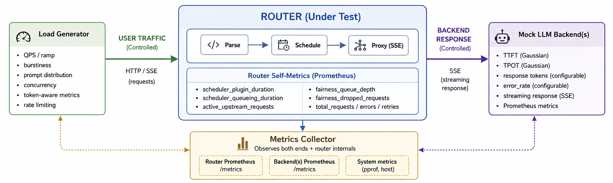
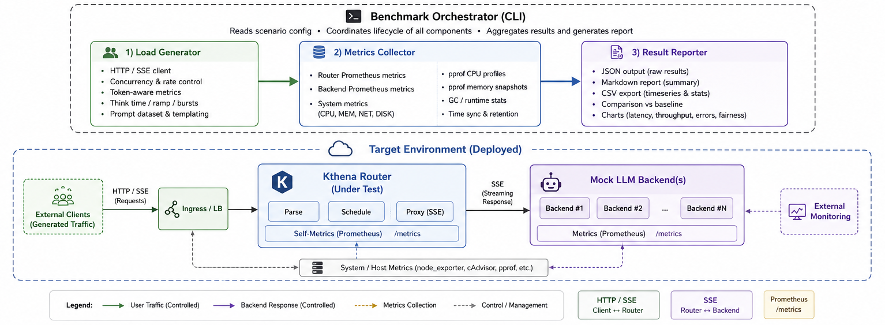

# Proposal: Kthena Router Benchmark Framework based on Mocked LLM Backend

- **Status**: Draft
- **Issue**: [#942](https://github.com/volcano-sh/kthena/issues/942)
- **Author**: Leo Xie

---

## Summary

This proposal introduces a reusable, config-driven benchmark framework for the Kthena Router — the LLM routing data-plane component of the Volcano/Kthena project. The framework uses a **sandwich isolation model**: user traffic (Load Generator) and backend responses (Mock LLM Backend) are both fully controlled. While the Router itself accounts for a small fraction of end-to-end LLM inference latency (typically <5%), the real performance lever lies in the **score plugins** — the scheduler components that decide which backend pod receives each request. The framework therefore focuses on measuring and comparing **plugin combination effectiveness** under varied backend conditions. It enables reproducible performance measurement under realistic LLM traffic patterns, produces structured reports for regression detection across releases, and supports local and CI execution. Where the benchmark reveals suboptimal plugin behavior, targeted plugin optimizations will be proposed and submitted as upstream PRs with before/after performance data.

## Motivation

Kthena Router sits on the critical path for every inference request. But in LLM serving, the Router's own contribution to end-to-end latency is dwarfed by engine-side inference time.

The Router cannot make the engine faster — but it *can* choose *which* engine to send each request to. That decision is made by the **score plugin chain** (`least_latency.go`, `kvcache_aware.go`, `prefix.go`, `gpu.go`, etc.). A bad plugin combination routes requests to overloaded or cold-cache engines, causing the >95% engine time to explode. A good one avoids those engines and keeps tail latency in check.

The community already recognizes this. Issue [#1100](https://github.com/volcano-sh/kthena/issues/1100) documented that a single `KVCacheAware.Score()` call adds 30–100ms of scheduling latency per request, more than the Router's own parsing and proxying combined. This is a plugin-level bottleneck, not a Router-level one. The community wants to (a) observe plugin behavior quantitatively, (b) stress-test plugin chains under varied backend conditions, and (c) optimize plugin combinations based on data.

Currently, the community lacks:

1. **Plugin-level observability** — `kthena_router_scheduler_plugin_duration_seconds` exists but is not systematically collected, correlated with scenario conditions, or compared across plugin combinations
2. **Controlled backend simulation** — No way to test how plugins behave when backends degrade (KV cache pressure, queue buildup, heterogeneous TTFT) without deploying real GPUs
3. **Reproducible plugin benchmarks** — No YAML-configurable scenario format that varies both traffic patterns *and* backend engine conditions simultaneously
4. **Plugin optimization data** — No before/after comparison data for plugin changes (different weight factors, caching strategies, new plugin types), making it impossible to evaluate whether a plugin PR actually improves scheduling quality

The existing [`benchmark/kthena-router/`](https://github.com/volcano-sh/kthena/tree/main/benchmark/kthena-router) tool measures end-to-end throughput but lacks plugin-specific metrics, controlled backend simulation, CI integration, and scenario configurability.

### Goals

- Design and implement a **reusable benchmark framework** (load generator, scenario configuration, metrics collection, result aggregation) that runs both locally and in CI
- Define a **standardized benchmark scenario format** (YAML) built around the sandwich isolation model, covering both sides of the control plane:
  - **User traffic**: QPS levels, burstiness (Gamma distribution), ramp-up profiles (linear/exponential), prompt length distributions, concurrency
  - **Backend response**: TTFT/TPOT latency profiles (homogeneous, heterogeneous, degrading), backend count, and metrics emission fidelity under **steady-state backend conditions**
- Define an **orthogonal condition matrix** identifying high-value test combinations that expose Router-unique failure modes (scheduler staleness, failover latency, cross-engine metrics, fair queue behavior under burst)
- Retain the 8 original scenarios as a **Smoke Test Suite** for fast (~15 min) regression detection in CI
- Adopt and integrate **Dynamo Mocker** as the mock LLM inference backend, providing configurable streaming token generation latency profiles **and Prometheus metric emission** matching real vLLM/SGLang engines
- Produce a **comprehensive benchmark report** with throughput, TTFT, TPOT, latency percentiles (P50/P95/P99), scheduler plugin duration breakdowns (per-plugin Score() latency, per-plugin sub-operation timing), CPU/memory/goroutine metrics, and bottleneck analysis via `pprof`
- Document the **end-to-end test procedure as a runbook** covering cluster preparation, mock/real backend deployment, benchmark execution, and result interpretation
- **Identify and optimize** score plugin combination strategies — up to 3 distinct optimizations (e.g., adjust plugin weight factors, introduce caching for expensive plugin sub-operations, propose new plugin ordering), submitting upstream PRs with before/after comparison data quantifying the scheduling-quality improvement

### Non-Goals

- **Real LLM inference backends** — The framework uses mock backends by default. Testing against real GPUs and inference engines (vLLM, SGLang) is out of scope for this LFX term, as GPU availability cannot be guaranteed and would introduce environment-specific variance.
- **Production SLO monitoring** — The framework targets offline benchmarking, not continuous production monitoring. Integration with Prometheus/Grafana dashboards for ongoing SLO tracking is future work.
- **Comparative benchmarks against other routers** — We benchmark Kthena Router against its own historical baselines, not against other projects (e.g., Envoy AI Gateway, LiteLLM proxy).
- **gRPC routing benchmarks** — Initial scope covers HTTP/SSE routing only. gRPC streaming benchmarks are deferred to a future iteration.
- **Backend fault injection / chaos scenarios** — Pod churn (`crash_recover`, scale-out/scale-in during measurement), backend failover experiments, and simulated backend `errorRate` injection are deferred to future work. The current phase assumes **steady-state backends**; any unexpected backend instability during the measurement window invalidates the run instead of becoming a benchmark dimension.
- **Plugin optimization guarantee** — The optimization deliverable is conditional on the benchmark surfacing identifiable suboptimal plugin behavior. If all tested plugin combinations demonstrate near-optimal scheduling quality with no clear improvement opportunities, the optimization deliverable is replaced with a performance characterization report and recommendations for future optimization targets.

## Proposal

### Framework Architecture

The benchmark framework centers on a **sandwich isolation model**: Router performance can only be measured in isolation when **both** the user traffic (upstream) and backend responses (downstream) are fully controlled. Without this dual control, measured latency confounds routing overhead with backend inference variance.

```
                        ┌─────────────────────────────────────────┐
    USER TRAFFIC        │                                       │      BACKEND RESPONSE
    (Fully Controlled)   │           ROUTER (Under Test)          │     (Fully Controlled)
                        │                                       │
  ┌──────────────┐      │  ┌──────────────────────────────────┐  │      ┌──────────────────────┐
  │ Load Generator│ ────┼─►│  Parse → Schedule → Proxy (SSE)  │──┼─────►│ Mock LLM Backend(s)  │
  │              │      │  │                                  │  │      │                      │
  │ • QPS / ramp │      │  │  Router Self-Metrics:             │  │      │ • TTFT (Gaussian)    │
  │ • burstiness │      │  │  scheduler_plugin_duration        │  │      │ • TPOT (Gaussian)    │
  │ • prompt dist│      │  │  active_upstream_requests         │  │      │ • response tokens    │
  │ • concurrency│      │  │  fairness_queue_*                 │  │      │ • stable SSE output  │
  └──────────────┘      │  └──────────────────────────────────┘  │      │ • Prometheus metrics │
                        │                                       │      └──────────────────────┘
                        └─────────────────────────────────────────┘
                                          │
                                   Metrics Collector
                                   (observes both ends
                                    + router internals)
```



#### Why Dual Control is Necessary

| What happens if... | Consequence |
|---|---|
| User traffic is uncontrolled | Cannot attribute latency changes to Router vs. load variation |
| Backend response is uncontrolled | Real GPU inference variance (batch size, KV cache) drowns out routing overhead |
| Neither is controlled | Results are non-reproducible; regression detection is meaningless |

**Key insight for Router benchmarking**: the router does not generate TTFT/TPOT—it **observes** them from backend engines. The mock backend must simulate not only streaming responses, but also the **Prometheus metric emission patterns** of real vLLM/SGLang engines (identical metric names, histogram buckets, update frequency at `/metrics` on port 8000/30000). This allows the router's existing metrics parsers (`backend/vllm/metrics.go`, `backend/sglang/metrics.go`) and scheduler plugins (`least_latency.go`, `least_request.go`) to function identically to how they would against real backends.

#### 1. Benchmark Orchestrator

A CLI tool that:
- Parses a YAML scenario configuration file
- Starts the Load Generator
- Starts the Metrics Collector
- Runs the benchmark for the configured duration
- Collects results, tears down resources, generates the report
- Exits with code 0 on success, non-zero on benchmark failure or resource exhaustion

#### 2. Load Generator

A load generator tailored for LLM serving benchmarks. Key features:

- **Concurrency**: Configurable number of concurrent virtual users (VUs), each maintaining a persistent HTTP connection for SSE streaming
- **Rate control**: Supports constant rate (requests/second), ramp-up profiles (linear/exponential, e.g., 10→50→100 QPS over phases), and Gamma-distributed burstiness (shape parameter γ controlling inter-request gap distribution)
- **Token-aware metrics**: Tracks TTFT (time to first token) and TPOT (inter-token interval) from SSE stream timing
- **Configurable request body**: Supports variable prompt lengths (short ~100 tokens → long ~4000 tokens) using tokenizer-aware payload generation
- **Metrics Output**: Latency histograms, success/error counts, throughput (requests/sec and tokens/sec), streamed to Metrics Collector

#### 3. Metrics Collector

Collects data from multiple sources during a benchmark run:

- **Load Generator metrics**: Latency histograms, throughput, error rates (via in-process shared memory or gRPC streaming)
- **Router Prometheus metrics**: Scrapes Router's `/metrics` endpoint for Go runtime metrics (goroutines, heap, GC), HTTP handler latencies, connection pool stats
- **pprof profiles**: Takes CPU profile snapshots and heap profiles during steady-state benchmark phase
- **Environment metrics** (optional): If running alongside node-exporter, collects CPU/memory usage of the Router pod

Data is stored in memory during the run and serialized to JSON at completion.

#### 4. Result Reporter

Generates outputs from raw benchmark data:

- **JSON**: Machine-readable result file for automated comparison and CI assertions
- **Markdown report**: Human-readable summary with tables and key findings, suitable for pasting into GitHub issues
- **Comparison mode**: When a baseline result file is provided, computes deltas and highlights regressions using **P95 latency** for latency comparisons; the reporter emits a warning for `>5%` P95 latency increase, while CI failure is reserved for `>10%` P95 latency increase. It also highlights `>10%` throughput decrease
- **CSV export**: For further analysis in spreadsheet tools

### Benchmark Scenario Configuration

Benchmarks are defined via YAML configuration files for reproducibility. The configuration is structured around the sandwich model—**user traffic** on the left, **backend response** on the right, with routing strategy in the middle:

```yaml
# benchmark.yaml
name: "router-throughput-50qps-4backends"
description: "Baseline throughput test at 50 QPS with 4 homogeneous backends"

environment:
  router:
    image: "kthena-router:latest"
    replicas: 1
    resources:
      cpu: "2"
      memory: "4Gi"

# ── LEFT SIDE: User Traffic (Load Generator) ──
load:
  # Request scheduling mode
  schedule:
    mode: "constant_rate"     # constant_rate | ramp_up | burst | timestamp_replay
    rate: 50                  # requests/second (when mode=constant_rate)

  # Traffic shape
  traffic:
    burstiness: 0.5         # Gamma shape param (γ>0): 1=Poisson-like, <1=bursty, >1=smoother
    ramp:
      strategy: "none"      # none | linear | exponential
      # start_rps: 10       # only when ramp enabled
      # end_rps: 200        # only when ramp enabled

  # Concurrency
  concurrency:
    connections: 100        # max concurrent persistent connections

  # Request characteristics
  prompts:
    - tokens: 100
      weight: 7             # 70% short prompts
    - tokens: 2000
      weight: 3             # 30% long prompts
  max_tokens:
    - tokens: 128
      weight: 5             # 50% short responses
    - tokens: 1024
      weight: 5             # 50% medium responses

# ── RIGHT SIDE: Backend Response (Mock LLM Backend) ──
backends:
  count: 4
  profiles:                 # per-backend latency profiles
    - name: "fast"
      count: 2              # 2 fast pods
      ttftMean: "30ms"
      ttftStddev: "5ms"
      tpotMean: "10ms"
      tpotStddev: "2ms"
    - name: "normal"
      count: 2              # 2 normal pods
      ttftMean: "100ms"
      ttftStddev: "15ms"
      tpotMean: "20ms"
      tpotStddev: "5ms"

  # Behavior
  responseTokens: 500       # default when max_tokens not in request
  errorRate: 0.0            # reserved for future chaos scenarios

  # Metrics emission (must match real vLLM/SGLang)
  metrics:
    port: 8000              # vLLM-compatible /metrics endpoint
    scrapeInterval: "1s"    # how often Router scrapes → affects scheduler freshness
    histogramBuckets: "vllm" # vllm | sglang (same bucket distribution as real engine)

# ── MIDDLE: Routing Strategy ──
routing:
  strategy: "least-latency" # random | least-connection | least-latency | least-request
  plugins: ["gpu", "prefix"] # scheduler plugin chain

# ── COLLECTION ──
metrics:
  pprof: true
  prometheus: true

output:
  dir: "./results/"
  formats: ["json", "markdown"]
```

**Configuration design principles:**

- **Independence**: Each side of the sandwich can vary independently—you can test the same backend profile under different traffic patterns, or the same traffic pattern against different backend profiles
- **Orthogonality**: Parameters within each side are also independent; `burstiness` and `ramp` can be combined with any `prompts` distribution
- **Fidelity**: The mock backend emits the same Prometheus metric names, histogram buckets, and scrape ports as real vLLM/SGLang engines—Router's existing parsers work unchanged

### Mock LLM Inference Backend

It simulates an OpenAI-compatible `/v1/chat/completions` endpoint with SSE streaming. This is essential because:

- Real LLM backends require GPUs, which are expensive and not available in CI
- Mock backends provide **deterministic, reproducible latency profiles**, which real backends cannot guarantee due to hardware variance
- Configurable latency parameters allow systematic exploration of performance under different backend conditions

**Behavior:**

1. Receive `POST /v1/chat/completions` with an OpenAI-compatible request body
2. Parse `max_tokens` (or use configured default) to determine how many tokens to generate
3. After a configurable TTFT delay (Gaussian distribution, clamped to non-negative), send the first SSE chunk: data: {"choices":[{"delta":{"content":"tok"},"index":0}]}
4. Continue sending tokens with configurable TPOT interval between each chunk
5. Send `data: [DONE]` to signal stream completion
6. Close the SSE connection

**Configuration** (via environment variables or flags):

| Parameter | Default | Description |
|-----------|---------|-------------|
| `TTFT_MEAN` | 50ms | Mean time-to-first-token |
| `TTFT_STDDEV` | 10ms | Standard deviation of TTFT |
| `TPOT_MEAN` | 15ms | Mean time-per-output-token |
| `TPOT_STDDEV` | 5ms | Standard deviation of TPOT |
| `DEFAULT_TOKENS` | 500 | Default token count when `max_tokens` not in request |
| `ERROR_RATE` | 0.0 | Reserved for future chaos scenarios |
| `METRICS_PORT` | 8000 | Prometheus /metrics endpoint port (8000=vLLM, 30000=SGLang) |
| `METRICS_ENGINE` | vllm | Metrics naming convention: `vllm` or `sglang` |

The mock backend must also expose a `/metrics` endpoint that emits Prometheus metrics with the identical naming, histogram bucket distribution, and data types as a real vLLM or SGLang engine. This is essential because the Router's scheduler plugins (`least_latency.go`, `least_request.go`) **consume** these scraped metrics to make routing decisions. Key metrics to simulate:

| Metric | vLLM Name | SGLang Name | Type |
|--------|-----------|-------------|------|
| GPU Cache Usage | `vllm:gpu_cache_usage_perc` | `sglang:token_usage` | Gauge |
| Waiting Requests | `vllm:num_requests_waiting` | `sglang:num_queue_reqs` | Gauge |
| Running Requests | `vllm:num_requests_running` | `sglang:num_running_reqs` | Gauge |
| Time to First Token | `vllm:time_to_first_token_seconds` | `sglang:time_to_first_token_seconds` | Histogram |
| Time Per Output Token | `vllm:time_per_output_token_seconds` | `sglang:time_per_output_token_seconds` | Histogram |

### ⭐ Test Scenarios

The test strategy uses a **two-tier** approach that differs not only in scope but in methodology—the two tiers answer fundamentally different questions about the Router:

| Dimension | Tier 1: Smoke Test Suite | Tier 2: Orthogonal Condition Matrix |
|---|---|---|
| **Methodology** | Black-box | Profiling-driven (white-box) |
| **Model** | **Sandwich Model** — both sides of the Router are fully controlled; the Router itself is treated as an opaque system | **Component Isolation** — each scenario targets a specific Router internal subsystem with pprof instrumentation enabled |
| **Core question** | *How fast? How much? Where does it break?* | *Which code path is the bottleneck? What is the per-component cost?* |
| **What we vary** | External pressure parameters: QPS, concurrency, prompt length, backend count | Conditions that stress specific code paths: scheduler plugin chain, connection pool, SSE relay, metrics parsing, lock contention |
| **What we measure** | End-to-end metrics: TTFT, TPOT, request throughput, error rate — all observed from outside the Router | Internal metrics: per-function CPU via pprof flame graphs, goroutine profiles, heap allocations, lock contention profiles, scheduler plugin execution duration |
| **Output** | Regression detection: "did P95 latency increase by >5%?" | Optimization guidance: "`leastLatencyPlugin.Score()` accounts for 12% of CPU under burst load — candidate for caching" |
| **Execution cadence** | Every PR (CI, ~15 min) | Nightly / on-demand (characterization jobs) |

In short: Tier 1 tells you **if** the Router is slow. Tier 2 tells you **why**.

#### Tier 1: Smoke Test Suite — Black-box & Quick Validation

These 8 scenarios serve as the "fast path"—run them first to catch obvious regressions. They operate under the Sandwich Model: user traffic (AIPerf) and backend response (Dynamo Mocker) are both fully controlled, allowing the Router's end-to-end behavior to be measured in isolation. The Router is treated as a black box — we vary external pressure and observe external outcomes:

| # | Scenario | What It Validates | Key Parameters |
|---|----------|-------------------|---------------|
| S1 | **Throughput Baseline** | Maximum sustainable throughput | Ramp QPS until 50% error rate; 4 homogeneous backends |
| S2 | **Latency vs. QPS** | Router overhead under increasing load | QPS: 10, 50, 100, 200, 500; fixed TTFT=50ms, TPOT=15ms |
| S3 | **Concurrency Scaling** | Connection pool behavior | Connections: 10, 100, 500, 1000; fixed QPS=100 |
| S4 | **Backend Count Impact** | Scheduler scaling with pod count | Backends: 1, 4, 16, 32; homogeneous profiles |
| S5 | **Prompt Length Impact** | Request body parsing cost | Prompt tokens: 100, 1000, 4000; fixed QPS=50 |
| S6 | **Long Response** | SSE relay overhead for long streams | Response tokens: 100, 1000, 4096 |
| S7 | **Backend Latency Variance** | Scheduler behavior under uneven backends | 3 pods: TTFT 10ms / 100ms / 500ms; measures if scheduler avoids slow pod |
| S8 | **Routing Strategy Comparison** | Plugin overhead vs. routing quality | random vs. least-latency vs. least-request |

**Smoke test execution time target**: All 8 scenarios should complete within **15 minutes** on a kind cluster.

#### Tier 2: Orthogonal Condition Matrix — Profiling & Optimization Oriented

Where Tier 1 measures the Router from the outside, Tier 2 looks inside — each scenario is designed to stress a specific Router subsystem and produce actionable pprof data (CPU flame graphs, heap profiles, goroutine dumps, mutex contention traces). The methodology is **component isolation**: vary conditions that exercise a single code path while keeping everything else constant, then profile the result.

##### Mapping Scenarios to Router Internals

Every Tier 2 scenario is paired with instrumentation on a specific internal component. The control-plane dimensions below are not abstract — they correspond directly to code paths in the Router:

| Scenario Dimension | Router Component Under Test | Code Path (Representative) | What Profiling Reveals |
|---|---|---|---|
| **Schedule Mode** (burst/ramp) | Request dispatch → scheduler invocation rate | `pkg/kthena-router/scheduler/` — how often `Schedule()` is called under burst | Lock contention on scheduler mutex; goroutine scheduling latency |
| **QPS Level** (10→1000) | Connection pool & HTTP transport | `net/http.Transport.RoundTrip` → backend connection management | `MaxIdleConnsPerHost` saturation; TCP handshake overhead; HTTP/2 stream contention |
| **Burstiness (γ)** | Fair queue depth & admission control | `pkg/kthena-router/fairqueue/` — queue push/pop under Gamma-distributed arrival | Queue-induced latency; head-of-line blocking; memory pressure from queued requests |
| **Ramp Strategy** | Scheduler plugin chain adaptation | `pkg/kthena-router/plugins/least_latency.go` — plugin scoring frequency during load ramp | Scheduler staleness window; plugin `Score()` CPU cost at high invocation rates |
| **Prompt Distribution** | Request body parsing & deserialization | `encoding/json.Unmarshal` in proxy handler → `pkg/kthena-router/proxy/` | JSON alloc cost for large (4000-token) vs. small (100-token) prompts; `json.RawMessage` pass-through efficiency |
| **Max-Token Distribution** | SSE stream relay & response buffering | `pkg/kthena-router/proxy/` — SSE chunk forwarding loop | Per-chunk copy overhead; buffer growth for long (4096-token) streams; goroutine lifetime |
| **Concurrent Connections** | Goroutine model & memory footprint | `go runtime` — goroutine count, heap size per connection | Goroutine leak detection; memory pressure at 500+ concurrent SSE connections |
| **Pod Count** (1→30) | Backend discovery & health checking | `pkg/kthena-router/discovery/` — endpoint watch & health probe loop | O(n) scaling in endpoint iteration; health-check CPU cost at high pod counts |
| **TTFT/TPOT Profile** | Scheduler scoring accuracy | `pkg/kthena-router/plugins/least_latency.go` — TTFT histogram consumption | Scoring bias toward low-variance pods; percentile selection logic correctness |
| **Metrics Update Interval** | Scheduler decision freshness | `pkg/kthena-router/backend/vllm/metrics.go` — scrape interval effect on scheduler | Quantifies the staleness penalty: how much worse is routing with 10s-old vs. 1s-old metrics? |
| **Engine Type** (vLLM/SGLang/mixed) | Cross-engine metric normalization | `pkg/kthena-router/backend/sglang/metrics.go` — SGLang → vLLM metric mapping | Per-call normalization overhead; correctness of cross-engine comparison in `least_latency` |

##### User Traffic

| Dimension | Values | Description |
|-----------|--------|-------------|
| **Schedule Mode** | `constant_rate`, `ramp_up`, `burst`, `timestamp_replay` | How requests are dispatched over time |
| **QPS Level** | 10, 50, 100, 500, 1000 | Base request rate (when mode ≠ timestamp_replay) |
| **Burstiness (γ)** | 0.1 (very bursty), 0.5 (bursty), 1 (Poisson), 10 (smooth) | Gamma distribution shape parameter for inter-request gaps |
| **Ramp Strategy** | none, linear, exponential | RPS growth pattern (start_rps → end_rps over scenario duration) |
| **Prompt Distribution** | fixed(512), narrow(μ=512,σ=100), wide(μ=1000,σ=800), bimodal(100+4000) | Distribution of input token counts |
| **Max-Token Distribution** | fixed(128), normal(μ=256,σ=100), long-tail(128+2048+4096) | Distribution of requested output lengths |
| **Concurrent Connections** | 1, 10, 100, 500 | Persistent SSE connections per load generator instance |

##### Backend Response

| Dimension | Values | Description |
|-----------|--------|-------------|
| **Pod Count** | 1, 3, 10, 30 | Number of mock backend replicas |
| **TTFT Profile** | `homogeneous(50ms)`, `heterogeneous(10/100/500ms)`, `degrading(50→500ms ramp)` | Per-pod TTFT distribution |
| **TPOT Profile** | `homogeneous(15ms)`, `heterogeneous(5/15/50ms)`, `high_variance(μ=20,σ=15)` | Per-pod TPOT distribution |
| **Metrics Update Interval** | 1s, 5s, 10s | Backend /metrics scrape frequency → affects scheduler decision freshness |
| **Engine Type** | `vllm`, `sglang`, `mixed(2 vllm + 2 sglang)` | Prometheus metric format on /metrics endpoint |

In the current phase, backend-fault dimensions such as injected `errorRate` and pod churn are **deferred to future work**. The benchmark assumes steady-state backends and treats unexpected restarts, OOMKills, readiness loss, or backend 5xx spikes as run invalidation conditions rather than scenario parameters.

##### High-Value Combinations

Not all cross-combinations are equally valuable. The following matrix identifies the **highest-priority intersections**—conditions where Router-specific behavior is most likely to diverge from baseline:

|  | User Traffic →<br>Backend ↓ | Low QPS<br>Uniform | High QPS<br>Burst | High QPS<br>Ramp | Multi-tenant<br>Bimodal |
|---|---|---|---|---|---|
| **Homogeneous<br>Backends** | ✅ S1+S2 | ✅ S2+S3 | 🔶 P1.1 | 🔶 P1.2 |
| **Heterogeneous<br>Backends** | ✅ S7 | 🔴 P0.1 | 🔴 P0.2 | 🔶 P1.3 |
| **Slow Metrics<br>Update** | — | 🔴 P0.4 | 🔶 P1.6 | — |
| **Engine Mix<br>(vllm+sglang)** | 🔶 P1.10 | 🔴 P0.5 | — | 🔶 P1.11 |

> **Legend**: ✅ = covered by Smoke Test Suite | 🔴 P0 = must-test (directly exposes Router weakness) | 🔶 P1 = should-test (valuable characterization) | — = low value

**P0 scenarios rationale** (each exposes a specific, Router-unique failure mode):

| ID       | User Traffic | Backend | Risk Exposed |
|----------|-------------|---------|-------------|
| **P0.1** | High QPS (500) + Burst (γ=0.5) | 3 pods: TTFT 10/100/500ms | Scheduler saturation—can it still avoid the 500ms pod under burst? |
| **P0.2** | High QPS (500) + Ramp (10→500) | 3 pods: TTFT 10/100/500ms | Scheduler adaptation—does it discover the slow pod quickly enough during ramp? |
| **P0.3** | High QPS | metrics interval=10s, degrading TTFT (50→500ms) | Stale metrics—does scheduler route to a newly-degraded pod based on 10s-old data? |
| **P0.4** | Burst traffic | 2 vLLM + 2 SGLang pods, heterogeneous TTFT | Cross-engine scheduling—can least-latency correctly compare metrics from different engines? |
| **P1.1** | Ramp 10→500 QPS | 4 homogeneous pods | Identifies the QPS level at which Router overhead becomes the bottleneck |
| **P1.2** | Bimodal prompts (100+4000) | 4 homogeneous pods | Cost of large request body parsing on the hot path |
| **P1.3** | Bimodal prompts | 3 heterogeneous pods | Does prompt length correlate with pod selection quality? |
| **P1.4** | Ramp traffic | metrics interval=5s | Quantifies scheduler staleness penalty at moderate load |
| **P1.5** | Uniform, low QPS | 2 vLLM + 2 SGLang, homogeneous | Baseline cross-engine routing correctness |
| **P1.6** | Bimodal | 2 vLLM + 2 SGLang, heterogeneous | Worst-case metrics normalization across engine types |

This matrix is not meant to be run in its entirety—that would be a combinatorial explosion. Instead, the **smoke tests** give fast feedback in CI, while **selected P0/P1 combinations** are run as periodic characterization jobs or on-demand when investigating specific Router behaviors.

##### Future Work: Backend Fault-Injection Scenarios

The following scenarios remain valuable, but are intentionally **deferred** until the steady-state benchmark framework and run-validity checks are in place:

| Deferred ID | User Traffic | Backend | Risk Exposed |
|-------------|-------------|---------|-------------|
| **F1** | Burst traffic | 1 of 4 pods crashes mid-benchmark | Failover latency—are in-flight streaming requests dropped? How fast is reconnection? |
| **F2** | Uniform, low QPS | 1 pod crashes + recovers | Baseline failover behavior in isolation |
| **F3** | Ramp traffic | Scale-out 3→6 pods | New pod discovery latency and initial routing accuracy |
| **F4** | Burst | injected `errorRate=5%` | Error propagation—does Router correctly surface backend errors vs. masking them? |
| **F5** | Ramp | injected `errorRate=5%` | Error rate at the boundary where throughput collapses |
| **F6** | Bimodal | injected `errorRate=5%` | Do long-prompt requests fail differently than short ones? |

### CI Integration

The benchmark framework integrates with GitHub Actions for automated regression testing:

```yaml
# .github/workflows/benchmark.yml (example)
benchmark:
  runs-on: ubuntu-latest
  steps:
    - uses: actions/checkout@v4
    - name: Create kind cluster
      run: ./hack/local-up-kthena.sh
    - name: Run benchmark suite
      run: |
        go run ./cmd/benchmark run \
          --scenario benchmarks/throughput-baseline.yaml \
          --output results/
    - name: Compare with baseline
      run: |
        go run ./cmd/benchmark compare \
          --current results/throughput-baseline.json \
          --baseline benchmarks/baselines/throughput-baseline.json
    - name: Fail on regression
      if: failure()
      run: echo "Performance regression detected. See benchmark report for details."
```

Key CI design decisions:
- Use **kind** (Kubernetes in Docker) for zero-cost ephemeral clusters
- Store baseline results as version-controlled JSON files in `benchmarks/baselines/`
- Fail the CI check when regression exceeds thresholds: >10% P95 latency increase or >10% max throughput decrease (emit warnings at >5% P95 latency increase)
- PR authors can update baselines by running the benchmark locally and committing the new JSON

### Plugin Optimization Strategy

The optimization phase targets score plugin combinations. While the Router's own code paths (parsing, proxying) contribute <5% of end-to-end latency, plugin decisions directly control which engine receives each request, and therefore indirectly control the >95% engine inference time. We should:

1. **Run the benchmark suite** against the latest Router build with multiple plugin chain configurations (e.g., `least-latency + gpu` vs. `least-latency + kvcache-aware + gpu` vs. `random` baseline)
2. **Collect per-plugin timing breakdowns** — use the existing `kthena_router_scheduler_plugin_duration_seconds` Prometheus histogram plus sub-operation timing logs (tokenization duration, Redis query duration, hash computation) to identify which plugin in the chain contributes the most scheduling latency and which sub-operation dominates
3. **Correlate plugin latency with scheduling quality** — for each plugin chain combination, measure whether longer plugin execution time actually produces better scheduling decisions (i.e., lower P95 end-to-end latency due to smarter engine selection), or whether it's pure overhead with no scheduling benefit
4. **Prioritize** up to 3 optimization targets based on (latency impact × improvement headroom) / implementation effort
5. **Implement, benchmark, compare** — submit each optimization as a separate PR with before/after data showing the scheduling-quality delta

**Optimization targets** (candidates, to be confirmed by benchmark data):

| Category | Example | Optimization Approach |
|----------|---------|----------------------|
| Plugin execution cost | `KVCacheAware.Score()` re-tokenizes same prefix on every multi-turn request | Cache tokenization results and Redis query results per session; reuse across turns |
| Plugin weight tuning | Improper `least_latency` TTFT/TPOT weight factor causes oversensitivity to transient spikes | Benchmark-driven calibration of `TTFTTPOTWeightFactor` under heterogeneous backend conditions |
| Plugin ordering | Expensive plugin runs before cheap filter; cheap filter could eliminate most pods first | Reorder plugin chain so cheapest filters run first, reducing input set for expensive score plugins |
| Missing plugin | No plugin accounts for engine queue depth under burst conditions, causing repeated routing to the same backlogged engine | Propose a `least-queue-depth` score plugin that reads `vllm:num_requests_waiting` / `sglang:num_queue_reqs` |
| Plugin redundancy | Two plugins compute overlapping information (e.g., both read TTFT from the same metric source) | Merge overlapping computations; share pre-computed values across plugins via `framework.Context` |

**Fallback clause:** If benchmark results show that all tested plugin combinations produce near-identical scheduling quality (i.e., engine selection doesn't meaningfully affect end-to-end latency), the optimization deliverable is replaced with:
- A performance characterization report documenting that plugin choice has negligible impact under the tested conditions
- Recommendations for conditions where plugin choice *would* matter (higher backend variance, larger pod counts, different traffic patterns)

## Implementation Plan

The framework consists of four loosely coupled components around this sandwich:

```
┌──────────────────────────────────────────────────────────────────┐
│                    Benchmark Orchestrator (CLI)                   │
│  - Reads scenario config                                          │
│  - Coordinates lifecycle of all components                        │
│  - Aggregates results and generates report                        │
└──────┬──────────────┬────────────────┬───────────────────────────┘
       │              │                │
       ▼              ▼                ▼
┌─────────────┐ ┌─────────────┐ ┌──────────────────┐
│   Load      │ │   Metrics   │ │   Result         │
│  Generator  │ │  Collector  │ │   Reporter       │
│             │ │             │ │                  │
│ - HTTP/SSE  │ │ - Router    │ │ - JSON output    │
│ - Concurrency│ │   Prometheus│ │ - Markdown report│
│ - Rate limit │ │   metrics   │ │ - CSV export     │
│ - Token-aware│ │ - pprof CPU │ │ - Comparison vs  │
│   metrics    │ │   /mem snap │ │   baseline       │
└──────┬───────┘ └──────┬──────┘ └──────────────────┘
       │                │
       ▼                ▼
┌──────────────────────────────────────────────┐
│            Target Environment                 │
│  ┌──────────────┐    ┌──────────────────────┐│
│  │ Kthena Router│◄───│ Mock LLM Backend(s)  ││
│  │  (under test)│    │ - Streaming response  ││
│  └──────────────┘    │ - Configurable TTFT   ││
│                      │ - Configurable TPOT   ││
│                      │ - Variable token count││
│                      │ - Prometheus metrics   ││
│                      └──────────────────────┘│
└──────────────────────────────────────────────┘
```



### Phase 1: Framework Foundation

Phase 1 introduces the two upstream tools that form the left and right sides of the sandwich model, instead of building load generator and mock backend from scratch. This decision was driven by three factors: (1) these tools are already maintained by the NVIDIA Dynamo ecosystem and used in production benchmarking, (2) they provide richer, battle-tested features than an in-house implementation could deliver in the same timeframe, and (3) kthena's E2E tests already use Dynamo Mocker (PR #920), so adopting it here provides consistency across the test stack.

#### Tool 1: AIPerf — Load Generator

**[AIPerf](https://github.com/ai-dynamo/aiperf)** is NVIDIA's official LLM benchmark load generator. It replaces the originally planned Go-based load generator and provides:

| Capability              | AIPerf Feature | Why It Matters |
|-------------------------|---|---|
| Rate Control            | Constant rate (QPS), Poisson/Gamma/Constant arrival distributions | Precisely reproduces real-world LLM traffic burstiness patterns |
| Credit-Based Flow Control | Prevents overloading the system under test via a credit mechanism, analogous to TCP congestion control | Ensures the Router is measured under a controlled, repeatable load — not an overload flood |
| Concurrency             | Configurable persistent connections per load-generator instance | Matches the SSE long-connection model of LLM serving |
| Prompt Distribution     | Token-aware payload generation with configurable length distributions | Exercises the Router's request-body parsing and forwarding overhead |
| Built-in E2E Metrics    | TTFT, TPOT, Request Latency, Output Token Throughput, Request Throughput — all reported per-run with percentile breakdowns | Eliminates the need to build SSE-aware timing from scratch |
| Trace Replay            | `timestamp_replay` mode consumes captured trace files for reproducible workload reproduction | Enables future A/B comparison against real production traffic traces |

**Why AIPerf over a custom Go load generator:** AIPerf is actively maintained, already handles SSE streaming metrics (TTFT/TPOT), and provides credit-based flow control that prevents the load generator itself from becoming the bottleneck. Building equivalent functionality in Go would require reimplementing token-aware SSE timing, rate-limiting with statistical distributions, and a metrics pipeline — at least 2–3 weeks of work for a result that would still lack the real-time dashboard and trace replay features.

#### Tool 2: Dynamo Mocker — Mock Backend

**[Dynamo Mocker](https://github.com/ai-dynamo/dynamo/blob/main/docs/mocker/mocker.md)** is a GPU-free, high-fidelity LLM inference simulator from the NVIDIA Dynamo project. It replaces the originally planned Go mock backend and provides:

| Capability | Dynamo Mocker Feature | Why It Matters |
|---|---|---|
| OpenAI-Compatible API | `POST /v1/chat/completions` with SSE streaming | Router connects to it identically to a real vLLM/SGLang backend |
| Configurable Latency | TTFT mean/stddev and TPOT mean/stddev per backend profile | Enables homogeneous, heterogeneous, and degrading backend scenarios |
| Engine Mode Switching | Operates in vLLM mode or SGLang mode per instance | Router's `backend/vllm/metrics.go` and `backend/sglang/metrics.go` parsers are exercised identically to production |
| Prometheus Metrics | Exposes `/metrics` on port 8000 (vLLM) or 30000 (SGLang) with identical metric names, histogram buckets, and data types as real engines | Router's scheduler plugins (`least_latency.go`, `least_request.go`) consume scraped metrics and make routing decisions indistinguishable from real-backend operation |
| KV Cache Simulation | Simulates GPU KV cache usage and capacity pressure | Exercises Router's cache-aware scheduling (prefix caching, GPU locality) |
| Prefix Caching | Supports automatic prefix caching with configurable hit rates | Validates Router's prefix-aware routing behavior |
| GPU-Free | Runs as a standard Kubernetes Deployment, no GPU required | Deployable on any kind cluster, developer laptop, or CI runner |

**Why Dynamo Mocker over a custom Go mock backend:** Dynamo Mocker already implements the full vLLM/SGLang metrics surface — including histogram buckets, metric naming conventions, and scrape intervals — that the Router's scheduler depends on. A custom implementation would need to replicate this entire surface correctly, which is error-prone: a single misconfigured histogram bucket could cause the `least_latency` scheduler to behave differently than in production. Additionally, Dynamo Mocker's KV cache simulation and engine-mode switching have no equivalent in a purpose-built mock — adding them would significantly expand scope.

#### Remaining Components to Build

With the left and right sides provided by upstream tools, Phase 1 focuses on the "glue" — the components that tie the sandwich together and make it a reusable, CI-ready framework:

- **Set up development environment**: kind cluster via `local-up-kthena.sh`, deploy Kthena Router, verify connectivity between all three sandwich components (AIPerf → Router → Dynamo Mocker)
- **Implement Benchmark Orchestrator**: Reads YAML scenario config, deploys mock backends with appropriate latency profiles, applies Router scheduling configuration, launches AIPerf Jobs, collects results, and orchestrates the full A/B test lifecycle (deploy → run A → swap config → run B → compare)
- **Implement Scenario Configuration Format**: YAML-based scenario files that express the full sandwich model — user traffic (AIPerf settings), backend response (mocker profiles), and routing strategy — in a single, version-controllable file
- **Implement Metrics Collector**: Aggregates AIPerf output JSON (TTFT, TPOT, throughput, error counts) with Router Prometheus metrics (scheduler plugin duration, active upstream requests, fairness queue depth) and produces a unified metrics dataset
- **Implement Result Reporter**: Generates JSON (machine-readable), Markdown (human-readable summary with comparison tables), and CSV (spreadsheet analysis) outputs with before/after delta computation for A/B test comparison
- **Build Kubernetes resource definitions**: Mocker Deployment/Service, ModelServer CRD, ModelRoute CRD (routes to mocker ModelServer), router ConfigMaps for different scheduling strategies, and AIPerf Job template
- **Write unit tests** for the orchestrator, metrics collector, and reporter
- **Deliverable**: Framework runs end-to-end on a kind cluster

### Phase 2: Scenarios & CI

- Create all 8 smoke test YAML files for quick CI validation
- Create P0 priority matrix YAML files (5 scenarios exposing Router-unique failure modes)
- Integrate with GitHub Actions: kind cluster setup → smoke test suite (every PR) → P0 periodic jobs (daily)
- Establish initial baseline results committed to the repository
- Write the runbook documenting the full test procedure
- Deliverable: CI pipeline runs smoke test suite on every PR; P0 matrix runs nightly

### Phase 3: Benchmark Report

- Run the full scenario suite and collect data
- Analyze results: latency distributions, throughput curves, resource utilization patterns
- Profile with pprof at representative load points
- Write the benchmark report with visualizations (tables, latency CDFs, throughput vs. QPS charts)
- Deliverable: Comprehensive benchmark report (Markdown + PDF)

### Phase 4: Plugin Optimization

- Analyze benchmark data from Phase 3 to identify the plugin chain with the most promising optimization headroom
- Implement targeted plugin optimizations, one PR per optimization (e.g., caching for `KVCacheAware` tokenization, weight factor calibration for `least_latency`, plugin chain reordering)
- Re-run benchmarks and produce before/after comparison data quantifying the improvement in scheduling quality (P95 end-to-end latency reduction, plugin Score() duration reduction)
- Community review, address feedback, merge
- Some plugin optimization PRs with before/after data, OR plugin characterization report

## Alternatives Considered

### 1. Extend the existing `benchmark/kthena-router/` Python tool
**Rejected.** The existing tool is a thin wrapper around `sglang/bench_serving.py`, written in Python, and designed for single-run ad-hoc testing. Rewriting in Go provides:
- Tighter integration with the Go-based Router (shared types, pprof integration)
- Better CI ergonomics (single Go binary, no Python dependency management)
- Full control over load generator behavior (SSE timing precision, rate control)

### 2. Use vegeta/hey/wrk as the load generator
**Rejected.** General-purpose HTTP load generators do not understand SSE streaming semantics (TTFT, TPOT, token counting) and cannot produce LLM-specific metrics. A purpose-built generator is necessary.

### 3. Require real GPU backends for all benchmarks
**Rejected.** GPU availability is not guaranteed across all developer machines and CI environments. Mock backends provide deterministic, reproducible results essential for regression detection. Real-backend benchmarks can be layered on top as an optional extension.

### 4. Build as a separate repository
**Rejected.** Keeping the benchmark framework in the kthena repository ensures:
- Co-versioning with the Router (benchmark and Router evolve together)
- Reuse of existing Go types, client libraries, and build tooling
- CI integration without cross-repo orchestration

## Open Questions

1. **Baseline storage strategy**: Should baseline results be stored as JSON files in the repo (simpler, but bloats repo size over time), or fetched from a GitHub Release artifact (cleaner, but more complex CI setup)?
2. **Mock backend implementation**: Resolved — the framework adopts Dynamo Mocker (see Phase 1) rather than building a mock backend from scratch. Dynamo Mocker provides the full vLLM/SGLang metrics surface, KV cache simulation, and engine-mode switching that a custom implementation would need to replicate. The "extend Dynamo Mocker" option was chosen; only latency configurability and per-pod profile assignment (via environment variables) needed integration work.
3. **Orthogonal matrix execution model**: The P0/P1 matrix contains ~20 high-value combinations. Should these be run as (a) a single nightly CI job, (b) on-demand manual triggers, or (c) a subset (e.g., 5 P0 scenarios) in CI + the rest on-demand?
4. **Multi-Router-instance benchmarks**: Should Phase 2 include scenarios with horizontally scaled Router instances behind a load balancer? This would measure the effectiveness of Router statelessness but adds significant CI complexity.
5. **Real-backend validation**: After the LFX term, should the framework add an optional "real backend" mode using vLLM/SGLang for validation that mock backend results correlate with real-world performance?
6. **Threshold tuning**: What regression thresholds should trigger CI failure? The initial proposal of >10% P95 latency or >10% max throughput needs community input based on production SLOs.
7. **Traffic replay integration**: Should Phase 2 include a "trace replay" mode that captures and replays real kthena deployment traffic (via httptape or GoReplay) as an alternative to hand-crafted traffic patterns?

## References

- Kthena Router Benchmark Issue: https://github.com/volcano-sh/kthena/issues/942
- Existing benchmark tool: https://github.com/volcano-sh/kthena/tree/main/benchmark/kthena-router
- Kthena Architecture Docs: https://kthena.volcano.sh/docs/architecture
- sglang bench_serving: https://github.com/sgl-project/sglang/blob/main/python/sglang/bench_serving.py
- Go pprof Documentation: https://pkg.go.dev/net/http/pprof
- LFX Mentorship 2026 Term 2: https://github.com/cncf/mentoring/blob/main/programs/lfx-mentorship/2026/02-Jun-Aug/README.md
- **Dynamo Mocker**: https://github.com/FAUST-BENCHOU/dynamo/blob/main/docs/mocker/mocker.md — Existing mock backend for vLLM/SGLang used in kthena E2E tests (PR #920). Provides OpenAI-compatible `/v1/chat/completions` and `/metrics` endpoints. The proposed mock backend extends this with configurable latency profiles, token-level streaming control, and cross-engine metrics simulation
- **AISBench Mooncake Trace**: https://github.com/AISBench/benchmark/blob/master/ais_bench/benchmark/configs/datasets/mooncake_trace/README.md — Deterministic prompt generation with hash_id caching and timestamp-based request scheduling for reproducible benchmarks
- **Real-world LLM workload characterization**: "Towards Efficient and Reliable LLM Serving: A Real-World Workload Study" (arXiv:2401.17644) — First public dataset of production LLM serving traces, documenting burstiness patterns and request distributions
- vLLM Benchmarking Guide: https://docs.vllm.ai/en/stable/benchmarking/
- GuideLLM: https://github.com/vllm-project/guidellm — vLLM project's official benchmark tool with multi-profile testing
