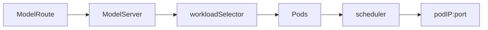
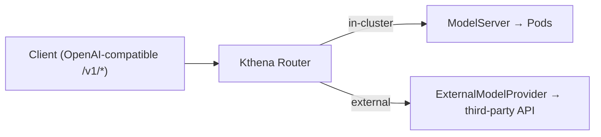
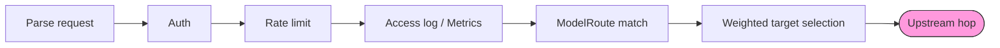
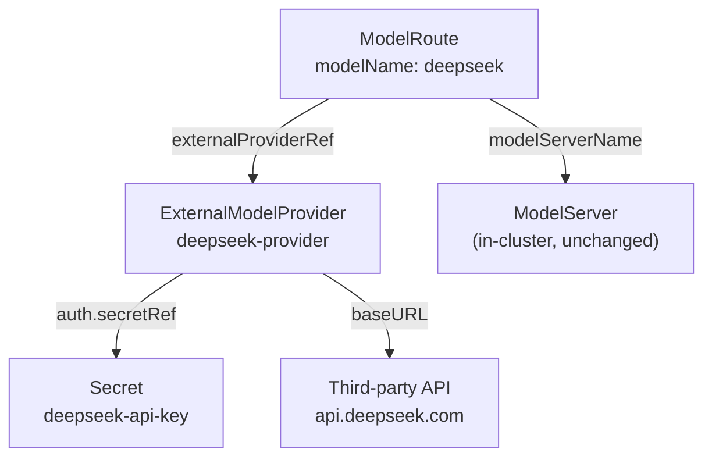
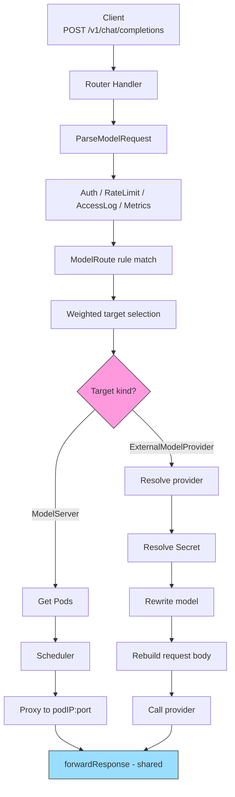

## Kthena Router Support for Third-Party Model APIs

### Summary

Kthena Router is documented as a unified LLM entry point for both privately deployed models and public AI service providers. The current implementation, however, only routes to in-cluster, Pod-backed `ModelServer`:



This proposal adds a second upstream destination type: an external OpenAI-compatible provider such as OpenAI, DeepSeek, or any compatible gateway. Clients continue to call the Router's OpenAI-compatible `/v1/*` endpoints with a virtual model name; the Router decides whether the request goes to an in-cluster model or an external provider.



This proposal evaluates two API shapes. **Option A** extends `ModelServer` with external provider fields. **Option B** adds a dedicated `ExternalModelProvider` CRD. The proposal recommends Option B, while keeping Option A as a valid lower-churn fallback. The final API shape should be confirmed with the mentor/maintainers.

Day-one endpoint scope is intentionally small:

| Endpoint | Day-one? | Reason |
|---|---|---|
| `/v1/chat/completions` | ✅Supported | Already parsed by the Router pre-routing path (`messages`) |
| `/v1/completions` | ✅Supported | Already parsed by the Router pre-routing path (`prompt`) |
| `/v1/embeddings` | ❌ Fast-follow | Uses `input`, not `messages`/`prompt`; needs a small parser change first |

### Motivation

The existing Router pipeline is already mostly independent of where the final upstream lives:



Everything up to the upstream hop is protocol-agnostic. Only the **final hop** is tightly coupled to in-cluster Pods: 

| Coupling point | What it does | Why it breaks for external APIs |
|:--|:--|:--|
| `getPodsAndServer()` | Requires target Pods for a `ModelServer` | External APIs have no Pods |
| `doRequest()` | Rewrites the request to `podIP:port` | No Pod IP to rewrite to |
| Scheduler | Scores Pods by runtime metrics, KV cache, LoRA, in-flight count | No `WorkloadSelector`, no vLLM/SGLang metrics |

External providers should therefore **skip Pod scheduling** and go directly through a provider client, while reusing the rest of the Router pipeline.

### Goals

- Route matched requests to an external OpenAI-compatible API.
- Reference credentials through Kubernetes `Secret`s, never inline plaintext.
- Reuse Router auth, rate limiting, access logging, metrics, model rewrite, and weighted traffic splitting.
- Support streaming SSE passthrough for chat/completion requests.
- Preserve backward compatibility for existing `ModelRoute` and `ModelServer` manifests.
- Provide unit tests, user docs, and examples. Mock-server e2e is a stretch goal.

### Non-Goals

- Native Gemini, Anthropic, Bedrock, or Vertex request/response translation. (Note: Gemini and Cohere expose OpenAI-compatible endpoints — e.g. Gemini's `/v1beta/openai` prefix — so they work day-one via `baseURL` without a new adapter. Only their *native* formats are out of scope.)
- `/v1/embeddings` support in the first implementation.
- Pod scheduling, KV-cache-aware routing, prefix-aware routing, LoRA affinity, or PD disaggregation for external providers.
- Managing the external service lifecycle.
- Provider-side multi-endpoint load balancing beyond what weighted `targetModels[]` can already express.
- Automatic failure fallback from one selected target to another.

### API Options

#### Option A: Extend ModelServer

Option A adds external-provider fields directly to `ModelServerSpec`. A `ModelRoute` would continue to target a `ModelServer`, and the router would decide whether that `ModelServer` points to Pods or to an external endpoint.

This is the lower-churn shape because it preserves the existing `ModelRoute -> ModelServer` user model and reuses the current store path. The cost is that `ModelServer` would describe two different backend types. Pod-oriented fields such as `workloadSelector`, `inferenceEngine`, and `workloadPort` would need to become optional or conditional, and the controller/router would need extra branches for the no-Pod case.

#### Option B: Add ExternalModelProvider

Option B adds a namespaced `ExternalModelProvider` CRD and extends `ModelRoute.targetModels[]` with an `externalProviderRef`. `ModelServer` remains the resource for Pod-backed serving, while external providers get their own fields for endpoint, credentials, protocol, and transport policy.

This proposal recommends Option B because Kthena is CRD-native and `ModelServer` is already documented and implemented around Pods. Separating the resources keeps lifecycle, validation, status, and future provider-specific fields cleaner.

| Dimension | Option A: extend `ModelServer` | Option B: new `ExternalModelProvider` |
|---|---|---|
| Recommendation | Fallback | Recommended |
| Router path change | Smaller | Larger |
| User-facing concepts | Reuses `ModelServer` | Adds one CRD |
| API clarity | `ModelServer` mixes Pod and external fields | Single-purpose resources |
| Existing required fields | Must relax Pod-oriented required fields | No need to relax `ModelServer` |
| Controller changes | Add no-Pod branches to `ModelServerController` | Add a small provider controller |
| Datastore | External entries share ModelServer map | Separate provider registry |
| Long-term evolution | Provider fields accumulate in `ModelServerSpec` | Providers evolve independently |

### Recommended API: ExternalModelProvider

Add a namespaced `ExternalModelProvider` CRD under `networking.serving.volcano.sh/v1alpha1`.

Resource relationships (all within one namespace):



`ExternalModelProviderSpec` fields:

| Field | Type | Required | Default | Notes |
|---|---|---|---|---|
| `providerType` | enum | no | `OpenAICompatible` | Only `OpenAICompatible` in MVP |
| `baseURL` | string | yes | — | `^https?://.+`; HTTPS unless `allowInsecure` |
| `allowInsecure` | bool | no | `false` | Permits `http://` for local/mock providers |
| `auth` | `ProviderAuth` | no | — | Credential Secret reference; if unset, no auth header is injected |
| `headers` | map | no | — | Static upstream headers; cannot override auth, `Host`, `Content-Length`, or hop-by-hop headers |
| `trafficPolicy` | `TrafficPolicy` | no | — | Reuses existing timeout/retry behavior |

`ProviderAuth` fields:

| Field | Type | Default | Notes |
|---|---|---|---|
| `secretRef` | `corev1.SecretKeySelector` | — | `{name, key}`, same namespace (required) |
| `header` | string | `Authorization` | Header carrying the credential |
| `scheme` | enum | `Bearer` | `Bearer` → `Authorization: Bearer <key>`; `Raw` → `<key>` |

```go
type ExternalProviderType string

const (
    OpenAICompatible ExternalProviderType = "OpenAICompatible"
)

type ProviderAuthScheme string

const (
    ProviderAuthSchemeBearer ProviderAuthScheme = "Bearer"
    ProviderAuthSchemeRaw    ProviderAuthScheme = "Raw"
)

// +kubebuilder:validation:XValidation:rule="self.allowInsecure || self.baseURL.startsWith('https://')",message="baseURL must be HTTPS unless allowInsecure is true"
type ExternalModelProviderSpec struct {
    // MVP supports only OpenAICompatible.
    // +optional
    // +kubebuilder:validation:Enum=OpenAICompatible
    // +kubebuilder:default=OpenAICompatible
    ProviderType ExternalProviderType `json:"providerType,omitempty"`

    // BaseURL is the provider endpoint root.
    // Example: https://api.deepseek.com
    // +kubebuilder:validation:Required
    // +kubebuilder:validation:MinLength=1
    // +kubebuilder:validation:Pattern=^https?://.+
    BaseURL string `json:"baseURL"`

    // AllowInsecure permits http:// only for local/in-cluster mock providers.
    // +optional
    AllowInsecure bool `json:"allowInsecure,omitempty"`

    // Auth references a credential Secret in the same namespace.
    // +optional
    Auth *ProviderAuth `json:"auth,omitempty"`

    // Static headers added to upstream requests. Must not override the configured
    // auth header or hop-by-hop/request-routing headers such as Host and Content-Length.
    // +optional
    Headers map[string]string `json:"headers,omitempty"`

    // Reuses existing timeout/retry behavior.
    // +optional
    TrafficPolicy *TrafficPolicy `json:"trafficPolicy,omitempty"`
}

type ProviderAuth struct {
    // +kubebuilder:validation:Required
    SecretRef corev1.SecretKeySelector `json:"secretRef"`

    // Default: Authorization.
    // +kubebuilder:default=Authorization
    Header string `json:"header,omitempty"`

    // Bearer -> "Authorization: Bearer <key>"; Raw -> "<key>".
    // +kubebuilder:default=Bearer
    // +kubebuilder:validation:Enum=Bearer;Raw
    Scheme ProviderAuthScheme `json:"scheme,omitempty"`
}

type ExternalModelProviderStatus struct {
    // +optional
    ObservedGeneration int64 `json:"observedGeneration,omitempty"`

    // +optional
    Conditions []metav1.Condition `json:"conditions,omitempty"`
}
```

`corev1.SecretKeySelector` is used intentionally instead of a custom selector. It keeps the API aligned with Kubernetes conventions while still allowing users to customize both the Secret name and the Secret key.

Status should only report whether the provider config can be used in the MVP. The controller can report conditions such as `Ready` and `CredentialsResolved`, but it should not actively call third-party APIs to check health in the first implementation.

Extend `TargetModel` with an external destination:

```go
// +kubebuilder:validation:XValidation:rule="(has(self.modelServerName) && self.modelServerName != '') != has(self.externalProviderRef)",message="exactly one of modelServerName or externalProviderRef must be set"
type TargetModel struct {
    // Existing in-cluster target. Mutually exclusive with ExternalProviderRef.
    ModelServerName string `json:"modelServerName,omitempty"`

    // New external target. Mutually exclusive with ModelServerName.
    ExternalProviderRef *ExternalProviderRef `json:"externalProviderRef,omitempty"`

    // Existing weighted splitting field.
    Weight *uint32 `json:"weight,omitempty"`
}

type ExternalProviderRef struct {
    // ExternalModelProvider name in the same namespace.
    // +kubebuilder:validation:Required
    Name string `json:"name"`

    // Upstream model name sent to the provider.
    // +kubebuilder:validation:Required
    // +kubebuilder:validation:MaxLength=256
    Model string `json:"model"`
}
```

Validation:

- Exactly one of `modelServerName` and `externalProviderRef` must be set.
- `baseURL` must be HTTPS unless `allowInsecure=true`.
- `baseURL` must be parsed and must not contain URL userinfo, query, or
  fragment. This should be enforced by webhook validation because CEL is not a
  good fit for full URL parsing.
- Static `headers` must not overwrite the configured auth header, `Host`, `Content-Length`, or hop-by-hop headers. Header names must be validated case-insensitively, for example by canonicalizing with `http.CanonicalHeaderKey` or comparing with `strings.EqualFold` in webhook validation.
- `secretRef.name` and `secretRef.key` are structurally validated at admission time. Secret existence and key availability are resolved asynchronously by the controller/router lister and reported through provider status.

Example:

```yaml
apiVersion: v1
kind: Secret
metadata:
  name: deepseek-api-key
  namespace: default
type: Opaque
stringData:
  apiKey: "<redacted>"
---
apiVersion: networking.serving.volcano.sh/v1alpha1
kind: ExternalModelProvider
metadata:
  name: deepseek-provider
  namespace: default
spec:
  providerType: OpenAICompatible
  baseURL: https://api.deepseek.com
  auth:
    secretRef:
      name: deepseek-api-key
      key: apiKey
    header: Authorization
    scheme: Bearer
  trafficPolicy:
    timeout: 60s
---
apiVersion: networking.serving.volcano.sh/v1alpha1
kind: ModelRoute
metadata:
  name: deepseek-route
  namespace: default
spec:
  modelName: deepseek
  rules:
  - name: default
    targetModels:
    - externalProviderRef:
        name: deepseek-provider
        model: deepseek-chat
```

Hybrid split also works:

```yaml
rules:
- name: default
  targetModels:
  - modelServerName: qwen-local
    weight: 80
  - externalProviderRef:
      name: openai-provider
      model: gpt-4o-mini
    weight: 20
```

This is traffic splitting, not failure fallback. The MVP selects one target by weight at the beginning of the request; it does not automatically try the external provider after an in-cluster target fails, or vice versa.

### Prior Art

The A/B split mirrors a consistent pattern across existing LLM gateways (verified against primary sources):

| Project | Type | How it models an external provider | Maps to |
|---|---|---|---|
| Envoy AI Gateway | K8s CRDs | Separate `AIServiceBackend` + `BackendSecurityPolicy` (credentials in their own resource, `secretRef` injected into `Authorization`) | Option B |
| LiteLLM Proxy | Config file | One uniform `model_list[]` entry per model, self-hosted or external | Option A |
| Kong / Higress AI Gateway | Gateway plugin | Single `provider` block on the route/service | Option A |

The takeaway: **CRD-native gateways lean toward separate resources (B); flat config/plugin proxies lean toward a unified entry (A).** Since Kthena is CRD-native, the closest precedent (Envoy AI Gateway) favors Option B. Its `secretRef`-into-`Authorization` credential model is also identical to this proposal's `auth.secretRef` + Bearer injection, and its pluggable `APISchema` validates the OpenAI-compatible-first MVP with adapters added later.

### Request Flow



Mapped onto the documented Router pipeline stages, the external path is **additive, not a rewrite**:

| Stage | In-cluster path | External path |
|---|---|---|
| Auth | ✅ reuse | ✅ reuse |
| RateLimit | ✅ reuse | ✅ reuse |
| Fairness | ✅ reuse | ✅ reuse |
| Scheduling | Pod filter/score | ⏭️ **skipped** (no Pods) |
| LoadBalancing | weighted Pod pick | 🔁 **replaced** by provider client |
| Proxy | `doRequest(podIP)` | 🔁 **replaced** by provider call |
| Response forwarding | `forwardResponse` | ✅ **same** `forwardResponse` |

The external path skips Pod scheduling, reuses the front half of the pipeline, and shares the same response-forwarding behavior.

### Implementation Details

#### Route Target

`selectDestination()` already returns the selected `TargetModel`, but `MatchModelServer()` currently collapses it into `ModelServerName`. For Option B, return a more general target:

```go
type RouteTarget struct {
    Kind DestinationKind // ModelServer or ExternalProvider

    ModelServer      *ModelServerTarget
    ExternalProvider *ExternalProviderTarget

    IsLora     bool
    ModelRoute *aiv1alpha1.ModelRoute
}

type ModelServerTarget struct {
    Name types.NamespacedName
}

type ExternalProviderTarget struct {
    ProviderRef   types.NamespacedName
    UpstreamModel string
}
```

Only the target representation changes; rule matching and weighted selection stay the same. The signature change is mechanical but touches the `Store` interface, `MockStore`, and a handful of existing tests, plus the single live caller in `doLoadbalance` (a router-level wrapper with no callers can be deleted).

#### Provider Adapter Layer

Add a small provider adapter layer under `pkg/kthena-router/provider/`. 

| File | Responsibility |
|---|---|
| `provider.go` | `ProviderAdapter` interface + `Input`/`Credential` types |
| `registry.go` | `providerType` → constructor lookup |
| `openai.go` | `OpenAICompatibleProvider` (MVP) |
| `secret.go` | Secret resolver (lister-backed) |
| `transport.go` | Shared HTTP executor (`*http.Client`, timeouts, TLS, redirects, pooling) |

Minimal interface:

```go
type ProviderAdapter interface {
    BuildRequest(ctx context.Context, in *Input) (*http.Request, error)
}

type Transport interface {
    Do(req *http.Request) (*http.Response, error)
}

type Credential struct {
    HeaderName  string
    HeaderValue string
}

type Input struct {
    ProviderType   ExternalProviderType
    BaseURL        string
    StaticHeaders  map[string]string
    Credential     *Credential
    RawBody        []byte
    Fields         map[string]any
    OriginalPath   string
    RequestHeaders http.Header
    UpstreamModel  string
}
```

The adapter decides what the upstream request should look like: URL, model rewrite, headers, and future provider-specific conversion. The shared transport sends the HTTP request and handles connection pooling, TLS, redirects, timeouts, and retry policy. If an implementation keeps a provider-level `Do()` helper, it should only call the shared transport instead of adding separate network rules inside each provider.

The MVP provider only needs OpenAI-compatible passthrough:

- Treat `baseURL` as the provider's OpenAI-compatible API root. Strip the public Router `/v1` prefix from the original path before joining. For example, `/v1/chat/completions` joined with `https://api.example.com/v1` becomes `https://api.example.com/v1/chat/completions`, and the same request joined with `https://generativelanguage.googleapis.com/v1beta/openai` becomes `https://generativelanguage.googleapis.com/v1beta/openai/chat/completions`.
- Inject auth from Secret.
- Copy allowed downstream headers.
- Rewrite `model` to the upstream model name.
- Use request context for cancellation.
- Execute the request through the shared transport.

Future provider adapters can convert native provider formats behind the same interface, but that is outside the MVP. This keeps the first change focused on making external OpenAI-compatible upstreams work end-to-end.

#### Future Native Provider Support

The API should leave room for provider-specific adapters even though the first implementation only supports OpenAI-compatible passthrough. Native providers usually differ in request body, URL format, authentication, streaming format, and usage fields, so they should be handled in provider adapters instead of adding provider-specific checks throughout the router.

| Future `providerType` | Why it may need an adapter |
|---|---|
| `Anthropic` | Native Messages API request format, headers, streaming events, and usage fields differ from OpenAI |
| `AzureOpenAI` | OpenAI-like request body, but deployment-based paths, API versions, and auth differ |
| `AWSBedrock` | Service-specific signing/auth, model identifiers, and response envelopes differ |
| `Custom` | User-controlled OpenAI-compatible or organization-specific gateway behavior |

This means the first implementation should add the provider registry and `providerType`, but only register `OpenAICompatible` until routing, Secret handling, streaming, and observability are stable.

#### Body and Usage Handling

`ParseModelRequest()` consumes `c.Request.Body` today. The external path should
read the body once, keep the raw bytes, and decode fields with
`json.Decoder.UseNumber()`:

```go
type ParsedRequest struct {
    RawBody []byte
    Fields  map[string]any
}
```

The provider adapter should rebuild the JSON body only when it needs to rewrite `model` or add usage options. This preserves unknown provider-specific fields and avoids changing large JSON numbers into `float64` during passthrough.

Streaming usage handling should be shared with the existing Pod path. Today this logic lives in unexported connector code (`addTokenUsage`), so implementation should move it into a shared helper, for example:

```go
applyUsageOpts(c, modelRequest, backendType)
```

For streaming, keep the standard OpenAI-compatible `stream_options.include_usage=true`. For non-streaming external calls, avoid injecting non-standard top-level fields unless a provider explicitly supports it.

#### Streaming Support

Streaming should behave the same for in-cluster and external targets. For OpenAI-compatible providers, if the downstream request contains `stream: true`, the provider path should forward the upstream SSE response line by line without buffering the full response.

The external path should:

- Preserve `text/event-stream` behavior and flush chunks as they arrive.
- Parse usage chunks when the provider returns them.
- Record output tokens for rate limiting, access logs, and metrics when usage is available.
- Continue forwarding the stream even if usage is absent.
- Cancel the upstream request and exit the forwarding loop when the downstream client disconnects.
- Never retry after the stream has started.

Streaming requests should not use `http.Client.Timeout` as a total request timeout, because a valid model stream can last longer than a normal non-streaming request. The MVP should use request context plus HTTP connection timeouts such as connect, TLS handshake, response-header, and idle connection timeouts. More specific first-token or stream-idle timeout fields can be added later.

This is why response forwarding should be shared instead of implemented separately for providers.

#### Response Forwarding

Extract the response-forwarding block from `proxyRequest()` into a reusable function:

```go
func forwardResponse(
    c *gin.Context,
    resp *http.Response,
    stream bool,
    onUsage func(TokenUsage),
) error

type TokenUsage struct {
    PromptTokens     int `json:"prompt_tokens,omitempty"`
    CompletionTokens int `json:"completion_tokens,omitempty"`
    TotalTokens      int `json:"total_tokens,omitempty"`
}
```

`TokenUsage` should live in a small shared router package rather than exposing a handler-specific response type through the forwarding API.

The code that receives `resp` from the transport should close `resp.Body`. `forwardResponse()` should only copy headers/status/body, stream data, and parse usage. The Pod path and external path should follow the same rule for who closes the response body.

Both Pod and external paths should use the same forwarding behavior:

- Copy upstream headers.
- Preserve upstream status and body.
- Stream SSE line by line.
- Parse usage chunks when available.
- Record output tokens for rate limit and metrics.

Provider HTTP errors with a response are passed through unchanged; only transport failures without an upstream response are created by the Router:

| Upstream outcome | What the client receives |
|---|---|
| `4xx` with body (e.g. `401`, or `429` after retry budget is exhausted) | Pass through status + body unchanged |
| `5xx` with body (e.g. `500`, or `502`/`503` after retry budget is exhausted) | Pass through status + body unchanged |
| Connection refused / TLS failure | Router-created `502 Bad Gateway` |
| Timeout, no response bytes | Router-created `504 Gateway Timeout` |
| Retry | Only for clearly retryable connection/setup failures before request submission is known, or explicitly retryable upstream responses such as `429`, `502`, or `503`; never after a stream starts |

#### Secret Resolution

Add a Kubernetes Secret informer/lister to the router process. Secret rotation takes effect on the next request because credentials are resolved from the lister cache at request time.

Missing Secret or missing key should set provider status to `Ready=False` with a configuration reason such as `CredentialNotFound`. Requests targeting an unresolved provider should return `503 Service Unavailable`. Error messages must name the provider but never print the key value.

#### Observability

Do not create external-only metrics. Instead, add a few labels with limited values to the existing router metrics so dashboards can compare in-cluster and external traffic with the same metric names.

Recommended labels to add where relevant:

| Label | Values | Notes |
|---|---|---|
| `backend_type` | `model_server`, `external_provider` | Identifies whether the selected target is in-cluster or external |
| `provider` | provider resource name, or empty/`none` for in-cluster traffic | Identifies the `ExternalModelProvider` without overloading `model_server` |
| `upstream_model` | configured upstream model, or empty/`none` for in-cluster traffic | Comes from `ExternalProviderRef.Model`, not from the client request body |

For example, add these labels to existing metrics such as `kthena_router_requests_total`, `kthena_router_request_duration_seconds`, `kthena_router_tokens_total`, and `kthena_router_active_upstream_requests` instead of adding `kthena_router_external_*` metric names. Existing in-cluster traffic should fill the new labels with default values so each metric always has the same label set.

Metric label values must stay controlled. `upstream_model` should come from the route config, not from the client request body, and status/error labels should use HTTP codes or fixed strings instead of raw error messages. A dedicated time-to-first-token metric would require adding a new metric, so it is left out of the MVP because maintainers prefer reusing existing metrics.

Access logs can add external fields because they are structured records, but existing fields should remain.

#### Future Work: Cost-Aware Routing

The MVP keeps the existing weighted `targetModels[]` selection model. This already lets users manually shift traffic toward lower-cost providers by assigning higher weights to cheaper targets.

A future API could add cost-aware routing policies, for example selecting the lowest-cost compatible target under latency, availability, or budget constraints. This should be added as a route-level policy rather than hard-coded into `ExternalModelProvider`, because cost-based routing needs more inputs than the provider endpoint itself: pricing metadata, model capability equivalence, token accounting, latency SLOs, and fallback behavior.

Possible future extension:

```yaml
selectionPolicy:
  type: CostOptimized
  constraints:
    maxLatency: 2s
    maxCostPer1KTokens: "0.01"
```

This proposal intentionally does not implement cost-aware routing in the first version. It only keeps `ModelRoute` target selection extensible so a future policy can be added without changing the external-provider resource model.

### Security and Validation

- Never log Secret contents or upstream auth headers.
- Require HTTPS by default.
- Use `allowInsecure` only for local or in-cluster mock providers.
- `allowInsecure` only permits `http://`; it must not disable TLS certificate verification for `https://` endpoints.
- Reject `baseURL` values with URL userinfo or fragments.
- Disable automatic redirects by default so an allowed provider endpoint cannot redirect the router to a different host.
- Reject static headers that overwrite the configured auth header, `Host`,
  `Content-Length`, or hop-by-hop headers.
- Keep provider, Secret, and ModelRoute references in the same namespace.
- Consider reducing router Secret RBAC to `get/list/watch` if `create` is not
  needed by other router features.

### Test Plan

Unit tests should not call real third-party APIs. Use `httptest.Server` and fake Kubernetes clients/listers.

| Area | Coverage |
|---|---|
| API validation | `modelServerName` XOR `externalProviderRef`; HTTPS/`allowInsecure`; URL userinfo/query/fragment rejection; static header conflicts |
| Secret resolution | missing Secret, missing key, valid key, rotation behavior, status conditions |
| Route resolution | external target, internal target, weighted internal/external split |
| Request building | `/v1` prefix stripping, path join, raw body preservation, `UseNumber`, model rewrite, Bearer/Raw auth, static/request headers |
| Streaming | SSE passthrough, line-by-line flush, usage callback, downstream cancellation, no mid-stream retry |
| Non-streaming | body passthrough, usage parsing when present |
| Errors | pass through upstream 4xx/5xx; create 502/504 for transport failures; retry only for constrained safe cases |
| Compatibility | existing ModelServer-only routes unchanged |
| Observability | existing metrics get backend labels with default values for in-cluster traffic; no external-only metrics; controlled label values |

E2E can use an in-cluster mock OpenAI-compatible server. This avoids depending on real external providers or free API availability.

### Implementation Milestones

| # | Milestone | Output |
|---|---|---|
| 1 | Confirm API shape with mentor/maintainers | Decision on Option B (recommended) vs A |
| 2 | CRD types + codegen | `ExternalModelProvider` types, deepcopy, CRD YAML, client |
| 3 | Registry + controller + store | Provider controller, store registry, informer wiring |
| 4 | Route target refactor | `RouteTarget` + external branch in `doLoadbalance` |
| 5 | Provider request + Secret + forwarding | `OpenAICompatibleProvider`, secret resolver, external forward |
| 6 | Shared helpers | Extract `forwardResponse` + usage helper from Pod path |
| 7 | Validation, docs, examples, tests | CEL/webhook, user guide, manifests, unit tests |

### Open Questions

- Do maintainers accept Option B, or prefer Option A for lower implementation churn?
- Is OpenAI-compatible-only scope acceptable for the first implementation?
- Should `/v1/embeddings` remain fast-follow until `input` parsing is added?
- Should the API reserve room for future cost-aware routing policies while keeping the first implementation limited to weighted target selection?
- Is a mock OpenAI-compatible server acceptable for e2e?
