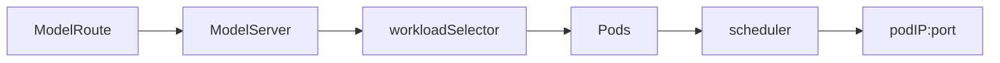
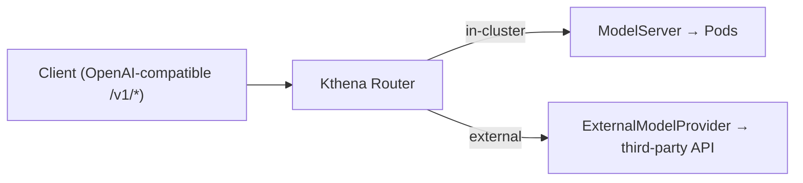
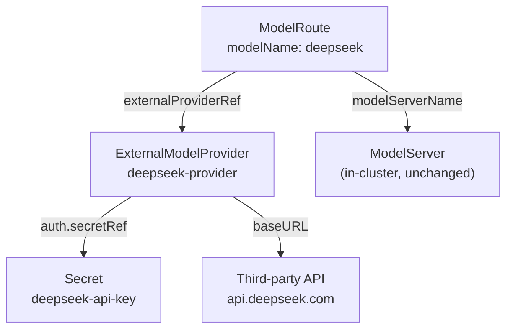
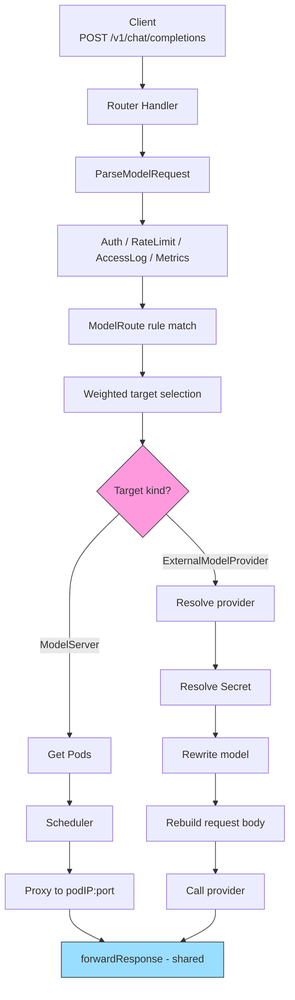

## Kthena Router Support for Third-Party Model APIs 

### Summary

Kthena Router is documented as a unified LLM entry point for both privately deployed models and public AI service providers. The current implementation, however, only routes to in-cluster, Pod-backed `ModelServer`:



This proposal adds a second upstream destination type: an external OpenAI-compatible provider such as OpenAI, DeepSeek, or any compatible gateway. Clients continue to call the Router's OpenAI-compatible `/v1/*` endpoints with a virtual model name; the Router decides whether the request goes to an in-cluster model or an external provider.



This proposal recommends **Option B: add a dedicated `ExternalModelProvider` CRD**. It keeps `ModelServer` focused on Pod-backed serving while giving external providers their own Kubernetes-native API surface. **Option A**, extending `ModelServer`, remains a valid lower-churn fallback. The final API shape should be confirmed with the mentor/maintainers.

Day-one endpoint scope is intentionally small:

| Endpoint | Day-one? | Reason |
|---|---|---|
| `/v1/chat/completions` | ✅ Supported | Already parsed by the Router pre-routing path (`messages`) |
| `/v1/completions` | ✅ Supported | Already parsed by the Router pre-routing path (`prompt`) |
| `/v1/embeddings` | ❌ Fast-follow | Uses `input`, not `messages`/`prompt`; needs a small parser change first |

### Motivation

The existing Router pipeline is already mostly independent of where the final upstream lives:


Everything up to the upstream hop is protocol-agnostic. Only the **final hop** is tightly coupled to in-cluster Pods:

| Coupling point | What it does | Why it breaks for external APIs |
|---|---|---|
| `getPodsAndServer()` | Requires target Pods for a `ModelServer` | External APIs have no Pods |
| `doRequest()` | Rewrites the request to `podIP:port` | No Pod IP to rewrite to |
| Scheduler | Scores Pods by runtime metrics, KV cache, LoRA, in-flight count | No `WorkloadSelector`, no vLLM/SGLang metrics |

External providers should therefore **skip Pod scheduling** and go directly through a provider client, while reusing the rest of the Router pipeline.

### Goals

- Route matched requests to an external OpenAI-compatible API.
- Reference credentials through Kubernetes `Secret`s, never inline plaintext.
- Reuse Router auth, rate limiting, access logging, metrics, model rewrite, and
  weighted traffic splitting.
- Support streaming SSE passthrough for chat/completion requests.
- Preserve backward compatibility for existing `ModelRoute` and `ModelServer`
  manifests.
- Provide unit tests, user docs, and examples. Mock-server e2e is a stretch goal.

### Non-Goals

- Native Gemini, Anthropic, Bedrock, or Vertex request/response translation.
  (Note: Gemini and Cohere expose OpenAI-compatible endpoints — e.g. Gemini's
  `/v1beta/openai` prefix — so they work day-one via `baseURL` without a new
  adapter. Only their *native* formats are out of scope.)
- `/v1/embeddings` support in the first implementation.
- Pod scheduling, KV-cache-aware routing, prefix-aware routing, LoRA affinity, or PD disaggregation for external providers.
- Managing the external service lifecycle.
- Provider-side multi-endpoint load balancing beyond what weighted `targetModels[]` can already express.

### Recommended API: ExternalModelProvider

Add a namespaced `ExternalModelProvider` CRD under
`networking.serving.volcano.sh/v1alpha1`.

Resource relationships (all within one namespace):



`ExternalModelProviderSpec` fields:

| Field | Type | Required | Default | Notes |
|---|---|---|---|---|
| `providerType` | enum | no | `OpenAICompatible` | Only `OpenAICompatible` in MVP |
| `baseURL` | string | yes | — | `^https?://.+`; HTTPS unless `allowInsecure` |
| `allowInsecure` | bool | no | `false` | Permits `http://` for local/mock providers |
| `auth` | `ProviderAuth` | no | — | Credential Secret reference; if unset, no auth header is injected |
| `headers` | map | no | — | Static upstream headers; cannot override auth, `Host`, or `Content-Length` |
| `trafficPolicy` | `TrafficPolicy` | no | — | Reuses existing timeout/retry semantics |

`ProviderAuth` fields:

| Field | Type | Default | Notes |
|---|---|---|---|
| `secretRef` | `SecretKeySelector` | — | `{name, key}`, same namespace (required) |
| `header` | string | `Authorization` | Header carrying the credential |
| `scheme` | enum | `Bearer` | `Bearer` → `Authorization: Bearer <key>`; `Raw` → `<key>` |

```go
type ExternalProviderType string

const (
    OpenAICompatible ExternalProviderType = "OpenAICompatible"
)

type ExternalModelProviderSpec struct {
    // MVP supports only OpenAICompatible.
    // +kubebuilder:validation:Enum=OpenAICompatible
    // +kubebuilder:default=OpenAICompatible
    ProviderType ExternalProviderType `json:"providerType"`

    // BaseURL is the provider endpoint root.
    // Example: https://api.deepseek.com
    // +kubebuilder:validation:Required
    // +kubebuilder:validation:Pattern=`^https?://.+`
    BaseURL string `json:"baseURL"`

    // AllowInsecure permits http:// only for local/in-cluster mock providers.
    // +optional
    AllowInsecure bool `json:"allowInsecure,omitempty"`

    // Auth references a credential Secret in the same namespace.
    // +optional
    Auth *ProviderAuth `json:"auth,omitempty"`

    // Static headers added to upstream requests. Must not override the configured
    // auth header or hop-by-hop/request-routing headers such as Host and Content-Length.
    // +optional
    Headers map[string]string `json:"headers,omitempty"`

    // Reuses existing timeout/retry semantics.
    // +optional
    TrafficPolicy *TrafficPolicy `json:"trafficPolicy,omitempty"`
}

type ProviderAuth struct {
    // +kubebuilder:validation:Required
    SecretRef SecretKeySelector `json:"secretRef"`

    // Default: Authorization.
    // +kubebuilder:default=Authorization
    Header string `json:"header,omitempty"`

    // Bearer -> "Authorization: Bearer <key>"; Raw -> "<key>".
    // +kubebuilder:default=Bearer
    // +kubebuilder:validation:Enum=Bearer;Raw
    Scheme string `json:"scheme,omitempty"`
}

type SecretKeySelector struct {
    // +kubebuilder:validation:Required
    Name string `json:"name"`
    // +kubebuilder:validation:Required
    Key string `json:"key"`
}
```

Extend `TargetModel` with an external destination:

```go
// +kubebuilder:validation:XValidation:rule="(self.modelServerName != '') != has(self.externalProviderRef)",message="exactly one of modelServerName or externalProviderRef must be set"
type TargetModel struct {
    // Existing in-cluster target. Mutually exclusive with ExternalProviderRef.
    ModelServerName string `json:"modelServerName,omitempty"`

    // New external target. Mutually exclusive with ModelServerName.
    ExternalProviderRef *ExternalProviderRef `json:"externalProviderRef,omitempty"`

    // Existing weighted splitting field.
    Weight *uint32 `json:"weight,omitempty"`
}

type ExternalProviderRef struct {
    // ExternalModelProvider name in the same namespace.
    // +kubebuilder:validation:Required
    Name string `json:"name"`

    // Upstream model name sent to the provider.
    // +kubebuilder:validation:Required
    // +kubebuilder:validation:MaxLength=256
    Model string `json:"model"`
}
```

Validation:

- Exactly one of `modelServerName` and `externalProviderRef` must be set.
- `baseURL` must be HTTPS unless `allowInsecure=true`.
- Static `headers` must not overwrite the configured auth header, `Host`, or
  `Content-Length`.
- Referenced Secrets must exist and contain the requested key.

Example:

```yaml
apiVersion: v1
kind: Secret
metadata:
  name: deepseek-api-key
  namespace: default
type: Opaque
stringData:
  apiKey: "<redacted>"
---
apiVersion: networking.serving.volcano.sh/v1alpha1
kind: ExternalModelProvider
metadata:
  name: deepseek-provider
  namespace: default
spec:
  providerType: OpenAICompatible
  baseURL: https://api.deepseek.com
  auth:
    secretRef:
      name: deepseek-api-key
      key: apiKey
    header: Authorization
    scheme: Bearer
  trafficPolicy:
    timeout: 60s
---
apiVersion: networking.serving.volcano.sh/v1alpha1
kind: ModelRoute
metadata:
  name: deepseek-route
  namespace: default
spec:
  modelName: deepseek
  rules:
  - name: default
    targetModels:
    - externalProviderRef:
        name: deepseek-provider
        model: deepseek-chat
```

Hybrid split also works:

```yaml
rules:
- name: default
  targetModels:
  - modelServerName: qwen-local
    weight: 80
  - externalProviderRef:
      name: openai-provider
      model: gpt-4o-mini
    weight: 20
```

### Option Comparison

| Dimension | Option A: extend `ModelServer` | Option B: new `ExternalModelProvider` |
|---|---|---|
| Recommendation | Fallback | Recommended |
| Router path change | Smaller | Larger |
| User-facing concepts | Reuses `ModelServer` | Adds one CRD |
| API clarity | `ModelServer` becomes a union | Single-purpose resources |
| Existing required fields | Must relax Pod-oriented required fields | No need to relax `ModelServer` |
| Controller changes | Add no-Pod branches to `ModelServerController` | Add a small provider controller |
| Datastore | External entries share ModelServer map | Separate provider registry |
| Long-term evolution | Provider fields accumulate in `ModelServerSpec` | Providers evolve independently |

This proposal recommends Option B because Kthena is CRD-native and `ModelServer` is already documented and implemented around Pods. Option A is still reasonable if maintainers prefer the lowest-churn path and want to preserve the existing
`ModelRoute -> ModelServer` mental model.

#### Prior Art

The A/B split mirrors a consistent pattern across existing LLM gateways (verified against primary sources):

| Project | Type | How it models an external provider | Maps to |
|---|---|---|---|
| Envoy AI Gateway | K8s CRDs | Separate `AIServiceBackend` + `BackendSecurityPolicy` (credentials in their own resource, `secretRef` injected into `Authorization`) | Option B |
| LiteLLM Proxy | Config file | One uniform `model_list[]` entry per model, self-hosted or external | Option A |
| Kong / Higress AI Gateway | Gateway plugin | Single `provider` block on the route/service | Option A |

The takeaway: **CRD-native gateways lean toward separate resources (B); flat config/plugin proxies lean toward a unified entry (A).** Since Kthena is CRD-native, the closest precedent (Envoy AI Gateway) favors Option B. Envoy AI
Gateway's `secretRef`-into-`Authorization` credential model is also identical to this proposal's `auth.secretRef` + Bearer injection, and its pluggable `APISchema` validates the OpenAI-compatible-first MVP with adapters added later.

### Request Flow



Mapped onto the documented Router pipeline stages, the external path is **additive, not a rewrite**:

| Stage | In-cluster path | External path |
|---|---|---|
| Auth | ✅ reuse | ✅ reuse |
| RateLimit | ✅ reuse | ✅ reuse |
| Fairness | ✅ reuse | ✅ reuse |
| Scheduling | Pod filter/score | ⏭️ **skipped** (no Pods) |
| LoadBalancing | weighted Pod pick | 🔁 **replaced** by provider client |
| Proxy | `doRequest(podIP)` | 🔁 **replaced** by provider call |
| Response forwarding | `forwardResponse` | ✅ **same** `forwardResponse` |

The external path skips Pod scheduling, reuses the front half of the pipeline, and shares the same response-forwarding behavior.

### Implementation Details

#### Route Target

`selectDestination()` already returns the selected `TargetModel`, but `MatchModelServer()` currently collapses it into `ModelServerName`. For Option B, return a more general target:

```go
type RouteTarget struct {
    Kind DestinationKind // ModelServer or ExternalProvider

    ModelServerName types.NamespacedName
    ProviderRef     types.NamespacedName
    UpstreamModel   string

    IsLora     bool
    ModelRoute *aiv1alpha1.ModelRoute
}
```

Only the target representation changes; rule matching and weighted selection stay the same. The signature change is mechanical but touches the `Store` interface, `MockStore`, and a handful of existing tests, plus the single live caller in `doLoadbalance` (a router-level wrapper with no callers can be deleted).

#### Provider Adapter Layer

Add a small provider adapter layer under `pkg/kthena-router/provider/`. 

| File | Responsibility |
|---|---|
| `provider.go` | `Provider` interface + `Input` type |
| `registry.go` | `providerType` → constructor lookup |
| `openai.go` | `OpenAICompatibleProvider` (MVP) |
| `secret.go` | Secret resolver (lister-backed) |
| `transport.go` | Shared `*http.Client` (timeouts, TLS, pooling) |

Minimal interface:

```go
type Provider interface {
    BuildRequest(ctx context.Context, in *Input) (*http.Request, error)
    Do(ctx context.Context, req *http.Request) (*http.Response, error)
}

type Input struct {
    ProviderType   string
    BaseURL        string
    StaticHeaders  map[string]string
    APIKey         string
    Body           []byte
    OriginalPath   string
    RequestHeaders http.Header
}
```

The MVP provider only needs OpenAI-compatible passthrough:

- Join `baseURL` with the original `/v1/...` path.
- Inject auth from Secret.
- Copy allowed downstream headers.
- Rewrite `model` to the upstream model name.
- Use request context for cancellation.
- Honor timeout and retry policy before response bytes are written.

Future provider adapters can implement native protocol translation behind the
same interface, but that is outside the MVP. This keeps the first change focused
on making external OpenAI-compatible upstreams work end-to-end.

#### Body and Usage Handling

`ParseModelRequest()` consumes `c.Request.Body`. The external upstream request must therefore be marshaled from the parsed `modelRequest` map, not from the original body.

Streaming usage handling should be shared with the existing Pod path. Today this logic lives in unexported connector code (`addTokenUsage`), so implementation should move it into a shared helper, for example:

```go
applyUsageOpts(c, modelRequest, backendType)
```

For streaming, keep the standard OpenAI-compatible `stream_options.include_usage=true`. For non-streaming external calls, avoid injecting non-standard top-level fields unless a provider explicitly supports it.

#### Streaming Support

Streaming should behave the same for in-cluster and external targets. For OpenAI-compatible providers, if the downstream request contains `stream: true`, the provider path should forward the upstream SSE response line by line without buffering the full response.

The external path should:

- Preserve `text/event-stream` behavior and flush chunks as they arrive.
- Parse usage chunks when the provider returns them.
- Record output tokens for rate limiting, access logs, and metrics when usage is
  available.
- Continue forwarding the stream even if usage is absent.
- Never retry after the first response byte has been written.

This is why response forwarding should be shared instead of implemented
separately for providers.

#### Response Forwarding

Extract the response-forwarding block from `proxyRequest()` into a reusable
function:

```go
func forwardResponse(
    c *gin.Context,
    resp *http.Response,
    stream bool,
    onUsage func(handlers.OpenAIResponse),
) error
```

Both Pod and external paths should use the same forwarding behavior:

- Copy upstream headers.
- Preserve upstream status and body.
- Stream SSE line by line.
- Parse usage chunks when available.
- Record output tokens for rate limit and metrics.

Provider HTTP errors with a response are passed through unchanged; only transport failures without an upstream response are synthesized:

| Upstream outcome | What the client receives |
|---|---|
| `4xx` with body (e.g. `401`, `429`) | Pass through status + body unchanged |
| `5xx` with body (e.g. `500`) | Pass through status + body unchanged |
| Connection refused / TLS failure | Synthesized `502 Bad Gateway` |
| Timeout, no response bytes | Synthesized `504 Gateway Timeout` |
| Retry | Only **before** the first response byte is flushed; never mid-stream |

#### Secret Resolution

Add a Kubernetes Secret informer/lister to the router process. Secret rotation takes effect on the next request because credentials are resolved from the lister cache at request time.

Missing Secret or missing key is a configuration error and should return `503 Service Unavailable`. Error messages must name the provider but never print the key value.

#### Observability

Do not break existing Prometheus label sets. The current active-upstream metric is labeled by `model_server` and `model_route`; adding labels to an existing metric would break dashboards. Two compatible approaches:

| Approach | How | Trade-off |
|---|---|---|
| Reuse existing label | Encode destination in `model_server`, e.g. `external/default/deepseek-provider` | Zero dashboard change; label value overloaded |
| New metrics | Add external-specific metrics with `backend_type`, `provider`, `upstream_model` labels | Cleaner dimensions; new dashboards needed |

Access logs can add external fields because they are structured records, but existing fields should remain.

#### Future Work: Cost-Aware Routing

The MVP keeps the existing weighted `targetModels[]` selection model. This
already lets users manually shift traffic toward lower-cost providers by
assigning higher weights to cheaper targets.

A future API could add cost-aware routing policies, for example selecting the
lowest-cost compatible target under latency, availability, or budget
constraints. This should be added as a route-level policy rather than hard-coded
into `ExternalModelProvider`, because cost-based routing needs more inputs than
the provider endpoint itself: pricing metadata, model capability equivalence,
token accounting, latency SLOs, and fallback behavior.

Possible future extension:

```yaml
selectionPolicy:
  type: CostOptimized
  constraints:
    maxLatency: 2s
    maxCostPer1KTokens: "0.01"
```

This proposal intentionally does not implement cost-aware routing in the first
version. It only keeps `ModelRoute` target selection extensible so a future
policy can be added without changing the external-provider resource model.

### Security and Validation

- Never log Secret contents or upstream auth headers.
- Require HTTPS by default.
- Use `allowInsecure` only for local or in-cluster mock providers.
- Reject static headers that overwrite the configured auth header.
- Keep provider, Secret, and ModelRoute references in the same namespace.
- Consider reducing router Secret RBAC to `get/list/watch` if `create` is not
  needed by other router features.

### Test Plan

Unit tests should not call real third-party APIs. Use `httptest.Server` and fake Kubernetes clients/listers.

| Area | Coverage |
|---|---|
| API validation | `modelServerName` XOR `externalProviderRef`; HTTPS/`allowInsecure`; auth header conflict |
| Secret resolution | missing Secret, missing key, valid key, rotation behavior |
| Route resolution | external target, internal target, weighted internal/external split |
| Request building | path join, model rewrite, Bearer/Raw auth, static/request headers |
| Streaming | SSE passthrough, line-by-line flush, usage callback |
| Non-streaming | body passthrough, usage parsing when present |
| Errors | pass through upstream 4xx/5xx; synthesize 502/504 for transport failures |
| Compatibility | existing ModelServer-only routes unchanged |
| Observability | no breaking changes to existing metric labels |

E2E can use an in-cluster mock OpenAI-compatible server. This avoids depending on real external providers or free API availability.

### Implementation Milestones

| # | Milestone | Output |
|---|---|---|
| 1 | Confirm API shape with mentor/maintainers | Decision on Option B (recommended) vs A |
| 2 | CRD types + codegen | `ExternalModelProvider` types, deepcopy, CRD YAML, client |
| 3 | Registry + controller + store | Provider controller, store registry, informer wiring |
| 4 | Route target refactor | `RouteTarget` + external branch in `doLoadbalance` |
| 5 | Provider request + Secret + forwarding | `OpenAICompatibleProvider`, secret resolver, external forward |
| 6 | Shared helpers | Extract `forwardResponse` + usage helper from Pod path |
| 7 | Validation, docs, examples, tests | CEL/webhook, user guide, manifests, unit tests |

### Open Questions

- Do maintainers accept Option B, or prefer Option A for lower implementation
  churn?
- Is OpenAI-compatible-only scope acceptable for the first implementation?
- Should `/v1/embeddings` remain fast-follow until `input` parsing is added?
- For observability, should external-provider traffic reuse existing metric labels by encoding the provider into `model_server` **(recommended)**, or should it add new external-specific metrics?
- Should the API reserve room for future cost-aware routing policies while
  keeping the first implementation limited to weighted target selection?
- Is a mock OpenAI-compatible server acceptable for e2e?
