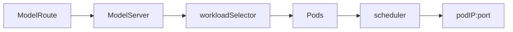
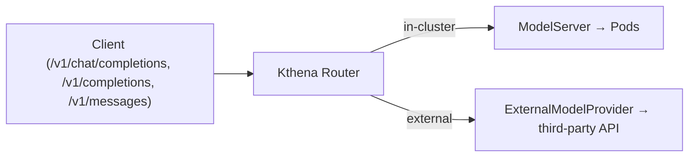
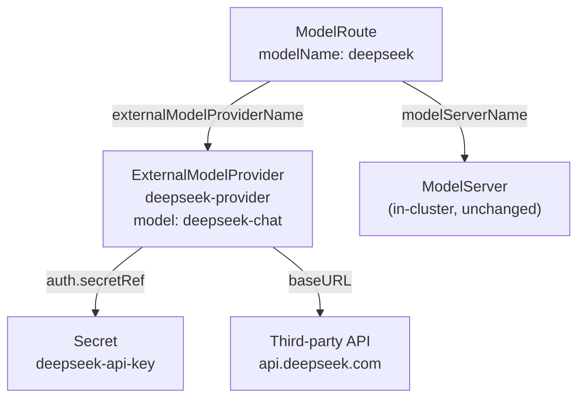
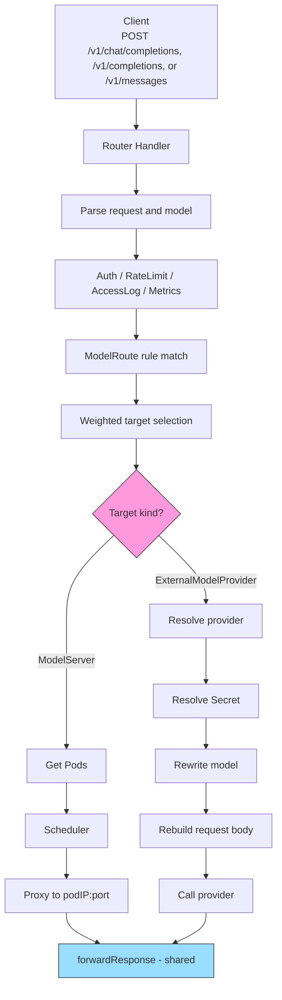

## Kthena Router Support for Third-Party Model APIs

### Summary

Kthena Router is documented as a unified LLM entry point for both privately deployed models and public AI service providers. The current implementation, however, only routes to in-cluster, Pod-backed `ModelServer`:



This proposal adds a second upstream destination type for third-party providers. The LFX delivery scope covers both OpenAI-compatible providers such as OpenAI, DeepSeek, or compatible gateways, and Anthropic-compatible providers that expose the Messages API. Clients continue to call the Router with a virtual model name; the Router decides whether the request goes to an in-cluster model or an external provider.



This proposal evaluates two API shapes. **Option A** extends `ModelServer` with external provider fields. **Option B** adds a dedicated `ExternalModelProvider` CRD. The selected design is Option B; Option A remains documented below to preserve the trade-off analysis and explain why it was not selected.

The MVP endpoint scope is intentionally small:

| Endpoint | MVP | Notes |
|---|---|---|
| `/v1/chat/completions` | Supported | Text-only requests where `messages[].content` is a string |
| `/v1/completions` | Supported | Text-only requests where `prompt` is a string |
| `/v1/messages` | Supported | Anthropic-compatible Messages API, including streaming and non-streaming text requests |

### Motivation

The existing Router pipeline is already mostly independent of where the final upstream lives:


Everything up to the upstream hop is protocol-agnostic. Only the **final hop** is tightly coupled to in-cluster Pods:

| Coupling point | What it does | Why it breaks for external APIs |
|:--|:--|:--|
| `getPodsAndServer()` | Requires target Pods for a `ModelServer` | External APIs have no Pods |
| `doRequest()` | Rewrites the request to `podIP:port` | No Pod IP to rewrite to |
| Scheduler | Scores Pods by runtime metrics, KV cache, LoRA, in-flight count | No `WorkloadSelector`, no vLLM/SGLang metrics |

External providers should therefore **skip Pod scheduling** and go directly through a provider client, while reusing the rest of the Router pipeline.

### Goals

- Route text-only `/v1/chat/completions` and `/v1/completions` requests to an external OpenAI-compatible API.
- Route text-only `/v1/messages` requests to an external Anthropic-compatible API.
- Reference credentials through Kubernetes `Secret`s, never inline plaintext.
- Reuse Router auth, rate limiting, access logging, metrics, model rewrite, and weighted traffic splitting.
- Support streaming SSE passthrough for OpenAI chat/completion requests and Anthropic messages requests.
- Preserve backward compatibility for existing `ModelRoute` and `ModelServer` manifests.
- Provide unit tests, user docs, and examples. Mock-server e2e is a stretch goal.

### Non-Goals

- Native Gemini, Bedrock, or Vertex request/response translation. (Note: Gemini and Cohere expose OpenAI-compatible endpoints — e.g. Gemini's `/v1beta/openai` prefix — so they work day-one via `baseURL` without a new adapter. Only their *native* formats are out of scope.)
- OpenAI-to-Anthropic or Anthropic-to-OpenAI request translation. The MVP supports each protocol at its own Router endpoint and provider adapter; it does not translate one client protocol into another upstream protocol.
- Multimodal content such as image, audio, or file content blocks. Text-only Anthropic content blocks are in scope.
- Pod scheduling, KV-cache-aware routing, prefix-aware routing, LoRA affinity, or PD disaggregation for external providers.
- LoRA routes targeting external providers. `ModelRoute.spec.loraAdapters[]` remains an in-cluster ModelServer feature in the MVP.
- Managing the external service lifecycle.
- Provider-side multi-endpoint load balancing beyond what weighted `targetModels[]` can already express.
- Automatic failure fallback from one selected target to another.
- Automatic retry of external-provider requests and configurable timeout/retry policies.

### API Options

#### Option A: Extend ModelServer

Option A adds external-provider fields directly to `ModelServerSpec`. A `ModelRoute` would continue to target a `ModelServer`, and the router would decide whether that `ModelServer` points to Pods or to an external endpoint.

This is the lower-churn shape because it preserves the existing `ModelRoute -> ModelServer` user model and reuses the current store path. The cost is that `ModelServer` would describe two different backend types. Pod-oriented fields such as `workloadSelector`, `inferenceEngine`, and `workloadPort` would need to become optional or conditional, and the controller/router would need extra branches for the no-Pod case.

#### Option B: Add ExternalModelProvider

Option B adds a namespaced `ExternalModelProvider` CRD and extends `ModelRoute.targetModels[]` with an `externalModelProviderName`. `ModelServer` remains the resource for Pod-backed serving, while external providers get their own fields for endpoint, credentials, model override, and protocol.

This proposal selects Option B because Kthena is CRD-native and `ModelServer` is already documented and implemented around Pods. Separating the resources keeps lifecycle, validation, status, and future provider-specific fields cleaner.

| Dimension | Option A: extend `ModelServer` | Option B: new `ExternalModelProvider` |
|---|---|---|
| Decision | Not selected; retained for comparison | Selected |
| Router path change | Smaller | Larger |
| User-facing concepts | Reuses `ModelServer` | Adds one CRD |
| API clarity | `ModelServer` mixes Pod and external fields | Single-purpose resources |
| Existing required fields | Must relax Pod-oriented required fields | No need to relax `ModelServer` |
| Controller changes | Add no-Pod branches to `ModelServerController` | Add a small provider controller |
| Datastore | External entries share ModelServer map | Separate provider registry |
| Long-term evolution | Provider fields accumulate in `ModelServerSpec` | Providers evolve independently |

### Recommended API: ExternalModelProvider

Add a namespaced `ExternalModelProvider` CRD under `networking.serving.volcano.sh/v1alpha1`.

Resource relationships (all within one namespace):



`ExternalModelProviderSpec` fields:

| Field | Type | Required | Default | Notes |
|---|---|---|---|---|
| `providerType` | enum | no | `OpenAI` | `OpenAI` or `Anthropic`; selects the protocol adapter. `OpenAI` means OpenAI-compatible, not only the OpenAI vendor |
| `model` | string | no | — | Actual upstream model name; when set, overrides the request model like `ModelServer.spec.model`; when unset, preserves the request model |
| `baseURL` | string | yes | — | `^https://.+`; external providers must use HTTPS |
| `insecureSkipVerify` | bool | no | `false` | For HTTPS only, skips server certificate-chain and hostname verification; use only when the endpoint cannot present a certificate trusted by the Router |
| `auth` | `ProviderAuth` | no | — | Credential Secret reference; the selected adapter injects it using the provider protocol's auth scheme; if unset, no auth header is injected |
| `headers` | map | no | — | Non-sensitive static upstream headers; credentials must use `auth.secretRef` |

`ProviderAuth` fields:

| Field | Type | Default | Notes |
|---|---|---|---|
| `secretRef` | `corev1.SecretKeySelector` | — | `{name, key}`, same namespace; `optional` must be unset or `false`; the selected value is sent with the adapter-specific authentication scheme |

```go
type ExternalProviderType string

const (
    OpenAI    ExternalProviderType = "OpenAI"
    Anthropic ExternalProviderType = "Anthropic"
)

// The BaseURL pattern requires HTTPS. These external providers run outside the
// cluster boundary, so plain HTTP is not supported.
type ExternalModelProviderSpec struct {
    // MVP supports OpenAI-compatible and Anthropic-compatible API adapters.
    // +optional
    // +kubebuilder:validation:Enum=OpenAI;Anthropic
    // +kubebuilder:default=OpenAI
    ProviderType ExternalProviderType `json:"providerType,omitempty"`

    // Model is the actual upstream model name. When set, it overwrites the
    // model in the request, matching ModelServer.Spec.Model behavior.
    // +optional
    // +kubebuilder:validation:MaxLength=256
    Model *string `json:"model,omitempty"`

    // BaseURL is the provider endpoint root. External providers must use HTTPS.
    // Example: https://api.deepseek.com
    // +kubebuilder:validation:Required
    // +kubebuilder:validation:MinLength=1
    // +kubebuilder:validation:Pattern=^https://.+
    BaseURL string `json:"baseURL"`

    // InsecureSkipVerify disables server certificate-chain and hostname
    // verification for HTTPS. It does not enable plain HTTP.
    // +optional
    // +kubebuilder:default=false
    InsecureSkipVerify bool `json:"insecureSkipVerify,omitempty"`

    // Auth references a credential Secret in the same namespace. The selected
    // provider adapter decides how the value is injected into the upstream request.
    // +optional
    Auth *ProviderAuth `json:"auth,omitempty"`

    // Non-sensitive static headers added to upstream requests. Credentials must use
    // Auth.SecretRef. Authorization, x-api-key, other credential-bearing headers,
    // hop-by-hop headers, and request-routing headers such as Host and Content-Length are forbidden.
    // +optional
    Headers map[string]string `json:"headers,omitempty"`
}

// +kubebuilder:validation:XValidation:rule="!has(self.secretRef.optional) || !self.secretRef.optional",message="secretRef.optional must be false or unset"
type ProviderAuth struct {
    // +kubebuilder:validation:Required
    SecretRef corev1.SecretKeySelector `json:"secretRef"`
}

type ExternalModelProviderStatus struct {
    // +optional
    ObservedGeneration int64 `json:"observedGeneration,omitempty"`

    // +optional
    Conditions []metav1.Condition `json:"conditions,omitempty"`
}
```

`corev1.SecretKeySelector` is used intentionally instead of a custom selector. It keeps the API aligned with Kubernetes conventions while still allowing users to customize both the Secret name and the Secret key.

Status should only report whether the provider config and referenced credentials can be used in the MVP. The controller can report conditions such as `Ready` and `CredentialsResolved`, but it should not actively call third-party APIs to check health in the first implementation. Secret add, update, and delete events must reconcile affected providers so these conditions do not become stale.

Extend `TargetModel` with an external destination:

```go
// +kubebuilder:validation:XValidation:rule="(has(self.modelServerName) && self.modelServerName != '') != (has(self.externalModelProviderName) && self.externalModelProviderName != '')",message="exactly one of modelServerName or externalModelProviderName must be set"
type TargetModel struct {
    // Existing in-cluster target. Mutually exclusive with ExternalModelProviderName.
    ModelServerName string `json:"modelServerName,omitempty"`

    // ExternalModelProviderName references an ExternalModelProvider in the same
    // namespace. It is mutually exclusive with ModelServerName.
    ExternalModelProviderName string `json:"externalModelProviderName,omitempty"`

    // Existing weighted splitting field.
    Weight *uint32 `json:"weight,omitempty"`
}
```

Validation:

- Exactly one of `modelServerName` and `externalModelProviderName` must be set.
- If `ModelRoute.spec.loraAdapters[]` is non-empty, every `targetModels[]` entry must use `modelServerName`; `externalModelProviderName` is rejected for that route. OpenAI-compatible passthrough has no standard way to express a Kthena LoRA adapter to an arbitrary provider.
- `baseURL` must be HTTPS. Plain HTTP is not supported for external providers.
- `insecureSkipVerify` is valid only with an HTTPS `baseURL`. It leaves the connection encrypted but disables certificate-chain and hostname verification.
- `baseURL` must be parsed and must not contain URL userinfo, query, or
  fragment. This should be enforced by webhook validation because CEL is not a
  good fit for full URL parsing.
- Static `headers` are for non-sensitive values only. Always reject credential-bearing headers such as `Authorization`, `Proxy-Authorization`, `Cookie`, and `x-api-key`, plus `Host`, `Content-Length`, and hop-by-hop headers. Header names must be validated case-insensitively, for example by canonicalizing with `http.CanonicalHeaderKey` or comparing with `strings.EqualFold` in webhook validation.
- `auth` may be omitted for providers that require no credential. When `auth` is present, its Secret and key are mandatory; reject `secretRef.optional=true` rather than silently sending an unauthenticated request.
- When `auth` is present, inject the selected Secret value according to the selected adapter: `Authorization: Bearer <secret value>` for OpenAI-compatible providers and `x-api-key: <secret value>` for Anthropic-compatible providers.
- `secretRef.name` and `secretRef.key` are structurally validated at admission time. Secret existence and key availability are resolved asynchronously by the controller/router lister and reported through provider status.
- The request protocol must match the selected external provider adapter. OpenAI-compatible endpoints route only to `providerType: OpenAI`; Anthropic-compatible `/v1/messages` routes only to `providerType: Anthropic`. The MVP does not translate between the two protocols.

Example:

```yaml
apiVersion: v1
kind: Secret
metadata:
  name: deepseek-api-key
  namespace: default
type: Opaque
stringData:
  apiKey: "<redacted>"
---
apiVersion: networking.serving.volcano.sh/v1alpha1
kind: ExternalModelProvider
metadata:
  name: deepseek-provider
  namespace: default
spec:
  providerType: OpenAI
  model: deepseek-chat
  baseURL: https://api.deepseek.com
  auth:
    secretRef:
      name: deepseek-api-key
      key: apiKey
---
apiVersion: networking.serving.volcano.sh/v1alpha1
kind: ModelRoute
metadata:
  name: deepseek-route
  namespace: default
spec:
  modelName: deepseek
  rules:
  - name: default
    targetModels:
    - externalModelProviderName: deepseek-provider
```

Anthropic-compatible provider example:

```yaml
apiVersion: v1
kind: Secret
metadata:
  name: anthropic-api-key
  namespace: default
type: Opaque
stringData:
  apiKey: "<redacted>"
---
apiVersion: networking.serving.volcano.sh/v1alpha1
kind: ExternalModelProvider
metadata:
  name: anthropic-provider
  namespace: default
spec:
  providerType: Anthropic
  model: "<anthropic-model>"
  baseURL: https://api.anthropic.com
  auth:
    secretRef:
      name: anthropic-api-key
      key: apiKey
  headers:
    anthropic-version: "2023-06-01"
---
apiVersion: networking.serving.volcano.sh/v1alpha1
kind: ModelRoute
metadata:
  name: anthropic-route
  namespace: default
spec:
  modelName: claude
  rules:
  - name: default
    targetModels:
    - externalModelProviderName: anthropic-provider
```

Hybrid split also works:

```yaml
rules:
- name: default
  targetModels:
  - modelServerName: qwen-local
    weight: 80
  - externalModelProviderName: openai-provider
    weight: 20
```

In this example, `openai-provider` sets `spec.model: gpt-4o-mini` when the external target should override the request model. If `spec.model` is unset, the request model is forwarded unchanged.

If a base model should use an external provider while LoRA adapters remain in-cluster, split them into separate `ModelRoute` resources instead of mixing `modelName` and `loraAdapters[]` in one route:

```yaml
apiVersion: networking.serving.volcano.sh/v1alpha1
kind: ModelRoute
metadata:
  name: qwen-external
  namespace: default
spec:
  modelName: qwen
  rules:
  - name: external
    targetModels:
    - externalModelProviderName: qwen-provider
---
apiVersion: networking.serving.volcano.sh/v1alpha1
kind: ModelRoute
metadata:
  name: qwen-lora
  namespace: default
spec:
  loraAdapters:
  - qwen-lora-a
  - qwen-lora-b
  rules:
  - name: lora
    targetModels:
    - modelServerName: qwen-lora-server
```

This is traffic splitting, not failure fallback. The MVP selects one target by weight at the beginning of the request; it does not automatically try the external provider after an in-cluster target fails, or vice versa.

### Request Flow



Mapped onto the documented Router pipeline stages, the external path is **additive, not a rewrite**:

| Stage | In-cluster path | External path |
|---|---|---|
| Auth | ✅ reuse | ✅ reuse |
| RateLimit | ✅ reuse | ✅ reuse |
| Fairness | ✅ reuse | ✅ reuse |
| Target selection | weighted `targetModels[]` pick | ✅ reuse |
| Pod scheduling | Pod filter/score | ⏭️ **skipped** (no Pods) |
| Upstream execution | `doRequest(podIP)` | 🔁 **replaced** by provider call |
| Response forwarding | Shared body/SSE mechanics after Pod-specific status handling | Shared body/SSE mechanics; provider HTTP errors pass through |

The external path skips Pod scheduling, reuses the front half of the pipeline, and shares response-copying, SSE, and usage-parsing mechanics. Status acceptance, retry, and fallback behavior remain path-specific.

### Implementation Details

#### Route Target

`selectDestination()` already returns the selected `TargetModel`, but `MatchModelServer()` currently collapses it into `ModelServerName`. For Option B, return a more general target:

```go
type RouteTarget struct {
    Kind DestinationKind
    Name types.NamespacedName

    IsLora     bool
    ModelRoute *aiv1alpha1.ModelRoute
}
```

Only the target representation changes; rule matching and weighted selection stay the same. `Kind` identifies whether `Name` refers to a `ModelServer` or an `ExternalModelProvider`; this avoids pointer combinations such as `Kind=ExternalProvider` with a populated `ModelServer` branch. `IsLora` is only valid for `Kind=ModelServer` in the MVP. After entering the external branch, the Router resolves the `ExternalModelProvider` and computes the upstream model from `provider.spec.model`, preserving the request model when that field is unset. This mirrors the existing ModelServer path, which resolves `ModelServer.spec.model` after route selection.

The signature change is mechanical but touches the `Store` interface, `MockStore`, and a handful of existing tests, plus the single live caller in `doLoadbalance` (a router-level wrapper with no callers can be deleted).

#### Provider Adapter Layer

Add a small provider adapter layer under `pkg/kthena-router/provider/`.

| File | Responsibility |
|---|---|
| `provider.go` | `ProviderAdapter` interface + `Input` type |
| `registry.go` | `providerType` → constructor lookup |
| `openai.go` | `OpenAIProvider` implementing the OpenAI-compatible API adapter |
| `anthropic.go` | `AnthropicProvider` implementing the Anthropic-compatible Messages API adapter |
| `secret.go` | Secret resolver (lister-backed) |
| `transport.go` | Shared HTTP executor (`*http.Client`, timeouts, TLS, redirect policy, pooling) |

Minimal interface:

```go
type ProviderAdapter interface {
    BuildRequest(ctx context.Context, in *Input) (*http.Request, error)
}

type Transport interface {
    Do(req *http.Request, opts TransportOptions) (*http.Response, error)
}

type TransportOptions struct {
    InsecureSkipVerify bool
}

type Input struct {
    ProviderType   ExternalProviderType
    BaseURL        string
    StaticHeaders  map[string]string
    APIKey         []byte
    RawBody        []byte
    Fields         map[string]any
    OriginalPath   string
    RequestHeaders http.Header
    UpstreamModel  string
}
```

The adapter decides what the upstream request should look like: URL, model rewrite, headers, and future provider-specific conversion. The shared transport sends the HTTP request and handles connection pooling, TLS, redirect policy, and connection-level timeouts. Redirects are disabled by default. `TransportOptions` is populated from the resolved `ExternalModelProvider`; adapters must not choose TLS verification policy themselves. The MVP does not automatically retry external-provider requests. If an implementation keeps a provider-level `Do()` helper, it should only call the shared transport instead of adding separate network rules inside each provider.

The transport should keep separate long-lived secure and skip-verification clients, both created by cloning a private base `http.Transport`. The secure client uses normal certificate and hostname verification. The opt-in client uses a cloned `tls.Config` with `InsecureSkipVerify=true`. Never mutate `http.DefaultTransport`, a shared `tls.Config`, or the secure client when processing a provider with `insecureSkipVerify=true`; otherwise one provider could silently disable verification for every provider sharing the connection pool.

The MVP providers cover OpenAI-compatible passthrough and Anthropic-compatible Messages API passthrough. They share the same transport and Secret resolver but differ in URL mapping, authentication headers, streaming event semantics, and usage parsing.

OpenAI-compatible adapter behavior:

- Treat `baseURL` as the provider's OpenAI-compatible API root. Strip the public Router `/v1` prefix from the original path before joining. For example, `/v1/chat/completions` joined with `https://api.example.com/v1` becomes `https://api.example.com/v1/chat/completions`, and the same request joined with `https://generativelanguage.googleapis.com/v1beta/openai` becomes `https://generativelanguage.googleapis.com/v1beta/openai/chat/completions`.
- If `auth` is configured, inject the selected Secret value as `Authorization: Bearer <secret value>`.
- If `ExternalModelProvider.spec.model` is set, rewrite the request `model` to that value; otherwise preserve the request model. This matches the existing `ModelServer.spec.model` override behavior.

Anthropic-compatible adapter behavior:

- Accept Router requests on `/v1/messages` and forward them to the provider's Anthropic-compatible Messages API path under `baseURL`.
- If `auth` is configured, inject the selected Secret value as `x-api-key: <secret value>`.
- Forward or set required non-sensitive Anthropic protocol headers such as `anthropic-version` through the static header and downstream-header allowlist path. Credential-bearing headers still must come from `auth.secretRef`.
- If `ExternalModelProvider.spec.model` is set, rewrite the Anthropic request `model` to that value; otherwise preserve the request model.
- Parse Anthropic usage fields from non-streaming responses and streaming events. It must not use OpenAI-specific `stream_options.include_usage`.

Common adapter behavior:

- Do not copy downstream headers wholesale. Forward only `Content-Type`, `Accept`, protocol-required non-sensitive headers such as `anthropic-version`, and explicitly allowed tracing/request-correlation headers. Strip `Authorization`, `Proxy-Authorization`, `Cookie`, `x-api-key`, `Host`, `Content-Length`, and hop-by-hop headers; apply static headers and then inject the adapter-specific credential header last so client input cannot override it.
- Use request context for cancellation.
- Execute the request through the shared transport.

The MVP should not translate between OpenAI and Anthropic request formats. An OpenAI-compatible client request is handled by the OpenAI adapter, and an Anthropic-compatible `/v1/messages` request is handled by the Anthropic adapter.

#### Provider Protocol Support

The API should keep provider-specific behavior inside adapters. Native providers usually differ in request body, URL format, authentication, streaming format, and usage fields, so they should be handled in provider adapters instead of adding provider-specific checks throughout the router.

| `providerType` | Scope |
|---|---|
| `OpenAI` | MVP OpenAI-compatible chat/completions and completions passthrough |
| `Anthropic` | MVP Anthropic-compatible Messages API (`/v1/messages`) passthrough |
| `AzureOpenAI` | Future adapter; OpenAI-like request body, but deployment-based paths, API versions, and auth differ |
| `AWSBedrock` | Future adapter; service-specific signing/auth, model identifiers, and response envelopes differ |
| `Custom` | Future adapter; user-controlled OpenAI-compatible or organization-specific gateway behavior |

Here, `OpenAI` identifies the OpenAI-compatible API adapter, so compatible services such as DeepSeek do not need separate provider types. `Anthropic` identifies the Anthropic-compatible Messages API adapter, so providers exposing that API can be added without changing `ModelRoute` or `ExternalModelProvider` references.

#### Streaming Support

Streaming should behave consistently for in-cluster and external targets. For OpenAI-compatible providers, if the downstream request contains `stream: true`, the provider path should forward the upstream SSE response line by line without buffering the full response. For Anthropic-compatible providers, `/v1/messages` streaming should forward Anthropic SSE events while parsing usage from Anthropic event payloads when available.

The external path should:

- Preserve `text/event-stream` behavior and flush chunks as they arrive.
- Parse usage chunks when the provider returns them.
- For OpenAI-compatible requests, follow the existing ModelServer path and inject usage options by default when needed for token accounting.
- If Router injects OpenAI-compatible `stream_options.include_usage=true`, parse the usage chunk and suppress the injected usage-only chunk before forwarding. If the downstream request already asked for usage, forward the usage chunk.
- For Anthropic-compatible requests, do not inject OpenAI-specific usage options; parse Anthropic-native usage fields and streaming events instead.
- Record output tokens for rate limiting, access logs, and metrics when usage is available.
- Continue forwarding the stream even if usage is absent.
- For OpenAI-compatible chat/completions streams, forward `data: [DONE]` when the upstream sends it, and finish when the upstream response body reaches EOF.
- For Anthropic-compatible messages streams, finish when the provider sends the terminal Anthropic message event and closes the response body.
- Cancel the upstream request and exit the forwarding loop when the downstream client disconnects.
- Never automatically retry the provider request, including after a stream has started.

Streaming requests should follow the existing ModelServer path and must not use `http.Client.Timeout` as a total request timeout, because a valid model stream can last longer than a normal non-streaming request. Normal stream completion is upstream-driven: OpenAI-compatible chat/completions streams normally send `data: [DONE]` and then close the response body, while Anthropic-compatible streams send their own terminal event and close the response body. In both cases, the forwarding loop exits on EOF. The request context still handles downstream client disconnects and router shutdown. The external transport can add connection-stage bounds such as dial, TLS handshake, and response-header timeouts; `IdleConnTimeout` only controls pooled idle connections and is not an active stream-idle timeout. More specific first-token or active stream-idle timeout fields can be added later as explicit API decisions.

The streaming copy and usage-parsing mechanics should be shared instead of implemented separately for providers. Status acceptance, retry, and fallback decisions remain path-specific and happen before response forwarding starts.

#### Body and Usage Handling

`ParseModelRequest()` consumes `c.Request.Body` today for the OpenAI-compatible path. The external path should read the body once, keep the raw bytes, and decode protocol-specific fields with `json.Decoder.UseNumber()`:

```go
type ParsedRequest struct {
    RawBody []byte
    Fields  map[string]any
}
```

The provider adapter should rebuild the JSON body only when it needs to rewrite `model` or apply protocol-specific usage accounting options. This preserves unknown provider-specific fields and avoids changing large JSON numbers into `float64` during passthrough.

Streaming usage handling should be shared with the existing Pod path. Today this logic lives in unexported connector code (`addTokenUsage`), so implementation should move it into a shared helper, for example:

```go
applyUsageOpts(c, modelRequest, backendType)
```

For OpenAI-compatible requests, follow the existing ModelServer behavior. If the downstream streaming request already asks for `stream_options.include_usage=true`, forward the provider's usage chunk to the client and also use it for internal accounting. If the downstream streaming request does not ask for usage, Router may inject `stream_options.include_usage=true` upstream for token accounting, parse the usage chunk, and suppress the injected usage-only chunk before forwarding so the downstream response shape stays unchanged. For non-streaming OpenAI-compatible requests, keep the current internal-path behavior and add `include_usage=true` when building the upstream request.

For Anthropic-compatible requests, do not inject OpenAI-specific usage fields. The Anthropic adapter should parse usage from the Anthropic response body and streaming events.

#### Response Forwarding

Extract the response-forwarding block from `proxyRequest()` into a reusable function:

```go
func forwardResponse(
    c *gin.Context,
    resp *http.Response,
    stream bool,
    onUsage func(TokenUsage),
) error

type TokenUsage struct {
    PromptTokens     int `json:"prompt_tokens,omitempty"`
    CompletionTokens int `json:"completion_tokens,omitempty"`
    TotalTokens      int `json:"total_tokens,omitempty"`
}
```

`TokenUsage` should live in a small shared router package rather than exposing a handler-specific response type through the forwarding API.

The code that receives `resp` from the transport should close `resp.Body`. `forwardResponse()` should only copy headers/status/body, stream data, and parse usage. It must not decide whether a status is acceptable or whether another upstream should be attempted. The Pod path and external path should follow the same rule for who closes the response body.

After path-specific status handling accepts a response, both Pod and external paths should reuse the same forwarding mechanics:

- Copy end-to-end upstream headers. Strip hop-by-hop headers, and omit the upstream `Content-Length` when streaming or when the forwarded body is modified.
- Copy the accepted upstream status and body.
- Stream SSE line by line.
- Parse usage chunks when available.
- Record output tokens for rate limit and metrics.

This does not make the two paths' error semantics identical. The existing Pod path keeps its current error and retry semantics: it treats a non-2xx response as a failed Pod attempt, tries another candidate Pod when available, and returns a Router-generated error after all candidates fail. Shared forwarding may still intentionally standardize response-header filtering, such as stripping hop-by-hop headers and stale `Content-Length`.

The external provider path has no implicit fallback to another weighted target after target selection, so an upstream HTTP error response is passed through to the client.

For external providers, every non-2xx response is passed through unchanged; only transport failures without an upstream response are created by the Router. The handler must set the fixed completion category before `RequestMetricsRecorder.Finish()` runs so a forwarded provider response is never incorrectly recorded as `successful_request`:

| Upstream outcome | What the client receives | `error_type` | `error_origin` |
|---|---|---|---|
| `3xx` (automatic redirects are disabled) | Pass through status, headers, and body unchanged | `upstream_response` | `upstream` |
| `4xx` with body (including `401` and `429`) | Pass through status + body unchanged | `upstream_response` | `upstream` |
| `5xx` with body (including `500`, `502`, and `503`) | Pass through status + body unchanged | `upstream_response` | `upstream` |
| Connection refused / TLS failure | Router-created `502 Bad Gateway` | `upstream_transport` | `router` |
| Timeout, no response bytes | Router-created `504 Gateway Timeout` | `upstream_transport` | `router` |

Access logs should record the provider status code and a bounded message such as `provider returned HTTP 429`; they must not copy an arbitrary provider error body into logs. Successful provider responses keep `error_type="successful_request"` and omit `error_origin`.

#### Secret Resolution

Add a Kubernetes Secret informer/lister to the router process. Secret rotation takes effect on the next request because credentials are resolved from the lister cache at request time.

The provider controller should maintain an index from `<namespace>/<secret-name>` to the ExternalModelProviders that reference that Secret. ExternalModelProvider events reconcile the provider itself; Secret add, update, and delete events use the index to enqueue every affected provider. Reconciliation reads the Secret from the lister, checks the selected key, and updates `ObservedGeneration`, `CredentialsResolved`, and `Ready`. Status updates need RBAC for the `externalmodelproviders/status` subresource.

Missing Secret or missing key should set provider status to `Ready=False` with a configuration reason such as `CredentialNotFound`. Requests targeting an unresolved provider should return `503 Service Unavailable`. Error messages must name the provider but never print the key value.

#### Observability

`InferencePool` is an existing Gateway API Inference Extension destination reached through `HTTPRoute`; this proposal does not introduce or change that routing path. It is included below only because changing the shared Router metric schemas must keep every existing destination observable.

Do not create external-only metric names. Extend the existing request and upstream metrics with one shared set of bounded destination labels so the same PromQL can compare ModelServer, ExternalModelProvider, and existing InferencePool traffic.

Destination labels:

| Label | Values | Source |
|---|---|---|
| `model_route` | namespaced ModelRoute name, or `none` | The matched ModelRoute; `none` when no ModelRoute was selected |
| `backend_type` | `model_server`, `external_provider`, `inference_pool`, or `unresolved` | The selected destination kind; `unresolved` when the request ends before destination selection |
| `backend_name` | namespaced backend resource name, or `none` | The selected ModelServer, ExternalModelProvider, or InferencePool |
| `upstream_model` | configured upstream model, or `none` | For an external request, `ExternalModelProvider.spec.model` or the matched `ModelRoute.spec.modelName` when `spec.model` is unset; for a LoRA ModelServer request, the matched `ModelRoute.spec.loraAdapters[]` name; otherwise `ModelServer.spec.model` or the matched `ModelRoute.spec.modelName` when `spec.model` is unset |

These labels are added only to metrics that describe a completed routed request or a real upstream attempt:

| Metric | Existing labels | Labels to add |
|---|---|---|
| `kthena_router_requests_total` | `model`, `path`, `status_code`, `error_type` | `model_route`, `backend_type`, `backend_name`, `upstream_model` |
| `kthena_router_request_duration_seconds` | `model`, `path`, `status_code` | `model_route`, `backend_type`, `backend_name`, `upstream_model` |
| `kthena_router_tokens_total` | `model`, `path`, `token_type` | `model_route`, `backend_type`, `backend_name`, `upstream_model` |
| `kthena_router_active_upstream_requests` | `model_server`, `model_route` | `backend_type`, `backend_name`, `upstream_model` |

Keep the existing `model_server` label on `kthena_router_active_upstream_requests` for query compatibility. Set it to `none` for ExternalModelProvider and InferencePool attempts; `backend_name` is the destination-neutral replacement for new queries.

The following metrics keep their current label sets because they observe work before destination selection or a ModelServer-only internal phase: `kthena_router_active_requests`, `kthena_router_active_downstream_requests`, `kthena_router_rate_limit_exceeded_total`, the prefill/decode duration metrics, scheduler plugin metrics, fairness queue metrics, and tokenizer metrics.

The router should use one request-scoped observation recorder rather than passing independent label strings to each metric call. The recorder starts with the client model and path, buffers input-token observations, and exposes a one-time `BindDestination()` operation after route target selection. Binding stores all four destination labels from the resolved Kubernetes configuration. Input tokens are emitted when the destination is bound; if the request ends before binding, `Finish()` emits them with the unresolved values. Output tokens, the final request counter, and request duration use the same bound label set. This avoids recording input and output tokens for the same request under different destinations.

`BindDestination()` only records metric dimensions; it does not affect routing. The ModelRoute path calls it after selecting a ModelServer or ExternalModelProvider target. The existing HTTPRoute path must also call it after resolving an InferencePool, using `model_route="none"`, `backend_type="inference_pool"`, the namespaced InferencePool name as `backend_name`, and `upstream_model="none"`.

For a LoRA request, binding uses the adapter name that was successfully matched from `ModelRoute.spec.loraAdapters[]` as `upstream_model`. This is metric attribution only; it does not change existing LoRA matching, scheduling, or model rewrite behavior.

`kthena_router_active_upstream_requests` remains attempt-scoped rather than request-scoped. Increment it immediately before each actual Pod or provider call and decrement it on every completion path. A request that tries three Pods contributes three sequential upstream attempts but only one completed request to `kthena_router_requests_total`.

All label values must be controlled:

- Use `none`, never an absent or empty label value, when a dimension does not apply.
- Use `unresolved` only for `backend_type` when routing never selected a destination.
- Read `model_route`, `backend_name`, and `upstream_model` from resolved Kubernetes objects, not arbitrary request headers or error messages.
- Never use Pod IPs, request IDs, Secret names or values, raw URLs, or raw errors as metric labels.
- Continue using HTTP codes and fixed error categories for `status_code` and `error_type`: `successful_request` for provider 2xx responses, `upstream_response` for provider 3xx/4xx/5xx responses, and `upstream_transport` for connection, TLS, and timeout failures.

Changing a Prometheus label set is a schema migration even when metric names remain unchanged. Update every metric call, dashboard, alert, recording rule, observability document, and e2e assertion in the same change. E2E helpers must aggregate every matching series instead of returning the first partial-label match, because one client model can now produce separate ModelServer and ExternalModelProvider series. A dedicated time-to-first-token metric would require a new metric name, so it remains outside the MVP.

Access logs carry per-request diagnostic detail that is unsuitable for Prometheus labels. Add `backend_type`, `backend_name`, `upstream_model`, `upstream_status_code`, `upstream_attempts`, and a bounded `error_origin` (`router` or `upstream`) while retaining the existing `model_server`, `selected_pod`, and gateway fields.

#### Future Work: Cost-Aware Routing

The MVP keeps the existing weighted `targetModels[]` selection model. This already lets users manually shift traffic toward lower-cost providers by assigning higher weights to cheaper targets.

A future API could add cost-aware routing policies, for example selecting the lowest-cost compatible target under latency, availability, or budget constraints. This should be added as a route-level policy rather than hard-coded into `ExternalModelProvider`, because cost-based routing needs more inputs than the provider endpoint itself: pricing metadata, model capability equivalence, token accounting, latency SLOs, and fallback behavior.

Possible future extension:

```yaml
selectionPolicy:
  type: CostOptimized
  constraints:
    maxLatency: 2s
    maxCostPer1KTokens: "0.01"
```

This proposal intentionally does not implement cost-aware routing in the first version. It only keeps `ModelRoute` target selection extensible so a future policy can be added without changing the external-provider resource model.

### Security and Validation

- Treat ExternalModelProvider as trusted network configuration. Users allowed to create or update it can make the Router connect to arbitrary destinations reachable from the Router Pod, including cluster-internal addresses; same-namespace references and URL syntax validation do not prevent this SSRF capability.
- Restrict ExternalModelProvider create/update permissions to trusted administrators or tenants that are explicitly allowed to select Router egress destinations. In multi-tenant installations, enforce the allowed destinations with Router egress NetworkPolicy, a proxy, or an environment-specific admission policy.
- Never log Secret contents or upstream auth headers.
- Require HTTPS by default.
- `insecureSkipVerify` applies only to HTTPS and disables both certificate-chain and hostname verification. Restrict its use to trusted provider configuration where the endpoint cannot present a certificate trusted by the Router; prefer adding the organization CA to the Router trust store because skip-verification permits man-in-the-middle attacks.
- Reject `baseURL` values with URL userinfo, query, or fragments.
- Disable automatic redirects by default so an allowed provider endpoint cannot redirect the router to a different host.
- Reject credential-bearing static headers, `Host`, `Content-Length`, and hop-by-hop headers; static header values must be non-sensitive.
- Forward downstream headers through an explicit allowlist, strip client credentials and cookies, and inject provider credentials last.
- Strip hop-by-hop response headers, and do not forward a stale `Content-Length` after streaming or body modification.
- Keep provider, Secret, and ModelRoute references in the same namespace.

### Test Plan

Unit tests should not call real third-party APIs. Use `httptest.Server` and fake Kubernetes clients/listers.

| Area | Coverage |
|---|---|
| API validation | `modelServerName` XOR `externalModelProviderName`; reject `externalModelProviderName` on routes with `loraAdapters[]`; optional provider `model` length; require HTTPS `baseURL`; URL userinfo/query/fragment rejection; credential/reserved static-header rejection; anonymous provider without `auth`; reject `secretRef.optional=true` when `auth` is present |
| Request scope | OpenAI text-only chat messages and string prompts; Anthropic text-only messages requests; reject multimodal content |
| Secret resolution | missing Secret, missing key, valid key, rotation behavior, Secret add/update/delete event mapping, `ObservedGeneration`, `CredentialsResolved`, and `Ready` transitions |
| Route resolution | external target, internal target, weighted internal/external split, LoRA route remains ModelServer-only, request protocol matches selected provider type |
| Request building | OpenAI and Anthropic path joining, raw body preservation, `UseNumber`, configured model override and unset-model passthrough, adapter-specific auth headers, reserved credential static-header rejection, downstream header allowlist, credential precedence |
| TLS | trusted certificate succeeds by default; self-signed certificate fails by default; the same self-signed endpoint succeeds only with `insecureSkipVerify=true`; plain HTTP `baseURL` is rejected; secure and skip-verification connection pools remain isolated |
| Streaming | SSE passthrough, line-by-line flush, usage callback, OpenAI-compatible default usage-option injection aligned with the existing ModelServer path, downstream-requested usage chunks forwarded, Router-injected usage-only chunks suppressed, Anthropic-native streaming events and usage parsing, `[DONE]` or Anthropic terminal event handling, EOF completion, downstream cancellation, response header filtering, no mid-stream retry |
| Non-streaming | body passthrough, usage parsing when present, response header filtering |
| Errors | pass through every upstream non-2xx response with `upstream_response`/`upstream` attribution; create 502/504 with `upstream_transport`/`router` attribution; bounded access-log messages; no automatic provider retry |
| Compatibility | existing ModelServer-only routes unchanged |
| Observability | exact label schemas; ModelServer, matched LoRA adapter, provider, explicitly bound InferencePool, and unresolved values; buffered input tokens; consistent input/output attribution; balanced upstream gauges across retries and cancellation; no external-only metrics; controlled label values; e2e aggregation across matching series |

E2E can use in-cluster HTTPS mock OpenAI-compatible and Anthropic-compatible servers with self-signed certificates and `insecureSkipVerify=true` where needed. This avoids depending on real external providers or free API availability while still exercising the HTTPS-only provider path.
