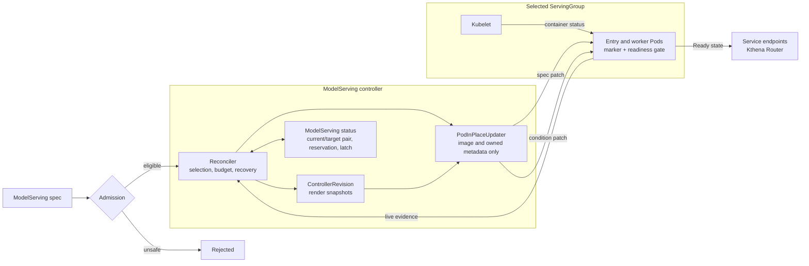
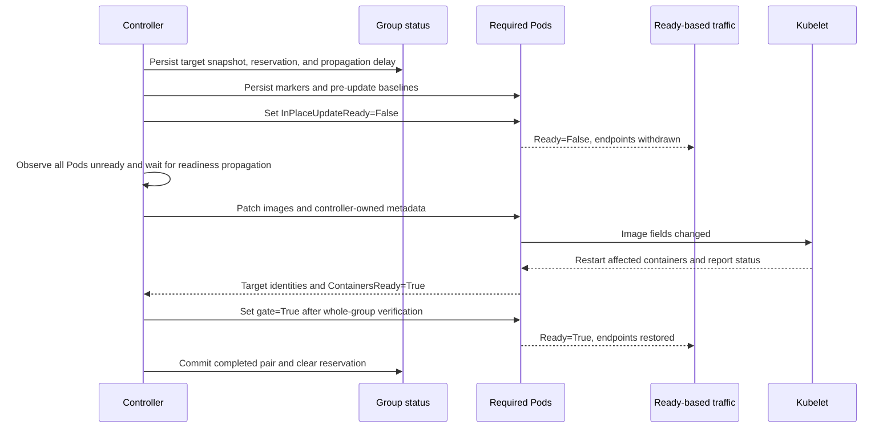
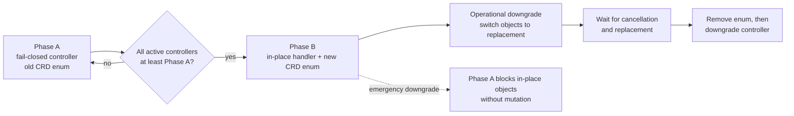
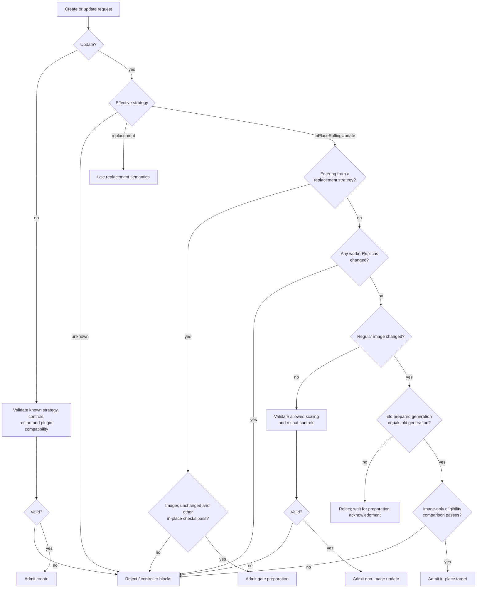
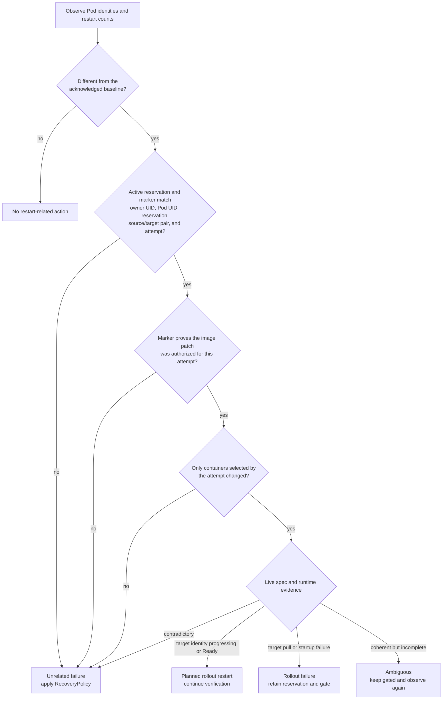
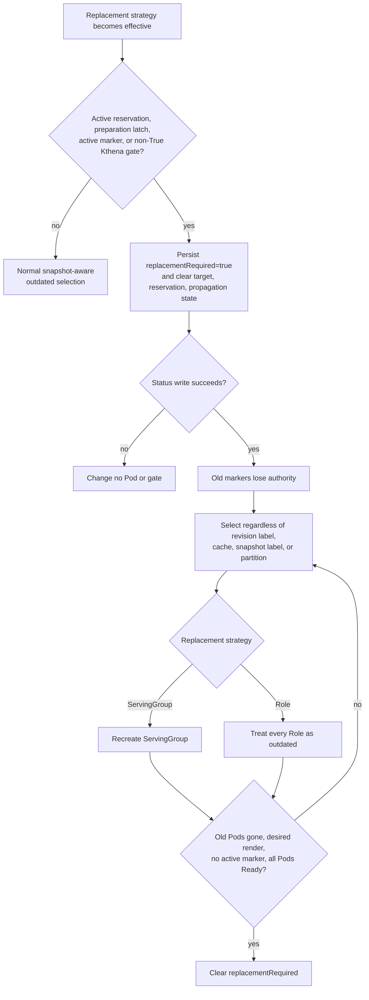

## ModelServing In-Place Rolling Update

### Summary

This proposal adds an explicit `InPlaceRollingUpdate` strategy for `ModelServing`. For an image-only update, Kthena patches `spec.containers[*].image` on existing entry and worker Pods. Kubelet restarts only the affected containers, while a successful rollout preserves Pod names, UIDs, IPs, node assignments, Pod-scoped volumes, Services, and PodGroups.

The strategy is opt-in and fail-closed. Admission and the controller require an eligible image-only diff, a compatible restart policy, and a complete applied render snapshot. Before any image patch, a Kthena readiness gate removes the whole selected ServingGroup from Ready-based traffic. The group returns only after all target containers are verified and all required Pods are Ready.

Per-group status, immutable render snapshots, Pod markers, readiness conditions, and live container status make the rollout resumable after a controller restart. A bad image stalls in place; replacement occurs only after an explicit strategy change or normal recovery action. The existing replacement strategies remain the default behavior.

### Motivation

`ServingGroupRollingUpdate` and `RoleRollingUpdate` currently replace outdated resources. Replacement is necessary for immutable Pod changes, but it is unnecessarily expensive when only a container image changes. Recreating a ServingGroup or Role can lose:

- Pod identity, IP, and node placement;
- accelerator and topology assignments;
- Pod-scoped data such as downloaded models or caches in `emptyDir`;
- existing Services and PodGroups; and
- scheduling and gang-admission work already completed for the workload.

Large inference workloads are particularly sensitive to rescheduling, image distribution, model initialization, and cache warm-up. An in-place update still restarts the affected process and does not preserve process memory, but it avoids repeating unrelated scheduling and data-preparation work.

Directly patching images is not enough. The current controller may interpret the expected container restart as a failure and apply the configured recovery policy. Rollout status also assumes a homogeneous revision within a ServingGroup. The new strategy therefore needs coordinated validation, availability accounting, durable state, restart classification, and completion reporting.

#### Goals

- Add an opt-in, image-only update path that preserves Pod and ServingGroup identity.
- Reuse ServingGroup-level `partition` and `maxUnavailable`.
- Fail closed on unsafe diffs, incompatible restart semantics, missing history, or unexplained live drift.
- Preserve effective pull and restart behavior across patching, scaling, and recovery.
- Persist enough per-group and per-Pod evidence to resume safely after restart.
- Remove the whole selected group from Ready traffic before patching images.
- Prepare existing gate-less workloads through an observable one-time replacement rollout.
- Distinguish planned image restarts from failures and preserve behavior outside this strategy.

#### Non-Goals

- Refreshing an unchanged mutable image tag.
- Supporting `maxSurge` or Role-scoped in-place rollout in the initial version.
- Updating init-container images or non-image Pod fields.
- Supporting Pods or regular containers whose effective restart behavior is not `Always`.
- Automatically rolling back or falling back to Pod, Role, or ServingGroup replacement after an image update begins.
- Installing OpenKruise controllers, CRDs, webhooks, or node components.
- Providing a generic `InPlaceIfPossible` strategy.
- Guaranteeing request draining or preservation of process-local state.

### Proposal

Users select the strategy through `spec.rolloutStrategy.type`. The existing `RollingUpdateConfiguration` is reused; `partition` and `maxUnavailable` continue to be measured in ServingGroups.

```yaml
apiVersion: workload.serving.volcano.sh/v1alpha1
kind: ModelServing
metadata:
  name: llama
spec:
  replicas: 4
  rolloutStrategy:
    type: InPlaceRollingUpdate
    rollingUpdateConfiguration:
      maxUnavailable: 1
      partition: 0
      readinessPropagationDelaySeconds: 5
  template:
    roles:
      - name: server
        replicas: 1
        workerReplicas: 0
        entryTemplate:
          spec:
            containers:
              - name: inference
                image: example.com/inference:v2
                imagePullPolicy: IfNotPresent
```

#### Architecture at a glance



The ModelServing controller owns selection, persistence, recovery coordination, and any explicit replacement. `PodInPlaceUpdater` only patches eligible images and controller-owned Pod metadata or status; it never deletes a Pod or chooses a fallback.

#### Happy-path rollout



The order above is normative: the reservation precedes Pod mutation, every required Pod is withdrawn and the propagation delay elapses before the first image patch, and no gate returns to `True` before whole-group verification. The availability slot remains held until the group is Ready.

At a glance, an eligible update has these properties; the exact comparison rules are defined under [Admission and Eligibility](#admission-and-eligibility).

| Dimension     | Requirement                                                                                  |
| ------------- | -------------------------------------------------------------------------------------------- |
| Mutation      | Only effective regular-container image values change                                         |
| Layout        | Role, entry/worker, and container names, counts, and order are unchanged                     |
| Restart       | Effective Pod `restartPolicy` is `Always`; no regular-container override or restart rules    |
| Pull policy   | Each target effective `imagePullPolicy` equals its applied value                             |
| Render inputs | Init containers, plugins, `spec.schedulerName`, and all other non-image inputs are unchanged |
| Readiness     | Every required Pod already has the Kthena readiness gate                                     |

Scaling and rollout-control changes keep their existing semantics. A `workerReplicas` change affects Pod topology and generated environment, so it is rejected under `InPlaceRollingUpdate` and requires a replacement strategy.

Gate-less workloads require preparation: switching from a replacement strategy is allowed only without an image change, then each existing group is recreated under `maxUnavailable` with its applied image and the readiness gate. Preparation ignores `partition` and must finish before image rollout. The controller acknowledges it with `status.readinessGatePreparedGeneration`; admission does not rely on the asynchronous condition reason.

#### Key scenarios

| Scenario                          | Result                                                                                                                |
| --------------------------------- | --------------------------------------------------------------------------------------------------------------------- |
| Valid image update                | Groups update within `partition` and `maxUnavailable`; Pods retain identity and placement                             |
| Images change in multiple Roles   | One reservation covers the whole group; all Roles must be eligible and no Role is updated partially                  |
| Images plus `workerReplicas`      | Admission rejects the entire request; no group is reserved and no Pod is patched                                     |
| Invalid image                     | The selected group stays gated and reserved; a later eligible image retargets the same reservation                    |
| Image plus unsafe field change    | Admission rejects it; a bypassed request is blocked without mutation or fallback                                      |
| Controller restart                | Status, snapshots, markers, gates, and live runtime state reconstruct the phase                                       |
| Enable in-place on existing Pods  | One-time gate preparation completes before `readinessGatePreparedGeneration` advances                                 |
| Switch to replacement while gated | Cancellation persists `replacementRequired`, invalidates markers, and forces recreation regardless of revision labels |

#### User-visible constraints

- Affected processes restart; the readiness-propagation delay is not an application-level drain acknowledgment, so in-flight requests may be interrupted.
- Gate-less Pods are never image-patched. Their one-time preparation replacement can change UID and placement.
- Init-container images and unchanged mutable tags are not updated. Effective image-pull behavior must remain equal.
- Unchanged containers should retain their container IDs, but applications must tolerate independent restarts.
- Compatible plugins must opt in; `OnPodCreate` does not run for an image patch.
- No timeout triggers automatic replacement. A new eligible image, explicit strategy change, normal unrelated-failure recovery, or external intervention is required.
- The strategy changes rollout-caused replacement only; scaling, explicit deletion, eviction, and unrelated recovery keep their existing semantics.
- Stable Pod identity does not preserve process memory or process-local caches.

### Design Details

#### API

The API adds one rollout strategy value, but only after the compatibility staging below:

```go
const (
    ServingGroupRollingUpdate RolloutStrategyType = "ServingGroupRollingUpdate"
    RoleRollingUpdate         RolloutStrategyType = "RoleRollingUpdate"
    InPlaceRollingUpdate      RolloutStrategyType = "InPlaceRollingUpdate"
)
```

`RollingUpdateConfiguration` is valid for `ServingGroupRollingUpdate` and `InPlaceRollingUpdate`:

- `maxUnavailable` is the maximum number of ServingGroups that may be unavailable or reserved for an update. Existing defaulting, percentage rounding, and non-zero validation remain unchanged.
- `partition` prevents new image-update reservations for the first N groups in ordinal order. It does not limit readiness-gate preparation. A group reserved before `partition` is raised finishes its recorded target rather than remaining partially updated.
- `readinessPropagationDelaySeconds` applies only to `InPlaceRollingUpdate`. After all required Pods are observed with `Ready=False`, the controller waits this long before patching images so endpoints and routers can observe the readiness change. It defaults to 5; zero disables the extra wait. The reservation captures the effective value.

An additive status field records the completed state and optional active reservation for each ServingGroup:

```go
type ServingGroupRevisionStatus struct {
    Ordinal                  int32        `json:"ordinal"`
    CurrentRevision          string       `json:"currentRevision"`
    CurrentSnapshotID        string       `json:"currentSnapshotID,omitempty"`
    UpdateRevision           string       `json:"updateRevision,omitempty"`
    UpdateSnapshotID         string       `json:"updateSnapshotID,omitempty"`
    ReservationID            string       `json:"reservationID,omitempty"`
    ReadinessPropagationDelaySeconds int32        `json:"readinessPropagationDelaySeconds,omitempty"`
    ReadinessPropagationStartedAt    *metav1.Time `json:"readinessPropagationStartedAt,omitempty"`
    ReplacementRequired      bool         `json:"replacementRequired,omitempty"`
}
```

`updateRevision`, `updateSnapshotID`, `reservationID`, and the captured propagation delay are either all inactive or form one active reservation. `readinessPropagationStartedAt` is written only after all required Pods are observed unready and is cleared if membership or gate state changes. The reservation ID remains stable if the target image changes while the group is in flight. `replacementRequired` is an independent, durable latch used both for readiness-gate preparation and cancellation; cancellation may clear an active reservation and leave this field set until replacement finishes. Partial or inconsistent state blocks further in-place mutation.

ModelServing status also adds `readinessGatePreparedGeneration`. It is zero when no generation has been acknowledged for in-place use. The controller sets it to `metadata.generation` only after that generation has been evaluated with `InPlaceRollingUpdate` effective and every existing required Pod is part of a completed gate-bearing population. For a later generation whose Pods already have gates, the controller may advance the acknowledgment after rechecking the population; a gate that is temporarily `False` because of an authoritative image reservation does not undo the completed structural migration.

The default strategy remains `ServingGroupRollingUpdate`. The Pod condition type is `workload.serving.volcano.sh/InPlaceUpdateReady`. Pod annotations, that condition, and revision, snapshot, and role-hash labels are controller-owned state, not user-facing configuration.

The API change updates the `RolloutStrategyType` kubebuilder enum, validates `readinessPropagationDelaySeconds`, adds the status fields, and regenerates the CRDs, clients, deepcopy code, API reference, and embedded Helm CRDs with `make generate`.

##### Compatibility staging



- Phase A validates the effective strategy before replica/Role sync, recovery, revision advancement, or rollout selection. Its dispatch is exhaustive: nil or `ServingGroupRollingUpdate`, `RoleRollingUpdate`, and otherwise `UnsupportedRolloutStrategy` with blocked status and no resource mutation or fallback.
- Phase B may expose `InPlaceRollingUpdate` only after every active controller is at least Phase A. Supported skew therefore handles the value or fails closed.
- An emergency downgrade to Phase A leaves in-place objects blocked until Phase B returns. An operational downgrade must follow the diagram; release and Helm documentation enforce this order.

#### Admission and Eligibility



For `InPlaceRollingUpdate`, admission compares old and new defaulted objects. An image target is eligible only when:

- Role names, order, entry/worker template structure, and container names and order are unchanged;
- every entry and worker Pod resolves to `restartPolicy: Always`, and regular containers have no restart override or restart rules;
- replacing the new regular-container images with the old images makes the normalized render inputs semantically equal, after materializing Kubernetes-defaulted restart and pull policies;
- every container's target effective `imagePullPolicy` equals its source effective policy; an omitted-to-explicit change is allowed only when it materializes the same value;
- init-container images and all other normalized non-image Pod fields are unchanged;
- plugin configuration and `spec.schedulerName` are unchanged, and every plugin declares compatibility; and
- only documented scaling and rollout-control fields differ outside the image changes, and `workerReplicas` is unchanged.

Eligibility is atomic across Roles. If any Role changes `workerReplicas` or fails another check, the entire request is rejected; otherwise one ServingGroup reservation covers all affected Roles and completes only after all required Pods are verified.

The shared default resolver treats an empty value as `Always` for admission and snapshots, and Pod rendering writes `Always` explicitly. Other explicit values are rejected.

An omitted pull policy is materialized before comparison. For example, an omitted `:latest` to pinned-tag transition changes the derived policy from `Always` to `IfNotPresent` and is rejected unless the target explicitly preserves `Always`.

The generation guard is exact: an image change requires `old.status.readinessGatePreparedGeneration == old.metadata.generation`; missing, zero, stale, or future values reject it. This prevents create-followed-by-update and leave-and-reenter races. Condition reasons are diagnostic only. Creates need no historical pull-policy comparison, and switching to a replacement strategy permits arbitrary template changes because it authorizes recreation.

Admission improves feedback but is not the safety boundary. Before reserving a group or building a Pod patch, the controller repeats the comparison against the immutable snapshot applied to that group, verifies the materialized policies against every live Pod, and requires the readiness gate on every Pod in the group. A gate-less group whose desired image differs from its applied image is blocked; annotation state alone never authorizes an ungated image patch. A missing, unknown, incomplete, or policy-inconsistent snapshot also fails closed unless the group passes the limited legacy-adoption process described below.

#### Durable Control State

Durable state is stored in existing Kubernetes API objects:

| Object | State |
| ------ | ----- |
| `ModelServing.status` | Per-group completed pair, active reservation, and replacement latch |
| `ControllerRevision` | Immutable render snapshot keyed by snapshot ID |
| Pod annotations and status | Attempt marker, restart baseline, readiness gate, and live runtime evidence |

The existing in-memory datastore is only a rebuildable cache and never authorizes mutation, gate restoration, or recovery suppression.

##### Revision and snapshot persistence

The public ModelServing revision and Role-template hash remain Role-only. The separate render snapshot includes normalized Roles, plugins, `spec.schedulerName`, strategy-owned readiness gates, effective restart policies, and non-empty pull policies. Scaling and rollout controls are excluded; `workerReplicas` remains included, and the reservation separately captures `readinessPropagationDelaySeconds`.

Snapshots are immutable hashes of canonical content and are persisted as `ControllerRevision` objects with a versioned render payload. Admission, validation, hashing, and Pod rendering share one Kubernetes-compatible default resolver, and Pod creation writes materialized policies explicitly.

| Strategy                    | A resource is outdated when                                                                         |
| --------------------------- | --------------------------------------------------------------------------------------------------- |
| `ServingGroupRollingUpdate` | Completed revision differs, completed snapshot differs, or `replacementRequired` is set             |
| `RoleRollingUpdate`         | Role-template hash differs or the applied and desired snapshot entries render that Role differently |

Global inputs such as plugins, `spec.schedulerName`, and strategy-owned gates therefore select every affected Role even if all public revisions are equal. A group's completed pair advances only after all affected Roles converge. Missing snapshots use the limited adoption path below or force replacement; equal revision labels never substitute for render history.

Each ServingGroup's status records its completed revision/snapshot pair and, while updating, its target pair and reservation ID. The controller writes the reservation before any Pod mutation and clears it only after all Pods complete. Scaling and recovery within an existing group use that group's recorded pair rather than the latest global desired state. Referenced revisions and snapshots are retained while status or Pod markers still need them.

For legacy groups without a snapshot ID, the controller may perform metadata-only adoption only when live owned Pods form a complete, unambiguous, plugin-free group, have homogeneous pull policies and `restartPolicy: Always`, and match a deterministic render of the historical Roles and scheduler. The adopted snapshot records the policies observed on the defaulted live Pods. Adoption does not make a gate-less Pod eligible for image patching; readiness-gate preparation follows. Otherwise it reports `LegacySnapshotMigrationRequired`. The supported history migration is a full rollout with an existing replacement strategy before enabling in-place updates; the controller never guesses historical inputs.

Before replacing a gate-less group for readiness-gate preparation, the controller persists `replacementRequired=true`. For this use of the latch, replacement renders the group's applied images into an in-place snapshot rather than adopting any newer image. The latch clears only after all pre-preparation Pod UIDs are gone and the gate-bearing replacements are Ready. `readinessGatePreparedGeneration` cannot advance while any preparation latch remains.

When `InPlaceRollingUpdate` creates a Pod for initial scale, Role scaling, recovery, or readiness-gate preparation, the rendered Pod contains `workload.serving.volcano.sh/InPlaceUpdateReady` in `spec.readinessGates`. A missing custom condition is treated as `False`. If no reservation applies, the controller sets the condition to `True` after `ContainersReady=True` and ownership and snapshot state are valid. A Pod created during an active reservation stays gated until the whole ServingGroup passes target verification.

##### Pod protocol and completion

Every Pod in a reserved group receives a versioned controller annotation. The marker identifies the Pod and owner, ServingGroup and Role, reservation, source and target revision/snapshot, attempt, protocol phase, and the pre-update identity and restart count of every regular and init container. It also identifies containers whose target must be proven, including containers touched by an earlier superseded attempt.

Preparing a Pod is separate from changing its image. The updater first uses a preconditioned metadata patch to write the marker and baseline without changing any image. It then uses a resource-version-aware Pod status patch to set only `workload.serving.volcano.sh/InPlaceUpdateReady=False` with reason `StartInPlaceUpdate`. The status patch preserves kubelet-owned and third-party conditions. No image in the ServingGroup is patched until every required Pod has the matching marker and gate condition, every aggregate Pod `Ready` condition is `False`, and the readiness-propagation deadline has passed.

After the propagation delay, the updater uses a preconditioned JSON Patch to:

- verify ownership, resource version, expected container layout, `restartPolicy: Always`, and the snapshot's effective pull policies;
- write the target revision, snapshot, role hash, and update marker; and
- replace only eligible regular-container images that differ from the target.

Spec and status conflicts cause independent fresh reads and full revalidation. Unexplained live image drift blocks the patch instead of being overwritten. Pods with no image difference receive metadata only so that the whole ServingGroup still converges to one revision and snapshot, but their gates remain `False` with the rest of the group.

A Pod is target-verified when its marker matches the live group reservation, its spec and labels match the fully materialized target, its restart and pull policies still match the snapshot, every required container reports the exact target image with a runtime identity consistent with the recorded attempt, unchanged regular and init containers have not unexpectedly restarted, and `ContainersReady=True`. Image names are compared using Kubernetes-compatible OCI normalization; an unverifiable runtime identity remains incomplete rather than producing a false success.

The controller restores no gate in the group until every required Pod is target-verified. It then patches each owned readiness condition to `True` with reason `TargetVerified`. A Pod completes only after its custom condition and aggregate `Ready` condition are both `True`; the ServingGroup completes only after every required Pod completes.

After completion, the marker retains acknowledged container identities and restart counts. This lets a restarted controller distinguish the rollout restart from a later unrelated failure. Pod markers can suppress generic recovery only when their owner, Pod UID, source state, and reservation match authoritative live state. A missing or malformed marker never causes the controller to set a `False` readiness condition back to `True` without re-establishing ownership, reservation, and runtime state.

##### Restart classification

The controller does not classify a restart from `restartCount > 0` alone. The following decision is normative and runs before ordinary Ready/error Pod handling and during full reconciliation, including after controller restart. It uses only the ServingGroup's durable completed or reserved pair, the Pod marker, and live Pod spec and status; an in-memory cache is not evidence.



The acknowledged baseline is the marker's pre-update identity and restart count while an attempt is active, and the retained post-verification identity and count after completion. Therefore:

- a restart of a selected regular container is planned only after the matching attempt authorized its exact target image;
- image-pull and startup failures for that exact active target are rollout failures, not unrelated failures, so they stall without invoking `RecoveryPolicy`;
- a restart of an unchanged regular container or any init container, a restart before image-patch authorization, a malformed or mismatched marker, and any restart beyond the retained completed baseline are unrelated failures and invoke `RecoveryPolicy`; and
- incomplete but non-contradictory runtime evidence is ambiguous: the controller keeps the group gated and retries observation without restoring readiness or invoking recovery.

Only the planned-restart and active-target-failure results suppress generic restart recovery, and only for the matching attempt. Once target verification records the completed baseline and clears the reservation, a later identity or restart-count change is unrelated even if the old marker remains on the Pod.

#### Rollout Reconciliation

The controller derives progress from per-group status and live Pods:


Reconciliation follows these invariants:

1. Strategy cancellation, existing reservations, and pending recovery decisions are reconciled before new groups are selected.
2. Role scaling is ordered before new rollout reservations; active reservations may continue while scaling converges.
3. `partition` is applied to groups without a reservation or replacement latch, and eligibility is checked against each group's applied snapshot.
4. Availability is calculated across readiness, reservations, replacement latches, and pending recovery.
5. Gate-less groups are prepared by replacement before they are eligible for an image reservation; a gate-less Pod is never patched in place.
6. A target snapshot, captured propagation delay, and reservation are persisted before the first Pod metadata or status patch.
7. All required Pods are marked, gated, observed unready, and given the propagation delay before any image in the group is patched.
8. All owned Pods are patched or observed as part of the group; partial progress and target supersession continue to hold the reservation and keep the group gated.
9. Gates return to `True` only after whole-group target verification. The group's completed pair advances and its reservation clears only after every required Pod becomes Ready.

Raising `partition` does not cancel a reservation; the group finishes and then becomes protected. An eligible newer image supersedes an unprotected target without releasing the reservation or availability slot. The group stays gated, and its propagation timer resets only when membership or gate state changes. Completion covers the last completed source plus every container touched by the reservation, so an intermediate image observation cannot complete the latest target. An ineligible change stalls with state preserved for diagnosis.

##### Strategy transition and cancellation



Cancellation runs before ordinary selection and never restores a gate: image and revision labels may already be patched without runtime verification. The latch survives restarts and further strategy changes. It counts against availability, but replacing an already unavailable group does not consume another slot.

Safely completed in-place groups need no cancellation latch. When leaving the strategy, snapshot comparison still selects them as needed because the replacement render omits the in-place-only readiness gate.

#### Availability Semantics

`maxUnavailable` counts real service loss and work that is committed but may not yet appear unready:

```text
unavailable = groups that are not fully Ready
            union groups with an active reservation
            union groups with replacementRequired
            union groups with a pending recovery decision

remainingBudget = max(0, maxUnavailable - cardinality(unavailable))
```

The union avoids double counting. Protected unavailable groups still consume budget. A healthy group is never reserved when the budget is exhausted. An outdated group that is already unavailable may be selected only after any pending recovery decision is resolved, because updating it does not further reduce capacity.

#### Traffic, Readiness, and Recovery

Every eligible Pod has the `workload.serving.volcano.sh/InPlaceUpdateReady` readiness gate. On normal startup, an absent condition is `False`; the controller sets it to `True` only after `ContainersReady=True` and ownership/snapshot validation. During a reservation it stays `False` until whole-group target verification.

The controller writes every marker and gate condition before `readinessPropagationStartedAt`, and records that time only after all aggregate Pod conditions are `Ready=False`. A Ready transition, Pod recreation, or membership change before image patching clears the timestamp and restarts the wait. Kthena Router and Service endpoints then have the configured time to observe withdrawal; this is not a drain acknowledgment and cannot protect requests already in flight.

| Evidence after reconciliation or restart                                              | Action                                                                                                                |
| ------------------------------------------------------------------------------------- | --------------------------------------------------------------------------------------------------------------------- |
| Reservation, markers, gates, propagation time, and runtime status agree               | Resume the derived phase without spending another availability slot                                                   |
| Restart classifier returns ambiguous                                                  | Keep the group gated and repeat the safe observation step; never restore a gate merely because an image field changed |
| Restart classifier returns active-target failure                                      | Stall and retain the reservation; `restartPolicy: Always` allows a later eligible target to start                     |
| Restart classifier returns unrelated failure                                          | Apply the configured `RecoveryPolicy`; the marker cannot suppress recovery                                            |
| Pod deletion during a reservation                                                     | Recreate from the reserved pair with the gate held `False` until group verification                                   |
| Pod deletion without a reservation                                                    | Recreate from the completed pair and follow normal gate initialization                                                |
| Missing authoritative history                                                         | Block recreation rather than substitute current global inputs                                                         |

Recovery decisions are revalidated against the live Pod and ModelServing immediately before deletion. Every recreated or scaled Pod explicitly receives the snapshot's pull and restart policies. No timeout causes automatic replacement; an explicit replacement strategy invokes the cancellation protocol above.

#### Status, Events, and Diagnostics

Existing status counters remain ServingGroup-based:

| Field                             | Meaning                                                                                                                           |
| --------------------------------- | --------------------------------------------------------------------------------------------------------------------------------- |
| `replicas`                        | Observed ServingGroups, including in-flight groups.                                                                               |
| `updatedReplicas`                 | Groups whose Pod specs and revision/snapshot metadata target the latest desired state and have no replacement latch.              |
| `currentReplicas`                 | Groups not yet fully targeting the latest desired state.                                                                          |
| `availableReplicas`               | Groups whose required Pods and Kthena gates are Ready at their applied state; reserved, gated, or latched groups are unavailable. |
| `servingGroupRevisions`           | Authoritative completed/reserved pairs and the replacement latch for each ordinal.                                                |
| `readinessGatePreparedGeneration` | Generation durably checked as having a gate-bearing population suitable for a later image update.                                 |
| `observedGeneration`              | Latest generation whose rollout safety and state were evaluated, including a blocked generation.                                  |

`UpdateInProgress` distinguishes readiness-gate preparation, readiness propagation, image patching, strategy cancellation, forced replacement, a stalled image, unverifiable image identity, required legacy migration, and blocked unsafe state. It becomes `False` with reason `RolloutComplete` only when all eligible groups are updated and no preparation, reservation, or replacement latch remains. `Progressing` continues to describe creation and scaling, while `availableReplicas` remains the capacity signal during rollout.

Events report adoption, gate preparation, propagation wait start, image patch start, cancellation, forced replacement, completion, stalls, unsafe changes, malformed state, and patch failures. Structured logs include the ModelServing, ServingGroup, Role, Pod, reservation, and target identifiers without including credentials or raw unvalidated annotation data.

#### Plugin Semantics

Plugin compatibility is explicit registry metadata, equivalent to an `InPlaceRollingUpdate` capability flag. Existing registrations default to incompatible; compatible plugins opt in through a capability-aware registration path. Empty plugin configuration is compatible, while unknown or incompatible plugins block this strategy.

`OnPodCreate` is not called for an image patch, so a compatible plugin must not require that hook to transform the target image or another immutable field. Existing plugin mutations remain on the Pod, and `OnPodReady` runs through the normal Ready event. Plugin configuration cannot change while the in-place strategy remains effective.

#### RBAC and Security

The controller's Pod permissions add `patch` on `pods` and `patch` on `pods/status`. It does not require `update` on Pod status or unrelated permissions. Before each spec or status patch, the controller verifies the controlling ModelServing UID and expected ServingGroup and Role. Spec patches are limited to eligible image fields and controller-owned metadata. Status patches modify only `workload.serving.volcano.sh/InPlaceUpdateReady` and preserve every other condition, with Kubernetes API validation as the final guard.

### Test Plan

| Area                            | Unit coverage                                                                                                                                                                              | Kind-based controller-manager coverage                                                                                                                                           |
| ------------------------------- | ------------------------------------------------------------------------------------------------------------------------------------------------------------------------------------------ | -------------------------------------------------------------------------------------------------------------------------------------------------------------------------------- |
| Eligibility and policy          | Image-only/structural comparisons; atomic multi-Role eligibility; omitted and invalid restart policies; unsafe changes and plugins | Generated Pods materialize `restartPolicy: Always`; unsafe requests block without mutation |
| Version skew and render history | Exhaustive unknown-strategy dispatch; canonical snapshots; snapshot-aware replacement when public revisions remain equal                                                                   | Phase A controller fails closed against the Phase B enum; plugin-only and scheduler-only replacement updates apply                                                               |
| Gate and patch protocol         | Condition ownership; marker/gate/propagation/patch/verification ordering; conflict retries; timer reset; metadata-only Pods                                                                 | Entry, worker, multi-container, and multi-Pod identity preservation; all Pods become unready before patching; readiness propagation wait; only changed containers restart        |
| Selection and supersession      | Per-group state, reservations, latches, `partition`, availability accounting, and target supersession                                                                                      | `maxUnavailable`, `partition`, scaling order, successive targets, invalid-image stall, and valid-image retarget                                                                  |
| Restart and recovery            | Reconstruction at every phase; expected versus unrelated restarts; malformed state and recovery races                                                                                      | Restart resumes partial work without early traffic, extra budget, or false recovery suppression; external deletion follows each recovery policy                                  |
| Preparation and cancellation    | Simultaneous strategy/image rejection; generation-bound acknowledgment; stale epoch rejection; marker invalidation and forced replacement for both strategies                              | Immediate post-strategy-change image update is rejected; gated strategy transitions recreate despite matching labels; restart cannot clear the latch or restore the gate         |
| Completion and diagnostics      | Legacy adoption; exact runtime proof; counters, conditions, events, history retention, and no implicit fallback                                                                            | Normal readiness, legacy migration, runtime-image verification, and Pod-status RBAC work end to end                                                                              |

### Alternatives

#### Import OpenKruise's Pod updater directly

OpenKruise provides mature in-place patch and observation utilities, but they are coupled to OpenKruise API types, state keys, readiness behavior, feature gates, and fallback semantics. They also do not provide Kthena's ServingGroup reservation, plugin history, scaling, recovery, or status model. Kthena therefore owns a narrow image-only updater and may adapt compatible mechanics with the appropriate license notices.

#### Use OpenKruise workload resources

CloneSet or Advanced StatefulSet could delegate more rollout behavior, but would add CRDs and controllers with ownership and status models that do not understand Kthena ServingGroups, Roles, PodGroups, plugins, or recovery policy. This is outside the proposal's scope.
