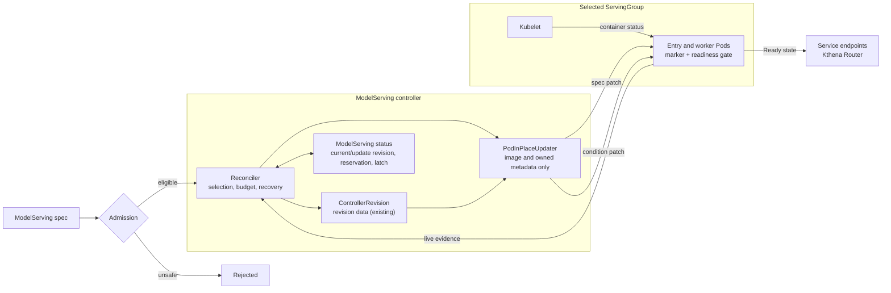
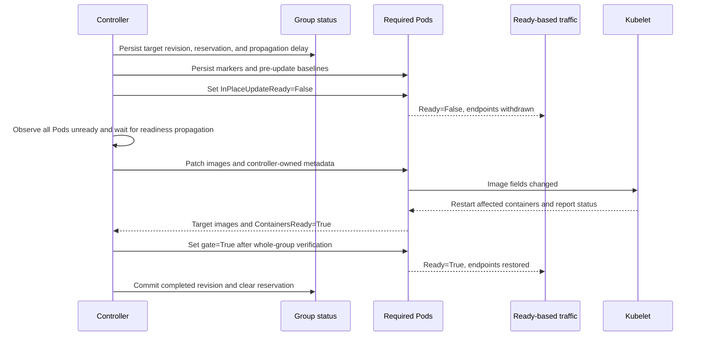
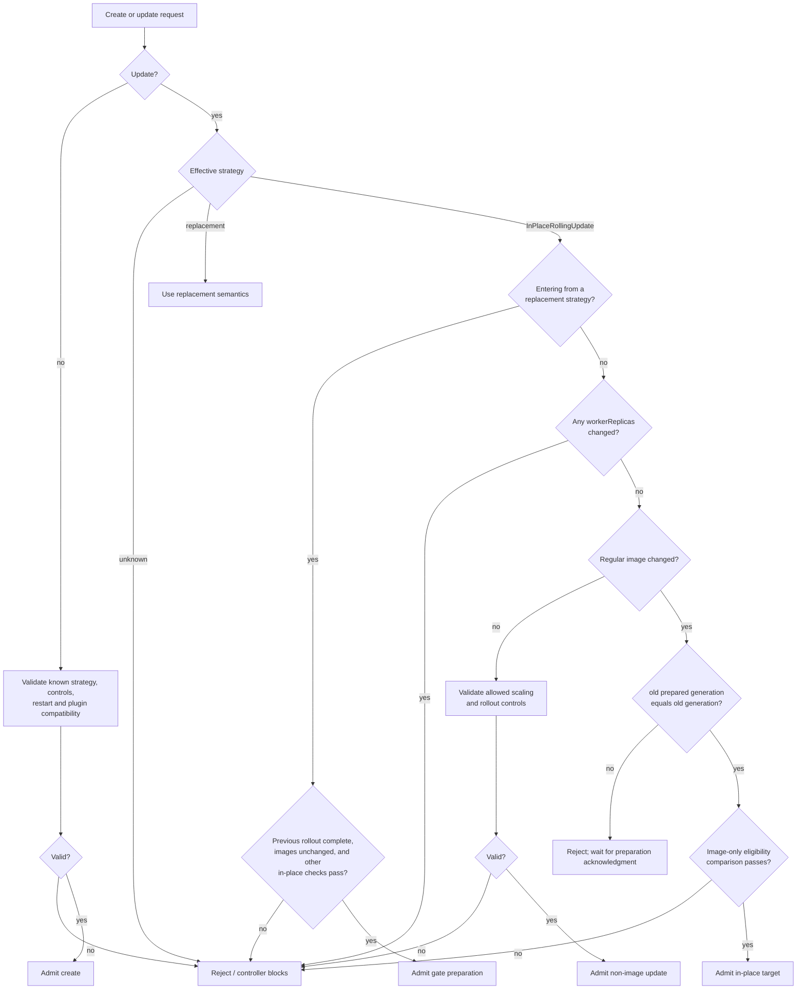
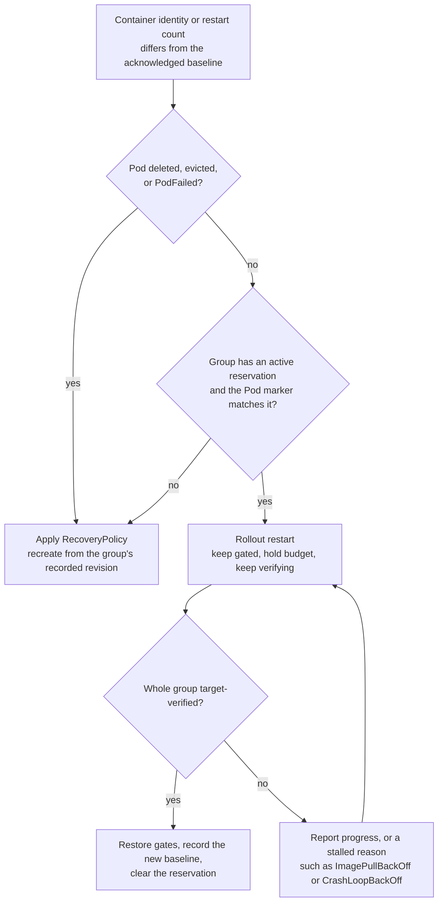
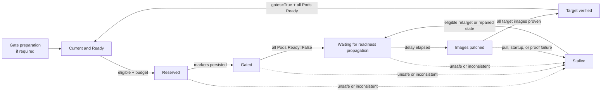
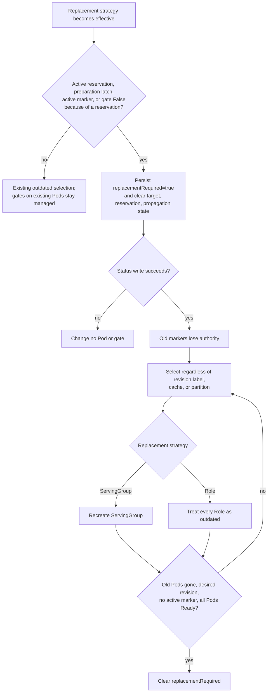

## ModelServing In-Place Rolling Update

### Summary

This proposal adds an explicit `InPlaceRollingUpdate` strategy for `ModelServing`. For an image-only update, Kthena patches `spec.containers[*].image` on existing entry and worker Pods. Kubelet restarts only the affected containers, while a successful rollout preserves Pod names, UIDs, IPs, node assignments, Pod-scoped volumes, Services, and PodGroups.

The strategy is opt-in and fail-closed. Admission and the controller require an eligible image-only diff and a compatible restart policy. Before any image patch, a Kthena readiness gate removes the whole selected ServingGroup from Ready-based traffic. The group returns only after all target containers are verified and all required Pods are Ready.

Per-group status, the existing ModelServing `ControllerRevision` history, Pod markers, readiness conditions, and live container status make the rollout resumable after a controller restart. While a group is being updated, every container restart inside it is attributed to the rollout, so multi-node and prefill/decode groups can restart in any order without triggering recovery. A bad image stalls in place; replacement occurs only after an explicit strategy change or normal recovery action. The existing replacement strategies remain the default behavior and are not changed by this proposal.

### Motivation

`ServingGroupRollingUpdate` and `RoleRollingUpdate` currently replace outdated resources. Replacement is necessary for immutable Pod changes, but it is unnecessarily expensive when only a container image changes. Recreating a ServingGroup or Role can lose:

- Pod identity, IP, and node placement;
- accelerator and topology assignments;
- Pod-scoped data such as downloaded models or caches in `emptyDir`;
- existing Services and PodGroups; and
- scheduling and gang-admission work already completed for the workload.

Large inference workloads are particularly sensitive to rescheduling, image distribution, model initialization, and cache warm-up. An in-place update still restarts the affected process and does not preserve process memory, but it avoids repeating unrelated scheduling and data-preparation work.

Directly patching images is not enough. The current controller treats any container with `restartCount > 0` as an error Pod (`utils.ContainerRestarted`) and applies the configured recovery policy, so the expected restart would recreate the Role or ServingGroup. Rollout status also assumes a homogeneous revision within a ServingGroup. The new strategy therefore needs coordinated validation, availability accounting, durable state, restart attribution, and completion reporting.

#### Goals

- Add an opt-in, image-only update path that preserves Pod and ServingGroup identity.
- Reuse ServingGroup-level `partition` and `maxUnavailable`.
- Fail closed on unsafe diffs, incompatible restart semantics, missing history, or unexplained live drift.
- Preserve effective pull and restart behavior across patching, scaling, and recovery.
- Persist enough per-group and per-Pod evidence to resume safely after restart.
- Remove the whole selected group from Ready traffic before patching images.
- Prepare existing gate-less workloads through an observable one-time replacement rollout.
- Tolerate the uncoordinated container restarts of multi-node and prefill/decode groups during an update, and preserve behavior outside this strategy.

#### Non-Goals

- Refreshing an unchanged mutable image tag.
- Supporting `maxSurge` or Role-scoped in-place rollout in the initial version.
- Updating init-container images or non-image Pod fields, including in-place resource resize.
- Supporting Pods or regular containers whose effective restart behavior is not `Always`.
- Automatically rolling back or falling back to Pod, Role, or ServingGroup replacement after an image update begins.
- Changing how `ServingGroupRollingUpdate` or `RoleRollingUpdate` decide which resources are outdated.
- Installing OpenKruise controllers, CRDs, webhooks, or node components.
- Providing a generic `InPlaceIfPossible` strategy.
- Guaranteeing request draining or preservation of process-local state.

### Proposal

Users select the strategy through `spec.rolloutStrategy.type`. The existing `RollingUpdateConfiguration` is reused; `partition` and `maxUnavailable` continue to be measured in ServingGroups. Settings that only apply to this strategy live in a separate `inPlaceUpdateConfiguration`.

```yaml
apiVersion: workload.serving.volcano.sh/v1alpha1
kind: ModelServing
metadata:
  name: llama
spec:
  replicas: 4
  rolloutStrategy:
    type: InPlaceRollingUpdate
    rollingUpdateConfiguration:
      maxUnavailable: 1
      partition: 0
    inPlaceUpdateConfiguration:
      readinessPropagationDelaySeconds: 5
  template:
    roles:
      - name: server
        replicas: 1
        workerReplicas: 0
        entryTemplate:
          spec:
            containers:
              - name: inference
                image: example.com/inference:v2
                imagePullPolicy: IfNotPresent
```

#### User Stories

##### Story 1: Patch-release engine upgrade on a multi-node deployment

An operator runs a large model with one entry Pod and several worker Pods per ServingGroup. The weights are downloaded into an `emptyDir` by an init container, and gang scheduling took minutes to place the group. A patch release of the inference engine only changes the image. With `InPlaceRollingUpdate`, each group is taken out of traffic, both entry and worker containers restart with the new image on the same nodes, the downloaded weights are reused, and the group returns to traffic once every Pod is Ready. The entry and worker containers may restart several times while they reconnect to each other; this does not trigger recovery because the group is already out of traffic.

##### Story 2: Prefill/decode disaggregated group

A ServingGroup contains a `prefill` Role and a `decode` Role that share an image. Updating the image in both Roles creates one reservation for the whole group. No Role is updated partially, and the group is not routable until both Roles are verified on the new image.

#### Architecture at a glance



The ModelServing controller owns selection, persistence, recovery coordination, and any explicit replacement. `PodInPlaceUpdater` only patches eligible images and controller-owned Pod metadata or status; it never deletes a Pod or chooses a fallback.

#### Happy-path rollout



The order above is normative: the reservation precedes Pod mutation, every required Pod is withdrawn and the propagation delay elapses before the first image patch, and no gate returns to `True` before whole-group verification. The availability slot remains held until the group is Ready.

At a glance, an eligible update has these properties; the exact comparison rules are defined under [Admission and Eligibility](#admission-and-eligibility).

| Dimension     | Requirement                                                                                  |
| ------------- | -------------------------------------------------------------------------------------------- |
| Mutation      | Only effective regular-container image values change                                         |
| Layout        | Role, entry/worker, and container names, counts, and order are unchanged                     |
| Restart       | Effective Pod `restartPolicy` is `Always`; no regular-container override or restart rules    |
| Pull policy   | Each target effective `imagePullPolicy` equals its applied value                             |
| Render inputs | Init containers, plugins, `spec.schedulerName`, and all other non-image inputs are unchanged |
| Readiness     | Every required Pod already has the Kthena readiness gate                                     |

Scaling and rollout-control changes keep their existing semantics. A `workerReplicas` change affects Pod topology and generated environment, so it is rejected under `InPlaceRollingUpdate` and requires a replacement strategy.

Gate-less workloads require preparation. Switching from a replacement strategy is allowed only when the previous rollout is complete and the images do not change in the same request. Each existing group is then recreated under `maxUnavailable` with its current revision and the readiness gate. Preparation ignores `partition` and must finish before image rollout. The controller acknowledges it with `status.readinessGatePreparedGeneration`; admission does not rely on the asynchronous condition reason.

#### Key scenarios

| Scenario                          | Result                                                                                                                |
| --------------------------------- | --------------------------------------------------------------------------------------------------------------------- |
| Valid image update                | Groups update within `partition` and `maxUnavailable`; Pods retain identity and placement                             |
| Images change in multiple Roles   | One reservation covers the whole group; all Roles must be eligible and no Role is updated partially                   |
| Images plus `workerReplicas`      | Admission rejects the entire request; no group is reserved and no Pod is patched                                      |
| Entry and workers restart unevenly | Restarts inside the reserved group are attributed to the rollout; the group stays gated until it is verified         |
| Invalid image                     | The selected group stays gated and reserved; a later eligible image retargets the same reservation                    |
| Image plus unsafe field change    | Admission rejects it; a bypassed request is blocked without mutation or fallback                                      |
| Controller restart                | Status, revisions, markers, gates, and live runtime state reconstruct the phase                                       |
| Enable in-place on existing Pods  | Allowed only after the previous rollout completes; one-time gate preparation completes before `readinessGatePreparedGeneration` advances |
| Switch to replacement while gated | Cancellation persists `replacementRequired`, invalidates markers, and forces recreation regardless of revision labels |
| Switch to replacement when idle   | No replacement; the controller keeps managing the gate on Pods that carry it                                          |

#### Notes/Constraints/Caveats

- Affected processes restart; the readiness-propagation delay is not an application-level drain acknowledgment, so in-flight requests may be interrupted.
- Gate-less Pods are never image-patched. Their one-time preparation replacement can change UID and placement.
- Init-container images and unchanged mutable tags are not updated. Effective image-pull behavior must remain equal.
- Unchanged containers should retain their container IDs, but applications must tolerate independent restarts.
- Compatible plugins must opt in; `OnPodCreate` does not run for an image patch, and `OnPodReady` runs again for the same Pod when it becomes Ready after the update, so it must be idempotent.
- No timeout triggers automatic replacement. A new eligible image, explicit strategy change, Pod loss handled by `RecoveryPolicy`, or external intervention is required.
- The strategy changes rollout-caused replacement only; scaling, explicit deletion, eviction, and recovery outside an update keep their existing semantics.
- Stable Pod identity does not preserve process memory or process-local caches. Router state keyed by Pod, such as the KV-cache-aware plugin's block index, may still describe the pre-restart cache; see [Risks and Mitigations](#risks-and-mitigations).
- A Pod that carries the Kthena readiness gate becomes Ready only after the controller sets the condition, so new gated Pods depend on a running controller.

#### Risks and Mitigations

| Risk | Mitigation |
| ---- | ---------- |
| An older controller interprets `InPlaceRollingUpdate` as `RoleRollingUpdate`, because today every non-`ServingGroupRollingUpdate` value is dispatched to the Role path | Exhaustive strategy dispatch lands first as a standalone fix; see [Version skew](#version-skew) |
| Gated Pods never become Ready while the controller is down | Only Pods rendered under this strategy carry the gate; the controller runs with leader election; `UpdateInProgress` and events name the gate as the blocking condition |
| Router KV-cache ownership still points at a Pod whose cache was cleared by the restart | Documented constraint for the initial version. The prefix-cache store already drops state through the Pod callback when the Pod becomes NotReady; clearing the KV-cache-aware index on the same signal is tracked as a separate router issue |
| A crash-looping target holds an availability slot indefinitely | Same behavior as a bad image: the group reports a stalled reason with restart counts, and a new eligible image or a strategy change resolves it. It never consumes more than its one slot |
| Pull-policy or restart-policy drift changes runtime behavior | Admission compares the resolved values, the controller re-checks them against live Pods before every patch, and Pod rendering writes them explicitly |
| Stale state after a crash between steps | Each step is written before the next begins and is guarded by resource versions; every phase can be reconstructed from status, markers, and live Pods |

### Design Details

#### API

The API adds one rollout strategy value:

```go
const (
    ServingGroupRollingUpdate RolloutStrategyType = "ServingGroupRollingUpdate"
    RoleRollingUpdate         RolloutStrategyType = "RoleRollingUpdate"
    InPlaceRollingUpdate      RolloutStrategyType = "InPlaceRollingUpdate"
)
```

Settings specific to this strategy go into a new struct on `RolloutStrategy`. They are not added to `RollingUpdateConfiguration`, because that struct is also inlined into every `Role` and a new field there would appear as `roles[].readinessPropagationDelaySeconds`.

```go
type RolloutStrategy struct {
    Type                       RolloutStrategyType         `json:"type"`
    RollingUpdateConfiguration *RollingUpdateConfiguration `json:"rollingUpdateConfiguration,omitempty"`

    // InPlaceUpdateConfiguration configures InPlaceRollingUpdate.
    // It must not be set for other strategy types.
    // +optional
    InPlaceUpdateConfiguration *InPlaceUpdateConfiguration `json:"inPlaceUpdateConfiguration,omitempty"`
}

type InPlaceUpdateConfiguration struct {
    // ReadinessPropagationDelaySeconds is how long the controller waits, after all
    // Pods in the selected ServingGroup are observed with Ready=False, before it
    // patches any image. Zero disables the extra wait.
    // +kubebuilder:default=5
    // +kubebuilder:validation:Minimum=0
    // +kubebuilder:validation:Maximum=300
    // +optional
    ReadinessPropagationDelaySeconds *int32 `json:"readinessPropagationDelaySeconds,omitempty"`
}
```

Admission rules for `InPlaceRollingUpdate`:

- `rollingUpdateConfiguration` is valid for `ServingGroupRollingUpdate` and `InPlaceRollingUpdate`; `inPlaceUpdateConfiguration` is valid only for `InPlaceRollingUpdate`.
- `maxUnavailable` is the maximum number of ServingGroups that may be unavailable or reserved for an update. It uses the existing parsing and round-down rules, but it must resolve to at least 1 against `spec.replicas`. The existing exception that allows 0 when `maxSurge` is positive does not apply, because `maxSurge` is not supported. For example, `25%` with 3 replicas is rejected.
- `rollingUpdateConfiguration.maxSurge` must be unset or resolve to 0.
- Role-level `maxSurge` and `partition` are rejected, as they already are for every strategy except `RoleRollingUpdate`. Role-level `maxUnavailable` is ignored, as it is under `ServingGroupRollingUpdate`.
- `partition` prevents new image-update reservations for the first N groups in ordinal order. It does not limit readiness-gate preparation. A group reserved before `partition` is raised finishes its recorded target rather than remaining partially updated.
- All three recovery policies (`ServingGroupRecreate`, `RoleRecreate`, `None`) are accepted. They act only on the failures described under [Restart attribution](#restart-attribution).

Because the scale subresource can change `spec.replicas` without passing this check, the controller also resolves `maxUnavailable` at runtime and uses 1 if it resolves to 0, following the Deployment controller's rule for the case where both budgets are 0.

An additive status field records the completed revision and optional active reservation for each ServingGroup:

```go
type ServingGroupRevisionStatus struct {
    Ordinal                          int32        `json:"ordinal"`
    CurrentRevision                  string       `json:"currentRevision"`
    UpdateRevision                   string       `json:"updateRevision,omitempty"`
    ReservationID                    string       `json:"reservationID,omitempty"`
    ReadinessPropagationDelaySeconds int32        `json:"readinessPropagationDelaySeconds,omitempty"`
    ReadinessPropagationStartedAt    *metav1.Time `json:"readinessPropagationStartedAt,omitempty"`
    ReplacementRequired              bool         `json:"replacementRequired,omitempty"`
}
```

`updateRevision`, `reservationID`, and the captured propagation delay are either all inactive or form one active reservation. `readinessPropagationStartedAt` is written only after all required Pods are observed unready and is cleared if membership or gate state changes. The reservation ID remains stable if the target image changes while the group is in flight. `replacementRequired` is an independent, durable latch used both for readiness-gate preparation and cancellation; cancellation may clear an active reservation and leave this field set until replacement finishes. Partial or inconsistent state blocks further in-place mutation.

`ModelServingStatus` gains `servingGroupRevisions []ServingGroupRevisionStatus` and `readinessGatePreparedGeneration int64`. The latter is zero when no generation has been acknowledged for in-place use. The controller sets it to `metadata.generation` only after that generation has been evaluated with `InPlaceRollingUpdate` effective and every existing required Pod carries the readiness gate. For a later generation whose Pods already have gates, the controller may advance the acknowledgment after rechecking the population; a gate that is temporarily `False` because of an active reservation does not undo the completed preparation.

The default strategy remains `ServingGroupRollingUpdate`. The Pod condition type is `workload.serving.volcano.sh/InPlaceUpdateReady`. Pod annotations, that condition, and revision and role-hash labels are controller-owned state, not user-facing configuration.

The API change updates the `RolloutStrategyType` kubebuilder enum and the `Type` field documentation, adds `InPlaceUpdateConfiguration` and the status fields, and regenerates the CRDs, clients, deepcopy code, API reference, and embedded Helm CRDs with `make generate`.

##### Version skew

Today `deleteOutdatedResourcesForRollingUpdate` sends every strategy other than nil or `ServingGroupRollingUpdate` to the Role path, so a controller that predates this proposal would replace `InPlaceRollingUpdate` objects Role by Role. The fix is small and independent: the controller dispatches exhaustively (nil or `ServingGroupRollingUpdate`, `RoleRollingUpdate`, otherwise an `UnsupportedRolloutStrategy` condition with no resource mutation). It is validated before replica and Role sync, recovery, revision advancement, and rollout selection, and it lands as a standalone change before this feature.

`InPlaceRollingUpdate` is supported only with a controller that includes that dispatch. Helm does not update CRDs during `helm upgrade`, so the new enum value becomes usable only after the operator applies the new CRDs, as the installation guide already requires. To downgrade, switch every object to a replacement strategy, wait for cancellation and replacement to finish, and then downgrade the controller. A controller that has the exhaustive dispatch but not this feature leaves in-place objects blocked without mutation.

#### Admission and Eligibility



For `InPlaceRollingUpdate`, admission decodes both `Object` and `OldObject` on updates and compares the two after applying the same defaulting. An image target is eligible only when:

- Role names, order, entry/worker template structure, and container names and order are unchanged;
- every entry and worker Pod resolves to `restartPolicy: Always`, and regular containers have no restart override or restart rules;
- replacing the new regular-container images with the old images makes the normalized templates semantically equal, after resolving Kubernetes-defaulted restart and pull policies;
- every container's target effective `imagePullPolicy` equals its source effective policy; an omitted-to-explicit change is allowed only when it resolves to the same value;
- init-container images and all other normalized non-image Pod fields are unchanged;
- plugin configuration and `spec.schedulerName` are unchanged, and every plugin declares compatibility; and
- only documented scaling and rollout-control fields differ outside the image changes, and `workerReplicas` is unchanged.

Eligibility is atomic across Roles. If any Role changes `workerReplicas` or fails another check, the entire request is rejected; otherwise one ServingGroup reservation covers all affected Roles and completes only after all required Pods are verified.

Effective restart and pull policies are a pure function of the stored template under Kubernetes defaulting rules, so they are computed rather than stored. Admission, the controller's eligibility check, and Pod rendering share one resolver. The resolver treats an empty `restartPolicy` as `Always` and rejects other values, and Pod rendering writes the resolved values explicitly. An omitted pull policy is resolved before comparison. For example, an omitted `:latest` to pinned-tag transition changes the derived policy from `Always` to `IfNotPresent` and is rejected unless the target explicitly keeps `Always`.

Entering the strategy from a replacement strategy requires the previous rollout to be complete in the old object: `status.observedGeneration == metadata.generation`, `status.currentRevision == status.updateRevision`, and `status.updatedReplicas == status.replicas == spec.replicas`. The template of every existing group is then the current revision, which gate preparation renders from.

The generation guard for image changes is exact: an image change requires `old.status.readinessGatePreparedGeneration == old.metadata.generation`; missing, zero, stale, or future values reject it. This prevents create-followed-by-update and leave-and-reenter races. Condition reasons are diagnostic only. Creates need no historical pull-policy comparison, and switching to a replacement strategy permits arbitrary template changes because it authorizes recreation.

Admission improves feedback but is not the safety boundary. Before reserving a group or building a Pod patch, the controller repeats the comparison against the revision recorded for that group, verifies the resolved policies against every live Pod, and requires the readiness gate on every Pod in the group. A gate-less group whose desired image differs from its applied image is blocked; annotation state alone never authorizes an ungated image patch. A group whose recorded revision is missing, unknown, or inconsistent with its live Pods also fails closed with `RevisionHistoryMissing`.

#### Durable Control State

Durable state is stored in existing Kubernetes API objects:

| Object | State |
| ------ | ----- |
| `ModelServing.status` | Per-group completed revision, active reservation, and replacement latch |
| `ControllerRevision` | Existing immutable revision data, reused unchanged |
| Pod annotations and status | Update marker, restart baseline, readiness gate, and live runtime evidence |

The existing in-memory datastore is only a rebuildable cache and never authorizes mutation, gate restoration, or recovery suppression.

##### Revision persistence

The strategy reuses the canonical revision data from the ModelServing revision core (`BuildRevisionData` and `RecordModelServingRevision` in `pkg/model-serving-controller/utils`). That data already includes the normalized Roles, `spec.schedulerName`, and plugins, is stored immutably in a `ControllerRevision`, and is identified by a hash with collision handling. A group's `currentRevision` and `updateRevision` name those revisions.

This depends on the controller using that revision identity. Today `syncModelServing` still computes the Role-only `utils.ModelServingRevision`; wiring the revision core into the controller is part of that work, not this proposal. The in-place strategy is enabled only once the controller uses the canonical revision.

Replacement strategies keep their outdated-selection rules. The readiness gate and the resolved policies are not part of the revision data: the gate is added by Pod rendering when `InPlaceRollingUpdate` is effective, and the policies are derived from the template. Switching strategies therefore never changes a revision and never triggers a rollout by itself.

Each ServingGroup's status records its completed revision and, while updating, its target revision and reservation ID. The controller writes the reservation before any Pod mutation and clears it only after all Pods complete. Scaling and recovery within an existing group use that group's recorded revision rather than the latest global desired state. `CleanupOldControllerRevisions` receives every revision referenced by group status or by an active Pod marker so that it is retained.

Before replacing a gate-less group for readiness-gate preparation, the controller persists `replacementRequired=true`. Preparation recreates the group from its current revision, which admission guaranteed equals the desired revision. The latch clears only after all pre-preparation Pod UIDs are gone and the gate-bearing replacements are Ready. `readinessGatePreparedGeneration` cannot advance while any preparation latch remains.

When `InPlaceRollingUpdate` creates a Pod for initial scale, Role scaling, recovery, or readiness-gate preparation, the rendered Pod contains `workload.serving.volcano.sh/InPlaceUpdateReady` in `spec.readinessGates`. A missing custom condition is treated as `False`. If no reservation applies, the controller sets the condition to `True` after `ContainersReady=True` and ownership and revision state are valid. A Pod created during an active reservation stays gated until the whole ServingGroup passes target verification. The controller manages the condition on every owned Pod that carries the gate, whatever the current strategy, so leaving the strategy does not require replacing completed groups.

##### Pod protocol and completion

Every Pod in a reserved group receives a versioned controller annotation. The marker identifies the Pod and owner, ServingGroup and Role, reservation, source revision, current target revision, every earlier target revision this reservation has patched, protocol phase, and the pre-update identity and restart count of every regular and init container.

Preparing a Pod is separate from changing its image. The updater first uses a preconditioned metadata patch to write the marker and baseline without changing any image. It then uses a resource-version-aware Pod status patch to set only `workload.serving.volcano.sh/InPlaceUpdateReady=False` with reason `StartInPlaceUpdate`. The status patch preserves kubelet-owned and third-party conditions. No image in the ServingGroup is patched until every required Pod has the matching marker and gate condition, every aggregate Pod `Ready` condition is `False`, and the readiness-propagation deadline has passed.

After the propagation delay, the updater uses a preconditioned JSON Patch to:

- verify ownership, resource version, expected container layout, `restartPolicy: Always`, and the resolved pull policies;
- write the target revision, role hash, and update marker; and
- replace only eligible regular-container images that differ from the target.

ModelServing status writes are guarded by resource version. On a conflict for either Pods or the ModelServing, the controller re-reads, re-evaluates reservation, target, and availability, and retries without patching a Pod from stale state. A live image that equals the source revision or a recorded earlier target is expected; any other live image is unexplained drift and blocks the patch instead of being overwritten. Pods with no image difference receive metadata only so that the whole ServingGroup still converges to one revision, but their gates remain `False` with the rest of the group.

When a newer eligible image supersedes the target of an in-flight group, the order is: update the group's `updateRevision` in status while keeping the reservation, then rewrite each Pod marker to the new target (recording the previous one), then patch images. After a crash, a marker whose target differs from the group status is stale and is rewritten before any further image patch.

A Pod is target-verified when its marker matches the live group reservation, its spec and labels match the target revision, its restart and pull policies still match the resolved values, every regular container reports the exact target image, and `ContainersReady=True`. Image names are compared using Kubernetes-compatible OCI normalization; a runtime image that cannot be verified leaves the Pod incomplete rather than producing a false success.

The controller restores no gate in the group until every required Pod is target-verified. It then patches each owned readiness condition to `True` with reason `TargetVerified`. A Pod completes only after its custom condition and aggregate `Ready` condition are both `True`; the ServingGroup completes only after every required Pod completes. At completion the controller records each container's current identity and restart count in the marker as the acknowledged baseline.

##### Restart attribution

The controller does not classify a restart from `restartCount > 0` alone, because counts are cumulative and a completed update leaves them above zero. It compares each container against an acknowledged baseline: the Pod's creation for a new Pod, and the identities and counts recorded at the last completion for an updated Pod. The decision uses only the group's durable status, the Pod marker, and live Pod spec and status; an in-memory cache is not evidence. It runs before ordinary Ready and error Pod handling and during full reconciliation, including after controller restart.

There are two regimes:

- **Update window.** From the moment a group's reservation is persisted until the group completes and the reservation clears, every container restart in a Pod whose marker matches the reservation is attributed to the rollout. This covers regular and init containers, changed and unchanged containers, and any number of restarts. The group is already out of traffic and already counted against `maxUnavailable`, so absorbing the restart cannot reduce capacity further. `RecoveryPolicy` is not invoked; the group stays gated and verification continues.
- **Outside the window.** Any change from the acknowledged baseline is a failure and follows `RecoveryPolicy`, exactly as today. A marker that does not match the live reservation (wrong owner UID, Pod UID, or reservation ID) never places a Pod inside the window.

Pod loss is never absorbed. Deletion, eviction, and `PodFailed` follow `RecoveryPolicy` in both regimes; during the window, recreated Pods use the group's reserved revision and stay gated.



This regime is what makes multi-node and prefill/decode groups safe to update. Kubelets on different nodes restart their containers independently, so an entry container can start while a worker still runs the old image, lose its peer, and restart again. Treating the second restart as a failure would trigger `RoleRecreate` or `ServingGroupRecreate` and defeat the purpose of the strategy. A crash-looping target behaves like a bad image: it stalls, holds its one availability slot, and reports restart counts until a new eligible image, a strategy change, or Pod loss resolves it.

#### Rollout Reconciliation

The controller derives progress from per-group status and live Pods:



Reconciliation follows these invariants:

1. Strategy cancellation, existing reservations, and pending recovery decisions are reconciled before new groups are selected.
2. Role scaling is ordered before new rollout reservations; active reservations may continue while scaling converges. New Pods in a reserved group use the reserved revision and carry the matching marker.
3. `partition` is applied to groups without a reservation or replacement latch, and eligibility is checked against each group's recorded revision.
4. Availability is calculated across readiness, reservations, replacement latches, and pending recovery. A new ServingGroup created by scale-up counts as unavailable until Ready, and no new reservation is made while the budget is exhausted.
5. Gate-less groups are prepared by replacement before they are eligible for an image reservation; a gate-less Pod is never patched in place.
6. A target revision, captured propagation delay, and reservation are persisted before the first Pod metadata or status patch.
7. All required Pods are marked, gated, observed unready, and given the propagation delay before any image in the group is patched.
8. All owned Pods are patched or observed as part of the group; partial progress and target supersession continue to hold the reservation and keep the group gated.
9. Gates return to `True` only after whole-group target verification. The group's completed revision advances and its reservation clears only after every required Pod becomes Ready.

Raising `partition` does not cancel a reservation; the group finishes and then becomes protected. An eligible newer image supersedes an unprotected target without releasing the reservation or availability slot. The group stays gated, and its propagation timer resets only when membership or gate state changes. An ineligible change stalls with state preserved for diagnosis.

##### Strategy transition and cancellation



Cancellation runs before ordinary selection and never restores a gate: image and revision labels may already be patched without runtime verification. The latch survives restarts and further strategy changes. It counts against availability, but replacing an already unavailable group does not consume another slot.

Completed in-place groups need no cancellation. Their Pods keep the readiness gate, the controller keeps managing it, and they are replaced only when the replacement strategy's normal outdated check selects them.

#### Availability Semantics

`maxUnavailable` counts real service loss and work that is committed but may not yet appear unready:

```text
unavailable = groups that are not fully Ready
            union groups with an active reservation
            union groups with replacementRequired
            union groups with a pending recovery decision

remainingBudget = max(0, maxUnavailable - cardinality(unavailable))
```

The union avoids double counting. Protected unavailable groups and new groups created by scale-up still consume budget. A healthy group is never reserved when the budget is exhausted. An outdated group that is already unavailable may be selected only after any pending recovery decision is resolved, because updating it does not further reduce capacity.

#### Traffic, Readiness, and Recovery

Every Pod rendered under this strategy has the `workload.serving.volcano.sh/InPlaceUpdateReady` readiness gate. On normal startup, an absent condition is `False`; the controller sets it to `True` only after `ContainersReady=True` and ownership and revision validation. During a reservation it stays `False` until whole-group target verification.

The controller writes every marker and gate condition before `readinessPropagationStartedAt`, and records that time only after all aggregate Pod conditions are `Ready=False`. A Ready transition, Pod recreation, or membership change before image patching clears the timestamp and restarts the wait. The Kthena Router watches Pods and drops a Pod when its `Ready` condition is not `True`; Service endpoints follow the same condition. The configured delay gives both time to observe withdrawal; it is not a drain acknowledgment and cannot protect requests already in flight.

| Evidence after reconciliation or restart                        | Action                                                                                                  |
| --------------------------------------------------------------- | ------------------------------------------------------------------------------------------------------- |
| Reservation, markers, gates, propagation time, and runtime agree | Resume the derived phase without spending another availability slot                                    |
| Container restart inside the update window                      | Keep the group gated and continue verification; never invoke `RecoveryPolicy`                          |
| Target pull or startup failure                                  | Stall and retain the reservation; `restartPolicy: Always` allows a later eligible target to start       |
| Container restart outside the update window                     | Apply the configured `RecoveryPolicy`                                                                    |
| Pod deletion, eviction, or `PodFailed` during a reservation     | Apply `RecoveryPolicy`; recreated Pods use the reserved revision with the gate held `False`             |
| Pod deletion without a reservation                              | Recreate from the completed revision and follow normal gate initialization                               |
| Missing authoritative history                                   | Block recreation rather than substitute current global inputs                                            |

Recovery decisions are revalidated against the live Pod and ModelServing immediately before deletion. Every recreated or scaled Pod explicitly receives the resolved pull and restart policies. No timeout causes automatic replacement; an explicit replacement strategy invokes the cancellation protocol above.

#### Controller Integration Points

The feature touches these existing paths in `pkg/model-serving-controller/controller/model_serving_controller.go`:

- **Strategy dispatch.** `manageRollingUpdate` and `deleteOutdatedResourcesForRollingUpdate` gain an explicit `InPlaceRollingUpdate` branch that runs the in-place planner instead of deleting outdated resources. Unknown values block, as described under [Version skew](#version-skew).
- **Pod events.** In `updatePod`, restart attribution runs before the switch on `IsPodRunningAndReady` and `ContainerRestarted`. For Pods that carry a marker, the cumulative `ContainerRestarted` check is replaced by the baseline comparison; Pods without a marker keep today's behavior.
- **Gate-induced NotReady.** A Pod whose gate is set `False` and whose restart count is 0 falls into the `default` branch today and stays Running in the datastore. The in-place path marks the Role and ServingGroup unavailable when it sets the gate, so `availableReplicas` and `checkServingGroupReady` stay correct.
- **Grace-period recovery.** `handlePodAfterGraceTime` re-reads the Pod and ModelServing and re-runs restart attribution before deleting, so a reservation made during the grace period prevents deletion.
- **Pod creation.** `scaleUpServingGroups`, `syncRoleReplicas`, and `CreatePodsByRole` receive the group's recorded revision for existing groups instead of the global revision, add the readiness gate, and write the marker for Pods created during a reservation.
- **Ready hook.** `handleReadyPod` calls `OnPodReady` again after an update; compatible plugins must be idempotent.
- **Status and history.** `UpdateModelServingStatus` writes `servingGroupRevisions` and `readinessGatePreparedGeneration`, and revision cleanup keeps every revision still referenced by group status or markers.

#### Status, Events, and Diagnostics

Existing status counters remain ServingGroup-based:

| Field                             | Meaning                                                                                                                           |
| --------------------------------- | --------------------------------------------------------------------------------------------------------------------------------- |
| `replicas`                        | Observed ServingGroups, including in-flight groups.                                                                               |
| `updatedReplicas`                 | Groups whose Pod specs and revision metadata target the latest desired revision and have no replacement latch.                    |
| `currentReplicas`                 | Groups not yet fully targeting the latest desired revision.                                                                       |
| `availableReplicas`               | Groups whose required Pods and Kthena gates are Ready at their applied revision; reserved, gated, or latched groups are unavailable. |
| `servingGroupRevisions`           | Authoritative completed and reserved revisions and the replacement latch for each ordinal.                                        |
| `readinessGatePreparedGeneration` | Generation durably checked as having a gate-bearing population suitable for a later image update.                                 |
| `observedGeneration`              | Latest generation whose rollout safety and state were evaluated, including a blocked generation.                                  |

`UpdateInProgress` distinguishes readiness-gate preparation, readiness propagation, image patching, strategy cancellation, forced replacement, a stalled image, unverifiable image identity, missing revision history, and blocked unsafe state. It becomes `False` with reason `RolloutComplete` only when all eligible groups are updated and no preparation, reservation, or replacement latch remains. `Progressing` continues to describe creation and scaling, while `availableReplicas` remains the capacity signal during rollout.

Events report gate preparation, propagation wait start, image patch start, restarts absorbed during an update, cancellation, forced replacement, completion, stalls, unsafe changes, malformed state, and patch failures. Structured logs include the ModelServing, ServingGroup, Role, Pod, reservation, and target identifiers without including credentials or raw unvalidated annotation data.

#### Plugin Semantics

Plugin compatibility is explicit registry metadata, equivalent to an `InPlaceRollingUpdate` capability flag. Existing registrations default to incompatible; compatible plugins opt in through a capability-aware registration path. Empty plugin configuration is compatible, while unknown or incompatible plugins block this strategy.

`OnPodCreate` is not called for an image patch, so a compatible plugin must not require that hook to transform the target image or another immutable field. Existing plugin mutations remain on the Pod, and `OnPodReady` runs again through the normal Ready event after the update. Plugin configuration cannot change while the in-place strategy remains effective.

#### RBAC and Security

The controller's Pod permissions add `patch` on `pods` and `patch` on `pods/status`. It does not require `update` on Pod status or unrelated permissions. Before each spec or status patch, the controller verifies the controlling ModelServing UID and expected ServingGroup and Role. Spec patches are limited to eligible image fields and controller-owned metadata. Status patches modify only `workload.serving.volcano.sh/InPlaceUpdateReady` and preserve every other condition, with Kubernetes API validation as the final guard.

### Test Plan

| Area                            | Unit coverage                                                                                                                                                  | Kind-based controller-manager coverage                                                                                                                                    |
| ------------------------------- | -------------------------------------------------------------------------------------------------------------------------------------------------------------- | ------------------------------------------------------------------------------------------------------------------------------------------------------------------------- |
| API and admission               | Create and update requests for each strategy; `inPlaceUpdateConfiguration` only with this strategy; `maxSurge` rejected; `maxUnavailable` resolving to 0 rejected; Role-level fields; every recovery policy; `OldObject` defaulting | Unsafe requests block without mutation; runtime `maxUnavailable` clamp after scale subresource changes                                                  |
| Eligibility and policy          | Image-only and structural comparisons; atomic multi-Role eligibility; omitted and invalid restart policies; omitted-to-explicit pull policy; unsafe plugins    | Generated Pods write `restartPolicy: Always` and resolved pull policies                                                                                                    |
| Version skew and revisions      | Exhaustive unknown-strategy dispatch; group revisions reference canonical revision data; referenced revisions survive cleanup                                    | Controller with only exhaustive dispatch blocks in-place objects; strategy switch alone does not change a revision                                                       |
| Gate and patch protocol         | Condition ownership; marker, gate, propagation, patch, and verification ordering; conflict retries; timer reset; metadata-only Pods                             | Entry, worker, multi-container, and multi-Pod identity preservation; all Pods become unready before patching; readiness propagation wait; only changed containers restart |
| Selection and supersession      | Per-group state, reservations, latches, `partition`, availability accounting with scale-up, and target supersession ordering including a crash between steps    | `maxUnavailable`, `partition`, scaling order, successive targets, invalid-image stall, and valid-image retarget                                                           |
| Restart attribution             | Restarts inside the window never invoke recovery; restarts outside it do; mismatched markers; Pod loss during the window; baselines after controller restart     | Multi-node group where entry and workers restart several times during an update completes without recreation; a later unrelated crash follows each recovery policy          |
| Preparation and cancellation    | Switch rejected while a rollout is incomplete or together with an image change; generation-bound acknowledgment; marker invalidation and forced replacement for both strategies | Immediate post-switch image update is rejected; gated strategy transitions recreate despite matching labels; completed groups keep managed gates after leaving the strategy |
| Completion and diagnostics      | Exact runtime image proof; counters, conditions, events, and no implicit fallback                                                                               | Normal readiness, runtime-image verification, and Pod-status RBAC work end to end                                                                                         |

### Alternatives

#### Import OpenKruise's Pod updater directly

OpenKruise provides mature in-place patch and observation utilities, but they are coupled to OpenKruise API types, state keys, readiness behavior, feature gates, and fallback semantics. They also do not provide Kthena's ServingGroup reservation, plugin history, scaling, recovery, or status model. Kthena therefore owns a narrow image-only updater and may adapt compatible mechanics with the appropriate license notices.

#### Use OpenKruise workload resources

CloneSet or Advanced StatefulSet could delegate more rollout behavior, but would add CRDs and controllers with ownership and status models that do not understand Kthena ServingGroups, Roles, PodGroups, plugins, or recovery policy. This is outside the proposal's scope.

#### Store a separate render snapshot

A second immutable snapshot could be stored next to each revision, covering plugins, `spec.schedulerName`, readiness gates, and resolved policies. The canonical revision data already stores plugins and the scheduler, the policies can be derived from the template, and the gate is a rendering choice. A second snapshot would duplicate that history and would also change how the replacement strategies select outdated resources.

#### Treat every unexpected restart during an update as a failure

Limiting the rollout to exactly one expected restart per changed container makes the controller stricter, but multi-node and prefill/decode groups routinely restart more than once while their peers restart. Recovering from those restarts would recreate the group the strategy is meant to keep. Because the group is already out of traffic and counted against the budget, the update window absorbs them and reports a stall instead.
