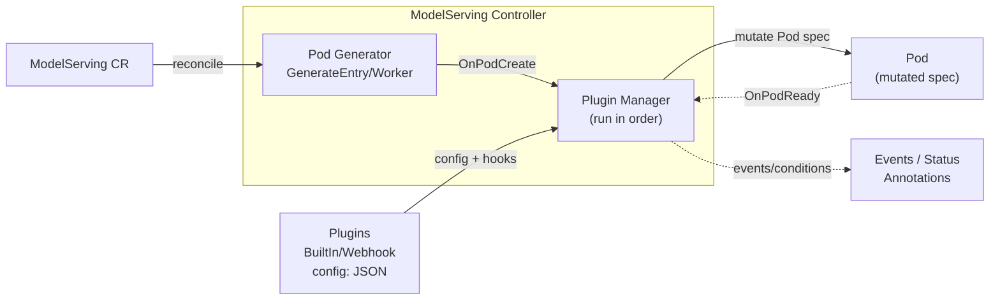

## ModelServing Plugin Framework

### Summary

This proposal introduces a plugin framework for `ModelServing` that lets users customize the Pods generated by the ModelServing controller for different inference engines (e.g., vLLM, TensorRT-LLM) and different accelerators (GPU, NPU, etc.).

At a high level:

- A new `spec.plugins` field enables one or more plugins.
- The controller will invoke plugins at defined hook points (e.g. `OnPodCreate`, `OnPodReady`).
- Plugins can mutate the Pod spec (labels/annotations, env, volumes, node affinity, scheduler hints, etc.) in a controlled and observable way.

### Motivation

Today, ModelServing already allows users to set `role.entryTemplate.spec` / `role.workerTemplate.spec` directly. In practice, organizations often need additional cross-cutting customization that depends on:

- runtime/inference engine specifics (extra sidecars, init containers, env var conventions, ports, probes)
- accelerator type/vendor (GPU vs NPU), driver injection, device plugin resources, runtimeClass
- networking (RDMA), topology constraints, hugepages
- integration with cluster infrastructure (custom schedulers, gang scheduling annotations, metadata conventions)

Embedding every possible case in the controller or CRD directly is not feasible and lacks extensibility.

A plugin system enables:

- reuse across many ModelServing objects
- optional, composable behavior (multiple plugins)
- faster iteration without changing the core ModelServing API for each new accelerator/engine

#### Goals

- Provide a first-class, opt-in extension mechanism for customizing Pods created by ModelServing.
- Support multiple plugins per ModelServing instance with deterministic ordering.
- Define stable hook points for the lifecycle:
  - Pod creation/mutation before the controller creates the Pod
  - Pod readiness notification (and future lifecycle hooks)
- Make plugin application observable (events / status conditions / annotations).
- Keep backward compatibility: ModelServing behavior is unchanged when no plugins are configured.

#### Non-Goals

- Allowing plugins to mutate resources other than those owned by the ModelServing reconciliation (initially).
- Implementing a remote plugin execution mechanism in the first iteration (e.g., webhook, WASM runtime) unless explicitly chosen as the MVP.

### Proposal

### Diagram



#### API changes

Add a `plugins` field to `ModelServingSpec`:

- `plugins[]` is optional.
- Each plugin entry specifies:
  - `name` (string) – plugin identifier
  - `type` (string) – plugin kind (e.g., `BuiltIn`, `Webhook`), to allow future extension
  - `config` (raw JSON) – plugin-specific configuration (opaque to the API server)
  - `scope` (optional) – apply to entry/worker, roles, or all

Example (illustrative):

```yaml
apiVersion: workload.kthena.io/v1alpha1
kind: ModelServing
metadata:
  name: llama-8b
spec:
  schedulerName: volcano
  replicas: 2
  plugins:
    - name: nvidia-gpu-defaults
      type: BuiltIn
      config:
        runtimeClassName: nvidia
        gpuResourceName: nvidia.com/gpu
        gpuCount: 1
    - name: huawei-ascend-defaults
      type: BuiltIn
      config:
        npuResourceName: huawei.com/Ascend910
        npuCount: 1
  template:
    roles: []
```

Notes:

- `config` should be defined as `apiextensionsv1.JSON` (or an equivalent raw JSON type already used in the repo) to avoid forcing a schema per plugin.

#### Hook points

Initial hook points:

- `OnPodCreate(ctx, req) -> error`
  - Called after the controller generates the base Pod object (currently via `utils.GenerateEntryPod` / `utils.GenerateWorkerPod`) and after core controller annotations are applied (e.g., gang scheduling annotations), but before the Pod is created.
  - Allows mutation of:
    - `ObjectMeta.Labels/Annotations`
    - `Spec` (containers, resources, env, volumes, nodeSelector, affinity, tolerations, runtimeClassName, schedulerName override?)

- `OnPodReady(ctx, req) -> error`
  - Called when the controller observes `utils.IsPodRunningAndReady(pod)` in the informer update callback.
  - Intended for side-effect-free bookkeeping or emitting signals (events/metrics) and for future extension.

Future hook points (out of scope for MVP but reserved):

- `OnPodDelete`
- `OnServiceCreate` (ModelServing currently creates headless services for worker roles)
- `OnRoleCreate` / `OnServingGroupCreate`

#### Plugin ordering and determinism

- Plugins execute in list order.
- Each plugin sees the Pod object after previous plugins have applied their mutations.
- If any plugin returns an error, reconciliation fails for that Pod creation step.
  - The controller retries via its workqueue retry logic.

#### Observability

- Emit Kubernetes Events on:
  - plugin applied
  - plugin error
- Add/extend ModelServing Status conditions to reflect plugin failures.
- (Optional) Annotate created Pods with applied plugin names + a hash of plugin config for debugging.

#### Notes/Constraints/Caveats

- Plugins must be deterministic and idempotent with respect to Pod mutation to avoid endless reconcile loops.
- Plugins must not mutate cluster-scoped resources or unrelated workloads in the first iteration.

#### Risks and Mitigations

- **Security:** Running arbitrary plugin code inside the controller process can be risky.
  - Mitigation: first iteration can restrict to a curated set of built-in plugins compiled into the controller image.
  - Future: support webhook- or WASM-based plugins with explicit allowlists.

- **Stability / upgrades:** Plugin API versioning.
  - Mitigation: version the plugin interface package and keep it compatible; add feature gates.

- **Debuggability:** Hard to see what mutations were applied.
  - Mitigation: add events + optional Pod annotations capturing applied plugins.

### Design Details

#### Controller integration points

Based on the current controller implementation:

- Pod objects are created in:
  - `(*ModelServingController).CreatePodsByRole()`
  - which calls `utils.GenerateEntryPod()` / `utils.GenerateWorkerPod()`
  - and then calls the Kubernetes API `Pods().Create()`.

This is the primary `OnPodCreate` insertion point.

- Pod readiness is handled in:
  - `ModelServingController.updatePod()`
  - which checks `utils.IsPodRunningAndReady(newPod)`
  - and then calls `handleReadyPod()`.

This is the primary `OnPodReady` insertion point.

#### Proposed Go interfaces (draft)

```go
// Package location (suggestion): pkg/model-serving-controller/plugins

// HookRequest contains all context needed for a hook.
type HookRequest struct {
  ModelServing   *workloadv1alpha1.ModelServing
  ServingGroup   string
  RoleName       string
  RoleID         string
  IsEntry        bool
  Pod            *corev1.Pod
}

type Plugin interface {
  Name() string

  // Called before controller creates the Pod.
  // Implementation may mutate req.Pod in-place.
  OnPodCreate(ctx context.Context, req *HookRequest) error

  // Called when controller observes Pod ready.
  OnPodReady(ctx context.Context, req *HookRequest) error
}
```

A small plugin manager composes plugins and runs them in order.

#### Test Plan

- Unit tests for the plugin manager:
  - ordering
  - error propagation
  - idempotent mutation examples
- Controller unit tests (existing `pkg/model-serving-controller/controller/model_serving_controller_test.go`) extended to validate:
  - Pod mutations were applied before create
  - ready hook invoked on readiness transitions

### Alternatives

1. **Admission webhook only**
   - Pros: Kubernetes-native, decoupled from controller.
   - Cons: harder to scope to ModelServing-specific logic; additional deployment complexity.

2. **Template-only approach** (expand `PodTemplateSpec`)
   - Pros: no plugin code.
   - Cons: does not scale for cross-cutting, conditional logic; becomes an unwieldy API surface.

3. **WASM plugin runtime inside controller**
   - Pros: safer sandbox; dynamic loading.
   - Cons: larger engineering lift; still needs a config distribution story.
