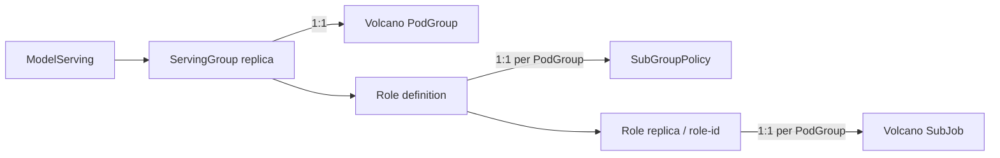

## Topology Affinity for ModelServing

### Summary

This proposal introduces a ModelServing-native topology-affinity API for
relationships between ServingGroups and roles. The ModelServing controller
translates these relationships to Volcano PodGroup topology-affinity rules:

- ServingGroup anti-affinity maps to PodGroup anti-affinity.
- Role affinity maps to SubGroup affinity.
- Role anti-affinity maps to SubGroup anti-affinity.

The proposal builds on Volcano's group topology affinity design and does not
reimplement topology placement in Kthena. Kthena exposes ServingGroup and Role
concepts, generates the required PodGroup selectors and SubGroupPolicy
references, and leaves enforcement to the Volcano scheduler and HyperNode
topology.

This work is tracked by [kthena#645], and depends on the scheduler capability
described in [volcano#5347] and the community design proposal in
[volcano#5349].

### Motivation

ModelServing already supports topology aggregation through
`spec.template.networkTopology`:

- `groupPolicy` constrains the topology envelope of all Pods in one
  ServingGroup.
- `rolePolicy` constrains the topology envelope of each Role instance.

These policies answer where a ServingGroup or Role instance may aggregate, but
they cannot express how multiple generated groups relate to one another.

Production inference workloads need additional placement relationships:

1. Multiple ServingGroups of the same ModelServing should be placed in
   different failure or communication domains so that one domain failure does
   not remove every serving replica.
2. Communication-heavy roles, such as Prefill and Decode, may need to share a
   rack or supernode.
3. Replicas of the same role may need to be spread across nodes, racks, or
   other HyperNode domains for fault isolation.
4. Operators may need either mandatory placement or a weighted preference when
   the cluster cannot satisfy the ideal layout.

Standard Kubernetes Pod affinity and anti-affinity operate on individual Pods
and Kubernetes topology labels. They do not naturally coordinate gang
scheduling, Role-instance grouping, and whole-ServingGroup placement on
Volcano's HyperNode tree. Injecting repeated Pod rules also makes the generated
Pods the source of truth instead of the ModelServing topology intent.

Volcano's group topology affinity capability provides the required scheduling
primitive. This proposal defines how ModelServing exposes and translates that
primitive without leaking generated PodGroup names, selectors, or SubJob IDs to
users.

#### Goals

1. Allow users to require or prefer separation between ServingGroups of the
   same ModelServing at a selected HyperNode tier.
2. Allow users to require or prefer affinity between selected roles within one
   ServingGroup.
3. Allow users to require or prefer anti-affinity within one role or between
   selected roles within one ServingGroup.
4. Preserve the existing mapping of one ServingGroup to one PodGroup, one Role
   to one SubGroupPolicy, and one Role replica to one SubJob.
5. Keep the ModelServing API independent of controller-generated selectors and
   Role instance IDs.
6. Compose topology-affinity relationships with the existing
   `networkTopology` aggregation policies.
7. Validate invalid role references, tier selection, and required/preferred
   term shapes before generating a PodGroup.
8. Fail clearly when the installed Volcano CRD or scheduler does not provide
   the required capability.

#### Non-Goals

1. Implementing topology placement algorithms in the ModelServing controller.
2. Cross-ModelServing or cross-namespace affinity and anti-affinity.
3. Cross-PodGroup affinity. The initial Volcano capability supports
   cross-PodGroup anti-affinity only.
4. Creating or maintaining HyperNode resources.
5. Replacing Pod-level affinity, topology spread constraints, device placement,
   or NUMA-aware scheduling.
6. Pairing Role replicas by ordinal, such as placing `prefill-0` with
   `decode-0`, while independently placing `prefill-1` with `decode-1`.
7. Automatically evicting already-running Pods after a topology-affinity policy
   changes.

### Proposal

Add `topologyAffinity` to the ServingGroup template. The field contains three
optional relationship blocks:

- `servingGroupAntiAffinity`
- `roleAffinity`
- `roleAntiAffinity`

Each block supports:

- `required`: hard constraints that must all be satisfied;
- `preferred`: soft constraints with a weight from 1 to 100.

Each term selects a comparison tier using either `topologyTierName` or
`topologyTier`. The name form is recommended because it directly refers to
`HyperNode.spec.tierName` and does not depend on cluster-specific numeric tier
assignments.

The capability model is:



`networkTopology` and `topologyAffinity` remain separate because they answer
different questions:

| API | Responsibility |
| --- | --- |
| `networkTopology` | Defines the aggregation envelope of a ServingGroup or Role instance. |
| `topologyAffinity` | Defines whether generated groups share or avoid the same topology domain. |

#### User Stories

##### Story 1: Isolate ServingGroups across communication domains

A ModelServing contains multiple ServingGroups, each of which can independently
serve traffic. The operator wants every ServingGroup placed in a different
communication domain so that a domain failure does not take down every serving
replica.

The user configures one required `servingGroupAntiAffinity` term. The controller
adds a PodGroup selector that matches other PodGroups generated for the same
ModelServing. Volcano excludes the current PodGroup and places the selected
PodGroups in distinct domains at the requested tier.

##### Story 2: Co-locate Prefill and Decode roles

An xPyD ServingGroup contains multiple Prefill and Decode Role instances. The
operator wants all Prefill and Decode instances in that ServingGroup to share
one rack for predictable communication latency.

The user configures a required `roleAffinity` term with
`roles: [prefill, decode]` at the `rack` tier. The controller translates the Role
names to SubGroupPolicy names. Volcano applies the relationship to every SubJob
created under those policies.

This is whole-policy affinity, not ordinal pairing. The term does not mean that
only `prefill-0` and `decode-0` are paired.

##### Story 3: Spread replicas of each role across nodes

For fault isolation, the operator wants Prefill replicas on different nodes and
Decode replicas on different nodes. The user creates two one-Role
`roleAntiAffinity` terms: one for `prefill` and one for `decode`.

A one-Role anti-affinity term means that all SubJobs generated under that Role's
SubGroupPolicy must use distinct topology domains at the selected tier.

#### Example

The following topology fragment illustrates a composition rather than a
special-purpose P/D policy:

```yaml
apiVersion: workload.serving.volcano.sh/v1alpha1
kind: ModelServing
metadata:
  name: pd-disaggregated-sample
spec:
  replicas: 3
  schedulerName: volcano
  template:
    networkTopology:
      # Keep one ServingGroup inside one communication domain.
      groupPolicy:
        mode: hard
        highestTierName: communication-domain
      # Keep the Pods of one Role instance inside one node domain.
      rolePolicy:
        mode: hard
        highestTierName: node
    topologyAffinity:
      # Place the three ServingGroups in distinct communication domains.
      servingGroupAntiAffinity:
        required:
        - topologyTierName: communication-domain
      # Place all P and D Role instances of one ServingGroup in one rack.
      roleAffinity:
        required:
        - roles: [prefill, decode]
          topologyTierName: rack
      # Spread replicas of each Role across node domains.
      roleAntiAffinity:
        required:
        - roles: [prefill]
          topologyTierName: node
        - roles: [decode]
          topologyTierName: node
    roles:
    - name: prefill
      replicas: 2
      workerReplicas: 0
      entryTemplate:
        spec:
          containers:
          - name: prefill
            image: example/prefill:latest
    - name: decode
      replicas: 2
      workerReplicas: 0
      entryTemplate:
        spec:
          containers:
          - name: decode
            image: example/decode:latest
```

The example allows a Prefill instance and a Decode instance to share a node. To
also separate Prefill from Decode at the node tier, the user adds a
cross-Role term:

```yaml
roleAntiAffinity:
  required:
  - roles: [prefill, decode]
    topologyTierName: node
```

#### Notes, Constraints, and Caveats

1. `topologyTierName` refers to a HyperNode tier, not a Kubernetes
   `topologyKey`. The example's `node` tier requires one leaf HyperNode domain
   per Kubernetes Node. If rack HyperNodes directly contain real Nodes, this
   topology has no node tier for group topology affinity to compare.
2. Required rules can make a ModelServing unschedulable when there are not
   enough domains or resources. Kthena cannot validate domain capacity from the
   ModelServing object.
3. Topology-affinity terms use scheduling-time semantics. Updating a generated
   PodGroup affects pending or later-recreated Pods but does not move running
   Pods automatically.
4. Role affinity and anti-affinity apply only within one ServingGroup/PodGroup.
5. The initial implementation requires `schedulerName: volcano`.
6. The installed PodGroup CRD must contain both `spec.topologyAffinity` and,
   for Role rules, `spec.subGroupPolicy`.
7. Volcano scheduler configuration must enable `group-topology-affinity`.
   `network-topology-aware` is also required when the ModelServing uses
   `networkTopology`.

#### Risks and Mitigations

- **Unschedulable hard constraints:** The requested number of distinct domains
  may exceed cluster capacity.
  - Mitigation: support preferred terms, document domain requirements, and
    surface PodGroup/scheduler fit errors through Events and logs.
- **Silent degradation on an older Volcano installation:** Older PodGroup CRDs
  may prune or reject `topologyAffinity`.
  - Mitigation: detect CRD capabilities before creating or updating a PodGroup
    and fail reconciliation with an actionable Event instead of dropping rules.
- **API coupling to Volcano:** Directly embedding Volcano Go types would make
  the public ModelServing API depend on scheduler API evolution.
  - Mitigation: define Kthena-owned API types and convert at the PodGroup
    boundary.
- **Conflicting hard rules:** Affinity and anti-affinity may produce an empty
  candidate intersection.
  - Mitigation: validate conflicts that can be determined statically and rely
    on Volcano diagnostics for named-tier or capacity-dependent conflicts.
- **Misinterpreting Role replicas as policy names:** Users or implementation
  code may try to reference `prefill-0` rather than `prefill`.
  - Mitigation: expose Role names only and document the Policy/SubJob mapping.

### Design Details

#### Related Work and Dependencies

- [kthena#645] tracks the ModelServing requirement for ServingGroup
  anti-affinity and records that scheduler design must be coordinated with the
  Volcano community.
- [volcano#5347] tracks PodGroup-level inter-group topology scheduling,
  including PodGroup anti-affinity, SubGroup affinity/anti-affinity, hard/soft
  semantics, and scheduler integration.
- [volcano#5349] is the documentation proposal for Volcano group topology
  affinity. This Kthena proposal consumes that capability and does not redefine
  the scheduler's HyperNode gradient, occupancy index, scoring, or allocation
  algorithms.

The Kthena implementation must update `volcano.sh/apis` to a commit or release
that contains the approved PodGroup `topologyAffinity` API.

#### Existing PodGroup Generation Model

The current ModelServing controller already creates the scheduling hierarchy
needed by the Volcano feature:

| Kthena concept | Volcano concept | Identity |
| --- | --- | --- |
| one ServingGroup replica | one PodGroup | generated ServingGroup name, such as `model-0` |
| one Role definition | one SubGroupPolicy | `Role.name`, such as `prefill` |
| one Role replica | one SubJob | `modelserving.volcano.sh/role-id` |
| Pods in one Role replica | members of one SubJob | entry Pod plus worker Pods |

For every Role, the controller currently generates one SubGroupPolicy:

```yaml
subGroupPolicy:
- name: prefill
  labelSelector:
    matchLabels:
      modelserving.volcano.sh/name: pd-disaggregated-sample
      modelserving.volcano.sh/role: prefill
  matchLabelKeys:
  - modelserving.volcano.sh/role-id
  subGroupSize: 3
  minSubGroups: 2
```

`matchLabelKeys` partitions matching Pods by `role-id`. Distinct values such as
`prefill-0` and `prefill-1` create distinct SubJobs under the same `prefill`
policy. All entry and worker Pods with `role-id: prefill-0` belong to the same
SubJob.

`subGroupSize` is the required Pod count of one Role instance:

```text
1 entry Pod + workerReplicas
```

`minSubGroups` is only the minimum number of ready or pipelined Role-instance
SubJobs required by gang scheduling. It does not create or identify SubJobs. If
`gangPolicy.minRoleReplicas` is lower than `Role.replicas`, the gang threshold
is lower, but every actual Role replica still has a distinct SubJob.

Volcano topology terms refer to SubGroupPolicy names and expand to the concrete
SubJobs at scheduling time. The Kthena controller must not generate one policy
or one affinity term per Role replica.

#### API Changes

Add an optional field to `ServingGroup`:

```go
type ServingGroup struct {
    // Existing fields omitted.

    // TopologyAffinity defines topology relationships between ServingGroups
    // and between Role replicas on the scheduler's topology tree.
    // +optional
    TopologyAffinity *TopologyAffinity `json:"topologyAffinity,omitempty"`
}
```

Define Kthena-owned topology-affinity types:

```go
// TopologyAffinity defines group relationship rules on the HyperNode tree.
type TopologyAffinity struct {
    // ServingGroupAntiAffinity separates ServingGroups belonging to this
    // ModelServing. The controller selects peer PodGroups automatically.
    // +optional
    ServingGroupAntiAffinity *ServingGroupAntiAffinity `json:"servingGroupAntiAffinity,omitempty"`

    // RoleAffinity co-locates selected Role policies within each ServingGroup.
    // +optional
    RoleAffinity *RoleAffinity `json:"roleAffinity,omitempty"`

    // RoleAntiAffinity spreads or separates selected Role policies within each
    // ServingGroup.
    // +optional
    RoleAntiAffinity *RoleAntiAffinity `json:"roleAntiAffinity,omitempty"`
}

type ServingGroupAntiAffinity struct {
    // +optional
    Required []ServingGroupAffinityTerm `json:"required,omitempty"`
    // +optional
    Preferred []ServingGroupAffinityTerm `json:"preferred,omitempty"`
}

type RoleAffinity struct {
    // +optional
    Required []RoleAffinityTerm `json:"required,omitempty"`
    // +optional
    Preferred []RoleAffinityTerm `json:"preferred,omitempty"`
}

type RoleAntiAffinity struct {
    // +optional
    Required []RoleAffinityTerm `json:"required,omitempty"`
    // +optional
    Preferred []RoleAffinityTerm `json:"preferred,omitempty"`
}

type ServingGroupAffinityTerm struct {
    // Weight is forbidden for required terms and required for preferred terms.
    // +kubebuilder:validation:Minimum=1
    // +kubebuilder:validation:Maximum=100
    // +optional
    Weight *int32 `json:"weight,omitempty"`

    // Exactly one of TopologyTierName and TopologyTier must be set.
    // TopologyTierName is recommended.
    // +kubebuilder:validation:MaxLength=253
    // +optional
    TopologyTierName string `json:"topologyTierName,omitempty"`

    // +kubebuilder:validation:Minimum=0
    // +optional
    TopologyTier *int32 `json:"topologyTier,omitempty"`
}

type RoleAffinityTerm struct {
    // Roles contains names from spec.template.roles.
    // +listType=set
    // +kubebuilder:validation:MinItems=1
    Roles []string `json:"roles"`

    // Weight is forbidden for required terms and required for preferred terms.
    // +kubebuilder:validation:Minimum=1
    // +kubebuilder:validation:Maximum=100
    // +optional
    Weight *int32 `json:"weight,omitempty"`

    // Exactly one of TopologyTierName and TopologyTier must be set.
    // +kubebuilder:validation:MaxLength=253
    // +optional
    TopologyTierName string `json:"topologyTierName,omitempty"`

    // +kubebuilder:validation:Minimum=0
    // +optional
    TopologyTier *int32 `json:"topologyTier,omitempty"`
}
```

The ModelServing API deliberately omits Volcano's `podGroupSelector`,
`namespaceSelector`, and `subGroups` fields:

- ServingGroup peers are the other PodGroups generated for the same
  ModelServing in the same namespace.
- `roles` names entries in `spec.template.roles` and maps to generated
  SubGroupPolicy names.
- Cross-ModelServing and cross-namespace selection are out of scope.

#### Term Semantics

Every term must set exactly one of:

- `topologyTierName`: a `HyperNode.spec.tierName`;
- `topologyTier`: a `HyperNode.spec.tier` value.

Required terms are ANDed and must not contain `weight`. Preferred terms require
`weight: 1..100` and contribute to candidate scoring.

ServingGroup anti-affinity compares the current PodGroup with all other
PodGroups selected as peers of the same ModelServing. Volcano excludes the
current PodGroup itself.

For Role rules, `roles` contains Role/SubGroupPolicy names, not Role instance
IDs:

- `roleAffinity` with `[prefill, decode]` requires all SubJobs under both
  policies to share one domain at the selected tier.
- `roleAntiAffinity` with `[prefill]` spreads all Prefill SubJobs pairwise
  across distinct domains.
- `roleAntiAffinity` with `[prefill, decode]` prevents SubJobs of different
  listed policies from sharing a domain. It does not by itself spread multiple
  Prefill SubJobs from one another or multiple Decode SubJobs from one another.

Role affinity requires at least two distinct Role names. One-Role
anti-affinity is valid even when the Role currently has one replica; it is a
no-op until the Role scales out.

#### Controller Translation

The controller translates the ModelServing terms when it creates or updates
each generated PodGroup:

| ModelServing API | PodGroup API | Controller-generated data |
| --- | --- | --- |
| `servingGroupAntiAffinity` | `topologyAffinity.podGroupAntiAffinity` | `podGroupSelector` matching the ModelServing label |
| `roleAffinity` | `topologyAffinity.subGroupAffinity` | `roles` copied to `subGroups` |
| `roleAntiAffinity` | `topologyAffinity.subGroupAntiAffinity` | `roles` copied to `subGroups` |
| tier and weight fields | corresponding Volcano term fields | type conversion only |

For example, the ServingGroup anti-affinity term for ModelServing `sample`
becomes:

```yaml
metadata:
  name: sample-0
  labels:
    modelserving.volcano.sh/name: sample
spec:
  topologyAffinity:
    podGroupAntiAffinity:
      required:
      - podGroupSelector:
          matchLabels:
            modelserving.volcano.sh/name: sample
        topologyTierName: communication-domain
```

The controller should isolate this conversion in helper functions rather than
letting Volcano API types become part of the Kthena workload API.

#### Controller and CRD Capability Handling

The PodGroup manager already discovers whether the installed PodGroup CRD
contains `subGroupPolicy`. Extend discovery with an independent
`topologyAffinity` capability flag.

The behavior is:

1. A ModelServing without `topologyAffinity` preserves existing behavior.
2. ServingGroup rules require PodGroup `spec.topologyAffinity`.
3. Role rules require both PodGroup `spec.topologyAffinity` and
   `spec.subGroupPolicy`.
4. If a configured capability is unavailable, reconciliation returns an error
   and emits an actionable Event. The controller must not create the PodGroup
   after silently omitting the rule.
5. `PodGroup.spec.topologyAffinity` participates in PodGroup change detection so
   additions, updates, and removals are reconciled.

#### Validation

The CRD schema should validate local scalar and list constraints. The
ModelServing validating webhook should validate relationships involving the
required/preferred location or the Role list:

1. `schedulerName` is `volcano` when `topologyAffinity` is configured.
2. At least one non-empty rule block exists.
3. Every term sets exactly one tier field.
4. Required terms do not set `weight`.
5. Preferred terms set `weight` from 1 to 100.
6. Every referenced Role exists in `spec.template.roles` and appears only once
   in a term.
7. Role-affinity terms contain at least two Roles.
8. Role anti-affinity terms contain at least one Role.
9. Statically comparable hard affinity and anti-affinity tiers do not
   contradict each other.

Named-tier hierarchy and available domain capacity cannot be derived from the
ModelServing object and remain scheduler-time validation and diagnostics.

#### Update Semantics

Adding, removing, or changing topology affinity updates generated PodGroups.
The changed rule applies to Pods scheduled after that update. Existing bound
Pods are not evicted or migrated automatically.

Users who require immediate convergence must recreate or roll the affected
ServingGroups. Automatic topology-driven rollout or migration is a separate
design because it affects availability and disruption policy.

#### Interaction with Other Scheduler Plugins

This proposal does not change the Volcano scheduling pipeline defined by
[volcano#5349]. At a high level:

1. `group-topology-affinity` evaluates relationships and contributes HyperNode
   candidates or scores.
2. `network-topology-aware` contributes aggregation-envelope candidates when
   `networkTopology` is configured.
3. Volcano intersects applicable HyperNode constraints and performs resource
   filtering and allocation dry-runs.
4. Existing node predicates and node scoring select concrete Kubernetes Nodes
   within surviving HyperNodes.
5. NUMA-aware and device-aware plugins continue to evaluate placement inside a
   selected host; Kthena's API does not replace them.

#### Test Plan

Unit and API tests should cover:

1. CRD generation and deep-copy/client generation for the new API types.
2. Valid required/preferred terms and all invalid weight/tier combinations.
3. Unknown or duplicate Role references and invalid Role-affinity cardinality.
4. Exact translation of all three rule blocks.
5. Automatic PodGroup selector generation for the same ModelServing.
6. Multiple Role replicas still generating one SubGroupPolicy with `role-id` in
   `matchLabelKeys`, the expected `subGroupSize`, and the expected
   `minSubGroups`.
7. Role topology terms containing Role policy names only, without enumerating
   Role instance IDs.
8. PodGroup creation, update, and clearing behavior.
9. Fail-closed behavior with an older or incomplete PodGroup CRD.
10. No behavior change when `topologyAffinity` is absent.

Kind verification should use a HyperNode hierarchy containing enough domains
to demonstrate:

```text
node -> rack -> communication-domain
```

The verification should confirm:

1. ServingGroups occupy distinct communication domains.
2. Prefill and Decode Role instances of one ServingGroup share one rack.
3. Prefill Role instances occupy distinct node domains.
4. Decode Role instances occupy distinct node domains.
5. Insufficient domains keep required rules pending with useful scheduler
   diagnostics.
6. Equivalent preferred terms can fall back and still schedule.
7. Generated PodGroups contain the expected selectors, SubGroupPolicy entries,
   and translated terms.

### Alternatives

#### Expose the raw Volcano TopologyAffinitySpec

This would minimize conversion code, but it would expose PodGroup selectors,
SubGroupPolicy names, and scheduler API types through ModelServing. Users could
reference controller-generated details incorrectly, and future Volcano API
changes would directly affect the Kthena API. The proposal instead uses
Kthena-owned ServingGroup and Role terms.

#### Inject standard Kubernetes Pod affinity and anti-affinity

This approach was suggested in [kthena#645]. It works for some Pod-level
hostname or zone constraints, but does not express whole-PodGroup placement,
SubJob gang units, or relationships on the HyperNode tree. It also duplicates
the same logical intent across every generated Pod. Pod affinity remains useful
inside a Role instance, but it is not the primary mechanism for the group-level
requirements in this proposal.

#### Extend networkTopology with affinity fields

`networkTopology` defines aggregation boundaries, while topology affinity
defines relationships between groups. Combining them would blur these two
semantics and make it difficult to compose multiple rules. A sibling
`topologyAffinity` field follows the Volcano API layering.

#### Configure affinity independently on each Role

A relationship declared inside each Role would be duplicated and could become
asymmetric when users update only one side. Declaring Role-name sets once at the
ServingGroup level makes the relationship explicit and validatable.

[kthena#645]: https://github.com/volcano-sh/kthena/issues/645
[volcano#5347]: https://github.com/volcano-sh/volcano/issues/5347
[volcano#5349]: https://github.com/volcano-sh/volcano/pull/5349
