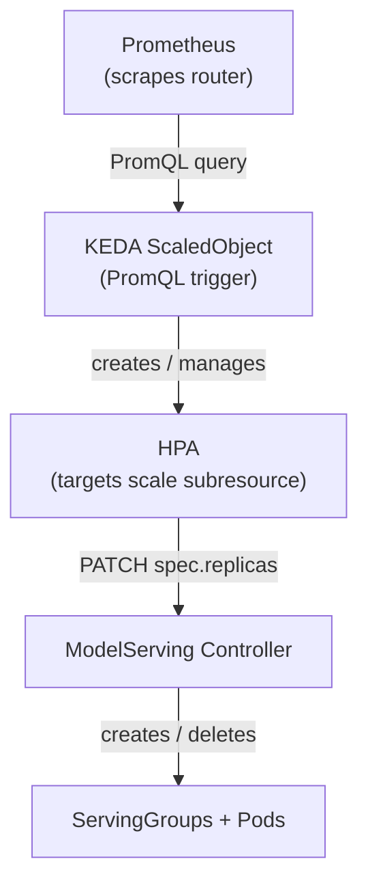
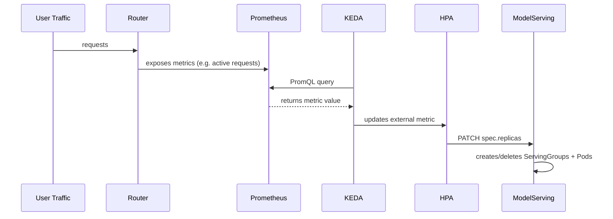

# Proposal: KEDA + Prometheus Autoscaling for Kthena ModelServing

**Status:** Draft
**Authors:** @david_laid
**Date:** 2026-04-02

---

## 1. Problem

LLM inference traffic is bursty. Without autoscaling, you either overprovision GPUs or eat latency spikes when load surges.

Kthena already has an autoscaler (`AutoscalingPolicy` + `AutoscalingPolicyBinding`). It scrapes metrics from pod endpoints, has panic mode, supports heterogeneous cost-optimized scaling. Works fine for pod-level signals like `kthena:num_requests_waiting`.

Where it falls short for some teams:

1. **Can't talk to Prometheus.** It scrapes pods directly. Teams that already have Prometheus running can't leverage their existing observability stack for autoscaling.

2. **No per-model demand signal from the router.** The router can expose metrics labeled by model, giving visibility into demand *before* it hits backends. The built-in autoscaler doesn't use this.

3. **Redundant tooling for KEDA users.** Teams already running KEDA for other workloads end up maintaining two autoscaling systems side by side.

This proposal adds KEDA as an **optional** autoscaling path for teams that already use Prometheus and KEDA. It does not touch or replace `AutoscalingPolicy`.

**Scope boundary:** KEDA and Prometheus are external dependencies, not part of Kthena core. Kthena does not install, bundle, or reconcile `ScaledObject` resources -- users own their ScaledObjects the same way they own any other KEDA-managed workload. Tested against KEDA `v2.13+` (earlier versions have CRD differences in the `ScaledObject` spec).

---

## 2. Scope

### What this proposal covers (Phase 1)

- Fix `status.labelSelector` so HPA can target ModelServing ([#839](https://github.com/volcano-sh/kthena/pull/839))
- Provide example manifests for KEDA ScaledObject + ServiceMonitor
- Helm chart templates behind opt-in feature flags
- Document two Prometheus scraping strategies: router-level and backend-level

### What this proposal does NOT cover

- Modifying or replacing `AutoscalingPolicy` / `AutoscalingPolicyBinding`
- Building a custom metrics adapter
- Multi-model-per-ModelServing (we assume 1:1)
- Role-level scaling via KEDA (built-in autoscaler handles that with `subTargets.kind: Role`)
- Auto-generating ScaledObjects from ModelServing CRs
- Validation webhooks for autoscaler conflict detection

These are deferred to Phase 2/3 (see [Future Work](#7-future-work)).

---

## 3. Design

### Architecture



### Scale-up flow



### How it works

1. Prometheus scrapes the router (or any instrumented component) and collects metrics labeled by model.
2. A KEDA ScaledObject runs a PromQL query scoped to a specific model, targeting a ModelServing CR.
3. KEDA creates an HPA pointing at the ModelServing scale subresource.
4. HPA reads `status.replicas` + `status.labelSelector`, patches `spec.replicas` when it needs to scale.
5. ModelServing controller sees the change, creates or deletes ServingGroups via `manageServingGroupReplicas()`.

### Why this works with ModelServing

ModelServing isn't a Deployment, but it already has a scale subresource:

```go
// +kubebuilder:subresource:scale:specpath=.spec.replicas,statuspath=.status.replicas,selectorpath=.status.labelSelector
```

So HPA/KEDA talk to it the same way they'd talk to a Deployment:

| Field | Path | Purpose |
|-------|------|---------|
| Desired replicas | `spec.replicas` | HPA writes this |
| Current replicas | `status.replicas` | HPA reads this |
| Pod selector | `status.labelSelector` | HPA uses this to count pods |

One catch: the controller wasn't populating `status.labelSelector`. HPA couldn't find pods, scaling broke silently with a `selector is required` error. Fixed in [#839](https://github.com/volcano-sh/kthena/pull/839).

### Two scaling approaches

KEDA's Prometheus trigger accepts **any valid PromQL query**, so the metric used for scaling is not prescribed. In practice there are two places to source metrics from, and each fits a different operational setup. No new API, label, or annotation is introduced -- users just write the ScaledObject spec.

#### Approach A: Router-level metrics

Scrape metrics from the Kthena router and filter by the model label the router exposes.

```yaml
triggers:
  - type: prometheus
    metadata:
      serverAddress: <prometheus-url>
      query: |
        sum(router_active_requests{model="<router-model-name>"})
      threshold: "5"
```

**When to use:** you want to react to demand *before* it reaches the backend (queue depth, in-flight requests at the router), and the person writing the ScaledObject knows which model name the router is exposing (i.e. the value configured in `ModelRoute`).

**Caveats:** the model name on the router (what clients send in API requests) may differ from the backend identifier. The PromQL filter has to match the router's label, which the operator reads from the `ModelRoute` config. If `ModelRoute` and `ModelServing` are operated by different personas, coordinate on the label value or use Approach B.

#### Approach B: Backend-level metrics

Scrape metrics directly from the inference engine pods and filter by pod/namespace selectors that identify the ModelServing.

```yaml
triggers:
  - type: prometheus
    metadata:
      serverAddress: <prometheus-url>
      query: |
        sum(vllm_num_requests_running{namespace="<ns>", pod=~"<modelserving-name>-.*"})
      threshold: "5"
```

**When to use:** the persona writing the ScaledObject owns the `ModelServing` but not the router, or the router's model label is not known up front. Pod and namespace selectors are owned by the same team, so no cross-team coordination is needed.

**Caveats:** you only observe load that has already reached the backend, so scale-up reacts slightly later than with router-level signals.

#### Choosing between them

Both approaches work out of the box; neither requires changes on the Kthena side. Pick based on:

- Which team owns the ScaledObject (router operator vs. backend operator)
- Whether queued-but-not-yet-served demand matters for your SLO
- Whether a stable router-level model label is known when the ScaledObject is authored

Teams can also combine the two using KEDA's multi-trigger support.

#### Metrics reference (not prescribed)

The PromQL query is user-defined -- Kthena does not prescribe or validate which metric is used for scaling. For convenience, the following metrics are already exported by Kthena components and make reasonable starting points:

| Source | Metric | Notes |
|--------|--------|-------|
| Router | `router_active_requests{model=...}` | In-flight requests at the router, pre-backend |
| Router | `router_queue_depth{model=...}` | Queued requests awaiting a backend |
| Backend (vLLM) | `vllm_num_requests_running` | Requests currently being decoded |
| Backend (vLLM) | `vllm_num_requests_waiting` | Backend-side queue depth |

Users with custom inference runtimes bring their own metrics -- any PromQL expression that returns a scalar works. This list is documentation, not API surface; the authoritative names are whatever the components actually export at the time of scraping.

---

## 4. Key Design Decisions

### 4.1 Coexistence with AutoscalingPolicy

**Rule: one scaler per ModelServing.** A ModelServing must be controlled by either `AutoscalingPolicy` or a KEDA `ScaledObject`, never both. KEDA creates an HPA under the hood, and two independent controllers writing `spec.replicas` will fight -- replicas oscillate, metrics race, GPU time is wasted on churn.

- **Phase 1 (this proposal):** documented constraint. Operators are expected not to bind both to the same target. The failure mode is visible (flapping replicas) rather than silent.
- **Phase 2:** validation webhook that rejects an `AutoscalingPolicyBinding` whose target already has a `ScaledObject` pointing at it, and vice versa. This is the real enforcement -- see [Future Work](#7-future-work).
- **Switching scalers:** remove the existing resource (`AutoscalingPolicyBinding` or `ScaledObject`) before creating the other. KEDA leaves its managed HPA in place for a few seconds after ScaledObject deletion; wait for it to be garbage-collected before binding an `AutoscalingPolicy`.
- **Scale-to-zero:** only supported via the KEDA path (`minReplicaCount: 0` + `activationThreshold`). `AutoscalingPolicy` does not scale to zero. Teams that need scale-to-zero for dev/staging must use KEDA.

### 4.2 Why KEDA instead of extending AutoscalingPolicy

| | AutoscalingPolicy | KEDA + Prometheus |
|--|-------------------|-------------------|
| Metric source | Direct pod scraping | Prometheus (any query) |
| Metric scope | Per-pod | Per-model (via PromQL labels) |
| External metrics | No | Yes |
| Ecosystem | Kthena-specific | CNCF graduated |
| Panic mode | Yes | No |
| Heterogeneous scaling | Yes | No |

We're adding KEDA as another option, not replacing anything. This integration is most useful for teams that already have KEDA and Prometheus in their cluster. Teams without KEDA should continue using AutoscalingPolicy.

### 4.3 Why per-model metric scoping

One ModelServing = one model (typically). Without filtering by model in the PromQL query, a spike on `model-A` would scale `model-B` too. Scoping the query by model label isolates scaling decisions -- each ScaledObject queries for its model only.

### 4.4 How ModelServing is targeted

ScaledObject points at ModelServing directly:

```yaml
scaleTargetRef:
  apiVersion: workload.serving.volcano.sh/v1alpha1
  kind: ModelServing
  name: <deployment-name>
```

KEDA creates an HPA that hits the `/scale` subresource -- same as Deployments, StatefulSets. Nothing custom.

### 4.5 Why labelSelector matters

HPA needs `status.labelSelector` to count pods and compute scaling ratios. If it's empty, HPA sees 0 pods and scaling goes sideways. The selector has to match all pods in the CR's ServingGroups.

### 4.6 Cooldown period for LLM workloads

LLM inference pods have slow startup times (model loading can take 30s to 5+ minutes). Aggressive scale-down is harmful -- removing a pod that just finished loading wastes the GPU time spent on initialization. We recommend a `cooldownPeriod` of **300 seconds** (5 minutes) as a starting point. Tune based on your model's load time.

---

## 5. Alternatives Considered

### 5.1 Using only AutoscalingPolicy CRD

Has panic mode and heterogeneous scaling, which are nice. But it can't query Prometheus, can't scope by model from the router, and bolting Prometheus support onto it would just be reinventing KEDA. Keep both -- they cover different use cases.

### 5.2 CPU/memory-based scaling

Doesn't work for LLM inference. It's GPU-bound, and GPU util is a misleading signal -- a model at 30% GPU util can be completely saturated if KV-cache is full. Request-based metrics are what you actually want.

### 5.3 Global (non per-model) metrics

Aggregating metrics without a model filter is simpler, but one model's spike scales everything. Wastes GPUs on models that don't need capacity. Per-model scoping is a must for multi-model setups.

---

## 6. Failure Modes

What breaks and what happens:

| Failure | What happens | What to do |
|---------|-------------|------------|
| **Prometheus goes down** | KEDA can't get metrics, scaling freezes at current count | Use KEDA's `fallback` config to hold at a safe replica count |
| **Router pod restarts** | Metrics gap for a scrape interval or two | Run multiple router replicas. `sum()` still works with partial data |
| **KEDA operator dies** | HPA stops getting updates, but the existing HPA keeps running -- kube-controller-manager owns it | Run KEDA with 2+ replicas |
| **Both autoscalers target same CR** | They fight over `spec.replicas`, replicas oscillate visibly | Documented constraint in Phase 1 (see §4.1). Phase 2 adds a webhook that rejects the second binding |
| **Bad PromQL query** (wrong model name) | Returns 0, may scale down to `minReplicaCount` | Verify the query returns data before applying the ScaledObject |

Most failures just freeze scaling where it is -- you don't get runaway scaling. The `fallback` config handles the Prometheus-down case:

```yaml
fallback:
  failureThreshold: 3    # after 3 failed scrapes
  replicas: 2            # hold at 2
```

---

## 7. Future Work

### Phase 2: Hardening

- Validation webhook to block AutoscalingPolicy + KEDA targeting the same CR
- Recommended thresholds based on production data
- Multi-trigger ScaledObject examples (combining router demand + backend saturation)

### Phase 3: If there's demand

- Controller that auto-generates ScaledObjects from ModelServing CRs
- Scale-to-zero support for dev/staging environments
- Grafana dashboard for scaling decisions
- Custom metrics adapter (if KEDA proves too heavy for some environments)

---

## 8. Rollout Plan (Phase 1)

- [#839](https://github.com/volcano-sh/kthena/pull/839): Controller fix for `status.labelSelector`. This is the blocker -- nothing works without it.
- [#831](https://github.com/volcano-sh/kthena/pull/831): Example manifests (ServiceMonitor, PodMonitor, ScaledObject) in `examples/keda-autoscaling/`.
- [#836](https://github.com/volcano-sh/kthena/pull/836): Helm chart templates behind feature flags (`metrics.enabled`, `autoscaling.enabled`), off by default.

Merge #839 first, then #831 and #836 in any order.

After this, users can set up KEDA autoscaling with per-model Prometheus metrics. Everything is opt-in, existing setups are unaffected.

---

## 9. Example Configuration

No annotation or label on the `ModelServing` is required. Users author the ScaledObject directly and point it at an existing `ModelServing`.

### ScaledObject (router-level metrics)

```yaml
apiVersion: keda.sh/v1alpha1
kind: ScaledObject
metadata:
  name: <deployment-name>-autoscaler
  namespace: default
spec:
  scaleTargetRef:
    apiVersion: workload.serving.volcano.sh/v1alpha1
    kind: ModelServing
    name: <deployment-name>
  minReplicaCount: 1
  maxReplicaCount: 10
  cooldownPeriod: 300
  fallback:
    failureThreshold: 3
    replicas: 2
  triggers:
    - type: prometheus
      metadata:
        serverAddress: <prometheus-url>
        query: |
          sum(router_active_requests{model="<router-model-name>"})
        threshold: "5"
        activationThreshold: "1"
```

### ScaledObject (backend-level metrics)

Same shape, different trigger query -- filter by pod/namespace instead of router model label:

```yaml
  triggers:
    - type: prometheus
      metadata:
        serverAddress: <prometheus-url>
        query: |
          sum(vllm_num_requests_running{namespace="<ns>", pod=~"<deployment-name>-.*"})
        threshold: "5"
        activationThreshold: "1"
```

Both scale `ModelServing/<deployment-name>` via its scale subresource. The `cooldownPeriod` of 300s matters because LLM pods have slow startup times and aggressive scale-down wastes initialization work.

### Prerequisites

1. Prometheus scraping the Kthena router (ServiceMonitor or scrape config)
2. KEDA installed in the cluster
3. ModelServing controller populating `status.labelSelector` ([#839](https://github.com/volcano-sh/kthena/pull/839))
4. RBAC for KEDA to hit the ModelServing scale subresource:

```yaml
apiVersion: rbac.authorization.k8s.io/v1
kind: ClusterRole
metadata:
  name: keda-modelserving-scaler
rules:
  - apiGroups: ["workload.serving.volcano.sh"]
    resources: ["modelservings/scale"]
    verbs: ["get", "update", "patch"]
  - apiGroups: ["workload.serving.volcano.sh"]
    resources: ["modelservings"]
    verbs: ["get", "list", "watch"]
```

---

## 10. What we learned building the prototype

We ran the full flow on a KIND cluster before writing this. Key takeaways:

1. **labelSelector was the blocker.** The CRD had the scale subresource defined correctly, but the controller never set `status.labelSelector`. KEDA created the HPA just fine, HPA couldn't find any pods. Took a while to figure out because the error (`selector is required`) doesn't point you to the right place. [#839](https://github.com/volcano-sh/kthena/pull/839) fixes this.

2. **KEDA needed zero patches.** Point a ScaledObject at ModelServing, KEDA creates the HPA, HPA uses the scale subresource. All config, no code changes on KEDA's side.

3. **Global metrics were our first attempt and they didn't work.** We started with an unscoped aggregation (no model filter). Worked, but a spike on one model scaled everything. Per-model queries fixed it.

4. **End-to-end latency is ~60s worst case.** Prometheus scrape (15s) + KEDA poll (30s) + HPA sync (15s). For LLM workloads where loading a model takes minutes anyway, this is fine.
